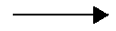
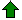
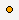
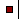
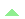

#DrawingObjects

## AddChartAndrewsPitchfork()
### Description
This drawing object draws an Andrew’s Pitchfork.

Information concerning its usage:
-   [*vtad.de*](http://vtadwiki.vtad.de/index.php/Andrews\_Pitchfork)
-   [*hvolumen-analyse.de*](http://www.volumen-analyse.de/blog/?p=917)
-   [*Godmode-Trader.de*](http://www.godmode-trader.de/wissen/index.php/Chartlehrgang:Andrews\_Pitchfork)

### Usage
```cs
AddChartAndrewsPitchfork(string name, bool autoScale, int start1BarsBack, double start1Y, int start2BarsBack, double start2Y, int start3BarsBack, double start3Y, Color color, DashStyle dashStyle, int width)
AddChartAndrewsPitchfork(string name, bool autoScale, DateTime start1Time, double start1Y, DateTime start2Time, double start2Y, DateTime start3Time, double start3Y, Color color, DashStyle dashStyle, int width)
```

### Return Value
A drawing object of the type IAndrewsPitchfork (interface)

### Parameter
|                |                                                                                         |
|----------------|-----------------------------------------------------------------------------------------|
| name           | A clearly identifiable name for the drawing object                                      |
| autoScale      | Adjusts the scale of the y-axis so that drawing objects can be viewed in their entirety |
| start1BarsBack | Number of bars ago for start point 1 (x-axis)                                           |
| start1Time     | Date/time for start point 1 (x-axis)                                                    |
| start1Y        | y-value for start point 1                                                               |
| start2BarsBack | Number of bars ago for start point 2 (x-axis)                                           |
| start2Time     | Date/time for start point 2 (x-axis)                                                    |
| start2Y        | y-value for start point 2                                                               |
| start3BarsBack | Number of bars ago for start point 3 (x-axis)                                           |
| start3Time     | Date/time for start point 3 (x-axis)                                                    |
| start3Y        | y-value for start point 3                                                               |
| color          | Color of the object                                                                     |
| dashStyle      | LevelLine styles:                                                                            |
|                |  DashStyle.Dash, DashStyle.DashDot, DashStyle.DashDotDot, DashStyle.Dot DashStyle.Solid |
|                | You need to integrate:                                                                  |
|                | using System.Drawing.Drawing2D;.                                                        |
| width          | LevelLine strength in points                                                                 |

### Example
```cs
// Draw the Andrew’s Pitchfork (“MyAPF”)
AddChartAndrewsPitchfork("MyAPF", true, 4, Low[4], 3, High[3], 1, Low[1], Color.Black, DashStyle.Solid, 2);
```

## AddChartArc()
### Description
AddChartArc() draws a circular arc.

### Usage
```cs
AddChartArc(string name, int barsBackStart, double startY, int barsBackEnd, double endY, Color color)
AddChartArc(string name, bool autoScale, int barsBackStart, double startY, int barsBackEnd, double endY, Color color, DashStyle dashStyle, int width)
AddChartArc(string name, bool autoScale, DateTime startTime, double startY, DateTime endTime, double endY, Color color, DashStyle dashStyle, int width)
```

### Return Value
A drawing object of the type IArc (interface)

### Parameter
|              |                                                                                         |
|--------------|-----------------------------------------------------------------------------------------|
| name         | A clearly identifiable name for the drawing object                                      |
| autoScale    | Adjusts the scale of the y-axis so that drawing objects can be viewed in their entirety |
| barsBackStart| Number of bars ago for the starting point                                               |
| startTime    | Date/time for the starting point                                                        |
| startY       | y-value for the starting point                                                          |
| barsBackEnd  | Number of bars ago for the end point                                                    |
| endTime      | Date/time for the end point                                                             |
| endY         | y-value for the end point                                                               |
| color        | Color of the drawing object                                                             |
| dashStyle    | LevelLine style                                                                              |                                                                                           
|              |  DashStyle.Dash                                                                         |  
|              |  DashStyle.DashDot                                                                      |  
|              |  DashStyle.DashDotDot                                                                   |  
|              |  DashStyle.Dot                                                                          |  
|              |  DashStyle.Solid                                                                        |  
|              |                                                                                         |  
|              |  You may have to integrate:                                                             |  
|              |  using System.Drawing.Drawing2D;                                                        |
| width        | LevelLine strength in points                                                                 |

### Example
```cs
// AddChart a blue arc
AddChartArc("MyArc", true, 10, 10, 0, 20, Color.Blue, DashStyle.Solid, 3);
```

## AddChartArrowDown()
### Description
AddChartArrowDown() draws an arrow pointing downwards:


See [*AddChartArrowUp()*](#addchartarrowup), [*AddChartArrowDown()*](#addchartarrowdown)(#drawarrowdown), [*AddChartDiamond()*](#addchartdiamond)(#drawdiamond), [*AddChartDot()*](#addchartdot)(#drawdot), [*AddChartSquare()*](#addchartsquare)(#drawsquare), [*AddChartTriangleUp()*](#addcharttriangleup)(#drawtriangleup), [*AddChartTriangleDown()*](#addcharttriangledown)(#drawtriangledown).

### Usage
```cs   
AddChartArrowDown(string name, bool autoScale, int barsAgo, double y, Color color)
AddChartArrowDown(string name, bool autoScale, DateTime time, double y, Color color)
```

### Return Value
A drawing object of the type IArrowDown (interface)

### Parameter
|           |                                                                                         |
|-----------|-----------------------------------------------------------------------------------------|
| name      | A clearly identifiable name for the drawing object                                      |
| autoScale | Adjusts the scale of the y-axis so that drawing objects can be viewed in their entirety |
| barsAgo   | Sets the preceding bar on which the arrow should be drawn (0 = current bar)             |
| time      | Date/time of the bar on which the arrow should be drawn                                 |
| y         | y-value for the arrow                                                                   |
| color     | Color of the drawing object                                                             |

### Example
```cs
// Draws a red arrow 3 ticks above the high for the current bar
AddChartArrowDown("MyArrow", true, 0, High[0] + 3*TickSize, Color.Red);
// Draws a red arrow on a three-bar reversal pattern
if(High[2] > High[3] && High[1] > High[2] && Close[0] < Open[0])
AddChartArrowDown(ProcessingBarIndex.ToString(), true, 0, High[0] + 3*TickSize, Color.Red);
```

## AddChartArrowLine()
### Description
AddChartArrowLine() draws an arrow:



### Usage
```cs
 AddChartArrowLine (string name,  int  barsBackStart,  double  startY,  int  barsBackEnd,  double  endY, Color color)
 AddChartArrowLine (string name,  bool  autoScale,  int  barsBackStart,  double  startY,  int  barsBackEnd,  double  endY, Color color, DashStyle dashStyle,  int  width)
 AddChartArrowLine (string name,  bool  autoScale, DateTime startTime,  double  startY, DateTime endTime,  double  endY, Color color, DashStyle dashStyle,  int  width)
```

### Return Value
A drawing object of the type IArrowLine (interface)

### Parameter
|              |                                                                                         |
|--------------|-----------------------------------------------------------------------------------------|
| name         | A clearly identifiable name for the drawing object                                      |
| autoScale    | Adjusts the scale of the y-axis so that drawing objects can be viewed in their entirety |
| barsBackStart| Sets the preceding bar at which the arrow should start (0 = current bar)                |
| startTime    | Date/time of the bar at which the arrow should start                                    |
| startY       | y-value for the starting point of the arrow                                             |
| barsBackEnd  | Sets the preceding bar at which the arrow should end (0 = current bar)                  |
| endTime      | Date/time at which the arrow should end                                                 |
| endY         | y-value at which the arrow should end                                                   |
| color        | Color of the drawing object                                                             |
| dashStyle    | LevelLine style                                                                              |                                                                                           
|              |  DashStyle.Dash                                                                         |  
|              |  DashStyle.DashDot                                                                      |  
|              |  DashStyle.DashDotDot                                                                   |  
|              |  DashStyle.Dot                                                                          |  
|              |  DashStyle.Solid                                                                        |  
|              |                                                                                         |  
|              |  You may have to integrate:                                                             |  
|              |  using System.Drawing.Drawing2D;                                                        |
| width        | LevelLine strength in points                                                                 |

### Example
```cs
// Draws a black arrow
AddChartArrowLine("MyArrow", false, 10, 10, 0, 5, Color.Black, DashStyle.Solid, 4);
```

## AddChartArrowUp()
### Description
AddChartArowUp() draws an arrow pointing upwards:



See [*AddChartArrowUp()*](#drawarrowup), [*AddChartArrowDown()*](#addchartarrowdown)(#drawarrowdown), [*AddChartDiamond()*](#addchartdiamond)(#drawdiamond), [*AddChartDot()*](#addchartdot)(#drawdot), [*AddChartSquare()*](#addchartsquare)(#drawsquare), [*AddChartTriangleUp()*](#addcharttriangleup)(#drawtriangleup), [*AddChartTriangleDown()*](#addcharttriangledown)(#drawtriangledown).

### Usage
```cs
AddChartArrowUp(string name, bool autoScale, int barsAgo, double y, Color color)
AddChartArrowUp(string name, bool autoScale, DateTime time, double y, Color color)
```

### Return Value
A drawing object of the type IArrowUp (interface)

### Parameter
|           |                                                                                         |
|-----------|-----------------------------------------------------------------------------------------|
| name      | A clearly identifiable name for the drawing object                                      |
| autoScale | Adjusts the scale of the y-axis so that drawing objects can be viewed in their entirety |
| barsAgo   | Sets the preceding bar on which the arrow should be drawn (0 = current bar)             |
| time      | Date/time at which the arrow should be drawn                                            |
| y         | y-value for the arrow                                                                   |
| color     | Color of the drawing object                                                             |

### Example
```cs
// Draws a green arrow for the current bar 3 ticks below the low
AddChartArrowUp("MyArrow", true, 0, Low[0] - 3*TickSize, Color.Green);
```

## AddChartDiamond()
### Description
AddChartDiamond() draws a diamond:


See [*AddChartArrowUp()*](#drawarrowup), [*AddChartArrowDown()*](#addchartarrowdown)(#drawarrowdown), [*AddChartDiamond()*](#addchartdiamond)(#drawdiamond), [*AddChartDot()*](#addchartdot)(#drawdot), [*AddChartSquare()*](#addchartsquare)(#drawsquare), [*AddChartTriangleUp()*](#addcharttriangleup)(#drawtriangleup), [*AddChartTriangleDown()*](#addcharttriangledown)(#drawtriangledown).

### Usage
```cs
AddChartDiamond(string name, bool autoScale, int barsAgo, double y, Color color)
AddChartDiamond(string name, bool autoScale, DateTime time, double y, Color color)
```

### Return Value
A drawing object of the type IDiamond (interface)

### Parameter
|           |                                                                                         |
|-----------|-----------------------------------------------------------------------------------------|
| name      | A clearly identifiable name for the drawing object                                      |
| autoScale | Adjusts the scale of the y-axis so that drawing objects can be viewed in their entirety |
| barsAgo   | Defines the preceding bar on which the diamond should be drawn                          |
| time      | Date/time of the bar on which the diamond should be drawn                               |
| y         | y-value on which the diamond should be drawn                                            |
| color     | Color of the drawing object                                                             |

### Example
```cs
// Draws a light blue diamond for the current bar 5 ticks below the low
AddChartDiamond("MyDiamond", true, 0, Low[0] - 5*TickSize, Color.SteelBlue);
```

## AddChartDot()
### Description
AddChartDot() draws a dot:



See [*AddChartArrowUp()*](#drawarrowup), [*AddChartArrowDown()*](#addchartarrowdown)(#drawarrowdown), [*AddChartDiamond()*](#addchartdiamond)(#drawdiamond), [*AddChartDot()*](#addchartdot)(#drawdot), [*AddChartSquare()*](#addchartsquare)(#drawsquare), [*AddChartTriangleUp()*](#addcharttriangleup)(#drawtriangleup), [*AddChartTriangleDown()*](#addcharttriangledown)(#drawtriangledown).

### Usage
```cs
AddChartDot(string name, bool autoScale, int barsAgo, double y, Color color)
AddChartDot(string name, bool autoScale, DateTime time, double y, Color color)
```

### Return Value
A drawing object of the type IDot (interface)

### Parameter
|           |                                                                                         |
|-----------|-----------------------------------------------------------------------------------------|
| name      | A clearly identifiable name for the drawing object                                      |
| autoScale | Adjusts the scale of the y-axis so that drawing objects can be viewed in their entirety |
| barsAgo   | Defines the preceding bar on which the dot should be drawn (0 = current bar)            |
| time      | The date/time at which the dot should be drawn                                          |
| y         | y-value at which the dot should be drawn                                                |
| color     | Color of the drawing object                                                             |

### Example
```cs
// Draws an orange dot for the current bar 5 ticks above the high
AddChartDot("MyDot", true, 0, High[0] + 5*TickSize, Color.Orange);
```

## AddChartEllipse()
### Description
AddChartEllipse() draws an ellipse.

### Usage
```cs
AddChartEllipse(string name, int barsBackStart, double startY, int barsBackEnd, double endY, Color color)
AddChartEllipse(string name, bool autoScale, int barsBackStart, double startY, int barsBackEnd, double endY, Color color, Color areaColor, int areaOpacity)
AddChartEllipse(string name, bool autoScale, DateTime startTime, double startY, DateTime endTime, double endY, Color color, Color areaColor, int areaOpacity)
```
### Return Value
A drawing object of the type IEllipse (interface)

### Parameter
|              |                                                                                         |
|--------------|-----------------------------------------------------------------------------------------|
| name         | A clearly identifiable name for the drawing object                                      |
| autoScale    | Adjusts the scale of the y-axis so that drawing objects can be viewed in their entirety |
| barsBackStart| Sets the preceding bar at which the ellipse should start                                |
| startTime    | Date/time at which the ellipse should start                                             |
| startY       | y-value for the start of the ellipse                                                    |
| barsBackEnd  | Sets the preceding bar at which the ellipse should end (0 = current bar)                |
| endTime      | Date/time at which the ellipse should end                                               |
| endY         | y-value for the end of the ellipse                                                      |
| color        | Border color of the drawing object                                                      |
| areaColor    | Fill color of the drawing object                                                        |
| areaOpacity  | Transparency of the fill color value between 0 and 255 (0 = completely transparent , 255 = completely opaque) |

### Example
```cs
// Draws a yellow ellipse from the current bar to 5 bars ago
AddChartEllipse("MyEllipse", true, 5, High[5], 0, Close[0], Color.Yellow, Color.Yellow, 1);
```

## AddChartExtendedLine()
### Description
AddChartExtendedLine() draws a line with an infinite end point.

See [*AddChartLine()*](#drawline), [*AddChartHorizontalLine()*](#drawhorizontalline), [*AddChartVerticalLine()*](#drawverticalline), [*AddChartRay()*](#drawray).

### Usage
```cs
AddChartExtendedLine(string name, int barsBackStart, double startY, int barsBackEnd, double endY, Color color)
AddChartExtendedLine(string name, bool autoScale, int barsBackStart, double startY, int barsBackEnd, double endY, Color color, DashStyle dashStyle, int width)
AddChartExtendedLine(string name, bool autoScale, DateTime startTime, double startY, DateTime endTime, double endY, Color color, DashStyle dashStyle, int width)
```

### Return Value
A drawing object of the type IExtendedLine (interface)

### Parameter
|              |                                                                                                         |
|--------------|---------------------------------------------------------------------------------------------------------|
| name         | A clearly identifiable name for the drawing object                                                      |
| autoScale    | Adjusts the scale of the y-axis so that drawing objects can be viewed in their entirety                 |
| barsBackStart| Number of bars ago for the start point                                                                  |
| startTime    | Date/time for the start point                                                                           |
| startY       | y-value for the start point                                                                             |
| barsBackEnd  | Number of bars ago for the second point (a true end point does not exist; the line extends to infinity) |
| endTime      | Date/time for the end point                                                                             |
| endY         | y-value for the end point                                                                               |
| color        | Color of the drawing object                                                                             |
| dashStyle    | LevelLine style                                                                               |                                                                                           
|              |  DashStyle.Dash                                                                                         |  
|              |  DashStyle.DashDot                                                                                      |  
|              |  DashStyle.DashDotDot                                                                                   |  
|              |  DashStyle.Dot                                                                                          |  
|              |  DashStyle.Solid                                                                                        |  
|              |                                                                                                         |  
|              |  You may have to integrate:                                                                             |  
|              |  using System.Drawing.Drawing2D;                                                                        |
| width        | LevelLine strength in points                                                                                 |

### Example
```cs
// Draws a line without an end point
AddChartExtendedLine("MyExt.LevelLine", false, 10, Close[10], 0, Close[0], Color.Black, DashStyle.Solid, 1);
```

## AddChartFibonacciCircle()
### Description
AddChartFibonacciCircle() draws a Fibonacci circle.

### Usage
```cs
AddChartFibonacciCircle(string name, bool autoScale, int barsBackStart, double startY, int barsBackEnd, double endY)
AddChartFibonacciCircle(string name, bool autoScale, DateTime startTime, double startY, DateTime endTime, double endY)
```

### Return Value
A drawing object of the type IFibonacciCircle (interface)

### Parameter
|              |                                                                                         |
|--------------|-----------------------------------------------------------------------------------------|
| name         | A clearly identifiable name for the drawing object                                      |
| autoScale    | Adjusts the scale of the y-axis so that drawing objects can be viewed in their entirety |
| barsBackStart| Defines the starting point in terms of bars ago                                         |
| startTime    | Date/time of the bar for the starting point                                             |
| startY       | y-value for the start of the Fibonacci circle                                           |
| barsBackEnd  | Defines the end point in terms of bars ago                                              |
| endTime      | Date/time for the end of the Fibonacci circle                                           |
| endY         | y-value for the end point of the Fibonacci circle                                       |

### Example
```cs
//Draws a Fibonacci circle
AddChartFibonacciCircle("MyFibCircle", true, 5, Low[5], 0, High[0]);
```

## AddChartFibonacciExtensions()
### Description
AddChartFibonacciExtensions() draws Fibonacci extensions.

### Usage
```cs
AddChartFibonacciExtensions(string name, bool autoScale, int start1BarsAgo, double start1Y, int start2BarsAgo, double start2Y, int start3BarsAgo, double start3Y)
AddChartFibonacciExtensions(string name, bool autoScale, DateTime start1Time, double start1Y, DateTime start2Time, double start2Y, DateTime start3Time, double start3Y)
```

### Return Value
A drawing object of the type IFibonacciExtensions (interface)

### Parameter
|                |                                                                                         |
|----------------|-----------------------------------------------------------------------------------------|
| name           | A clearly identifiable name for the drawing object                                      |
| autoScale      | Adjusts the scale of the y-axis so that drawing objects can be viewed in their entirety |
| start1BarsAgo  | Number of bars ago for start point 1                                                    |
| start1Time     | Date/time for start point 1                                                             |
| start1Y        | y-value for start point 1                                                               |
| start2BarsAgo  | Number of bars ago for start point 2                                                    |
| start2Time     | Date/time for start point 2                                                             |
| start2Y        | y-value for the start point 2                                                           |
| start3BarsAgo  | Number of bars ago for start point 3                                                    |
| start3Time     | Date/time for start point 3                                                             |
| start3Y        | y-value for start point 3                                                               |

### Example
```cs
// Draws Fibonacci extensions
AddChartFibonacciExtensions("MyFibExt", true, 4, Low[4], 3, High[3], 1, Low[1]);
```
## AddChartFibonacciProjections()
### Description
Draw Fibonacci Projections () sketches Fibonacci Projections.

### Usage
```cs
AddChartFibonacciProjections(string name, bool autoScale, DateTime start1Time, double start1Y,DateTime start2Time, double start2Y, DateTime start3Time, double start3Y)
```

### Return Value
A drawing object of the type IFibonacciProjections (Interface)

### Parameter
|                |                                                                                         |
|----------------|-----------------------------------------------------------------------------------------|
| name           | A clearly identifiable name for the drawing object                                      |
| autoScale      | Adjusts the scale of the y-axis so that drawing objects can be viewed in their entirety |
| start1Time     | Date/time for start point 1                                                             |
| start1Y        | y-value for start point 1                                                               |
| start2Time     | Date/time for start point 2                                                             |
| start2Y        | y-value for the start point 2                                                           |
| start3Time     | Date/time for start point 3                                                             |
| start3Y        | y-value for start point 3                                                               |

### Example
```cs
// zeichnet FibonacciProjections
AddChartFibonacciProjections("MyFibPro", true, Low[4], 3, High[3], 1, Low[1], 2);

```

## AddChartFibonacciRetracements()
### Description
AddChartFibonacciRetracements() draws Fibonacci retracements.

### Usage
```cs
AddChartFibonacciRetracements(string name, bool autoScale, int barsBackStart, double startY, int barsBackEnd, double endY)
AddChartFibonacciRetracements(string name, bool autoScale, DateTime startTime, double startY, DateTime endTime, double endY)
```

### Return Value
A drawing object of the type IFibonacciRetracements (interface)

### Parameter
|              |                                                                                         |
|--------------|-----------------------------------------------------------------------------------------|
| name         | A clearly identifiable name for the drawing object                                      |
| autoScale    | Adjusts the scale of the y-axis so that drawing objects can be viewed in their entirety |
| barsBackStart| Defines how many bars ago the starting point of the Fibonacci retracement is located    |
| startTime    | Date/time of the bar at which the Fibonacci retracement should begin                    |
| startY       | y-value at which the Fibonacci retracement will begin                                   |
| barsBackEnd  | Defines how many bars ago the end point of the Fibonacci retracement is located         |
| endTime      | Date/time at which the Fibonacci retracement should end                                 |
| endY         | y-value at which the Fibonacci retracement should end                                   |

### Example
```cs
// Draws Fibonnaci retracements
AddChartFibonacciRetracements("MyFibRet", true, 10, Low[10], 0, High[0]);
```

## AddChartFibonacciTimeExtensions()
### Description
AddChartFibonacciTimeExtensions() draws Fibonacci time extensions.

### Usage
```cs
AddChartFibonacciTimeExtensions(string name, int barsBackStart, double startY, int barsBackEnd, double endY)
AddChartFibonacciTimeExtensions(string name, DateTime startTime, double startY, DateTime endTime, double endY)
```

### Return Value
A drawing object of the type IFibonacciTimeExtensions (interface)

### Parameter
|              |                                                       |
|--------------|-------------------------------------------------------|
| name         | A clearly identifiable name for the drawing object    |
| barsBackStart| Defines how many bars ago the extensions should start |
| startTime    | Date/time at which the extensions should start        |
| startY       | y-value at which the extensions should start          |
| barsBackEnd  | Defines how many bars ago the extensions should end   |
| endTime      | Date/time at which the extensions should end          |
| endY         | y-value at which the extensions should end            |

### Example
```cs
// Draws Fibonacci time extensions
AddChartFibonacciTimeExtensions("MyFibTimeExt", 10, Low[10], 0, High[0]);
```

## AddChartGannFan()
### Description
AddChartGannFan() draws a Gann fan.

### Usage
```cs
AddChartGannFan(string name, bool autoScale, int barsAgo, double y)
AddChartGannFan(string name, bool autoScale, DateTime time, double y)
```

### Return Value
A drawing object of the type IGannFan (interface)

### Parameter
|           |                                                                                         |
|-----------|-----------------------------------------------------------------------------------------|
| name      | A clearly identifiable name for the drawing object                                      |
| autoScale | Adjusts the scale of the y-axis so that drawing objects can be viewed in their entirety |
| barsAgo   | Sets the preceding bar on which the Gann fan should be drawn                            |
| time      | Date/time at which the Gann fan should start                                            |
| y         | y-value for the Gann fan                                                                |

### Example
```cs
// Shows a Gann fan at the low of the bar from 10 periods ago
AddChartGannFan("MyGannFan", true, 10, Low[10]);
```

## AddChartLine()
### Description
AddChartLine() draws a (trend) line.

See [*AddChartHorizontalLine()*](#drawhorizontalline), [*AddChartVerticalLine()*](#drawverticalline), [*AddChartExtendedLine()*](#drawextendedline), [*AddChartRay()*](#drawray).

### Usage
```cs
AddChartLine(string name, int barsBackStart, double startY, int barsBackEnd, double endY, Color color)
AddChartLine(string name, bool autoScale, int barsBackStart, double startY, int barsBackEnd, double endY, Color color, DashStyle dashStyle, int width)
AddChartLine(string name, bool autoScale, DateTime startTime, double startY, DateTime endTime, double endY, Color color, DashStyle dashStyle, int width)
```

### Return Value
A drawing object of the type ITrendLine (interface).

### Parameter
|              |                                                                                         |
|--------------|-----------------------------------------------------------------------------------------|
| name         | A clearly identifiable name for the drawing object                                      |
| autoScale    | Adjusts the scale of the y-axis so that drawing objects can be viewed in their entirety |
| barsBackStart| Number of bars ago for the starting point                                               |
| startTime    | Date/time for the starting point                                                        |
| startY       | y-value for the starting point                                                          |
| barsBackEnd  | Number of bars ago for the end point                                                    |
| endTime      | Date/time for the end point                                                             |
| endY         | y-value for the end point                                                               |
| color        | Color of the drawing object                                                             |
| dashStyle    | LevelLine style                                                                              |                                                                                           
|              |  DashStyle.Dash                                                                         |  
|              |  DashStyle.DashDot                                                                      |  
|              |  DashStyle.DashDotDot                                                                   |  
|              |  DashStyle.Dot                                                                          |  
|              |  DashStyle.Solid                                                                        |  
|              |                                                                                         |  
|              |  You may have to integrate:                                                             |  
|              |  using System.Drawing.Drawing2D;                                                        |
| width        | LevelLine strength in points                                                                 |

### Example
```cs
// Draws a line
AddChartLine("MyLine", false, 10, Close[10], 0, Close[0], Color.Black, DashStyle.Solid, 1);
```

## AddChartHorizontalLine()
### Description
AddChartHorizontalLine() draws a horizontal line in the chart.

See [*AddChartLine()*](#drawline), [*AddChartVerticalLine()*](#drawverticalline), [*AddChartExtendedLine()*](#drawextendedline), [*AddChartRay()*](#drawray).

### Usage
```cs
AddChartHorizontalLine(string name, double y, Color color)
AddChartHorizontalLine(string name, bool autoScale, double y, Color color, DashStyle dashStyle, int width)
```

### Return Value
A drawing object of the type IHorizontalLine (interface)

### Parameter
|           |                                                                                         |
|-----------|-----------------------------------------------------------------------------------------|
| name      | A clearly identifiable name for the drawing object                                      |
| autoScale | Adjusts the scale of the y-axis so that drawing objects can be viewed in their entirety |
| y         | Any double value of your choice                                                         |
| color     | LevelLine color                                                                              |
| dashStyle | LevelLine style                                                                              |                                                                                           
|           |  DashStyle.Dash                                                                         |  
|           |  DashStyle.DashDot                                                                      |  
|           |  DashStyle.DashDotDot                                                                   |  
|           |  DashStyle.Dot                                                                          |  
|           |  DashStyle.Solid                                                                        |  
|           |                                                                                         |  
|           |  You may have to integrate:                                                             |  
|           |  using System.Drawing.Drawing2D;                                                        |
| width     | LevelLine strength                                                                           |

### Example
```cs
// Draws a horizontal line at y=10
AddChartHorizontalLine("MyHorizontalLine", 10, Color.Black);
```

## AddChartRay()
### Description
AddChartRay() draws a (trend) line and extends it to infinity.

See [*AddChartLine()*](#drawline), [*AddChartHorizontalLine()*](#drawhorizontalline), [*AddChartVerticalLine()*](#drawverticalline), [*AddChartExtendedLine()*](#drawextendedline).

### Usage
```cs
AddChartRay(string name, int start1BarsAgo, double start1Y, int start2BarsAgo, double start2Y, Color color)
AddChartRay(string name, bool autoScale, int start1BarsAgo, double start1Y, int start2BarsAgo, double start2Y, Color color, DashStyle dashStyle, int width)
AddChartRay(string name, bool autoScale, DateTime start1Time, double start1Y, DateTime start2Time, double start2Y, Color color, DashStyle dashStyle, int width)
```

### Return Value
A drawing object of the type IRay (interface)

### Parameter
|                |                                                                                         |
|----------------|-----------------------------------------------------------------------------------------|
| name           | A clearly identifiable name for the drawing object                                      |
| autoScale      | Adjusts the scale of the y-axis so that drawing objects can be viewed in their entirety |
| start1BarsAgo  | Number of bars ago for start point 1                                                    |
| start1Time     | Date/time for anstartchor point 1                                                       |
| start1Y        | y-value for start point 1                                                               |
| start2BarsAgo  | Number of bars ago for start point 2                                                    |
| start2Time     | Date/time for start point 2                                                             |
| start2Y        | y-value for start point 2                                                               |
| color          | Color of the drawing object                                                             |
| dashStyle      | LevelLine style                                                                              |                                                                                           
|                |  DashStyle.Dash                                                                         |  
|                |  DashStyle.DashDot                                                                      |  
|                |  DashStyle.DashDotDot                                                                   |  
|                |  DashStyle.Dot                                                                          |  
|                |  DashStyle.Solid                                                                        |  
|                |                                                                                         |  
|                |  You may have to integrate:                                                             |  
|                |  using System.Drawing.Drawing2D;                                                        |
| width          | LevelLine strength                                                                           |

### Example
```cs
// Draws a line from the bar from 10 periods ago to the current bar (x-axis)
// --> line is extended to the right
// from y=3 to y=7
AddChartRay("MyRay", 10, 3, 0, 7, Color.Green);
// Draws a line from the current bar to the bar from 10 periods ago
// --> line is extended to the left
// from y=3 to y=7
AddChartRay("MyRay", 0, 3, 10, 7, Color.Green);
```

## AddChartRectangle()
### Description
AddChartRectangle() draws a rectangle.

### Usage
```cs
AddChartRectangle(string name, int barsBackStart, double startY, int barsBackEnd, double endY, Color color)
AddChartRectangle(string name, bool autoScale, int barsBackStart, double startY, int barsBackEnd, double endY, Color color, Color areaColor, int areaOpacity)
AddChartRectangle(string name, bool autoScale, DateTime startTime, double startY, DateTime endTime, double endY, Color color, Color areaColor, int areaOpacity)
```
### Return Value
A drawing object of the type IRectangle (interface)

### Parameter
|              |                                                                                                        |
|--------------|--------------------------------------------------------------------------------------------------------|
| name         | A clearly identifiable name for the drawing object                                                     |
| autoScale    | Adjusts the scale of the y-axis so that drawing objects can be viewed in their entirety                |
| barsBackStart| Sets the preceding bar at which the one corner of the rectangle should be located (0 = current bar)    |
| startTime    | Date/time at which the start of the one rectangle corner should be located                             |
| startY       | y-value at which the one corner of the rectangle should be located                                     |
| barsBackEnd  | Sets the preceding bar at which the second corner of the rectangle should be located (0 = current bar) |
| endTime      | Date/time of the second rectangle corner                                                               |
| endY         | y-value of the second rectangle corner                                                                 |
| color        | Color of the drawing object                                                                            |
| areaColor    | Fill color of the drawing object                                                                       |
| areaOpacity  | Transparency of the fill color. Value between 0 and 255 (0 = completely transparent, 255 = completely opaque) |

### Example
```cs
// Draws a green rectangle from the low of 10 periods ago to the high of 5 periods ago
// with a fill color of pale green and a transparency of 2
AddChartRectangle("MyRect", true, 10, Low[10], 5, High[5], Color.PaleGreen, Color.PaleGreen, 2);
```

## AddChartRegion()
### Description
AddChartRegion() fills a specific area on a chart.

### Usage
```cs
AddChartRegion(string name, int barsBackStart, int barsBackEnd, IDataSeries series, double y, Color outlineColor, Color areaColor, int areaOpacity)
AddChartRegion(string name, int barsBackStart, int barsBackEnd, IDataSeries series1, IDataSeries series2, Color outlineColor, Color areaColor, int areaOpacity)
AddChartRegion(string name, DateTime startTime, DateTime endTime, IDataSeries series, double y, Color outlineColor, Color areaColor, int areaOpacity)
AddChartRegion(string name, DateTime startTime, DateTime endTime, IDataSeries series1, IDataSeries series2, Color outlineColor, Color areaColor, int areaOpacity)
```

### Return Value
A drawing object of the type IRegion (interface)

### Parameter
|                  |                                                                                   |
|------------------|-----------------------------------------------------------------------------------|
| name             | A clearly identifiable name for the drawing object                                |
| barsBackStart    | Sets the preceding bar at which the drawing should begin (0 = current bar)        |
| startTime        | Start time for the drawing                                                        |
| barsBackEnd      | Sets the preceding bar at which the drawing should end (0 = current bar)          |
| endTime          | End time for the drawing                                                          |
| series1, series2 | Every data series, for example an indicator, close, high, low and so on. The respective value of the data series for the current bar is used as a y-value.  |
| y                | Any double value                                                                  |
| outlineColor     | Color for the border                                                              |
| areaColor        | Fill color for the area                                                           |
| areaOpacity      | Transparency of the fill color. Value between 0 and 255 (0 = completely transparent, 255 = completely opaque) |

### Example
```cs
// Fills the area between the upper and lower Bollinger Bands
AddChartRegion("MyRegion", ProcessingBarIndex, 0, Bollinger(2, 14).Upper, Bollinger(2, 14).Lower, Color.Empty, Color.Lime, 100);
```

## AddChartRegressionChannel()
### Description
AddChartRegressionChannel() draws a regression channel.

### Usage
```cs
AddChartRegressionChannel(string name, int barsBackStart, int barsBackEnd, Color color)
AddChartRegressionChannel(string name, bool autoScale, int barsBackStart, int barsBackEnd, Color upperColor, DashStyle upperDashStyle, int upperWidth, Color middleColor, DashStyle middleDashStyle, int middleWidth, Color lowerColor, DashStyle lowerDashStyle, int lowerWidth)
AddChartRegressionChannel(string name, bool autoScale, DateTime startTime, DateTime endTime, Color upperColor, DashStyle upperDashStyle, int upperWidth, Color middleColor, DashStyle middleDashStyle, int middleWidth, Color lowerColor, DashStyle lowerDashStyle, int lowerWidth)
```

### Return Value
A drawing object of the type IRegressionChannel (interface)

### Parameter
|                  |                                                                                         |
|------------------|-----------------------------------------------------------------------------------------|
| name             | A clearly identifiable name for the drawing object                                      |
| autoScale        | Adjusts the scale of the y-axis so that drawing objects can be viewed in their entirety |
| barsBackStart    | Sets the preceding bar at which the regression channel should start (0 = current bar)   |
| startTime        | Start time for the regression channel                                                   |
| barsBackEnd      | Sets the preceding bar at which the regression channel should end (0 = current bar)     |
| endTime          | End time for the regression channel                                                     |
| color            | Color of the drawing object                                                             |
| upperDashStyle, middleDashStyle, lowerDashStyle    |                                                                              
| dashStyle        | LevelLine style                                                                              |                                                                                           
|                  |  DashStyle.Dash                                                                         |  
|                  |  DashStyle.DashDot                                                                      |  
|                  |  DashStyle.DashDotDot                                                                   |  
|                  |  DashStyle.Dot                                                                          |  
|                  |  DashStyle.Solid                                                                        |  
|                  |                                                                                         |  
|                  |  You may have to integrate:                                                             |  
|                  |  using System.Drawing.Drawing2D;                                                        |
| upperColor,  middleColor,    lowerColor        | LevelLine color                                                                              |
| upperWidth,   middleWidth,  lowerWidth        | LevelLine strength                                                                           |

### Example
```cs
// Draws a regression channel from the low of the bar from 10 days ago to the high of the bar from 5 days ago.
AddChartRegressionChannel("MyRegChannel", 10, 0, Color.Black);
```

## AddChartSquare()
### Description
AddChartSquare() draws a square:



See [*AddChartArrowUp()*](#drawarrowup), [*AddChartArrowDown()*](#addchartarrowdown), [*AddChartDiamond()*](#addchartdiamond), [*AddChartDot()*](#addchartdot), [*AddChartTriangleUp()*](#addcharttriangleup), [*AddChartTriangleDown()*](#addcharttriangledown).

### Usage
```cs
DrawSqare(string name, bool autoScale, int barsAgo, double y, Color color)
DrawSqare(string name, bool autoScale, DateTime time, double y, Color color)
```

### Return Value
A drawing object of the type ISquare (interface)

### Parameter
|           |                                                                                         |
|-----------|-----------------------------------------------------------------------------------------|
| name      | A clearly identifiable name for the drawing object                                      |
| autoScale | Adjusts the scale of the y-axis so that drawing objects can be viewed in their entirety |
| barsAgo   | Sets the preceding bar at which the square should be drawn (0 = current bar)            |
| Time      | Date/time of the bar at which the square should be drawn                                |
| Y         | y-value for the square                                                                  |
| color     | Color of the drawing object                                                             |

### Example
```cs
// Draws a dark red square at the current bar 10 ticks above the high
AddChartSquare("MySquare", true, 0, High[0] + 10*TickSize, Color.DarkRed);
```

## AddChartText()
### Description
AddChartText() writes whatever text you want onto the chart using price and datetime coordinates.

See [*AddChartTextFixed()*](#addcharttextfixed).

### Usage
```cs   
AddChartText(string tag, string text, int barsAgo, double y, Color color);
AddChartText(string tag, string text, TextPosition textPosition, Color textColor, Font font, Color outlineColor, Color areaColor, int areaOpacity);
AddChartText(string tag, string text, int barsAgo, double y, Color textColor, Font font, StringAlignment alignment, Color outlineColor, Color areaColor, int areaOpacity);
AddChartText(string tag, bool autoScale, string text, int barsAgo, double y, int yPixelOffset, Color textColor, Font font, StringAlignment alignment, Color outlineColor, Color areaColor, int areaOpacity);
AddChartText(string tag, bool autoScale, string text, DateTime x, double y, int yPixelOffset, Color textColor, Font font, StringAlignment alignment, Color outlineColor, Color areaColor, int areaOpacity);
AddChartText(string tag, bool autoScale, string text, DateTime x, double y, int pixelOffset, Color textColor, Font font, StringAlignment alignment, HorizontalAlignment hAlign, VerticalAlignment vAlign, Color outlineColor, Color areaColor);
AddChartText(string tag, bool autoScale, string text, int barsAgo, double y, int yPixelOffset, Color textColor, Font font, StringAlignment alignment, HorizontalAlignment hAlign, VerticalAlignment vAlign, Color outlineColor, Color areaColor, int areaOpacity);
AddChartText(string tag, bool autoScale, string text, DateTime x, double y, int pixelOffset, Color textColor, Font font, StringAlignment alignment, HorizontalAlignment hAlign, VerticalAlignment vAlign, Color outlineColor, Color areaColor);   
```

**Important note:**
When using signatures that contain horizontal alignment and vertical alignment, you need to add the following lines:
```cs
using System.Windows.Forms;
using System.Windows.Forms.VisualStyles;
```

### Return Value
A drawing object of the type IText (interface)

### Parameter
|              |                                                                                             |
|--------------|---------------------------------------------------------------------------------------------|
| name         | A clearly identifiable name for the drawing object                                          |
| autoScale    | Adjusts the scale of the y-axis so that drawing objects can be viewed in their entirety     |
| Text         | Text to be displayed (may contain escape sequences)                                         |
| barsAgo      | Sets how many bars ago the text should be displayed                                         |
| Time         | Date/time of the bar at which the text should begin                                         |
| Y            | y-value at which the text should be written                                                 |
| yPixelOffset | Vertical offset of the text; positive numbers move it up, and negative numbers move it down |
| textColor    | Text color                                                                                  |
| Font         | Font                                                                                        |
| Alignment    | Possible values are: StringAlignment.Center, StringAlignment.Far, StringAlignment.Near     |
| HAlign       | Possible values are: HorizontalAlign.Left, HorizontalAlign.Center, HorizontalAlign.Right   |
| VAlign       | Possible values are: VerticalAlign.Top, VerticalAlign.Center, VerticalAlign.Bottom   |
| outlineColor | Border color around the text (for no border, select Color.Empty)  |
| areaColor    | Fill color for the text box    |
| areaOpacity  | Transparency of the fill color
Value between 0 and 255 (0 = completely transparent, 255 = completely opaque)    |

### Example
```cs
// writes text at y=3.0
AddChartText("MyText", "This is sample text.", 10, 3, Color.Black);
// writes red text in the font Arial 7
AddChartText("MyText", false, "This is sample text.", Time[0], Close[0]+50*TickSize, 0,
Color.Red, new Font("Arial",7), StringAlignment.Center, Color.Blue, Color.DarkOliveGreen, 10);
```

This leads to the following result:


```cs
AddChartText("MyTag",true,"Text",1,
// barsAgo
High[1], // y
10, // yPixelOffset
Color.Blue, // Text color
new Font("Arial", 10, FontStyle.Bold),
StringAlignment.Center,
HorizontalAlignment.Center,
VerticalAlignment.Bottom,
Color.Red, // Outline color
Color.Yellow, // Fill color
100); // Opacity
```

## AddChartTextFixed()
### Description
AddChartTextFixed() writes text into one of 5 predetermined locations on the chart.

See [*AddChartText()*](#addcharttext).

### Usage
```cs
AddChartTextFixed(string tag, string text, TextPosition textPosition);
AddChartTextFixed(string tag, string text, TextPosition textPosition, Color textColor, Font font, Color outlineColor, Color areaColor);
AddChartTextFixed(string tag, string text, TextPosition textPosition, Color textColor, Font font, Color outlineColor, Color areaColor, int areaOpacity);
```

### Return Value
A drawing object of the type ITextFixed (interface)

### Parameter
|              |                                                                            |
|--------------|----------------------------------------------------------------------------|
| name         | A clearly identifiable name for the drawing object                         |
| text         | The text to be displayed                                                   |
| TextPosition | TextPosition.BottomLeft, TextPosition.BottomRight, TextPosition.Center, TextPosition.TopLeft, TextPosition.TopRight  |
| textColor    | Text color                                                                 |
| font         | Font                                                                       |
| outlineColor | Color for the border around the text. For no border color, use Color.Empty |
| areaColor    | Fill color of the text box. For no fill color, use Color.Empty   |
| areaOpacity  | Transparency of the fill color. Value between 0 and 255 (0 = completely transparent, 255 = completely opaque)  |

### Example
```cs
// Writes text into the middle of the chart
AddChartTextFixed("MyText", "This is sample text.", TextPosition.Center);
// Writes red text with a blue border into the middle of the chart
AddChartTextFixed("MyText", "This is sample text.", TextPosition.Center, Color.Red, new Font("Arial",35), Color.Blue, Color.Empty, 10);
```

## AddChartTrendChannel()
### Description
AddChartTrendChannel() draws a trend channel.

### Usage
```cs
AddChartTrendChannel(string name, bool autoScale, int start1BarsAgo, double start1Y, int start2BarsAgo, double start2Y, int start3BarsAgo, double start3Y)
AddChartTrendChannel(string name, bool autoScale, DateTime start1Time, double start1Y, DateTime start2Time, double start2Y, DateTime start3Time, double start3Y)
```

### Return Value
A drawing object of the type ITrendChannel (interface)

### Parameter
|                |                                                                                         |
|----------------|-----------------------------------------------------------------------------------------|
| name           | A clearly identifiable name for the drawing object                                      |
| autoScale      | Adjusts the scale of the y-axis so that drawing objects can be viewed in their entirety |
| start1BarsAgo  | Number of bars ago for start point 1 (x-axis)                                           |
| start1Time     | Date/time for start point 1 (x-axis)                                                    |
| start1Y        | y-value for start point 1                                                               |
| start2BarsAgo  | Number of bars ago for start point 2 (x-axis)                                           |
| start2Time     | Date/time for start point 2 (x-axis)                                                    |
| start2Y        | y-value for start point 2                                                               |
| start3BarsAgo  | Number of bars ago for start point 3 (x-axis)                                           |
| start3Time     | Date/time for start point 3 (x-axis)                                                    |
| start3Y        | y-value for start point 3                                                               |

### Example
```cs
// Draws a trend channel
AddChartTrendChannel("MyTrendChannel", true, 10, Low[10], 0, High[0], 10, High[10] + 5 * TickSize);
```

## AddChartTriangle()
### Description
AddChartTriangle() draws a triangle.

### Usage
```cs
AddChartTriangle(string name, int start1BarsAgo, double start1Y, int start2BarsAgo, double start2Y, int start3BarsAgo, double start3Y, Color color)
AddChartTriangle(string name, bool autoScale, int start1BarsAgo, double start1Y, int start2BarsAgo, double start2Y, int start3BarsAgo, double start3Y, Color color, Color areaColor, int areaOpacity)
AddChartTriangle(string name, bool autoScale, DateTime start1Time, double start1Y, DateTime start2Time, double start2Y, DateTime start3Time, double start3Y, Color color, Color areaColor, int areaOpacity)
```

### Return Value
A drawing object of the type ITriangle (interface)

### Parameter
|                |                                                                                         |
|----------------|-----------------------------------------------------------------------------------------|
| name           | A clearly identifiable name for the drawing object                                      |
| autoScale      | Adjusts the scale of the y-axis so that drawing objects can be viewed in their entirety |
| start1BarsAgo  | Number of bars ago for start point 1 (x-axis)                                           |
| start1Time     | Date/time for start point 1 (x-axis)                                                    |
| start1Y        | y-value for start point 1                                                               |
| start2BarsAgo  | Number of bars ago for start point 2 (x-axis)                                           |
| start2Time     | Date/time for start point 2 (x-axis)                                                    |
| start2Y        | y-value for start point 2                                                               |
| start3BarsAgo  | Number of bars ago for start point 3 (x-axis)                                           |
| start3Time     | Date/time for start point 3 (x-axis)                                                    |
| start3Y        | y-value for start point 3                                                               |
| color          | Color of the drawing object                                                             |
| areaColor      | Fill color of the drawing object                                                        |
| areaOpacity    | Transparency of the fill color
Value between 0 and 255
                  0 = completely transparent
                  255 = completely opaque                                                                   |

### Example
```cs
// Draws a green triangle
AddChartTriangle("tag1", 4, Low[4], 3, High[3], 1, Low[1], Color.Green);
```

## AddChartTriangleUp()
### Description
AddChartTriangleUp() draws a small upwards-pointing triangle:



See [*AddChartArrowUp()*](#drawarrowup), [*AddChartArrowDown()*](#addchartarrowdown), [*AddChartDiamond()*](#addchartdiamond), [*AddChartDot()*](#addchartdot), [*AddChartSquare()*](#addchartsquare), [*AddChartTriangleDown()*](#addcharttriangledown).

### Usage
```cs
AddChartTriangleUp(string name, bool autoScale, int barsAgo, double y, Color color)
AddChartTriangleUp(string name, bool autoScale, DateTime time, double y, Color color)
```

### Return Value
A drawing object of the type ITriangleUp (interface)

### Parameter
|           |                                                                                         |
|-----------|-----------------------------------------------------------------------------------------|
| name      | A clearly identifiable name for the drawing object                                      |
| autoScale | Adjusts the scale of the y-axis so that drawing objects can be viewed in their entirety |
| barsAgo   | Sets how many bars ago the triangle should be drawn                                     |
| time      | Date/time for the bar at which the triangle should be drawn                             |
| y         | y-value at which the triangle should be drawn                                           |
| color     | Color of the drawing object                                                             |

### Example
```cs
// Draws a small light green triangle at the current bar 10 ticks below the low
AddChartTriangleUp("MyTriangleUp", true, 0, Low[0] - 10*TickSize, Color.LightGreen);
```

## AddChartTriangleDown()
### Description
AddChartTriangleDown() draws a small downwards-pointing triangle:


See [*AddChartArrowUp()*](#drawarrowup), [*AddChartArrowDown()*](#addchartarrowdown), [*AddChartDiamond()*](#addchartdiamond), [*AddChartDot()*](#addchartdot), [*AddChartSquare()*](#addchartsquare), [*AddChartTriangleUp()*](#addcharttriangleup).

### Usage
```cs
AddChartTriangleDown(string name, bool autoScale, int barsAgo, double y, Color color)
AddChartTriangleDown(string name, bool autoScale, DateTime time, double y, Color color)
```

### Return Value
A drawing object of the type ITriangleDown (interface)

### Parameter
|           |                                                                                         |
|-----------|-----------------------------------------------------------------------------------------|
| name      | A clearly identifiable name for the drawing object                                      |
| autoScale | Adjusts the scale of the y-axis so that drawing objects can be viewed in their entirety |
| barsAgo   | Sets how many bars ago the triangle should be drawn                                     |
| time      | Date/time for the bar at which the triangle should be drawn                             |
| Y         | y-value at which the triangle should be drawn                                           |
| color     | Color of the drawing object                                                             |

### Example
```cs
// Draws a small red triangle at the current bar 10 ticks above the high
AddChartTriangleDown("MyTriangleDown", true, 0, High[0] + 10*TickSize, Color.Red);
```

## AddChartVerticalLine()
### Description
AddChartVerticalLine() draws a vertical line in the chart.

See [*AddChartLine()*](#drawline), [*AddChartHorizontalLine()*](#drawhorizontalline), [*AddChartExtendedLine()*](#drawextendedline), [*AddChartRay()*](#drawray).

### Usage
```cs
AddChartVerticalLine(string name, int barsAgo, Color color)
AddChartVerticalLine(string name, int barsAgo, Color color, DashStyle dashStyle, int width)
AddChartVerticalLine(string name, DateTime time, Color color, DashStyle dashStyle, int width)
```

### Return Value
A drawing object of the type IVerticalLine (interface)

### Parameter
|           |                                                                            |
|-----------|----------------------------------------------------------------------------|
| name      | A clearly identifiable name for the drawing object                         |
| barsAgo   | Sets how many bars ago the vertical line should be drawn (0 = current bar) |
| time      | Date/time of the bar at which the vertical line should be drawn            |
| color     | LevelLine color                                                                 |
| dashStyle | LevelLine style: DashStyle.Dash, DashStyle.DashDot, DashStyle.DashDotDot, DashStyle.Dot, DashStyle.Solid
You may have to integrate:
using System.Drawing.Drawing2D;                                             |
| width     | LevelLine strength                                                              |

### Example
```cs
// Draws a vertical line at the bar from 10 periods ago
AddChartVerticalLine("MyVerticalLine", 10, Color.Black);
```
