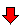
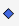

# Zeichenobjekte

## AddChartAndrewsPitchfork()
### Beschreibung
AddChartAndrewsPitchfork() zeichnet ein Andrew's Pitchfork.

Informationen zur Verwendung:
-   [*vtad.de*](http://vtadwiki.vtad.de/index.php/Andrews\_Pitchfork)
-   [*hvolumen-analyse.de*](http://www.volumen-analyse.de/blog/?p=917)
-   [*Godmode-Trader.de*](http://www.godmode-trader.de/wissen/index.php/Chartlehrgang:Andrews\_Pitchfork)

### Verwendung
```cs
AddChartAndrewsPitchfork(string name, bool autoScale, int start1BarsBack, double start1Y, int start2BarsBack, double start2Y, int start3BarsBack, double start3Y, Color color, DashStyle dashStyle, int width)
AddChartAndrewsPitchfork(string name, bool autoScale, DateTime start1Time, double start1Y, DateTime start2Time, double start2Y, DateTime start3Time, double start3Y, Color color, DashStyle dashStyle, int width)
```

### Rückgabewert
A drawing object of the type IAndrewsPitchfork (interface)

### Parameter
|                |                                                                                         |
|----------------|-----------------------------------------------------------------------------------------|
| name           | Der Name eines Zeichenobjekts zur eindeutigen Identifizierung                           |
| autoScale      | Skalierung der y-Achse so anpassen, dass das Zeichenobjekt vollständig zu sehen ist.    |
| start1BarsBack | Anzahl der rückwärtigen Bars für Ankerpunkt1 (x-Achse)                                  |
| start1Time     | Datum/Zeit für Ankerpunkt1 (x-Achse)                                                    |
| start1Y        | y-Wert für Ankerpunkt1                                                                  |
| start2BarsBack | Anzahl der rückwärtigen Bars für Ankerpunkt2 (x-Achse)                                  |
| start2Time     | Datum/Zeit für Ankerpunkt2(x-Achse)                                                     |
| start2Y        | y-Wert für Ankerpunkt2                                                                  |
| start3BarsBack | Anzahl der rückwärtigen Bars für Ankerpunkt3 (x-Achse)                                  |
| start3Time     | Datum/Zeit für Ankerpunk3 (x-Achse)                                                     |
| start3Y        | -Wert für Ankerpunkt3                                                                   |
| color          | Farbe des Zeichenobjekts                                                                |
| dashStyle      | Linienart:                                                                              |
|                |  DashStyle.Dash, DashStyle.DashDot, DashStyle.DashDotDot, DashStyle.Dot DashStyle.Solid |
|                | Es muß:                                                                                 |
|                | using System.Drawing.Drawing2D; mit eingebunden sein.                                   |
| width          | Linienstärke in Punkten                                                                 |

### Beispiel
```cs
// zeichnet ein Andrew's Pitchfork ("Mistgabel")
AddChartAndrewsPitchfork("MyAPF", true, 4, Low[4], 3, High[3], 1, Low[1], Color.Black, DashStyle.Solid, 2);
```

## AddChartArc()
### Beschreibung
AddChartArc() zeichnet einen Kreisbogen.

### Verwendung
```cs
AddChartArc(string name, int barsBackStart, double startY, int barsBackEnd, double endY, Color color)
AddChartArc(string name, bool autoScale, int barsBackStart, double startY, int barsBackEnd, double endY, Color color, DashStyle dashStyle, int width)
AddChartArc(string name, bool autoScale, DateTime startTime, double startY, DateTime endTime, double endY, Color color, DashStyle dashStyle, int width)
```

### Rückgabewert
Ein Zeichenobjekt vom Typ IArc (Interface)

### Parameter
|              |                                                                                         |
|--------------|-----------------------------------------------------------------------------------------|
| name         |Der Name eines Zeichenobjekts zur eindeutigen Identifizierung                            |
| autoScale    | Skalierung der y-Achse so anpassen, dass das Zeichenobjekt vollständig zu               |
| barsBackStart| Anzahl der rückwärtigen Bars für den Startpunkt                                         |
| startTime    | Datum/Uhrzeit für den Startpunkt                                                        |
| startY       | y-Wert für den Startpunkt                                                               |
| barsBackEnd  | Anzahl der rückwärtigen Bars für den Endpunkt                                           |
| endTime      | Datum/Uhrzeit für den Endpunkt                                                          |
| endY         | y-Wert für den Endpunkt                                                                 |
| color        | Farbe des Zeichenobjekts                                                                |
| dashStyle    | Linienart                                                                               |                                                                                           
|              |  DashStyle.Dash                                                                         |  
|              |  DashStyle.DashDot                                                                      |  
|              |  DashStyle.DashDotDot                                                                   |  
|              |  DashStyle.Dot                                                                          |  
|              |  DashStyle.Solid                                                                        |  
|              |                                                                                         |  
|              |  ggf. muß                                                                               |  
|              |  using System.Drawing.Drawing2D; mit eingebunden werden.                                |
| width        | Linienstärke in Punkten                                                                 |

### Beispiel
```cs
// zeichnet einen blauen Kreisbogen
AddChartArc("MyArc-" + ProcessingBarIndex, true, 10, 10, 0, 20, Color.Blue, DashStyle.Solid, 3);
```

## AddChartArrowDown()
### Beschreibung
AddChartArrowDown()  zeichnet einen nach unten gerichteten Pfeil:



 DrawArrowUp(), DrawDiamond(), DrawDot(), DrawSquare(), DrawTriangleUp(),  [*AddChartArrowUp()*](#addchartarrowup), [*AddChartArrowDown()*](#addchartarrowdown)(#drawarrowdown), [*AddChartDiamond()*](#addchartdiamond)(#drawdiamond), [*AddChartDot()*](#addchartdot)(#drawdot), [*AddChartSquare()*](#addchartsquare)(#drawsquare), [*AddChartTriangleUp()*](#addcharttriangleup)(#drawtriangleup), [*AddChartTriangleDown()*](#addcharttriangledown)(#drawtriangledown).

### Verwendung
```cs   
AddChartArrowDown(string name, bool autoScale, int barsAgo, double y, Color color)
AddChartArrowDown(string name, bool autoScale, DateTime time, double y, Color color)
```

### Rückgabewert
A drawing object of the type IArrowDown (interface)

### Parameter
|           |                                                                                         |
|-----------|-----------------------------------------------------------------------------------------|
| name      | Der Name eines Zeichenobjekts zur eindeutigen Identifizierung                           |
| autoScale | Skalierung der y-Achse so anpassen, dass das Zeichenobjekt vollständig zu sehen         |
| barsAgo   | Gibt an, an welchem zurückliegenden Bar der Pfeil gezeichnet werden soll 
(0=aktueller Bar)|
| time      | Datum/Uhrzeit des Bars, an dem der Pfeil gezeichnet werden soll                         |
| y         |  y-Wert für den Pfeil                                                                  |
| color     | Farbe des Zeichenobjekts                                                                |

### Beispiel
```cs
// zeichnet am akt. Bar einen roten Pfeil 3 Ticks über dem Hoch
AddChartArrowDown("MyArrow-" + ProcessingBarIndex, true, 0, High[0] + 3*TickSize, Color.Red);
// Zeichnet einen roten Pfeil auf einem Dreistufen-Umkehrmuster
if(High[2] > High[3] && High[1] > High[2] && Close[0] < Open[0])
AddChartArrowDown(ProcessingBarIndex.ToString(), true, 0, High[0] + 3*TickSize, Color.Red);
```

## AddChartArrowLine()
### Beschreibung
AddChartArrowLine() zeichnet einen Pfeil.


### Verwendung
```cs
 AddChartArrowLine (string name,  int  barsBackStart,  double  startY,  int  barsBackEnd,  double  endY, Color color)
 AddChartArrowLine (string name,  bool  autoScale,  int  barsBackStart,  double  startY,  int  barsBackEnd,  double  endY, Color color, DashStyle dashStyle,  int  width)
 AddChartArrowLine (string name,  bool  autoScale, DateTime startTime,  double  startY, DateTime endTime,  double  endY, Color color, DashStyle dashStyle,  int  width)
```

### Rückgabewert
Ein Zeichenobjekt vom Typ IArrowLine (Interface)

### Parameter
|              |                                                                                         |
|--------------|-----------------------------------------------------------------------------------------|
| name         | Der Name eines Zeichenobjekts zur eindeutigen Identifizierung                           |
| autoScale    | Skalierung der y-Achse so anpassen, dass das Zeichenobjekt vollständig zu sehen ist     |
| barsBackStart| Gibt an, an welchem zurückliegenden Bar der Pfeil beginnen soll (0=aktueller Bar)       |
| startTime    | Datum/Uhrzeit des Bars, an dem der Pfeil beginnen soll                                  |
| startY       | y-Wert, an dem der Pfeil beginnen soll                                                  |
| barsBackEnd  | Gibt an, an welchem zurückliegenden Bar der Pfeil enden soll (0=aktueller Bar)          |
| endTime      | Datum/Uhrzeit des Bars, an dem der Pfeil enden                                          |
| endY         | y-Wert, an dem der Pfeil enden soll                                                     |
| color        | Farbe des Zeichenobjekts                                                                |
| dashStyle    | Linienart                                                                               |                                                                                           
|              |  DashStyle.Dash                                                                         |  
|              |  DashStyle.DashDot                                                                      |  
|              |  DashStyle.DashDotDot                                                                   |  
|              |  DashStyle.Dot                                                                          |  
|              |  DashStyle.Solid                                                                        |  
|              |                                                                                         |  
|              |  ggf. muß                                                                               |  
|              |  using System.Drawing.Drawing2D; mit eingebunden werden.                                |
| width        | Linienstärke in Punkten                                                                 |

### Beispiel
```cs
// zeichnet einen schwarzen Pfeil
AddChartArrowLine("MyArrow-" + ProcessingBarIndex, false, 10, 10, 0, 5, Color.Black, DashStyle.Solid, 4);
```

## AddChartArrowUp()
### Beschreibung
AddChartArowUp() zeichnet einen nach oben gerichteten Pfeil:


Siehe auch [*AddChartArrowUp()*](#drawarrowup), [*AddChartArrowDown()*](#addchartarrowdown)(#drawarrowdown), [*AddChartDiamond()*](#addchartdiamond)(#drawdiamond), [*AddChartDot()*](#addchartdot)(#drawdot), [*AddChartSquare()*](#addchartsquare)(#drawsquare), [*AddChartTriangleUp()*](#addcharttriangleup)(#drawtriangleup), [*AddChartTriangleDown()*](#addcharttriangledown)(#drawtriangledown).

### Verwendung
```cs
AddChartArrowUp(string name, bool autoScale, int barsAgo, double y, Color color)
AddChartArrowUp(string name, bool autoScale, DateTime time, double y, Color color)
```

### Rückgabewert
A drawing object of the type IArrowUp (interface)

### Parameter
|           |                                                                                         |
|-----------|-----------------------------------------------------------------------------------------|
| name      | Der Name eines Zeichenobjekts zur eindeutigen Identifizierung                           |
| autoScale | Skalierung der y-Achse so anpassen, dass das Zeichenobjekt vollständig zu sehen         |
| barsAgo   | Gibt an, an welchem zurückliegenden Bar der Pfeil gezeichnet werden soll 
(0=aktueller Bar)|
| time      | Datum/Uhrzeit des Bars, an dem der Pfeil gezeichnet werden soll                         |
| y         |  y-Wert für den Pfeil                                                                  |
| color     | Farbe des Zeichenobjekts                                                                |

### Example
```cs
// zeichnet einen grünen Pfeil am akt. Bar 3 Ticks unter dem Tief
AddChartArrowUp("MyArrow-"  + ProcessingBarIndex, true, 0, Low[0] - 3*TickSize, Color.Green);
```

## AddChartDiamond()
### Beschreibung
AddChartDiamond() zeichnet einen Diamanten:



Siehe auch [*AddChartArrowUp()*](#drawarrowup), [*AddChartArrowDown()*](#addchartarrowdown)(#drawarrowdown), [*AddChartDiamond()*](#addchartdiamond)(#drawdiamond), [*AddChartDot()*](#addchartdot)(#drawdot), [*AddChartSquare()*](#addchartsquare)(#drawsquare), [*AddChartTriangleUp()*](#addcharttriangleup)(#drawtriangleup), [*AddChartTriangleDown()*](#addcharttriangledown)(#drawtriangledown).

### Verwendung
```cs
AddChartDiamond(string name, bool autoScale, int barsAgo, double y, Color color)
AddChartDiamond(string name, bool autoScale, DateTime time, double y, Color color)
```

### Rückgabewert
Ein Zeichenobjekt vom Typ IDiamond (Interface)

### Parameter
|           |                                                                                         |
|-----------|-----------------------------------------------------------------------------------------|
| name      | Der Name eines Zeichenobjekts zur eindeutigen Identifizierung                           |
| autoScale | Skalierung der y-Achse so anpassen, dass das Zeichenobjekt vollständig zu sehen         |
| barsAgo   | Gibt an, an welchem zurückliegenden Bar der Pfeil gezeichnet werden soll 
(0=aktueller Bar)|
| time      | Datum/Uhrzeit des Bars, an dem der Pfeil gezeichnet werden soll                         |
| y         |  y-Wert für den Pfeil                                                                   |
| color     | Farbe des Zeichenobjekts                                                                |

### Beispiel
```cs
// zeichnet einen hellblauen Diamanten am akt. Bar 5 Ticks unter dem Tief
AddChartDiamond("MyDiamond-" + ProcessingBarIndex, true, 0, Low[0] - 5*TickSize, Color.SteelBlue);
```

## AddChartDot()
### Beschreibung
AddChartDot() zeichnet einen Punkt:


Siehe auch [*AddChartArrowUp()*](#drawarrowup), [*AddChartArrowDown()*](#addchartarrowdown)(#drawarrowdown), [*AddChartDiamond()*](#addchartdiamond)(#drawdiamond), [*AddChartDot()*](#addchartdot)(#drawdot), [*AddChartSquare()*](#addchartsquare)(#drawsquare), [*AddChartTriangleUp()*](#addcharttriangleup)(#drawtriangleup), [*AddChartTriangleDown()*](#addcharttriangledown)(#drawtriangledown).

### Verwendung
```cs
AddChartDot(string name, bool autoScale, int barsAgo, double y, Color color)
AddChartDot(string name, bool autoScale, DateTime time, double y, Color color)
```

### Rückgabewert
Ein Zeichenobjekt vom Typ IDot (Interface)

### Parameter
|           |                                                                                         |
|-----------|-----------------------------------------------------------------------------------------|
| name      | Der Name eines Zeichenobjekts zur eindeutigen Identifizierung                           |
| autoScale | Skalierung der y-Achse so anpassen, dass das Zeichenobjekt vollständig zu sehen         |
| barsAgo   | Gibt an, an welchem zurückliegenden Bar der Pfeil gezeichnet werden soll 
(0=aktueller Bar)|
| time      | Datum/Uhrzeit des Bars, an dem der Pfeil gezeichnet werden soll                         |
| y         |  y-Wert für den Pfeil                                                                   |
| color     | Farbe des Zeichenobjekts                                                                |

### Beispiel
```cs
// zeichnet einen orangen Punkt am akt. Bar 5 Ticks über dem Hoch
AddChartDot("MyDot-" + ProcessingBarIndex, true, 0, High[0] + 5*TickSize, Color.Orange);
```

## AddChartEllipse()
### Beschreibung
AddChartEllipse() zeichnet eine Ellipse.

### Verwendung
```cs
AddChartEllipse(string name, int barsBackStart, double startY, int barsBackEnd, double endY, Color color)
AddChartEllipse(string name, bool autoScale, int barsBackStart, double startY, int barsBackEnd, double endY, Color color, Color areaColor, int areaOpacity)
AddChartEllipse(string name, bool autoScale, DateTime startTime, double startY, DateTime endTime, double endY, Color color, Color areaColor, int areaOpacity)
```
### Rückgabewert
Ein Zeichenobjekt vom Typ IEllipse (Interface)

### Parameter
|              |                                                                                         |
|--------------|-----------------------------------------------------------------------------------------|
| name         | Der Name eines Zeichenobjekts zur eindeutigen Identifizierung                           |
| autoScale    | Skalierung der y-Achse so anpassen, dass das Zeichenobjekt vollständig zu sehen ist     |
| barsBackStart| Gibt an, an welchem zurückliegenden Bar die Ellipse beginnen soll (0=aktueller Bar)     |
| startTime    | Datum/Uhrzeit des Bars, an dem die Ellipse beginnen soll                                |
| startY       | Wert, an dem die Ellipse beginnen soll                                                  |
| barsBackEnd  | Gibt an, an welchem zurückliegenden Bar die Ellipse enden soll (0=aktueller Bar)        |
| endTime      | Datum/Uhrzeit des Bars, an dem die Ellipse enden soll                                   |
| endY         | y-Wert, an dem die Ellipse enden soll                                                      |
| color        | Randfarbe des Zeichenobjekts                                                            |
| areaColor    | Füllfarbe des Zeichenobjekts                                                            |
| areaOpacity  | Transparenz der Füllfarbe. Wert zwischen 0 und 255 (0 = komplett transparent; 255 = keine Transparenz) |

### Beispiel
```cs
// zeichnet eine gelbe Ellipse vom akt. Bar bis 5 Bars zurück
AddChartEllipse("MyEllipse-" + ProcessingBarIndex, true, 5, High[5], 0, Close[0], Color.Yellow, Color.Yellow, 1);
```

## AddChartExtendedLine()
### Beschreibung
AddChartExtendedLine() zeichnet eine Linie mit unendlichem Endpunkt.

Siehe auch [*AddChartLine()*](#drawline), [*AddChartHorizontalLine()*](#drawhorizontalline), [*AddChartVerticalLine()*](#drawverticalline), [*AddChartRay()*](#drawray).

### Verwendung
```cs
AddChartExtendedLine(string name, int barsBackStart, double startY, int barsBackEnd, double endY, Color color)
AddChartExtendedLine(string name, bool autoScale, int barsBackStart, double startY, int barsBackEnd, double endY, Color color, DashStyle dashStyle, int width)
AddChartExtendedLine(string name, bool autoScale, DateTime startTime, double startY, DateTime endTime, double endY, Color color, DashStyle dashStyle, int width)
```

### Rückgabewert
Ein Zeichenobjekt vom Typ IExtendedLine (Interface)

### Parameter
|              |                                                                                                         |
|--------------|---------------------------------------------------------------------------------------------------------|
| name         | Der Name eines Zeichenobjekts zur eindeutigen Identifizierung                                           |
| autoScale    | Skalierung der y-Achse so anpassen, dass das Zeichenobjekt vollständig zu sehen ist                     |
| barsBackStart| Anzahl der rückwärtigen Bars für den Startpunkt                                                         |
| startTime    | Datum/Uhrzeit für den Startpunkt                                                                        |
| startY       | y-Wert für den Startpunkt                                                                               |
| barsBackEnd  | Anzahl der rückwärtigen Bars für den zweiten Punkt (Einen Endpunkt gibt es bei diesem Zeichenobjekt nicht |
| endTime      | Datum/Uhrzeit für den Endpunkt                                                                          |
| endY         | y-Wert für den Endpunkt                                                                                 |
| color        | Farbe des Zeichenobjekts                                                                                |
| dashStyle    | Linienart                                                                               |                                                                                           
|              |  DashStyle.Dash                                                                                         |  
|              |  DashStyle.DashDot                                                                                      |  
|              |  DashStyle.DashDotDot                                                                                   |  
|              |  DashStyle.Dot                                                                                          |  
|              |  DashStyle.Solid                                                                                        |  
|              |                                                                                                         |  
|              |  ggf. muß                                                                                               |  
|              |  using System.Drawing.Drawing2D;  mit eingebunden werden.                                               |
| width        | Linienstärke in Punkten                                                                                 |

### Beispiel
```cs
// zeichnet eine Linie ohne Endpunkt
AddChartExtendedLine("MyExt.LevelLine-" + ProcessingBarIndex, false, 10, Close[10], 0, Close[0], Color.Black, DashStyle.Solid, 1);
```

## AddChartFibonacciCircle()
### Beschreibung
AddChartFibonacciCircle() zeichnet Fibonacci-Kreise.

### Verwendung
```cs
AddChartFibonacciCircle(string name, bool autoScale, int barsBackStart, double startY, int barsBackEnd, double endY)
AddChartFibonacciCircle(string name, bool autoScale, DateTime startTime, double startY, DateTime endTime, double endY)
```

### Rückgabewert
Ein Zeichenobjekt vom Typ IFibonacciCircle (Interface)

### Parameter
|              |                                                                                         |
|--------------|-----------------------------------------------------------------------------------------|
| name         | Der Name eines Zeichenobjekts zur eindeutigen Identifizierung                           |
| autoScale    | Skalierung der y-Achse so anpassen, dass das Zeichenobjekt vollständig zu sehen ist     |
| barsBackStart| Gibt an, an welchem zurückliegenden Bar die Fibonacci-Kreise beginnen sollen.           |
| startTime    | Datum/Uhrzeit des Bars, an dem die Fibonacci-Kreise beginnen sollen                     |
| startY       | y-Wert, an dem die Fibonacci-Kreise beginnen sollen                                     |
| barsBackEnd  | Gibt an, an welchem zurückliegenden Bar die Fibonacci-Kreise enden sollen (0=aktueller Bar)                                             |
| endTime      | Datum/Uhrzeit des Bars, an dem die Fibonacci-Kreise enden sollen                        |
| endY         | y-Wert, an dem die Fibonacci-Kreise enden sollen                                       |

### Beispiel
```cs
// zeichnet Fibonacci-Kreise
AddChartFibonacciCircle("MyFibCircle-"  + ProcessingBarIndex, true, 5, Low[5], 0, High[0]);
```

## AddChartFibonacciExtensions()
### Beschreibung
AddChartFibonacciExtensions() zeichnet Fibonacci Extensions

### Verwendung
```cs
AddChartFibonacciExtensions(string name, bool autoScale, int start1BarsAgo, double start1Y, int start2BarsAgo, double start2Y, int start3BarsAgo, double start3Y)
AddChartFibonacciExtensions(string name, bool autoScale, DateTime start1Time, double start1Y, DateTime start2Time, double start2Y, DateTime start3Time, double start3Y)
```

### Rückgabewert
Ein Zeichenobjekt vom Typ IFibonacciExtensions (Interface)

### Parameter
|                |                                                                                         |
|----------------|-----------------------------------------------------------------------------------------|
| name           | Der Name eines Zeichenobjekts zur eindeutigen Identifizierung                           |
| autoScale      | Skalierung der y-Achse so anpassen, dass das Zeichenobjekt vollständig zu sehen ist.    |
| start1BarsAgo  | Anzahl der rückwärtigen Bars für Ankerpunkt1 (x-Achse)                                  |
| start1Time     | Datum/Zeit für Ankerpunkt1 (x-Achse)                                                    |
| start1Y        | y-Wert für Ankerpunkt1                                                                  |
| start2BarsAgo  | Anzahl der rückwärtigen Bars für Ankerpunkt2 (x-Achse)                                  |
| start2Time     | Datum/Zeit für Ankerpunkt2(x-Achse)                                                     |
| start2Y        | y-Wert für Ankerpunkt2                                                                  |
| start3BarsAgo  | Anzahl der rückwärtigen Bars für Ankerpunkt3 (x-Achse)                                  |
| start3Time     | Datum/Zeit für Ankerpunk3 (x-Achse)                                                     |
| start3Y        | y-Wert für Ankerpunkt3                                                                  |

### Beispiel
```cs
// zeichnet FibonacciExtensions
AddChartFibonacciExtensions("MyFibExt-"  + ProcessingBarIndex, true, 4, Low[4], 3, High[3], 1, Low[1]);
```
## AddChartFibonacciProjections()
### Beschreibung
Draw Fibonacci Projections () zeichnet Fibonacci Projections.

### Verwendung
```cs
AddChartFibonacciProjections(string name, bool autoScale, DateTime start1Time, double start1Y,DateTime start2Time, double start2Y, DateTime start3Time, double start3Y)
```

### Rückgabewert
Ein Zeichenobjekt vom Typ IFibonacciProjections (Interface)

### Parameter
|                |                                                                                         |
|----------------|-----------------------------------------------------------------------------------------|
| name           | Der Name eines Zeichenobjekts zur eindeutigen Identifizierung                           |
| autoScale      | Skalierung der y-Achse so anpassen, dass das Zeichenobjekt vollständig zu sehen ist.    |
| start1Time     | Datum/Zeit für Ankerpunkt1 (x-Achse)                                                    |
| start1Y        | y-Wert für Ankerpunkt1                                                                  |
| start2Time     | Datum/Zeit für Ankerpunkt2(x-Achse)                                                     |
| start2Y        | y-Wert für Ankerpunkt2                                                                  |
| start3Time     | Datum/Zeit für Ankerpunk3 (x-Achse)                                                     |
| start3Y        | y-Wert für Ankerpunkt3                                                                  |

### Beispiel
```cs
// zeichnet FibonacciProjections
AddChartFibonacciProjections("MyFibPro-"  + ProcessingBarIndex, true, Low[4], 3, High[3], 1, Low[1], 2);

```

## AddChartFibonacciRetracements()
### Beschreibung
AddChartFibonacciRetracements() dzeichnet Fibonacci Retracements.

### Verwendung
```cs
AddChartFibonacciRetracements(string name, bool autoScale, int barsBackStart, double startY, int barsBackEnd, double endY)
AddChartFibonacciRetracements(string name, bool autoScale, DateTime startTime, double startY, DateTime endTime, double endY)
```

### Rückgabewert
A drawing object of the type IFibonacciRetracements (interface)

### Parameter
|              |                                                                                         |
|--------------|-----------------------------------------------------------------------------------------|
| name         | Der Name eines Zeichenobjekts zur eindeutigen Identifizierung                           |
| autoScale    | Skalierung der y-Achse so anpassen, dass das Zeichenobjekt vollständig zu sehen ist     |
| barsBackStart| Gibt an, an welchem zurückliegenden Bar die Fibonacci Retracements beginnen sollen.     |
| startTime    | Datum/Uhrzeit des Bars, an dem die Fibonacci Retracements beginnen sollen               |
| startY       | y-Wert, an dem die Fibonacci Retracements beginnen sollen                               |
| barsBackEnd  | Gibt an, an welchem zurückliegenden Bar die Fibonacci Retracements enden sollen (0=aktueller Bar)                                             |
| endTime      | Datum/Uhrzeit des Bars, an dem die Fibonacci Retracements enden sollen                 |
| endY         | y-Wert, an dem die Fibonacci Retracements enden sollen                                 |

### Beispiel
```cs
// zeichnet Fibonnaci Retracements
AddChartFibonacciRetracements("MyFibRet-"  + ProcessingBarIndex, true, 10, Low[10], 0, High[0]);
```

## AddChartFibonacciTimeExtensions()
### Beschreibung
AddChartFibonacciTimeExtensions() zeichnet Fibonacci Retracements.

### Verwendung
```cs
AddChartFibonacciTimeExtensions(string name, int barsBackStart, double startY, int barsBackEnd, double endY)
AddChartFibonacciTimeExtensions(string name, DateTime startTime, double startY, DateTime endTime, double endY)
```

### Rückgabewert
Ein Zeichenobjekt vom Typ IFibonacciTimeExtensions (Interface)

### Parameter
|              |                                                                                         |
|--------------|-----------------------------------------------------------------------------------------|
| name         | Der Name eines Zeichenobjekts zur eindeutigen Identifizierung                           |
| barsBackStart| Gibt an, an welchem zurückliegenden Bar die Fibonacci TimeExtensions beginnen sollen.   |
| startTime    | Datum/Uhrzeit des Bars, an dem die Fibonacci TimeExtensions beginnen sollen             |
| startY       | y-Wert, an dem die Fibonacci-Kreise beginnen sollen                                     |
| barsBackEnd  | Gibt an, an welchem zurückliegenden Bar die Fibonacci TimeExtensions enden sollen (0=aktueller Bar)                                             |
| endTime      | Datum/Uhrzeit des Bars, an dem die Fibonacci TimeExtensions enden sollen                |
| endY         | y-Wert, an dem die Fibonacci TimeExtensions enden sollen                                |

### Beispiel
```cs
// zeichnet Fibonacci TimeExtensions
AddChartFibonacciTimeExtensions("MyFibTimeExt-" + ProcessingBarIndex, 10, Low[10], 0, High[0]);
```

## AddChartGannFan()
### Beschreibung
AddChartGannFan() zeichnet Fibonacci Retracements.

### Verwendung
```cs
AddChartGannFan(string name, bool autoScale, int barsAgo, double y)
AddChartGannFan(string name, bool autoScale, DateTime time, double y)
```

### Rückgabewert
Ein Zeichenobjekt vom Typ IGannFan (Interface)

### Parameter
|           |                                                                                         |
|-----------|-----------------------------------------------------------------------------------------|
| name      | Der Name eines Zeichenobjekts zur eindeutigen Identifizierung                           |
| autoScale | Skalierung der y-Achse so anpassen, dass das Zeichenobjekt vollständig zu sehen ist     |
| barsAgo   | Gibt an, an welchem zurückliegenden Bar der GannFan gezeichnet werden soll              |
| time      | Datum/Uhrzeit des Bars, an dem der GannFan gezeichnet werden soll                       |
| y         | y-Wert, an dem der GannFan gezeichnet werden soll                                       |

### Beispiel
```cs
// zeichnet einen Gann Fan am Tief des Bars von vor 10 Perioden
AddChartGannFan("MyGannFan-" + ProcessingBarIndex, true, 10, Low[10]);
```

## AddChartHorizontalLine()
### Beschreibung
AddChartHorizontalLine() zeichnet eine horizontale Linie in den Chart.

Siehe auch [*AddChartLine()*](#drawline), [*AddChartVerticalLine()*](#drawverticalline), [*AddChartExtendedLine()*](#drawextendedline), [*AddChartRay()*](#drawray).

### Verwendung
```cs
AddChartHorizontalLine(string name, double y, Color color)
AddChartHorizontalLine(string name, bool autoScale, double y, Color color, DashStyle dashStyle, int width)
```

### Rückgabewert
Ein Zeichenobjekt vom Typ IHorizontalLine (Interface)

### Parameter
|              |                                                                                         |
|--------------|-----------------------------------------------------------------------------------------|
| name         | Der Name eines Zeichenobjekts zur eindeutigen Identifizierung                           |
| autoScale    | Skalierung der y-Achse so anpassen, dass das Zeichenobjekt vollständig zu sehen ist     |
| y            | ein beliebiger double-Wert                                                              |
| color        | Linienfarbe                                                                             |
| dashStyle    | Linienart                                                                               |                                                                                           
|              |  DashStyle.Dash                                                                         |  
|              |  DashStyle.DashDot                                                                      |  
|              |  DashStyle.DashDotDot                                                                   |  
|              |  DashStyle.Dot                                                                          |  
|              |  DashStyle.Solid                                                                        |  
|              |                                                                                         |  
|              |  ggf. muß                                                                               |  
|              |  using System.Drawing.Drawing2D; mit eingebunden werden.                                |
| width        | Linienstärke                                                                            |

### Beispiele
```cs
// zeichnet eine horizontale Linie bei y=10
AddChartHorizontalLine("MyHorizontalLine-" + ProcessingBarIndex, 10, Color.Black);
```

## AddChartLine()
### Beschreibung
AddChartLine()  zeichnet eine (Trend-) Linie.

Siehe auch  [*AddChartHorizontalLine()*](#drawhorizontalline), [*AddChartVerticalLine()*](#drawverticalline), [*AddChartExtendedLine()*](#drawextendedline), [*AddChartRay()*](#drawray).

### Verwendung
```cs
AddChartLine(string name, int barsBackStart, double startY, int barsBackEnd, double endY, Color color)
AddChartLine(string name, bool autoScale, int barsBackStart, double startY, int barsBackEnd, double endY, Color color, DashStyle dashStyle, int width)
AddChartLine(string name, bool autoScale, DateTime startTime, double startY, DateTime endTime, double endY, Color color, DashStyle dashStyle, int width)
```

### Rückgabewert
Ein Zeichenobjekt vom Typ ITrendLine (Interface)

### Parameter
|              |                                                                                         |
|--------------|-----------------------------------------------------------------------------------------|
| name         | Der Name eines Zeichenobjekts zur eindeutigen Identifizierung                           |
| autoScale    | Skalierung der y-Achse so anpassen, dass das Zeichenobjekt vollständig zu sehen ist     |
| barsBackStart| Anzahl der rückwärtigen Bars für den Startpunkt                                         |
| startTime    | Datum/Uhrzeit für den Startpunkt                                                        |
| startY       | y-Wert für den Startpunkt                                                               |
| barsBackEnd  | Anzahl der rückwärtigen Bars für den zweiten Punkt (Einen Endpunkt gibt es bei diesem Zeichenobjekt nicht)                                                    |
| endTime      | Datum/Uhrzeit für den Endpunkt                                                          |
| endY         | y-Wert für den Endpunkt                                                                 |
| color        | Farbe des Zeichenobjekts                                                                |
| dashStyle    | Linienart                                                                               |                                                                                           
|              |  DashStyle.Dash                                                                         |  
|              |  DashStyle.DashDot                                                                      |  
|              |  DashStyle.DashDotDot                                                                   |  
|              |  DashStyle.Dot                                                                          |  
|              |  DashStyle.Solid                                                                        |  
|              |                                                                                         |  
|              |  ggf. muß                                                                               |  
|              |  using System.Drawing.Drawing2D; mit eingebunden werden.                                |
| width        | Linienstärke in Punkten                                                                |

### Beispiel
```cs
// zeichnet eine Linie
AddChartLine("MyLine-" + ProcessingBarIndex, false, 10, Close[10], 0, Close[0], Color.Black, DashStyle.Solid, 1);
```

## AddChartRay()
### Beschreibung
AddChartRay() zeichnet eine (Trend-) Linie, die zu einer Seite ins Unendliche verlängert wird.

Siehe auch [*AddChartLine()*](#drawline), [*AddChartHorizontalLine()*](#drawhorizontalline), [*AddChartVerticalLine()*](#drawverticalline), [*AddChartExtendedLine()*](#drawextendedline).

### Verwendung
```cs
AddChartRay(string name, int start1BarsAgo, double start1Y, int start2BarsAgo, double start2Y, Color color)
AddChartRay(string name, bool autoScale, int start1BarsAgo, double start1Y, int start2BarsAgo, double start2Y, Color color, DashStyle dashStyle, int width)
AddChartRay(string name, bool autoScale, DateTime start1Time, double start1Y, DateTime start2Time, double start2Y, Color color, DashStyle dashStyle, int width)
```

### Rückgabewert
Ein Zeichenobjekt vom Typ IRay (Interface)

### Parameter
|                |                                                                                         |
|----------------|-----------------------------------------------------------------------------------------|
| name           | Der Name eines Zeichenobjekts zur eindeutigen Identifizierung                           |
| autoScale      | Skalierung der y-Achse so anpassen, dass das Zeichenobjekt vollständig zu sehen ist.    |
| start1BarsAgo  | Anzahl der rückwärtigen Bars für Ankerpunkt1 (x-Achse)                                  |
| start1Time     | Datum/Zeit für Ankerpunkt1 (x-Achse)                                                    |
| start1Y        | y-Wert für Ankerpunkt1                                                                  |
| start2BarsAgo  | Anzahl der rückwärtigen Bars für Ankerpunkt2 (x-Achse)                                  |
| start2Time     | Datum/Zeit für Ankerpunkt2(x-Achse)                                                     |
| start2Y        | y-Wert für Ankerpunkt2                                                                  |
| color          | Farbe des Zeichenobjekts                                                                |
| dashStyle      | Linienart                                                                               |                                                                                           
|                |  DashStyle.Dash                                                                         |  
|                |  DashStyle.DashDot                                                                      |  
|                |  DashStyle.DashDotDot                                                                   |  
|                |  DashStyle.Dot                                                                          |  
|                |  DashStyle.Solid                                                                        |  
|                |                                                                                         |  
|                |  ggf. muß                                                                               |  
|                |  using System.Drawing.Drawing2D; mit eingebunden werden.                                |
| width          | Linienstärke                                                                            |

### Beispiele
```cs
// zeichnet eine Linie vom Bar von vor 10 Perioden über den aktuellen Bar (x-Achse)
// --> Linie wird nach rechts verlängert
// von y=3 über y=7
AddChartRay("MyRay-" + ProcessingBarIndex, 10, 3, 0, 7, Color.Green);
// zeichnet eine Linie vom akt. Bar über den Bar von vor 10 Perioden
// --> Linie wird nach links verlängert
// von y=3 über y=7
AddChartRay("MyRay-" + ProcessingBarIndex, 0, 3, 10, 7, Color.Green);
```

## AddChartRectangle()
### Beschreibung
AddChartRectangle() zeichnet ein Rechteck.

### Verwendung
```cs
AddChartRectangle(string name, int barsBackStart, double startY, int barsBackEnd, double endY, Color color)
AddChartRectangle(string name, bool autoScale, int barsBackStart, double startY, int barsBackEnd, double endY, Color color, Color areaColor, int areaOpacity)
AddChartRectangle(string name, bool autoScale, DateTime startTime, double startY, DateTime endTime, double endY, Color color, Color areaColor, int areaOpacity)
```
### Rückgabewert
Ein Zeichenobjekt vom Typ IRectangle (Interface)

### Parameter
|              |                                                                                                        |
|--------------|--------------------------------------------------------------------------------------------------------|
| name         | Der Name eines Zeichenobjekts zur eindeutigen Identifizierung                                          |
| autoScale    | Skalierung der y-Achse so anpassen, dass das Zeichenobjekt vollständig zu sehen ist.                   |
| barsBackStart| Gibt an, an welchem zurückliegenden Bar sich die eine Ecke des Rechtecks befinden soll (0=aktueller Bar)   |
| startTime    | Datum/Uhrzeit des Bars, an dem sich die eine Ecke des Rechtecks befinden soll                          |
| startY       | y-Wert, an dem die sich die eine Ecke des Rechtecks befinden soll                                      |
| barsBackEnd  | Gibt an, an welchem zurückliegenden Bar sich die zweite Ecke des Rechtecks befinden soll (0=aktueller Bar) |
| endTime      | Datum/Uhrzeit des Bars, an dem sich die zweite Ecke des Rechtecks befinden soll                        |
| endY         | y-Wert, an dem die sich die zweite Ecke des Rechtecks befinden soll                                    |
| color        | Farbe des Zeichenobjekts                                                                               |
| areaColor    | Füllfarbe des Zeichenobjekts                                                                           |
| areaOpacity  | Transparenz der Füllfarbe. Wert zwischen 0 und 255 (0 =  komplett transparent, 255 = keine Transparenz)|

### Beispiel
```cs
// zeichnet ein grünes Rechteck vom Tief von vor 10 Perioden zum Hoch von vor 5 Perioden
// mit der Füllfarbe PaleGreen und einer Transparenz von 2
AddChartRectangle("MyRect-" + ProcessingBarIndex, true, 10, Low[10], 5, High[5], Color.PaleGreen, Color.PaleGreen, 2);
```

## AddChartRegion()
### Beschreibung
AddChartRegion() DrawRegion() füllt einen bestimmten Bereich auf einem Chart aus.

### Verwendung
```cs
AddChartRegion(string name, int barsBackStart, int barsBackEnd, IDataSeries series, double y, Color outlineColor, Color areaColor, int areaOpacity)
AddChartRegion(string name, int barsBackStart, int barsBackEnd, IDataSeries series1, IDataSeries series2, Color outlineColor, Color areaColor, int areaOpacity)
AddChartRegion(string name, DateTime startTime, DateTime endTime, IDataSeries series, double y, Color outlineColor, Color areaColor, int areaOpacity)
AddChartRegion(string name, DateTime startTime, DateTime endTime, IDataSeries series1, IDataSeries series2, Color outlineColor, Color areaColor, int areaOpacity)
```

### Rückgabewert
Ein Zeichenobjekt vom Typ IRegion (Interface)

### Parameter
|              |                                                                                                        |
|--------------|--------------------------------------------------------------------------------------------------------|
| name         | Der Name eines Zeichenobjekts zur eindeutigen Identifizierung                                          |
| barsBackStart| Gibt an, an welchem zurückliegenden Bar sich die eine Ecke des Rechtecks befinden soll (0=aktueller Bar)   |
| startTime    | Datum/Uhrzeit des Bars, an dem sich die eine Ecke des Rechtecks befinden soll                          |
| barsBackEnd  | Gibt an, an welchem zurückliegenden Bar sich die zweite Ecke des Rechtecks befinden soll (0=aktueller Bar) |
| endTime      | Datum/Uhrzeit des Bars, an dem sich die zweite Ecke des Rechtecks befinden soll                        |
| series1, series2  | jedes Datenserie, wie z.B. ein Indikator, Close, High, Low usw.
 Der jeweilige Wert der Datenserie für den aktuellen Bar wird als y-Wert herangezogen                       |
| y            | ein beliebiger double-Wert                                                              |
| outlineColor | Farbe für die Umrandung des Bereichs                                                                   |
| areaColor    | Füllfarbe des Zeichenobjekts                                                                           |
| areaOpacity  | Transparenz der Füllfarbe. Wert zwischen 0 und 255 (0 =  komplett transparent, 255 = keine Transparenz)|

### Beispiel
```cs
// füllt den Bereich zwischen dem oberen und dem unteren Bollinger Band
AddChartRegion("MyRegion", ProcessingBarIndex, 0, Bollinger(2, 14).Upper, Bollinger(2, 14).Lower, Color.Empty, Color.Lime, 100);
```

## AddChartRegressionChannel()
### Beschreibung
AddChartRegressionChannel()zeichnet einen Regressionskanal.

### Verwendung
```cs
AddChartRegressionChannel(string name, int barsBackStart, int barsBackEnd, Color color)
AddChartRegressionChannel(string name, bool autoScale, int barsBackStart, int barsBackEnd, Color upperColor, DashStyle upperDashStyle, int upperWidth, Color middleColor, DashStyle middleDashStyle, int middleWidth, Color lowerColor, DashStyle lowerDashStyle, int lowerWidth)
AddChartRegressionChannel(string name, bool autoScale, DateTime startTime, DateTime endTime, Color upperColor, DashStyle upperDashStyle, int upperWidth, Color middleColor, DashStyle middleDashStyle, int middleWidth, Color lowerColor, DashStyle lowerDashStyle, int lowerWidth)
```

### Rückgabewert
Ein Zeichenobjekt vom Typ IRegressionChannel (Interface)

### Parameter
|                  |                                                                                         |
|------------------|-----------------------------------------------------------------------------------------|
| name             | Der Name eines Zeichenobjekts zur eindeutigen Identifizierung                           |
| autoScale        | Skalierung der y-Achse so anpassen, dass das Zeichenobjekt vollständig zu sehen ist.    |
| barsBackStart    | Gibt an, an welchem zurückliegenden Bar der Regressionskanal beginnen soll (0=aktueller Bar)   |
| startTime        | Datum/Uhrzeit des Bars, an dem der Regressionskanal beginnen soll                       |
| barsBackEnd      | Gibt an, an welchem zurückliegenden Bar der Regressionskanal enden soll (0=aktueller Bar)     |
| endTime          | Datum/Uhrzeit des Bars, an dem der Regressionskanal enden soll                          |
| color            | Farbe des Zeichenobjekts                                                            |
| upperDashStyle, middleDashStyle, lowerDashStyle    |                                                                              
| dashStyle        | Linienart                                                                            |                                                                                           
|                  |  DashStyle.Dash                                                                         |  
|                  |  DashStyle.DashDot                                                                      |  
|                  |  DashStyle.DashDotDot                                                                   |  
|                  |  DashStyle.Dot                                                                          |  
|                  |  DashStyle.Solid                                                                        |  
|                  |                                                                                         |  
|                  |  ggf. muß:                                                                              |  
|                  |  using System.Drawing.Drawing2D; mit eingebunden werden.                                |
| upperColor,  middleColor,    lowerColor        | jeweilige Linienfarbe                                                                              |
| upperWidth,   middleWidth,  lowerWidth        | jeweilige Linienstärke                                                                           |

### Beispiel
```cs
// zeichnet einen Regressionskanal vom Tief des Bars von vor 10 Tagen
// zum Hoch des Bars von vor 5 Tagen
AddChartRegressionChannel("MyRegChannel-" + ProcessingBarIndex, 10, 0, Color.Black);
```

## AddChartSquare()
### Beschreibung
AddChartSquare()  zeichnet ein Quadrat:


Siehe auch [*AddChartArrowUp()*](#drawarrowup), [*AddChartArrowDown()*](#addchartarrowdown), [*AddChartDiamond()*](#addchartdiamond), [*AddChartDot()*](#addchartdot), [*AddChartTriangleUp()*](#addcharttriangleup), [*AddChartTriangleDown()*](#addcharttriangledown).

### Verwendung
```cs
DrawSqare(string name, bool autoScale, int barsAgo, double y, Color color)
DrawSqare(string name, bool autoScale, DateTime time, double y, Color color)
```

### Rückgabewert
Ein Zeichenobjekt vom Typ ISquare (Interface)

### Parameter
|           |                                                                                         |
|-----------|-----------------------------------------------------------------------------------------|
| name      | Der Name eines Zeichenobjekts zur eindeutigen Identifizierung                           |
| autoScale | Skalierung der y-Achse so anpassen, dass das Zeichenobjekt vollständig zu sehen         |
| barsAgo   | Gibt an, an welchem zurückliegenden Bar das Quadrat gezeichnet werden soll (0=aktueller Bar)      |
| Time      | Datum/Uhrzeit des Bars, an dem das Quadrat gezeichnet werden soll                       |
| Y         | y-Wert, an dem das Quadrat gezeichnet werden soll                                       |
| color     | Farbe des Zeichenobjekts                                                                |

### Beispiel
```cs
// zeichnet ein durnkelrotes Quadrat am akt. Bar 10 Ticks über dem Hoch
AddChartSquare("MySquare", true, 0, High[0] + 10*TickSize, Color.DarkRed);
```

## AddChartText()
### Beschreibung
AddChartText() schreibt einen beliebigen Text auf den Chart.

Siehe auch [*AddChartTextFixed()*](#addcharttextfixed).

### Verwendung
```cs   
AddChartText(string tag, string text, int barsAgo, double y, Color color);
AddChartText(string tag, string text, TextPosition textPosition, Color textColor, Font font, Color outlineColor, Color areaColor, int areaOpacity);
AddChartText(string tag, string text, int barsAgo, double y, Color textColor, Font font, StringAlignment alignment, Color outlineColor, Color areaColor, int areaOpacity);
AddChartText(string tag, bool autoScale, string text, int barsAgo, double y, int yPixelOffset, Color textColor, Font font, StringAlignment alignment, Color outlineColor, Color areaColor, int areaOpacity);
AddChartText(string tag, bool autoScale, string text, DateTime x, double y, int yPixelOffset, Color textColor, Font font, StringAlignment alignment, Color outlineColor, Color areaColor, int areaOpacity);
AddChartText(string tag, bool autoScale, string text, DateTime x, double y, int pixelOffset, Color textColor, Font font, StringAlignment alignment, HorizontalAlignment hAlign, VerticalAlignment vAlign, Color outlineColor, Color areaColor);
AddChartText(string tag, bool autoScale, string text, int barsAgo, double y, int yPixelOffset, Color textColor, Font font, StringAlignment alignment, HorizontalAlignment hAlign, VerticalAlignment vAlign, Color outlineColor, Color areaColor, int areaOpacity);
AddChartText(string tag, bool autoScale, string text, DateTime x, double y, int pixelOffset, Color textColor, Font font, StringAlignment alignment, HorizontalAlignment hAlign, VerticalAlignment vAlign, Color outlineColor, Color areaColor);   
```

**wichtiger Hinweis:**
Bei Verwendung der Signaturen, die HorizontalAlignment und VerticalAlignment enthalten, sind die folgenden beiden Zeilen dem Programmcode hinzuzufügen:
```cs
using System.Windows.Forms;
using System.Windows.Forms.VisualStyles;
```

### Rückgabewert
Ein Zeichenobjekt vom Typ IText (Interface)

### Parameter
|              |                                                                                             |
|--------------|---------------------------------------------------------------------------------------------|
| name         | Der Name eines Zeichenobjekts zur eindeutigen Identifizierung                               |
| autoScale    | Skalierung der y-Achse so anpassen, dass das Zeichenobjekt vollständig zu sehen ist         |
| Text         | Der auszugebende Text (Der Text darf auch den Zeilenumbruch "\n" enthalten.)                |
| barsAgo      | Gibt an, an welchem zurückliegenden Bar der Text ausgegeben werden soll (0=aktueller Bar)
(Welcher Bar den Index 0 hat, ist abhängig von CalculateOnBarClose.)                                         |
| Time         | Datum/Uhrzeit des Bars, an dem der Text beginnen soll                                       |
| Y            | y-Wert, an dem der Text geschrieben werden soll                                             |
| yPixelOffset | vertikale Verschiebung des Textes. Positive Werte verschieben den Text nach oben, negative Werte nach unten. |
| textColor    | Textfarbe                                                                                   |
| Font         | Schriftart für den Text                                                                     |
| Alignment    | mögliche Werte sind: StringAlignment.Center, StringAlignment.Far, StringAlignment.Near      |
| HAlign       | mögliche Werte sind: HorizontalAlign.Left, HorizontalAlign.Center, HorizontalAlign.Right    |
| VAlign       | mögliche Werte sind: VerticalAlign.Top, VerticalAlign.Center, VerticalAlign.Bottom          |
| outlineColor | Farbe des Rahmens um den Text (Für keinen Rahmen Color.Empty verwenden)                     |
| areaColor    | Füllfarbe der Textbox (Für keine Füllung Color.Empty verwenden)                             |
| areaOpacity  | Transparenz der Füllfarbe. Wert zwischen 0 und 255 (0 =  komplett transparent, 255 = keine Transparenz)|

### Beispiele
```cs
// schreibt einen Text bei y=3.0 
AddChartText("MyText-" + ProcessingBarIndex, "This is sample text.", 10, 3, Color.Black);
// schreibt einen roten Text in Schriftgröße Arial 7
AddChartText("MyText-" + ProcessingBarIndex, false, "This is sample text.", Time[0], Close[0]+50*TickSize, 0,
Color.Red, new Font("Arial",7), StringAlignment.Center, Color.Blue, Color.DarkOliveGreen, 10);
```

Nachstehende Anweisung führt zu diesem Ergebnis:


```cs
AddChartText("MyTag",true,"Text",1, // barsAgo
High[1], // y
10, // yPixelOffset
Color.Blue, // Text color
new Font("Arial", 10, FontStyle.Bold),
StringAlignment.Center,
HorizontalAlignment.Center,
VerticalAlignment.Bottom,
Color.Red, // Outline color
Color.Yellow, // Fill color
100); // Opacity
```

## AddChartTextFixed()
### Beschreibung
AddChartTextFixed() schreibt Text an eine von 5 möglichen festen Stellen im Chart.

Siehe auch [*AddChartText()*](#addcharttext).

### Verwendung
```cs
AddChartTextFixed(string tag, string text, TextPosition textPosition);
AddChartTextFixed(string tag, string text, TextPosition textPosition, Color textColor, Font font, Color outlineColor, Color areaColor);
AddChartTextFixed(string tag, string text, TextPosition textPosition, Color textColor, Font font, Color outlineColor, Color areaColor, int areaOpacity);
```

### Rückgabewert
Ein Zeichenobjekt vom Typ ITextFixed (Interface)

### Parameter
|              |                                                                            |
|--------------|----------------------------------------------------------------------------|
| name         | Der Name eines Zeichenobjekts zur eindeutigen Identifizierung              |
| text         | The text to be displayed                                                   |
| TextPosition | TextPosition.BottomLeft, TextPosition.BottomRight, TextPosition.Center, TextPosition.TopLeft, TextPosition.TopRight  |
| textColor    | Textfarbe                                                                  |
| font         | Schriftart für den Text                                                    |
| outlineColor | Farbe des Rahmens um den Text (Für keinen Rahmen Color.Empty verwenden)    |
| areaColor    | Füllfarbe der Textbox (Für keine Füllung Color.Empty verwenden)            |
| areaOpacity  | Transparenz der Füllfarbe. Wert zwischen 0 und 255 (0 =  komplett transparent, 255 = keine Transparenz)|

### Beispiele
```cs
// schreibt einen Text in die Mitte des Charts
AddChartTextFixed("MyText-" + ProcessingBarIndex, ""Das ist ein Beispieltext.", TextPosition.Center);
// schreibt einen roten Text mit einem blauen Rand in die Mitte des Charts
AddChartTextFixed("MyText-" + ProcessingBarIndex, "Das ist ein Beispieltext.", TextPosition.Center, Color.Red, new Font("Arial",35), Color.Blue, Color.Empty, 10);
```

## AddChartTrendChannel()
### Beschreibung
AddChartTrendChannel() zeichnet einen Trendkanal.

### Verwendung
```cs
AddChartTrendChannel(string name, bool autoScale, int start1BarsAgo, double start1Y, int start2BarsAgo, double start2Y, int start3BarsAgo, double start3Y)
AddChartTrendChannel(string name, bool autoScale, DateTime start1Time, double start1Y, DateTime start2Time, double start2Y, DateTime start3Time, double start3Y)
```

### Rückgabewert
Ein Zeichenobjekt vom Typ ITrendChannel (Interface)

### Parameter
|                |                                                                                         |
|----------------|-----------------------------------------------------------------------------------------|
| name           | A clearly identifiable name for the drawing object                                      |
| autoScale      | Adjusts the scale of the y-axis so that drawing objects can be viewed in their entirety |
| start1BarsAgo  | Number of bars ago for start point 1 (x-axis)                                           |
| start1Time     | Date/time for start point 1 (x-axis)                                                    |
| start1Y        | y-value for start point 1                                                               |
| start2BarsAgo  | Number of bars ago for start point 2 (x-axis)                                           |
| start2Time     | Date/time for start point 2 (x-axis)                                                    |
| start2Y        | y-value for start point 2                                                               |
| start3BarsAgo  | Number of bars ago for start point 3 (x-axis)                                           |
| start3Time     | Date/time for start point 3 (x-axis)                                                    |
| start3Y        | y-value for start point 3                                                               |

### Beispiele
```cs
// zeichnet einen Trendkanal
AddChartTrendChannel("MyTrendChannel-" + ProcessingBarIndex, true, 10, Low[10], 0, High[0], 10, High[10] + 5 * TickSize);
```

## AddChartTriangle()
### Beschreibung
AddChartTriangle() zeichnet ein Dreieck.

### Verwendung
```cs
AddChartTriangle(string name, int start1BarsAgo, double start1Y, int start2BarsAgo, double start2Y, int start3BarsAgo, double start3Y, Color color)
AddChartTriangle(string name, bool autoScale, int start1BarsAgo, double start1Y, int start2BarsAgo, double start2Y, int start3BarsAgo, double start3Y, Color color, Color areaColor, int areaOpacity)
AddChartTriangle(string name, bool autoScale, DateTime start1Time, double start1Y, DateTime start2Time, double start2Y, DateTime start3Time, double start3Y, Color color, Color areaColor, int areaOpacity)
```

### Rückgabewert
Ein Zeichenobjekt vom Typ ITriangle (Interface)

### Parameter
|                |                                                                                         |
|----------------|-----------------------------------------------------------------------------------------|
| name           | Der Name eines Zeichenobjekts zur eindeutigen Identifizierung                           |
| autoScale      | Skalierung der y-Achse so anpassen, dass das Zeichenobjekt vollständig zu sehen ist     |
| start1BarsAgo  | Anzahl der rückwärtigen Bars für Ankerpunkt1 (x-Achse)                                  |
| start1Time     | Datum/Zeit für Ankerpunkt1 (x-Achse)                                                    |
| start1Y        | y-Wert für Ankerpunkt1                                                                  |
| start2BarsAgo  | Anzahl der rückwärtigen Bars für Ankerpunkt2 (x-Achse)                                  |
| start2Time     | Datum/Zeit für Ankerpunkt2 (x-Achse)                                                    |
| start2Y        | y-Wert für Ankerpunkt2                                                                  |
| start3BarsAgo  | Anzahl der rückwärtigen Bars für Ankerpunkt3 (x-Achse)                                  |
| start3Time     | Datum/Zeit für Ankerpunkt3 (x-Achse)                                                    |
| start3Y        | y-Wert für Ankerpunkt3                                                                  |
| color          | Farbe des Zeichenobjekts                                                                |
| areaColor      | Füllen Sie Farbe des Zeichnungsobjekt                                                   |
| areaOpacity    | Transparenz der Füllfarbe. Wert zwischen 0 und 255 (0 =  komplett transparent, 255 = keine Transparenz)|

### Beispiel
```cs
// zeichnet ein grünes Dreieck
AddChartTriangle("tag1", 4, Low[4], 3, High[3], 1, Low[1], Color.Green);
```

## AddChartTriangleDown()
### Beschreibung
AddChartTriangleDown() zeichnet ein kleines abwärtsgerichtetes Dreieck.


Siehe auch [*AddChartArrowUp()*](#drawarrowup), [*AddChartArrowDown()*](#addchartarrowdown), [*AddChartDiamond()*](#addchartdiamond), [*AddChartDot()*](#addchartdot), [*AddChartSquare()*](#addchartsquare), [*AddChartTriangleUp()*](#addcharttriangleup).

### Verwendung
```cs
AddChartTriangleDown(string name, bool autoScale, int barsAgo, double y, Color color)
AddChartTriangleDown(string name, bool autoScale, DateTime time, double y, Color color)
```

### Rückgabewert
Ein Zeichenobjekt vom Typ ITriangleDown (Interface)

### Parameter
|           |                                                                                         |
|-----------|-----------------------------------------------------------------------------------------|
| name      | Der Name eines Zeichenobjekts zur eindeutigen Identifizierung                           |
| autoScale | Skalierung der y-Achse so anpassen, dass das Zeichenobjekt vollständig zu sehen ist     |
| barsAgo   | Gibt an, an welchem zurückliegenden Bar das Dreieck gezeichnet werden soll              |
| time      | Datum/Uhrzeit des Bars, an dem das Dreieck gezeichnet werden soll                       |
| y         | y-Wert, an dem das Dreieck gezeichnet werden                                            |
| color     | Farbe des Zeichenobjekts                                                                |

### Beispiel
```cs
// zeichnet ein kleines rotes Dreieck am akt. Bar 10 Ticks über dem Hoch
AddChartTriangleDown("MyTriangleDown-" + ProcessingBarIndex, true, 0, High[0] + 10*TickSize, Color.Red);
```

## AddChartTriangleUp()
### Beschreibung
AddChartTriangleUp() zeichnet ein kleines aufwärtsgerichtetes Dreieck.


Siehe auch [*AddChartArrowUp()*](#drawarrowup), [*AddChartArrowDown()*](#addchartarrowdown), [*AddChartDiamond()*](#addchartdiamond), [*AddChartDot()*](#addchartdot), [*AddChartSquare()*](#addchartsquare), [*AddChartTriangleDown()*](#addcharttriangledown).

### Verwendung
```cs
AddChartTriangleUp(string name, bool autoScale, int barsAgo, double y, Color color)
AddChartTriangleUp(string name, bool autoScale, DateTime time, double y, Color color)
```

### Rückgabewert
Ein Zeichenobjekt vom Typ ITriangleUp (Interface)

### Parameter
|           |                                                                                         |
|-----------|-----------------------------------------------------------------------------------------|
| name      | Der Name eines Zeichenobjekts zur eindeutigen Identifizierung                           |
| autoScale | Skalierung der y-Achse so anpassen, dass das Zeichenobjekt vollständig zu sehen ist     |
| barsAgo   | Gibt an, an welchem zurückliegenden Bar das Dreieck gezeichnet werden soll              |
| time      | Datum/Uhrzeit des Bars, an dem das Dreieck gezeichnet werden soll                       |
| y         | y-Wert, an dem das Dreieck gezeichnet werden                                            |
| color     | Farbe des Zeichenobjekts                                                                |

### Beispiel
```cs
// zeichnet ein kleines hellgrünes Dreieck am akt. Bar 10 Ticks unter dem Tief
AddChartTriangleUp("MyTriangleUp-" + ProcessingBarIndex, true, 0, Low[0] - 10*TickSize, Color.LightGreen);
```


## AddChartVerticalLine()
### Beschreibung
AddChartVerticalLine() zeichnet eine vertikale Linie in den Chart.

Siehe auch [*AddChartLine()*](#drawline), [*AddChartHorizontalLine()*](#drawhorizontalline), [*AddChartExtendedLine()*](#drawextendedline), [*AddChartRay()*](#drawray).

### Verwendung
```cs
AddChartVerticalLine(string name, int barsAgo, Color color)
AddChartVerticalLine(string name, int barsAgo, Color color, DashStyle dashStyle, int width)
AddChartVerticalLine(string name, DateTime time, Color color, DashStyle dashStyle, int width)
```

### Rückgabewert
Ein Zeichenobjekt vom Typ IVerticalLine (Interface)

### Parameter
|           |                                                                            |
|-----------|----------------------------------------------------------------------------|
| name      | Der Name eines Zeichenobjekts zur eindeutigen Identifizierung              |
| barsAgo   | Gibt an, an welchem zurückliegenden Bar die vertikale Linie gezeichnet werden soll (0=aktueller Bar) |
| time      | Datum/Uhrzeit des Bars, an dem die vertikale Linie gezeichnet werden soll  |
| color     | Linienfarbe                                                                |
| dashStyle | Linienart: DashStyle.Dash, DashStyle.DashDot, DashStyle.DashDotDot, DashStyle.Dot, DashStyle.Solid
ggf. muß
using System.Drawing.Drawing2D;  mit eingebunden werden.                                 |
| width     | Linienstärkeh                                                              |

### Beispiele
```cs
// zeichnet eine vertikale Linie am Bar von vor 10 Perioden
AddChartVerticalLine("MyVerticalLine-" + ProcessingBarIndex, 10, Color.Black);
```
