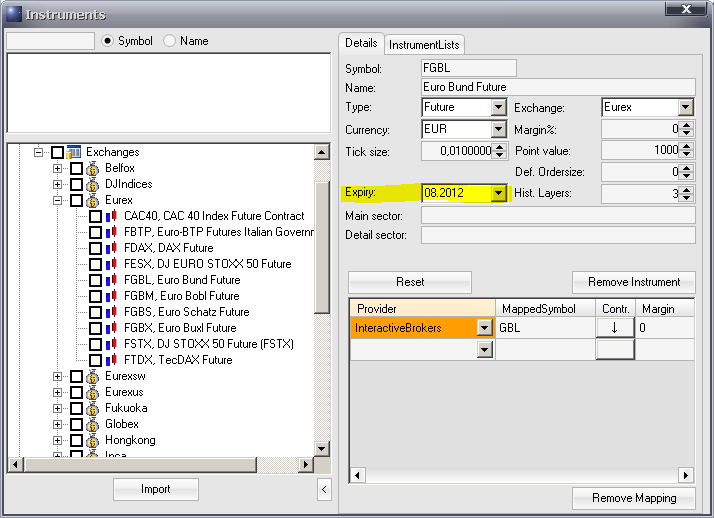

#Umgang mit Bars und Instrumenten

Unter "Daten" werden hier einerseits Informationen verstanden, die "von außen" in AgenaTrader geladen werden und zum anderen Datenreihen, die aus selbst erstellten AgenaSripts stammen.

Detailierte Informatonen finden sich unter dem jeweiligen Stichwort.

[Bars (Candles)](#bars-candles)

[Data series](#data-series)

[Instruments](#instruments)

##Bars (Candles)
### Funktionsweise
Ein klassischer Indikator berechnet üblicherweise aus einer vorliegenden Datenreihe einen oder mehrere Werte.

Datenreihen können dabei z.B. alle Schlusskurse oder auch alle Tiefkurse eines Tages, einer Stunde oder einer 10 Min. Periode sein.

Jeder Periode (also jeder Kerze eines Tages, einer Stunde usw.) wird/werden folglich ein oder mehrere Indikatorwert(e) zugeordnet.

Im Folgenden gehen wir von einem Indikatorwert, wie z.B. bei einem gleitenden Durchschnitt aus.

Zur Berechnung eines gleitenden Durchschnitts benötigt AgenaTrader eine Datenreihe. Im Beispiel nehmen wir die Schlusskurse. Alle Schlusskurse der Bars (Kerzen), die in einem Chart dargestellt sind, sind in einer Liste gespeichert und sozusagen durchnummeriert.

Der aktuelle Schlusskurs, also der Schlusskurs des Bars, der am rechten Rand des Charts dargestellt wird, bekommt die Nummer 0. Der Bar links davon die Nummer 1 usw. Der älteste dargestellte Bar hat dann z.B. die Nummer 500.

Kommt im Laufe der Handelssitzung ein neuer Bar hinzu, erhält dieser nun die Nummer 0, der links von ihm, der gerade noch die Nummer 0 hatte, wird zu Nummer 1 usw. Der letzte dargestellte Bar wird zu Nummer 501.

In einem Script (einem selbsterstellten Programm) steht [*Close*](#close für die Liste (Array) aller Schlusskurse. Der letzte Schlusskurs ist dann *Close \[0\]*; t der Schlusskurs davor (bei Tagesdaten ist das z.B. der Schlusskurs von gestern) ist *Close \[1\]*,  der davor  *Close \[2\]* bis zum ersten Bar im Chart (ganz links) mit *Close \[501\]*. Die Zahl in den eckigen Klammern ist ein Index. In AgenaTrader steht hierfür im allgemeinen Fall der Ausdruck "barsAgo". 

Für jeden Bar gibt es nicht nur Close, sondern zudem auch [*High*](#high), [*Low*](#low), [*Open*](#open), [*Median*](#median), [*Typical*](#typical), [*Weighted*](#weighted), [*Time*](#time) and [*Volume*](#volume). Das Hoch der Kerze, von vor 10 Tagen ist also z.B.  *High \[10\]*, Das Tief von gestern *Low \[1\]*...

**wichtiger Hinweis**

Die o.g. Beispiele gelten, wenn die Berechnung am Ende einer Periode erfolgt. Die Werte der aktuell laufenden (noch nicht fertigen Kerze) sind nicht berücksichtigt.
Möchte man bereits auf die Werte der sich gerade ausbildenden Kerze zurückgreifen, muß man dies AgenaTrader im Script mit [*CalculateOnClosedBar*](#CalculateOnClosedBar)= false mitteilen.

In diesem Fall bekommt der aktuell laufende Bar die Nummer 0, der Bar links neben dem aktuell laufenden die Nummer 1 usw. Der letzte Bar (im Beispiel oben) hätte jetzt die Nummer 502.

Mit close \[0\] bekommt man nun den jeweils letzten Kurs, der gerade vom Datenanbieter an AgenaTrader übermittelt wurde. Alle Werte des Bars (high \[0\], low \[0\]…) können sich solange verändern, bis der Bar fertig ausgebildet ist und ein neuer Bar begonnen hat. Nur Open[0] ändert sich auch in diesem Fall nicht mehr.

## Eigenschaften von Bars
### Eigenschaften von Bars
"Bars" steht für eine Liste aller Bars (Kerzen) in einem Chart (siehe [*Functionality*](#functionality)(#functionality)[*Bars*](#bars)).

Bars (**public** IBars Bars) kann direkt in einem Script verwendet werden und entspricht in diesem Fall BarsArray \[0\] (siehe Bars.GetNextSessionTimeSpan).

Eigenschaften werden immer mit einem Punkt hinter dem Objekt (in diesem Falle Bars, der Liste der Kerzen) angegeben.


[*Bars.Count*](#barscount)

[*Bars.CurrentSessionBeginTime*](#currentsessionbegintime)

[*Bars.CurrentSessionEndTime*](#currentsessionendtime)

[*Bars.GetBar*](#barsgetbar)

[*Bars.GetBarIndex*](#barsgetbarindex)

[*Bars.GetBarsAgo*](#barsgetbarsago)

[*Bars.GetByIndex*](#barsgetbyindex)

[*Bars.GetClose*](#barsgetclose)

[*Bars.GetHigh*](#barsgethigh)

[*Bars.GetLow*](#barsgetlow)

[*Bars.GetNextSessionTimeSpan*](#getnextsessiontimespan)

[*Bars.GetOpen*](barsgetopen)

[*Bars.GetSessionBegin*](#getsessionbegin)

[*Bars.GetTime*](#barsgettime)

[*Bars.GetVolume*](#barsgetvolume)

[*Bars.Instrument*](#barsinstrument)

[*Bars.IsEod*](#barsiseod)

[*Bars.IsFalling*](#barsisfalling)

[*Bars.IsFirstBarInSession*](#barsfirstbarinsession)

[*Bars.IsGrowing*](#barsisgrowing)

[*Bars.IsIntraday*](#barsisintraday)

[*Bars.IsNtb*](#barsisntb)

[*Bars.SessionBreak*](#barssessionbreak)

[*Bars.LastBarCompleteness*](#barslastbarcompleteness)

[*Bars.NextSessionBeginTime*](#nextsessionbegintime)

[*Bars.NextSessionEndTime*](#nextsessionendtime)

[*Bars.TailBottom*](#barstailbottom)

[*Bars.TailTop*](#barstailtop)

[*Bars.TicksCountForLastBar*](#tickscountforlastbar)

[*Bars.TicksCountInTotal*](#barstickscountintotal)

[*Bars.TimeFrame*](#barstimeframe)

[*BarsCountForSession*](#barscountforsession)

[*IsProcessingBarIndexLast*](#isprocessingbarindexlast)

Innerhalb von **OnCalculate()**  können alle Eigenschaften verwendet werden, ohne vorher auf Null-Reference testen zu müssen. Sobald die Funktion **OnCalculate()** von AgenaScript aufgerufen wird, ist immer auch ein Bars Objekt vorhanden. Falls diese Eigenschaften ausserhalb von **OnCalculate()**  verwendet werden, sollte vorher ein entsprechender Test auf Null-Reference z.B. mit **if** (Bars != **null**) ausgeführt werden.

## Bars.Count
### Beschreibung
Bars.Count liefert die Anzahl der Bars in einer Datenreihe.

Siehe auch weitere [*Properties*](#properties) von Bars.

### Rückgabewert
Typ int	Anzahl der Bars

### Verwendung
Bars.Count

### Weitere Informationen
Der Wert von *ProcessingBarIndex* kann immer nur kleiner oder gleich Bars.Count - 1 sein.

Wenn in AgenaTrader angegeben wurde, wieviel Bars in einen Chart geladen werden sollen, entspricht der Wert von Bars.Count genau dieser Einstellung. Im Beispiel unten würde Bars.Count 500 liefern.


### Beispiel
```cs
Print ("Es stehen insgesamt" + Bars.Count + "Bars zur Verfügung.");
```

## Bars.CurrentSessionBeginTime
### Beschreibung
Bars.CurrentSessionBeginTime  liefert das Datum und die Uhrzeit des Beginns der aktuell laufenden Handelssitzung.

Datum und Uhrzeit für den Beginn der aktuellen Handelssitzung werden auch dann korrekt angegeben, wenn die Funktion von einem Bar in der Vergangenheit aufgerufen wird.

### Parameter
keine

### Rückgabewert
Typ DateTime

### Verwendung
Bars.GetSessionBegin

### Weitere Informationen
Die Uhrzeit des zurückgegebenen Wertes entspricht der im MarketEscort angegebenen Startzeit der Handelssitzung des jeweiligen Handelsplatzes. Der für den Wert verwendete Handelsplatz wird im Instrumet Escort eingestellt und kann in AgenaSript mit der Funktion [*Instrument.Exchange*](#instrumentexchange) ermittelt.


### Beispiel
```cs
Print("Die laufende Handelssitzung hat um  " + Bars.CurrentSessionBeginTime );
```

## Bars.CurrentSessionEndTime
### Beschreibung
Bars.CurrentSessionEndTime  liefert das Datum und die Uhrzeit für das Ende der aktuell laufenden Handelssitzung.
Datum und Uhrzeit für das Ende der aktuellen Handelssitzung werden auch dann korrekt angegeben, wenn die Funktion von einem Bar in der Vergangenheit aufgerufen wird.

### Parameter
keine

### Rückgabewert
Typ DateTime

### Verwendung
Bars.GetSessionEnd

### Weitere Informationen
Die Uhrzeit des zurückgegebenen Wertes entspricht der im MarketEscort angegebenen Endezeit der Handelssitzung des jeweiligen Handelsplatzes. Der für den Wert verwendete Handelsplatz wird im Instrumet Escort eingestellt und kann in AgenaSript mit der Funktion  [*Instrument.Exchange*](#instrumentexchange) ermittelt werden.


### Beispiel
```cs
Print("Die laufende Handelssitzung endet um " + Bars.CurrentSessionEndTime);
```

## Bars.GetBar
### Beschreibung
Bars.GetBar liefert den ersten Bars (vom ältesten zum jüngsten), der dem übergebenen Datum bzw. der Uhrzeit entspricht.

Siehe auch [*Bars.GetBarsAgo*](#barsgetbarsago), [*Bars.GetByIndex*](#barsgetbyindex), [*Bars.GetBarIndex*](#barsgetbarindex).

### Parameter
Typ DateTime

### Rückgabewert
Typ IBar Bar-Objekt, des dem Zeitstempel entsprichenden Bars

bei Zeitstempel älter als der älteste Bar: 0 (Null)
bei Zeitstempel jünger als der letzte Bar: Index des letzten Bars

### Verwendung
```cs
Bars.GetBar(DateTime time)
```

### Weitere Informationen
zur Indizierung von Bars siehe [*Functionality*](#functionality), [*Bars*](#bars)

zur Benutzung von DateTime siehe [http://msdn.microsoft.com/de-de/library/system.datetime.aspx](http://msdn.microsoft.com/de-de/library/system.datetime.aspx)

### Beispiel
```cs
Print ("Der Schlusskurs für den 01.03.2012 um 18:00:00 Uhr war " + Bars.GetBar(new DateTime(2012, 01, 03, 18, 0, 0)).Close);
```

## Bars.GetBarIndex
### Beschreibung
Bars.GetBarIndex liefert den Index eines Bars. Übergeben werden kann der Methode entweder ein Bar-Objekt oder ein DateTime-Objekt.

Siehe [*Bars.GetBar*](#barsgetbar)(#barsgetbar), [*Bars.GetBarsAgo*](#barsgetbarsago)(#barsgetbarsago), [*Bars.GetByIndex*](#barsgetbyindex)(#barsgetbyindex).

### Parameter
Typ IBar bar
oder
Typ DateTime

### Rückgabewert
Typ int	der zu dem übergebenen Bar-Objekt bzw. dem übergebenen DateTime-Objekt gehörende Bar-Index

### Verwendung
```cs
Bars.GetBarIndex (IBar bar)
Bars.GetBarIndex (DateTime dt)
```

### Weitere Informationen
zur Indizierung von Bars siehe [*Functionality*](#functionality), [*Bars*](#bars)

### Beispiel
```cs
int barsAgo = 5;
IBar bar = Bars.GetBar(Time[barsAgo]);
Print(barsAgo + " und " + Bars.GetBarIndex(bar) + " sind in diesem Beispiel gleich.");
```
## Bars.GetBarsAgo
### Beschreibung
Bars.GetBarsAgo liefert den Index des ersten Bars (vom ältesten zum jüngsten), der dem übergebenen Datum bzw. der Uhrzeit entspricht.

Siehe auch:: [*Bars.GetBar*](#barsgetbar), [*Bars.GetByIndex*](#barsgetbyindex), [*Bars.GetBarIndex*](#barsgetbarindex).

### Parameter
Typ DateTime

### Rückgabewert
Typ int	Index des Bars, der dem Zeitstempel als erstes entspricht.

bei Zeitstempel älter als der älteste Bar: 0 (Null)
bei Zeitstempel jünger als der letzte Bar: Index des letzten Bars

### Verwendung
```cs
Bars.GetBarsAgo(DateTime time)
```

### Weitere Informationen
zur Indizierung von Bars siehe [*Functionality*](#functionality), [*Bars*](#bars)

zur Benutzung von DateTime siehe  [http://msdn.microsoft.com/de-de/library/system.datetime.aspx](http://msdn.microsoft.com/de-de/library/system.datetime.aspx)

### Beispiel
```cs
Print("Der Bar für den 01.03.2012 um 18:00:00 Uhr hat den Index" + Bars.GetBarsAgo(new DateTime(2012, 01, 03, 18, 0, 0)));
```
## Bars.GetByIndex
### Beschreibung
Bars.GetByIndex liefert das zu einem übergebenen Index gehörende Bar-Objekt.

Siehe [*Bars.GetBar*](#barsgetbar)(#barsgetbar), [*Bars.GetBarsAgo*](#barsgetbarsago)(#barsgetbarsago), [*Bars.GetBarIndex*](#barsgetbarindex)(#barsgetindex).

### Parameter
Typ int Index

### Rückgabewert
Typ IBar Bar-Objekt zu dem übergebenen Index

### Verwendung
```cs
Bars.GetByIndex (int Index)
```

### Weitere Informationen
zur Indizierung von Bars siehe [*Functionality*](#functionality), [*Bars*](#bars)

### Beispiel
```cs
Print(Close[0] + " und " + Bars.GetByIndex(ProcessingBarIndex).Close + " sind in diesem Beispiel gleich.");
```

## Bars.GetClose
Bars.GetClose(int index) – siehe [*Bars.GetOpen*](barsgetopen).

## Bars.GetHigh
Bars.GetHigh(int index) – siehe [*Bars.GetOpen*](barsgetopen).


## Bars.GetLow
Bars.GetLow(int index) – siehe [*Bars.GetOpen*](barsgetopen).

## Bars.GetNextSessionTimeSpan
### Beschreibung
Bars.GetNextSessionTimeSpan liefert jeweils Datum und Uhrzeit von Beginn und Ende der nächsten Handelssitzung.

Siehe [*Bars.CurrentSessionBeginTime*](#barssessionbegin), [*Bars.CurrentSessionEndTime*](#barssessionend), [*Bars.NextSessionBeginTime*](#barssessionnextbegin), [*Bars.NextSessionEndTime*](#barssessionnextend).

### Parameter
|          |         |                                                                                            |
|----------|---------|--------------------------------------------------------------------------------------------|
| DateTime | time    | Datum bzw. Uhrzeit, für die die Daten der folgenden Handelssitzung gesucht werden          |
| iBars    | bars    | Barobjekt, für das die Daten der folgenden Handelssitzung gesucht werden                   |
| int      | barsago | Anzahl der Tage in der Vergangenheit, für die die Daten der folgenden Handelssitzung gesucht werden                    |

### Rückgabewert
DateTime sessionBegin
DateTime sessionEnd

**Hinweis:**
Das Datum von Beginn und Ende sind jeweils für eine Handelssitzung zusammengehörend. Wenn das übergebene Datum dem Ende-Datum der aktuellen Handelssitzung entspricht, kann das zurückgegebene Datum für den Beginn der Handelssitzung bereits in der Vergangenheit liegen.
Es wird in diesem Fall nicht das Datum der nächstfolgenden Handelssitzung zurückgegeben.

### Verwendung
```cs
Bars.GetNextSessionTimeSpan(Bars bars, int barsAgo, out DateTime sessionBegin, out DateTime sessionEnd)
Bars.GetNextSessionTimeSpan(DateTime time, out DateTime sessionBegin, out DateTime sessionEnd)
```

### Weitere Informationen
Die beiden Signaturen liefern nicht notwendigerweise auch die gleichen Ergebnisse.
Bei Verwendung der Bar-Signatur wird der ubergebene Bar daraufhin untersucht, zu welchem Session-Template er gehört. Beginn und Ende der nächsten Session werden dann diesem Template entnommen.

Bei Verwendung der Zeit-Signatur wierden Datum und Uhrzeit des übergebenen Bars genutzt, um die Daten der aktuellen und damit der folgenden Session zu berechnen.

Wenn bei Verwendung der Zeit-Signatur ein Zeitstempel übergeben wird, der exakt einer Beginn bzw. Endezeit einer Session entspricht, werden Beginn und Ende der davorliegenden Session zurückgegeben, d.h. der Zeitstempel wird als "in der Session enthalten" angesehen, selbst wenn der fragliche Bar bereits in einer neuen Session enthalten ist. Um dieses Verhaten sicher auszuschließen, ist die Verwendung der Bar-Signatur empfohlen.

zur Benutzung von DateTime siehe [*http://msdn.microsoft.com/de-de/library/system.datetime.aspx*](http://msdn.microsoft.com/de-de/library/system.datetime.aspx)

### Beispiel
```cs
DateTime sessionBegin;
DateTime sessionEnd;
protected override void OnCalculate()
{
Bars.GetNextSessionTimeSpan(Bars, 0, out sessionBegin, out sessionEnd);
Print("Session Start: " + sessionBegin + " Session End: " + sessionEnd);
}
```

## Bars.GetOpen
### Beschreibung
Die folgenden Methoden sind aus Gründen der Kompatibilität vorhanden.

-   Bars.GetOpen(int index) liefert das Open des mit &lt;index&gt; referenzierten Bars.
-   Bars.GetHigh(int index) liefert das High des mit &lt;index&gt; referenzierten Bars..
-   Bars.GetLow(int index) liefert das Low des mit &lt;index&gt; referenzierten Bars.
-   Bars.GetClose(int index) liefert das Close des mit &lt;index&gt; referenzierten Bars.
-   Bars.GetTime(int index) liefert das Zeitstempel des mit &lt;index&gt; referenzierten Bars.
-   Bars.GetVolume(int index) liefert das Volumen des mit &lt;index&gt; referenzierten Bars.

**Achtung**: Die Indizierung weicht von der sonst verwendeten [*Indexing*](#indexing), [*Bars*](#bars) ab.
Hier beginnt die Indizierung mit 0 am ältesten Bar (links im Chart) und endet mit dem jüngsten Bar rechts im Chart  (=Bars.Count-1).

Die Indizierungen können leicht (in beiden Richtungen!) wie folgt umgerechnet werden:
```cs
private int Convert(int idx)
{
return Math.Max(0,Bars.Count-idx-1-(CalculateOnClosedBar?1:0));
}
```
### Parameter
int index (0 .. Bars.Count-1)

### Rückgabewert
Typ double für GetOpen, GetHigh, GetLow, GetClose und GetVolume

Typ DateTime für GetTime

## Bars.GetSessionBegin
### Beschreibung
Bars.GetSessionBegin liefert das Datum und die Uhrzeit des Beginns einer bestimmten Handelssitzung.
Datum und Uhrzeit für den Beginn der aktuellen Handelssitzung werden auch dann korrekt angegeben, wenn die Funktion von einem Bar in der Vergangenheit aufgerufen wird.
Siehe auch weitere [*Properties*](#properties) von Bars.

### Parameter
keine

### Rückgabewert
Typ DateTime

### Verwendung
Bars.GetSessionBegin(DateTime dt)

### Weitere Informationen
Die Uhrzeit des zurückgegebenen Wertes entspricht der im MarketEscort angegebenen Startzeit der Handelssitzung des jeweiligen Handelsplatzes. Der für den Wert verwendete Handelsplatz wird im Instrumet Escort eingestellt und kann in AgenaSript mit der Funktion Instrument.Exchange ermittelt werden.


### Beispiel
```cs
Print("Die Handelssitzung am 25.03.2015 hat um "+ Bars.GetSessionBegin(new DateTime(2015, 03, 25)) + " begonnen.");
}
```

## Bars.GetTime
Bars.GetTime(int index) – siehe [*Bars.GetOpen*](barsgetopen).

## Bars.GetVolume
Bars.GetVolume(int index) – siehe [*Bars.GetOpen*](barsgetopen).

## Bars.Instrument
### Beschreibung
Bars.Instrument liefert ein Instrument-Objekt, für das im Chart dargestellte Handelsinstrument.

Siehe auch weitere [*Properties*](#properties) von Bars.

### Parameter
keine

### Rückgabewert
Typ Instrument

### Verwendung
Bars.Instrument

### Weitere Informationen
Für weitere Informationen zu Handelsinstrumenten siehe unter  [*Instrument*](#instrument).

### Beispiel
```cs
// beide Ausgaben liefern das gleiche Ergebnis
Print("Das aktuell dargestellte Handelsinstrument hat das Symbol " + Bars.Instrument);
Instrument i = Bars.Instrument;
Print("Das aktuell dargestellte Handelsinstrument hat das Symbol " + i.Symbol);
```
## Bars.IsEod
### Beschreibung
Mit Bars.IsEod kann überprüft werden, ob es sich um End-of-Day-Bars handelt.

Siehe auch weitere [*Properties*](#properties) von Bars.

### Parameter
keine

### Rückgabewert
Typ bool

### Verwendung
Bars.IsEod

### More Information
Innerhalb von  [*OnCalculate()*](#oncalculate)kann diese Eigenschaft verwendet werden, ohne vorher auf Null-Reference testen zu müssen. Sobald die Methode OnCalculate() von AgenaScript aufgerufen wird, ist immer auch ein Bars Objekt vorhanden.

Falls diese Eigenschaft ausserhalb von  OnCalculate ()verwendet wird, sollte vorher ein entsprechender Test auf Null-Reference z.B. mit  if (bars! = Null) ausgeführt werden.

### Beispiel
```cs
Print("Die Bars sind Eod: " + Bars.IsEod);
```
## Bars.IsFalling
### Beschreibung
Bar-Eigenschaften, die verwendet werden, wenn Bar herunterfällt.

### Parameter
keine

### Rückgabewert
keine

### Beispiel
```cs
Bars[0].IsFalling;
```
## Bars.IsFirstBarInSession
### Beschreibung
Mit Bars.IsFirstBarInSession kann festgestellt werden, ob der aktuelle Bar der erste Bar einer Handelssitzung ist.

Siehe auch weitere  [*Properties*](#properties) von Bars.

### Rückgabewert
Typ bool

**true**: Der Bar ist der erste Bar einer Handelssitzung
**false**: Der Bar ist nicht der erste Bar einer Handelssitzung

### Verwendung
Bars.IsFirstBarInSession

### Weitere Informationen
Innerhalb von *OnCalculate()* kann diese Eigenschaft verwendet werden, ohne vorher auf Null-Reference testen zu müssen. Sobald die Methode OnCalculate() von AgenaScript aufgerufen wird, ist immer auch ein Bars Objekt vorhanden.
Falls diese Eigenschaft ausserhalb von OnCalculate() verwendet wird, sollte vorher ein entsprechender Test auf Null-Reference z.B. mit if (Bars != null) ausgeführt werden.

### Beispiel
```cs
if (Bars.IsFirstBarInSession)
Print ("Die aktuelle Handelsitzung hat um" + Time [0]);
```
## Bars.isGrowing
### Beschreibung
Bar-Eigenschaften verwendet, wenn Bar aufwächst.

### Parameter
keine

### Rückgabewert
keine

### Beispiel
```cs
Bars[0].isGrowing;
```

## Bars.IsIntraday
### Beschreibung
Mit Bars.IsIntraday kann überprüft werden, ob es sich um reine Intraday-Bars handelt. Entweder mit Berücksichtigung von Ticks - Bars.IsIntraday.

### Rückgabewert
**bool**

Er gibt "true" zurück, wenn TimeFrame intra-day (z. B. 1 min, 15 min, 1 h usw.) und "false" in anderen Fällen ist.

### Verwendung
```cs
Bars.IsIntraday
```

### Beispiel
```cs
if(Bars.IsIntraday) {
	Print("TimeFrame is Intraday.");
} else {
	Print("TimeFrame is not Intraday.");
}
```

## Bars.IsNtb
### Beschreibung
Mit Bars.IsNtb kann überprüft werden, ob es sich um Not-Time-Based-Bars handelt. Bei Ntb-Bars handelt es sich beispielsweise um Point & Figure oder Renko Charts.
Siehe auch weitere  [*Properties*](#properties) von Bars.

### Parameter
keine

### Rückgabewert
Typ bool

### Verwendung
Bars.IsNtb

### Weitere Informationen
Innerhalb von [*OnCalculate()*](#oncalculate) kann diese Eigenschaft verwendet werden, ohne vorher auf Null-Reference testen zu müssen. Sobald die Methode OnCalculate() von AgenaScript aufgerufen wird, ist immer auch ein Bars Objekt vorhanden.
Falls diese Eigenschaft ausserhalb von OnCalculate() verwendet wird, sollte vorher ein entsprechender Test auf Null-Reference z.B. mit if (Bars != null) ausgeführt werden.

### Beispiel
```cs
Print("Die angezeigten Bars sind Ntb:" + Bars.IsNtb);
```
## Bars.IsSessionBreak
### Beschreibung
Mit Bars.IsSessionBreak kann ermittelt werden, ob die Bars innerhalb der laufenden Handelssitzung in den im Marktplatz-Escort definierten Handelspausen liegen.

Siehe auch weitere [*Properties*](#properties) von Bars.

### Parameter
keine

### Rückgabewert
Typ bool

### Verwendung
Bars.IsSessionBreak

### Weitere Informationen


### Beispiel
```cs
if (Bars.IsSessionBreak)
{
Print("Die Börse Xetra hat gerade eine Handelspause"");
}
```
## Bars.LastBarCompleteness
### Beschreibung
Bars.LastBarCompleteness liefert einen Wert, der angibt, zu wieviel Prozent ein Bar bereits fertiggestellt ist. Ein Bar in der Zeiteinheit 10 Minuten ist z.B. nach 5 Minuten genau zu 50% fertig.

Für nicht-zeitbasierte Chartarten (Kagi, LineBreak, Renko, Range, P&F usw.) und während eines Backtests liefert die Eigenschaft immer eine 0.

### Rückgabewert
**double**

als Prozentwert, d.h. für 30% wird 0.3 zurückgegeben-

### Verwendung
Bars.LastBarCompleteness

### Weitere Informationen
Innerhalb von [*OnCalculate()*](#oncalculate) kann diese Eigenschaft verwendet werden, ohne vorher auf Null-Reference testen zu müssen. Sobald die Methode OnCalculate() von AgenaScript aufgerufen wird, ist immer auch ein Bars Objekt vorhanden.

Falls diese Eigenschaft ausserhalb von OnCalculate() verwendet wird, sollte vorher ein entsprechender Test auf Null-Reference z.B. mit if (Bars != null) ausgeführt werden.

### Beispiel
```cs
// Ein 60 Min. Chart wird intraday beobachtet.
// Jeweils 5 Min. bevor der aktuelle Bar schließt,
// soll ein akustisches Signal ausgegeben werden.
// 55 Min. entsprechen 92%

bool remind = false;
protected override void OnCalculate()
{
if (FirstTickOfBar) remind = true;
if (remind && Bars.LastBarCompleteness >= 0.92)
{
remind = false;
PlaySound("Alert1");
}
}
```

## Bars.NextSessionBeginTime
### Beschreibung
Bars.NextSessionBeginTime liefert das Datum und die Uhrzeit des Beginns der auf die aktuell laufende Handelssitzung folgenden Sitzung.
Datum und Uhrzeit für den Beginn der nächsten Handelssitzung werden auch dann korrekt angegeben, wenn die Funktion von einem Bar in der Vergangenheit aufgerufen wird.

### Parameter
keine

### Rückgabewert
Typ DateTime

### Verwendung
Bars.GetSessionNextBegin

### Weitere Informationen
Die Uhrzeit des zurückgegebenen Wertes entspricht der im MarketEscort angegebenen Startzeit der Handelssitzung des jeweiligen Handelsplatzes. Der für den Wert verwendete Handelsplatz wird im Instrumet Escort eingestellt und kann in AgenaSript mit der Funktion [*Instrument.Exchange*](#instrumentexchange) ermittelt werden.


### Beispiel
```cs
Print("Die nächste Handelssitzung beginnt um " + Bars.NextSessionBeginTime);
```

## Bars.NextSessionEndTime
### Beschreibung
Bars.NextSessionEndTime liefert das Datum und die Uhrzeit für das Ende der auf die aktuell laufende Handelssitzung folgenden Sitzung.
Datum und Uhrzeit für das Ende der nächsten Handelssitzung werden auch dann korrekt angegeben, wenn die Funktion von einem Bar in der Vergangenheit aufgerufen wird.
Siehe auch weitere  [*Properties*](#properties) von Bars.

### Parameter
keine

### Rückgabewert
Typ DateTime

### Verwendung
Bars.GetSessionNextEnd

### Weitere Informationen
Die Uhrzeit des zurückgegebenen Wertes entspricht der im MarketEscort angegebenen Endezeit der Handelssitzung des jeweiligen Handelsplatzes. Der für den Wert verwendete Handelsplatz wird im Instrumet Escort eingestellt und kann in AgenaSript mit der Funktion [*Instrument.Exchange*](#instrumentexchange) ermittelt werden.


### Beispiel
```cs
Print("Die nächste Handelssitzung endet um " + Bars.NextSessionEndTime);
```
## Bars.TailBottom
### Beschreibung
Mit dieser Eigenschaft ist es möglich die Höhe des unteren Dochtes der Kerze zu ermitteln.

### Parameter
keine

### Rückgabewert
keine

### Verwendung
```cs
Bars[0].TailBottom;
```

### Beispiel
```cs
Print("Die Höhe des unteren Dochtes ist: " + Bars.TailBottom);
```

## Bars.TailTop
### Beschreibung
Mit dieser Eigenschaft ist es möglich die Höhe des oberen Dochtes der Kerze zu ermitteln.

### Parameter
keine

### Rückgabewert
keine

### Verwendung
```cs
Bars[0].TailTop;
```

### Beispiel
```cs
Print("Die Höhe des oberen Dochtes ist: " + Bars.TailTop);
```

## Bars.TicksCountForLastBar
### Beschreibung
Bars.TicksCountForLastBar liefert die Gesamtanzahl der in einem Bar enthaltenen Ticks.

Siehe auch weitere [*Properties*](#properties) von Bars.

### Parameter
keine

### Rückgabewert
Typ int

### Verwendung
Bars.TicksCountForLastBar

### Weitere Informationen
Innerhalb von [*OnCalculate()*](#oncalculate) kann diese Eigenschaft verwendet werden, ohne vorher auf Null-Reference testen zu müssen. Sobald die Methode OnCalculate() von AgenaScript aufgerufen wird, ist immer auch ein Bars Objekt vorhanden.

Falls diese Eigenschaft ausserhalb von OnCalculate() verwendet wird, sollte vorher ein entsprechender Test auf Null-Reference z.B. mit *if* (Bars != *null*) ausgeführt werden.

### Beispiel
```cs
Print("Der aktuelle Bar besteht aus " + Bars.TicksCountForLastBar + " Ticks.");
```

## Bars.TicksCountInTotal
### Beschreibung
Bars.TicksCountInTotal  liefert die Gesamtzahl aller Ticks von dem Moment an, von dem die Funktion aufgerufen wird.

Siehe auch weitere  [*Properties*](#properties) von Bars.

### Parameter
keine

### Rückgabewert
Typ int

### Verwendung
Bars.TicksCountInTotal

### Weitere Informationen
Der Datentyp int hat einen positiven Wertebereich von 2147483647. Wenn 10 Ticks je Sekunde angenommen werden, gibt es auch nach 2 Handelsmonaten bei einem 24h-Handel noch kein Überlauf.

Innerhalb von [*OnCalculate()*](#oncalculate)kann diese Eigenschaft verwendet werden, ohne vorher auf Null-Reference testen zu müssen. Sobald die Methode OnCalculate() von AgenaScript aufgerufen wird, ist immer auch ein Bars Objekt vorhanden.

Falls diese Eigenschaft ausserhalb von OnCalculate() verwendet wird, sollte vorher ein entsprechender Test auf Null-Reference z.B. mit *if* (Bars != *null*) ausgeführt werden.

### Beispiel
```cs
//Anwendung in einem 30 Minuten Chart
Print("Die Gesamtanzahl der gelieferten Ticks in diesem Wert beträgt " + Bars.TicksCountInTotal);
```
## Bars.TimeFrame
### Beschreibung
Bars.TimeFrame liefert ein TimeFrame-Objekt, das Informationen zum aktuell verwendeten Zeiteinheit enthält.

Siehe auch weitere [*Properties*](#properties) von Bars.

### Parameter
keine

### Rückgabewert
Typ ITimeFrame

### Verwendung
Bars.TimeFrame

### Weitere Informationen
Für weitere Informationen zum TimeFrame-Objekt siehe unter [*TimeFrame*](#timeframe).

Innerhalb von [*OnCalculate()*](#oncalculate) kann diese Eigenschaft verwendet werden, ohne vorher auf Null-Reference testen zu müssen. Sobald die Methode OnCalculate() von AgenaScript aufgerufen wird, ist immer auch ein Bars Objekt vorhanden.

Falls diese Eigenschaft ausserhalb von OnCalculate() verwendet wird, sollte vorher ein entsprechender Test auf Null-Reference z.B. mit  *if* (Bars != *null*) ausgeführt werden.

### Beispiel
```cs
//Anwendung in einem 30 Minuten Chart
TimeFrame tf = (TimeFrame) Bars.TimeFrame;
Print(Bars.TimeFrame); //liefert "30 Min"
Print(tf.Periodicity); // liefert "Minute"
Print(tf.PeriodicityValue); // liefert "30"
```

## BarsCountForSession
### Beschreibung
Bars.BarsCountForSession liefert die Anzahl der Bars, die seit dem Beginn der aktuellen Handelssitzung entstanden sind.

Siehe auch weitere [*Properties*](#properties) von Bars.

### Rückgabewert
Typ int	Anzahl der Bars

Ein Wert von -1 deutet auf ein Problem bei der Ermittlung des Sessionbeginns hin.

### Verwendung
Bars.BarsCountForSession

### Weitere Informationen
Innerhalb von *OnCalculate()* kann diese Eigenschaft verwendet werden, ohne vorher auf Null-Reference testen zu müssen. Sobald die Methode OnCalculate() von AgenaScript aufgerufen wird, ist immer auch ein Bars Objekt vorhanden.

Falls diese Eigenschaft ausserhalb von OnBarUpdate() verwendet wird, sollte vorher ein entsprechender Test auf Null-Reference z.B. mit  *if* (Bars!= *null*)  ausgeführt werden.

### Beispiel
```cs
Print ("Seit dem Start der letzten Handelssitzung sind" + Bars.BarsCountForSession + "Bars entstanden.");
```

## ProcessingBarSeriesIndex
### Beschreibung
Gibt an, ob der aktuelle Bar zuletzt berechnet wurde.

### Parameter
keine

### Rückgabewert
Typ bool

### Verwendung
ProcessingBarSeriesIndex

### Weitere Informationen
Verwendet für komplizierte Berechnung auf einem letzten Bar

### Beispiel
```cs
protected override void OnCalculate()
        {
            base.OnCalculate();
            if (!IsProcessingBarIndexLast)
                return;
            bool isUpdated;
}
```


## Data Series
### Beschreibung
Datenserien werden in AgenaTrader zum einen unterschieden in die frei für die eigene Programmierung verwendbaren Datenserien zum Speichern von Werten unterschiedlicher Datentypen und zum anderen in die in AgenaTrader fest integrierten Datenserien, die die Kursdaten der einzelnen Bars enthalten. Die letzteren werden hier vorgestellt.
Das Konzept von Datenserien wird sehr konsequent und durchgängig verfolgt. Alle Kursdaten der einzelnen Bars sind in Datenserien organisiert.
Folgende Datenserien sind verfügbar:

[*Open*](#open) [*Opens*](#opens)

[*High*](#high) [*Highs*](#highs)

[*Low*](#low)(#low) [*Lows*](#lows)

[*Close*](#close) [*Closes*](#closes)

[*Median*](#median) [*Medians*](#medians)

[*Typical*](#typical)(#Typical) [*Typicals*](#typicals)

[*Weighted*](#weighted)(#weighted) [*Weighteds*](#weighteds)

[*Time*](#time) [*Times*](#times)

[*TimeFrame*](#timeframe) [*TimeFrames*](#timeframes)

[*Volume*](#volume) [*Volumes*](#volumes)

## Open
### Beschreibung
Open ist eine [*DataSeries*](#dataseries) vom Typ [*DataSeries*](#dataseries),  in der die historischen Eröffnungskurse gespeichert sind.

### Parameter
BarsAgo Indexwert (s. [*Bars*](#bars))

### Verwendung
```cs
Open
Open[int barsAgo]
```

### Weitere Informationen
Der zurückgegebene Wert ist abhängig von der Eigenschaft  [*CalculateOnClosedBar*](#calculateonclosebar).

### Beispiel
```cs
// Eröffnungskurs der aktuellen Periode
Print(Time[0] + " " + Open[0]);
// Eröffnungskurs des Bars von vor 5 Perioden
Print(Time[5] + " " + Open[5]);
// aktueller Wert für den SMA 14 über die Eröffnungskurse (gerundet)
Print("SMA(14) calculated using the opening prices: " + Instrument.Round2TickSize(SMA(Open, 14)[0]));
```

## Opens
### Beschreibung
Opens ist ein Array von Datenserien, welches alle Open-Datenserien enthält.

Dieses Array ist nur in Indikatoren bzw. Strategien von Bedeutung, die Daten aus mehreren Zeiteinheiten verarbeiten.

Ein neuer Eintrag wird dem Array immer dann hinzugefügt, wenn dem Indikator bzw. der Strategie eine neue Zeiteinheit hinzugefügt wird.

Mit **\[TimeFrameRequirements(("1 Day"), ("1 Week"))\]** enthält das Array 3 Einträge:

Opens\[0\] die Open-Dataseries der Chart-Zeiteinheit
Opens\[1\] die Open-Dataseries aller Bars auf Tagesbasis
Opens\[2\] die Open-Dataseries aller Bars auf Wochenbasis.

Opens\[0\]\[0\] entspricht Open\[0\].

Siehe auch [*MultiBars*](#multibars)

### Parameter
barsAgo Indexwert der einzelnen Bars innerhalb der Dataseries (s. [*Bars*](#bars))
barSeriesIndex Indexwert der unterschiedlichen Zeiteinheiten

### Verwendung
```cs
Opens[int barSeriesIndex]
Opens[int barSeriesIndex][int barsAgo]
```

### Weitere Informationen
Der zurückgegebene Wert ist abhängig von der Eigenschaft [*CalculateOnClosedBar*](#calculateonclosebar).

### Beispiel
Siehe Beispiel unter [*Multibars*](#multibars).

## High
### Description
High ist eine [*DataSeries*](#dataseries) vom Typ [*DataSeries*](#dataseries), in der die historischen Höchstkurse gespeichert sind.

### Parameter
barsAgo Indexwert (s. [*Bars*](#bars))

### Verwendung
```cs
High
High[int barsAgo]
```

### Weitere Informationen
Der zurückgegebene Wert ist abhängig von der Eigenschaft  [*CalculateOnClosedBar*](#calculateonclosebar).

### Beispiel
```cs
//Höchstkurs der aktuellen Periode
Print(Time[0] + " " + High[0]);
// Höchstkurs des Bars von vor 5 Perioden
Print(Time[5] + " " + High[5]);
// aktueller Wert für den SMA 14 über die Höchstkurse (gerundet)
Print("SMA(14) Calculated using the high prices: " + Instrument.Round2TickSize(SMA(High, 14)[0]));
```

## Highs
### Beschreibung
Highs ist ein Array von \[*DataSeries*\]\[1\] welches alle High-Datenserien enthält.

Dieses Array ist nur in Indikatoren bzw. Strategien von Bedeutung, die Daten aus mehreren Zeiteinheiten verarbeiten.

Ein neuer Eintrag wird dem Array immer dann hinzugefügt, wenn dem Indikator bzw. der Strategie eine neue Zeiteinheit hinzugefügt wird

Mit **\[TimeFrameRequirements(("1 Day"), ("1 Week"))\]** enthält das Array 3 Einträge.

Highs\[0\] die High-Dataseries der Chart-Zeiteinheit
Highs\[1\] die High-Dataseries aller Bars auf Tagesbasis
Highs\[2\] die High-Dataseries aller Bars auf Wochenbasis.

Highs\[0\]\[0\] entspricht High\[0\].

Siehe auch [*MultiBars*](#multibars).

### Parameter
barsAgo	 Indexwert der einzelnen Bars innerhalb der Dataseries (s. [*Bars*](#bars))
barSeriesIndex	Indexwert der unterschiedlichen Zeiteinheiten

### Verwendung
```cs
Highs[int barSeriesIndex]
Highs[int barSeriesIndex][int barsAgo]
```

### Weitere Informationen
Der zurückgegebene Wert ist abhängig von der Eigenschaft [*CalculateOnClosedBar*](#calculateonclosebar).

### Beispiel
Siehe Beispiel unter  [*Multibars*](#multibars).

## Low
### Beschreibung
Low ist eine [*DataSeries*](#dataseries) vom Typ [*DataSeries*](#dataseries),  in der die historischen Tiefstkurse gespeichert sind.

### Parameter
barsAgo Indexwert (s. [*Bars*](#bars))

### Verwendung
```cs
Low
Low[int barsAgo]
```

### Weitere Informationen
Der zurückgegebene Wert ist abhängig von der Eigenschaft [*CalculateOnClosedBar*](#calculateonclosebar).

### Beispiel
```cs
// Tiefstkurs der aktuellen Periode
Print(Time[0] + " " + Low[0]);
// Tiefstkurs des Bars von vor 5 Perioden
Print(Time[5] + " " + Low[5]);
// aktueller Wert für den SMA 14 über die Tiefstkurse (gerundet)
Print("SMA(14) calculated using the high prices: " + Instrument.Round2TickSize(SMA(Low, 14)[0]));
```

## Lows
### Beschreibung
Lows ist ein Array von \[*DataSeries*\]\[1\] welches alle [*Low*](#low)-Datenserien enthält.

Dieses Array ist nur in Indikatoren bzw. Strategien von Bedeutung, die Daten aus mehreren Zeiteinheiten verarbeiten.

Ein neuer Eintrag wird dem Array immer dann hinzugefügt, wenn dem Indikator bzw. der Strategie eine neue Zeiteinheit hinzugefügt wird.

Mit **\[TimeFrameRequirements(("1 Day"), ("1 Week"))\]**  enthält das Array 3 Einträge.

Lows\[0\] die Low-Dataseries der Chart-Zeiteinheit
Lows\[1\] die Low-Dataseries aller Bars auf Tagesbasis
Lows\[2\] die Low-Dataseries aller Bars auf Wochenbasis.

Lows\[0\]\[0\] entspricht Low\[0\].

Siehe auch [*MultiBars*](#multibars).

### Parameter
barsAgo	 Indexwert der einzelnen Bars innerhalb der Dataseries
barSeriesIndex	Indexwert der unterschiedlichen Zeiteinheiten

### Verwendung
```cs
Lows[int barSeriesIndex]
Lows[int barSeriesIndex][int barsAgo]
```

### Weitere Informationen
Der zurückgegebene Wert ist abhängig von der Eigenschaft [*CalculateOnClosedBar*](#calculateonclosebar).

### Beispiel
Siehe Beispiel unter [*Multibars*](#multibars).

## Close
### Beschreibung
Close ist eine [*DataSeries*](#dataseries) vom Typ [*DataSeries*](#dataseries), in der die historischen Schlusskurse gespeichert sind.

### Parameter
barsAgo Indexwert (s. [*Bars*](#bars))

### Verwendung
```cs
Close
Close[int barsAgo]
```

### Weitere Informationen
Der zurückgegebene Wert ist abhängig von der Eigenschaft [*CalculateOnClosedBar*](#calculateonclosebar).

Indikatoren werden standardmäßig über die Schlusskurse berechnet. Die Angabe der Input-Serie kann weggelassen werden (siehe Beispiel unten).

### Beispiel
```cs
// Schlusskurs der aktuellen Periode
Print(Time[0] + " " + Close[0]);
// Schlusskurs des Bars von vor 5 Perioden
Print(Time[5] + " " + Close[5]);
// aktueller Wert für den SMA 14 über die Schlusskurse (gerundet)
Print("SMA(14) calculated using the closing prices: " + Instrument.Round2TickSize(SMA(Close, 14)[0]));
// Close kann auch weggelassen werden, da es per Default verwendet wird.
Print("SMA(14) calculated using the closing prices: " + Instrument.Round2TickSize(SMA(14)[0]));
```

## Closes
### Beschreibung
Closes ist ein Array von \[*DataSeries*\]\[1\] welches alle [*Low*](#low)-Datenserien enthält.

Dieses Array ist nur in Indikatoren bzw. Strategien von Bedeutung, die Daten aus mehreren Zeiteinheiten verarbeiten.

Ein neuer Eintrag wird dem Array immer dann hinzugefügt, wenn dem Indikator bzw. der Strategie eine neue Zeiteinheit hinzugefügt wird.

Mit **\[TimeFrameRequirements(("1 Day"), ("1 Week"))\]** enthält das Array 3 Einträge.

Closes\[0\] die Close-Dataseries der Chart-Zeiteinheit
Closes\[1\] die Close-Dataseries aller Bars auf Tagesbasis
Closes\[2\] die Close-Dataseries aller Bars auf Wochenbasis.

Closes\[0\]\[0\] entspricht Close\[0\].

Siehe auch [*MultiBars*](#multibars).

### Parameter
barsAgo	Indexwert der einzelnen Bars innerhalb der Dataseries 
barSeriesIndex Indexwert der unterschiedlichen Zeiteinheiten

### Verwendung
```cs
Closes[int barSeriesIndex]
Closes[int barSeriesIndex][int barsAgo]
```

### Weitere Informationen
Der zurückgegebene Wert ist abhängig von der Eigenschaft [*CalculateOnClosedBar*](#calculateonclosebar).

### Beispiel
Siehe Beispiel unter [*Multibars*](#multibars).

## Median
### Beschreibung
Median ist eine [*DataSeries*](#dataseries) vom Typ [*DataSeries*](#dataseries)in der die historischen Median-Werte gespeichert sind.

Der Median-Preis eines Bars ergibt sich aus (High + Low) / 2.

Siehe auch [*Typical*](#typical) und [*Weighted*](#weighted).

### Parameter
barsAgo Indexwert (s. [*Bars*](#bars))

### Verwendung
```cs
Median
Median[int barsAgo]
```

### Weitere Informationen
Der zurückgegebene Wert ist abhängig von der Eigenschaft [*CalculateOnClosedBar*](#calculateonclosebar).

Informationen zu Median, Typical und Weighted:
[*http://blog.nobletrading.com/2009/12/median-price-typical-price-weighted.html*](http://blog.nobletrading.com/2009/12/median-price-typical-price-weighted.html)

### Beispiel
```cs
// Median-Preis der aktuellen Periode
Print(Time[0] + " " + Median[0]);
// Median-Preis des Bars von vor 5 Perioden
Print(Time[5] + " " + Median[5]);
// aktueller Wert für den SMA 14 über die Median-Preise (gerundet)
Print("SMA(14) calculated using the median prices: " + Instrument.Round2TickSize(SMA(Median, 14)[0]));
```

## Medians
### Beschreibung
Medians ist ein Array von  \[*DataSeries*\]\[1\] welches alle [*Median*](#median)-Datenserien enthält.

Dieses Array ist nur in Indikatoren bzw. Strategien von Bedeutung, die Daten aus mehreren Zeiteinheiten verarbeiten.

Ein neuer Eintrag wird dem Array immer dann hinzugefügt, wenn dem Indikator bzw. der Strategie eine neue Zeiteinheit hinzugefügt wird.

Mit **\[TimeFrameRequirements(("1 Day"), ("1 Week"))\]**  enthält das Array 3 Einträge.

Medians\[0\] die Median-Dataseries der Chart-Zeiteinheit
Medians\[1\] die Median-Dataseries aller Bars auf Tagesbasis
Medians\[2\] die Median-Dataseries aller Bars auf Wochenbasis.

Medians\[0\]\[0\]entspricht Medians\[0\].

Siehe auch [*MultiBars*](#multibars).

### Parameter
barsAgo	Indexwert der einzelnen Bars innerhalb der Dataseries
barSeriesIndex Indexwert der unterschiedlichen Zeiteinheiten

### Verwendung
```cs
Medians[int barSeriesIndex]
Medians[int barSeriesIndex][int barsAgo]
```

### Weitere Informationen
Der zurückgegebene Wert ist abhängig von der Eigenschaft  [*CalculateOnClosedBar*](#calculateonclosebar).

Informationen zu Median, Typical und Weighted: [http://www.investopedia.com/terms/m/median.asp](http://www.investopedia.com/terms/m/median.asp)

### Beispiel
Siehe Beispiel unter [*Multibars*](#multibars).

## Typical
### Beschreibung
Typical ist eine [*DataSeries*](#dataseries) vom Typ [*DataSeries*](#dataseries)in der die historischen Typical-Werte gespeichert sind.

Der Typical-Preis eines Bars ergibt sich aus (High + Low + Close) / 3.

Siehe auch [*Median*](#median) und [*Weighted*](#weighted).

### Parameter
barsAgo Indexwert (s. [*Bars*](#bars))

### Verwendung
```cs
Typical
Typical[int barsAgo]
```

### Weitere Informationen
Der zurückgegebene Wert ist abhängig von der Eigenschaft  [*CalculateOnClosedBar*](#calculateonclosebar).

Informationen zu Median, Typical und Weighted: [*https://technicianapp.com/resources/typical-price/*](https://technicianapp.com/resources/typical-price/)

### Beispiel
```cs
// Typical-Preis der aktuellen Periode
Print(Time[0] + " " + Typical[0]);
// Typical-Preis des Bars von vor 5 Perioden
Print(Time[5] + " " + Typical[5]);
// aktueller Wert für den SMA 14 über die Typical-Preise (gerundet)
Print("SMA(14) calculated using the typical price: " + Instrument.Round2TickSize(SMA(Typical, 14)[0]));
```

## Typicals
### Beschreibung
Typicals ist ein Array von *Datenserien*, welches alle  [*Typical*](#typical)-Datenserien enthält.

Dieses Array ist nur in Indikatoren bzw. Strategien von Bedeutung, die Daten aus mehreren Zeiteinheiten verarbeiten.

Ein neuer Eintrag wird dem Array immer dann hinzugefügt, wenn dem Indikator bzw. der Strategie eine neue Zeiteinheit hinzugefügt wird.

Mit **\[TimeFrameRequirements(("1 Day"), ("1 Week"))\]** enthält das Array 3 Einträge.

Typicals\[0\] die Typical-Dataseries der Chart-Zeiteinheit
Typicals\[1\] die Typical-Dataseries aller Bars auf Tagesbasis
Typicals\[2\] die Typical-Dataseries aller Bars auf Wochenbasis.

Typicals\[0\]\[0\] entspricht Typicals\[0\].

Siehe auch [*MultiBars*](#multibars).

### Parameter
barsAgo	Indexwert der einzelnen Bars innerhalb der Dataseries
barSeriesIndex Indexwert der unterschiedlichen Zeiteinheiten

### Verwendung
```cs
Typicals[int barSeriesIndex]
Typicals[int barSeriesIndex][int barsAgo]
```

### Weitere Informationen
Der zurückgegebene Wert ist abhängig von der Eigenschaft  [*CalculateOnClosedBar*](#calculateonclosebar).

### Beispiel
Siehe Beispiel unter  [*Multibars*](#multibars).

## Weighted
### Beschreibung
Weighted ist eine [*DataSeries*](#dataseries) vom Typ [*DataSeries*](#dataseries), in der die historischen Weighted-Werte gespeichert.

Der Weighted-Preis eines Bars ergibt sich aus (high + low + 2*close) / gewichtet auf den Schlusskurs.

Siehe auch [*Median*](#median) und [*Typical*](#typical).

### Parameter
barsAgo Indexwert (s. [*Bars*](#bars))

### Verwendung
```cs
Weighted[int barsAgo]
```

### Weitere Informationen
Der zurückgegebene Wert ist abhängig von der Eigenschaft  [*CalculateOnClosedBar*](#calculateonclosebar).

Informationen zu Median, Typical und Weighted: [*http://www.stock-trading-infocentre.com/pivot-points.html*](http://www.stock-trading-infocentre.com/pivot-points.html)

### Beispiel
```cs
// Weighted-Preis der aktuellen Periode
Print(Time[0] + " " + Weighted[0]);
// Weighted-Preis des Bars von vor 5 Perioden
Print(Time[5] + " " + Weighted[5]);
// aktueller Wert für den SMA 14 über die Weighted-Preise (gerundet)
Print("SMA(14) calculated using the weighted price: " + Instrument.Round2TickSize(SMA(Weighted, 14)[0]));
```

## Weighteds
### Beschreibung
Weighteds ist ein Array von  \[*DataSeries*\]\[1\] welches alle [*Weighted*](#weighted)-Datenserien enthält.

Dieses Array ist nur in Indikatoren bzw. Strategien von Bedeutung, die Daten aus mehreren Zeiteinheiten verarbeiten.

Ein neuer Eintrag wird dem Array immer dann hinzugefügt, wenn dem Indikator bzw. der Strategie eine neue Zeiteinheit hinzugefügt wird.

Mit **\[TimeFrameRequirements(("1 Day"), ("1 Week"))\]**   enthält das Array 3 Einträge.

Weighteds\[0\] die Weighted-Dataseries der Chart-Zeiteinheit
Weighteds\[1\] die Weighted-Dataseries aller Bars auf Tagesbasis
Weighteds\[2\] die Weighted-Dataseries aller Bars auf Wochenbasis

Weighteds\[0\]\[0\] entspricht Weighteds\[0\].

Siehe auch  [*MultiBars*](#multibars).

### Parameter
barsAgo	Indexwert der einzelnen Bars innerhalb der Dataseries 
barSeriesIndex Indexwert der unterschiedlichen Zeiteinheiten

### Verwendung
```cs
Weighteds[int barSeriesIndex]
Weighteds[int barSeriesIndex][int barsAgo]
```

### Weitere Informationen
Der zurückgegebene Wert ist abhängig von der Eigenschaft [*CalculateOnClosedBar*](#calculateonclosebar).

### Beispiel
Siehe Beispiel unter [*Multibars*](#multibars).

## Time
### Beschreibung
Time ist eine [*DataSeries*](#dataseries) vom Typ [*DateTimeSeries*](#datatimeseries), in der die Zeitstempel der einzelnen Bars gespeichert sind.

### Parameter
barsAgo Indexwert (s. [*Bars*](#bars))

### Verwendung
```cs
Time
Time[int barsAgo]
```

### Weitere Informationen
Der zurückgegebene Wert ist abhängig von der Eigenschaft  [*CalculateOnClosedBar*](#calculateonclosebar).

### Beispiel
```cs
// Zeitstempel der aktuellen Periode
Print(Time[0]);
// Zeitstempel des Bars von vor 5 Perioden
Print(Time[5]);
```

## Times
### Beschreibung
Times ist ein Array von [*DataSeries*](#dataseries) welches alle [*Time*](#time)-Datenserien enthält.

Dieses Array ist nur in Indikatoren bzw. Strategien von Bedeutung, die Daten aus mehreren Zeiteinheiten verarbeiten.
Ein neuer Eintrag wird dem Array immer dann hinzugefügt, wenn dem Indikator bzw. der Strategie eine neue Zeiteinheit hinzugefügt wird.

Mit **\[TimeFrameRequirements(("1 Day"), ("1 Week"))\]**   enthält das Array 3 Einträge.

Times\[0\] die Time-Dataseries der Chart-Zeiteinheit
Times\[1\] die Time-Dataseries aller Bars auf Tagesbasis
Times\[2\] die Time-Dataseries der Chart-Zeiteinheit

Times\[0\]\[0\] entspricht Times\[0\].

Siehe auch  [*MultiBars*](#multibars).

### Parameter
barsAgo	Indexwert der einzelnen Bars innerhalb der Dataseries
barSeriesIndex Indexwert der unterschiedlichen Zeiteinheiten

### Verwendung
```cs
Times[int barSeriesIndex]
Times[int barSeriesIndex][int barsAgo]
```

### Weitere Informationen
Der zurückgegebene Wert ist abhängig von der Eigenschaft [*CalculateOnClosedBar*](#calculateonclosebar).

### Beispiel
Siehe Beispiel unter [*Multibars*](#multibars).

## Volume
### Beschreibung
Volume ist eine [*DataSeries*](#dataseries) vom Typ [*DataSeries*](#dataseries),  in der die historischen Umsätze gespeichert sind.

### Parameter
barsAgo Indexwert (s. [*Bars*](#bars))

### Verwendung
Volume

Volume\[**int** barsAgo\]

### Weitere Informationen
Der zurückgegebene Wert ist abhängig von der Eigenschaft [*CalculateOnClosedBar*](#calculateonclosebar).

Der vom Indikator [*VOL()*](#vol) zurückgelieferte Wert ist identisch mit dem hier beschriebenen Volumen.
Z.B. liefert Vol()\[3\]  den gleichen Wert wie Volume\[3\].

### Beispiel
```cs
// Volumen der aktuellen Periode
Print(Time[0] + " " + Volume[0]);
// Volumen des Bars von vor 5 Perioden
Print(Time[5] + " " + Volume[5]);
// aktueller Wert für den SMA 14 über das Volumen (gerundet)
Print("SMA(14) berechnet über das Volumen: " + Instrument.Round2TickSize(SMA(Volume, 14)[0]));
```

## Volumes
### Beschreibung
Volumes ist ein Array von [*DataSeries*](#dataseries) welches alle [*Volume*](#volume)-Datenserien enthält.

Dieses Array ist nur in Indikatoren bzw. Strategien von Bedeutung, die Daten aus mehreren Zeiteinheiten verarbeiten.

Ein neuer Eintrag wird dem Array immer dann hinzugefügt, wenn dem Indikator bzw. der Strategie eine neue Zeiteinheit hinzugefügt wird.

Mit **\[TimeFrameRequirements(("1 Day"), ("1 Week"))\]**   enthält das Array 3 Einträge.

Volumes\[0\] die Volume-Dataseries der Chart-Zeiteinheit
Volumes\[1\] die Volume-Dataseries aller Bars auf Tagesbasis
Volumes\[2\] die Volume-Dataseries aller Bars auf Wochenbasis.

Volumes\[0\]\[0\] entspricht Volumes\[0\].

Siehe auch [*MultiBars*](#multibars).

### Parameter
barsAgo	Indexwert der einzelnen Bars innerhalb der Dataseries

barSeriesIndex Indexwert der unterschiedlichen Zeiteinheiten

### Verwendung
```cs
Volumes[int barSeriesIndex]
Volumes[int barSeriesIndex][int barsAgo]
```

### Weitere Informationen
Der zurückgegebene Wert ist abhängig von der Eigenschaft  [*CalculateOnClosedBar*](#calculateonclosebar).

### Beispiel
Siehe Beispiel unter  [*Multibars*](#multibars).

## TimeFrame
### Beschreibung
TimeFrame ist ein Zeitrahmenobjekt.

### Verwendung
```cs
TimeFrame
```

## TimeFrames
### Beschreibung
TimeFrames ist ein Array von TimeFrame-Objekten, welches für jedes Bar-Objekt ein separates TimeFrame-Objekt  enthält.

Dieses Array ist nur in Indikatoren bzw. Strategien von Bedeutung, die Daten aus mehreren Zeiteinheiten verarbeiten.

Ein neuer Eintrag wird dem Array immer dann hinzugefügt, wenn dem Indikator bzw. der Strategie eine neue Zeiteinheit hinzugefügt wird.

Mit **\[TimeFrameRequirements(("1 Day"), ("1 Week"))\]** enthält das Array 3 Einträge:

TimeFrames \[0\] TimeFrame der primären Datenserie (Chart-Zeiteinheit)
TimeFrames \[1\] **Print**(TimeFrames\[1\]);  // liefert "1 Day"
TimeFrames \[2\] **Print**(TimeFrames\[2\]); // liefert "1 Week"

TimeFrames \[0\] entspricht [*TimeFrame*](#timeframe).

Siehe auch [*MultiBars*](#multibars).

### Parameter
barSeriesIndex Indexwert der unterschiedlichen Zeiteinheiten

### Verwendung
```cs
TimeFrames [int barSeriesIndex]
```

### Beispiel
```cs
if (ProcessingBarSeriesIndex == 0 && ProcessingBarIndex == 0)
for (int i = BarsArray.Count-1; i >= 0; i--)
Print("The Indicator " + this.Name + " uses Bars of the Timeframe " + TimeFrames[i]);
```

##Instruments
"Instrument" bezeichnet einen handelbaren Wert, wie z.B. eine Aktie, einen ETF, einen Future, einen CFD usw.

Ein Instrument hat viele Eigenschaften, die in einem selbst erstellten AgenaScript verwendet werden können.

[*Instrument.Compare*](#instrumentcompare)

[*Instrument.Currency*](#instrumentcurrency)

[*Instrument.Digits*](#instrumentdigits)

[*Instrument.ETF*](#instrumentetf)

[*Instrument.Exchange*](#instrumentexchange)

[*Instrument.Expiry*](#instrumentexpiry)

[*Instrument.GetCurrencyFactor*](#instrumentgetcurrencyfactor)

[*Instrument.InstrumentType*](#instrumentinstrumenttype)

[*Instrument.MainSector*](#instrumentmainsector)

[*Instrument.Margin*](#instrumentmargin)

[*Instrument.Name*](#instrumentname)

[*Instrument.PointValue*](#instrumentpointvalue)

[*Instrument.Round2TickSize*](#instrumentround2ticksize)

[*Instrument.Symbol*](#instrumentsymbol)

[*Instrument.TickSize*](#instrumentticksize)

Innerhalb von  **OnCalculate()** können diese Eigenschaften verwendet werden, ohne vorher auf Null-Reference testen zu müssen.
Sobald die Funktion  **OnCalculate()**  von AgenaScript aufgerufen wird, ist immer auch ein Instrument-Objekt vorhanden. Falls diese Eigenschafte ausserhalb von **OnCalculate()**, verwendet werden, sollte vorher ein entsprechender Test auf Null-Reference z.B. mit **if** (Bars != **null**)

## Instrument.Compare
### Beschreibung
Die Funktion Instrument.Compare vergleicht 2 Kursdaten unter Berücksichtigung der richtigen Anzahl Nachkommastellen. Die kleinstmögliche Preisänderung wird durch den Wert TickSize angegeben. Diese Funktion vereinfacht den sonst etwas aufwändigeren Vergleich mit Hilfe von Floating-Point-Operationen.

### Parameter
double value1
double value2

### Rückgabewert
Typ int

 1 - Kurs1 ist größer als Kurs2
-1 - Kurs1 ist kleiner als Kurs2
 0 - Kurs1 und Kurs2 sind gleich

### Verwendung
```cs
Instrument.Compare(double Value1, double Value2)
```

### Weitere Informationen
**Be aware this function compares prices based on TickSize.** If the ticksize of your instrument is 0.01 these prices will be rounded and compared on 2 decimal digits. If you want a regular comparation of two numbers, you should use the operator "greater than" (>) or the operator "smaller than" (<).

More infomation about [math.round()](https://msdn.microsoft.com/en-us//library/75ks3aby(v=vs.110).aspx)

Wenn TickSize z.B. 0,00001 ist, wie bei FX-Werten üblich, dann liefert

Compare(2, 1.99999)	eine 1, d.h. 2 ist größer als 1.99999
Compare(2, 2.000001)	eine 0, d.h. die Kurse sind gleich
Compare(2, 1.999999)	eine 0, d.h. die Kurse sind gleich
Compare(2, 2.00001)	eine -1, d.h. 2 ist kleiner als 2.00001.

### Beispiel
```cs
Print(Instrument.Compare(2, 1.999999));
```

## Instrument.Currency
### Beschreibung
Instrument.Currency liefert ein Currencies-Objekt zurück, das die jeweilige Währung beinhaltet, in der das Instrument gehandelt wird.

### Parameter
keine

### Rückgabewert
eine Konstante vom Typ public enum Currencies

### Verwendung
Instrument.Currency

### Weitere Informationen
Übliche Währungen sind z.B. AUD, CAD, EUR, GBP, JPY oder USD.

### Beispiel
```cs
Print(Instrument.Name + "wird in  " + Instrument.Currency + " gehandelt".);
```

## Instrument.Digits
### Beschreibung
Instrument.Digits liefert die Anzahl der Nachkommastellen, mit denen der Kurs des Instrument notiert wird.

### Parameter
keine

### Rückgabewert
int Digits

### Verwendung
Instrument.Digits

### Weitere Informationen
Aktie werden üblicherweise mit 2 Stellen nach dem Komma gehandelt. Bei Forex sind es je nach Datenanbieter 4 oder 5 Stellen.

Die Funktion findet u.a. Verwendung für das Formatieren von Ausgaben oder zur Rundung von Kursdaten. Siehe auch [*TickSize*](#ticksize) und [*Instrument.Round2Ticks*](instrumentround2ticks), [*Instrument.Round2TickSize*](#instrumentround2ticksize).

Ausführliche Anleitung zum: *Formatieren von Zahlen.*.

### Beispiel
```cs
Print("Der Kurs von  " +Instrument.Name + " wird mit einer Genauigkeit von" + Instrument.Digits +" Nachkommastellen angegeben.");
```

## Instrument.ETF
### Beschreibung
Instrument.ETF dient der Unterscheidung zwischen einer Aktie und einem ETF. Dies ist notwendig, da ETF's von den Börsen auch als "Stock" (dt. Aktie) angesehen werden..

### Parameter
keine

### Rückgabewert
Typ bool

### Verwendung
Instrument.ETF

### Weitere Informationen
Was ist ein ETF?

Wikipedia: [*http://de.wikipedia.org/wiki/Exchange-traded\_fund*](http://de.wikipedia.org/wiki/Exchange-traded_fund*)

### Beispiel
```cs
if (Instrument.InstrumentType == InstrumentType.Stock)
if (Instrument.ETF)
Print("Der Wert ist ein Exchange-traded Fund.");
else
Print("Der Wert ist eine Aktie.");
```

## Instrument.Exchange
### Beschreibung
Instrument.Exchange (Exchange = dt. Börse) liefert die Bezeichnung des Börsenhandelsplatzes für das aktuelle Instrument.

### Parameter
keine

### Rückgabewert
ein Exchange-Objekt vom Typ public enum Exchanges

### Verwendung
Instrument.Exchange

### Weitere Informationen
[Übersicht Börsenhandelsplätze](http://www.boersen-links.de/boersen.htm)

### Beispiel
```cs
Print("Das Instrument " + Instrument.Name +"  wird an der Börse " + Instrument.Exchange + " gehandelt.");
```

## Instrument.Expiry
### Beschreibung
Instrument.Expiry gibt das Datum (Monat und Jahr) des Ablauf eines Finanzinstrumentes an. Nur derivative Handelsinstrumente, wie Optionen oder Futures besitzen ein Ablaufdatum, das sog. Verfallsdatum.

### Parameter
keine

### Rückgabewert
Typ DateTime

Für Instrumente ohne Verfallsdatum wird Instrument.Expiry auf DateTime.MaxValue (= 31.12.9999 23.59:59) gesetzt.

### Verwendung
Instrument.Expiry

### Weitere Informationen
Das Verfallsdatum (Expiry) ist auch im Instrument Escort ersichtlich:



### Beispiel
```cs
Print("Das Instrument " + Instrument.Name +" verfällt am " + Instrument.Expiry);
```

## Instrument.GetCurrencyFactor
### Beschreibung
Instrument.GetCurrencyFactor liefert einen Umrechnungsfaktor zurück, mit dessen Hilfe man den Kurs eines Instruments in die Währung des Accounts umrechnen kann.

### Parameter
Typ Currencies

### Rückgabewert
ein double

### Verwendung
Instrument.GetCurrencyFactor(Currencies)

### Weitere Informationen
Übliche Währungen sind z.B. AUD, CAD, EUR, GBP, JPY oder USD.

### Beispiel
```cs
Protected override void OnCalculate()
{
   double currFactor = Instrument.GetCurrencyFactor(Account.Currency);
   Print(Close[0] + " in " + Instrument.Currency.ToString() + " = " + (Close[0] * currFactor) + " in " + Account.Currency.ToString());
}
```

## Instrument.InstrumentType
### Beschreibung
Instrument.InstrumentType liefert ein Typ-Objekt des Handelsinstrumentes.

### Parameter
keine

### Rückgabewert
Objekt vom Typ public enum InstrumentType

### Verwendung
Instrument.InstrumentType

### Weitere Informationen

Mögliche Werte sind: Future, Stock, Index, Currency, Option, CFD und Unknown.
Einen Typ ETF gibt es nicht. ETF's sind vom Typ Stock, siehe[*Instrument.ETF*](#instrumentetf).

Der Instrument-Typ ist auch im Instrument Escort ersichtlich:


### Beispiel
```cs
Print("Das Instrument  " + Instrument.Name + "  ist vom Typ " + Instrument.InstrumentType);
```
## Instrument.MainSector
### Beschreibung
Instrument.MainSector liefert den Hauptsektor des Handelsinstrumentes zurück.

### Parameter
keine

### Rückgabewert
String

### Verwendung
Instrument.MainSector

### Weitere Informationen
Der  Hauptsektor ist auch im Instrument Escort ersichtlich:

### Beispiel
```cs
Print("Das Instrument " + Instrument.Name + " ist im Sektor " + Instrument.MainSector + " tätig.");
```

## Instrument.Margin
### Beschreibung
Instrument.Margin liefert die erforderliche Margin des Handelsinstrumentes zurück.

### Parameter
keine

### Rückgabewert
int

### Verwendung
Instrument.Margin

### Weitere Informationen
Margin ist auch im Instrument Escort ersichtlich:

### Beispiel
```cs
Print("Das Instrument" + Instrument.Name + " hat eine Margin von  " + Instrument.Margin);
```
## Instrument.Name
### Beschreibung
Instrument.Name liefert die Bezeichnung des Handelsinstrumentes.

### Parameter
keine

### Rückgabewert
Typ string

### Verwendung
Instrument.Name

### Weitere Informationen
Der Instrument Name ist auch im Instrument Escort ersichtlich:


### Beispiel
```cs
Print("Das aktuell im Chart geladene Instrument heißt " + Instrument.Name);
```

## Instrument.PointValue
### Beschreibung
Instrument.PointValue liefert den Geldwert für die Bewegung eines Instrumentes von einem vollen Punkt.

### Parameter
keine

### Rückgabewert
Typ double - Punktwert

### Verwendung
Instrument.PointValue

### Weitere Informationen
**Beispiele verschieder Punktwerte**  (je Stück, CDF, Futurekontrakt, Lot usw.)

Aktie: im .allg. 1,00 Euro bzw. 1,00 USD.
EUR/USD: 100,000 USD
Dax-Future:	25,00 Euro

**Tickwert**

Der Tickwert ergibt sich, wenn man den Punktwert mit der TickGröße (TickSize) multipliziert.

z.B. hat der E-mini S&P 500 einen Punktwert von $ 50. Die TickSize beträgt 0,25. Es braucht also eine Bewegung von 4 Ticks für einen vollen Punkt.
Aus 50 * 0,25 = 50 / 4 ergibt sich ein Tickwert von 12,50 $/ je Tick.

Der Punktwert ist auch im Instrument Escort ersichtlich:


### Beispiel
```cs
Print("Wenn " + Instrument.Name + " einen vollen Punkt steigt, entspricht dies dem Gegenwert von  " + Instrument.PointValue + " " + Instrument.Currency);
```

## Instrument.Round2TickSize
### Beschreibung
Die Funktion Instrument.Round2TickSize rundet einen übergebenen Kurswert auf den kleinstmöglichen Wert, der durch die Tickgröße (TickSize) des Instrumentes teilbar ist.

### Parameter
double - Kurswert

### Rückgabewert
double

### Verwendung
```cs
Instrument.Round2TickSize(double MarketPrice)
```

### Weitere Informationen
Die Anzahl der Nachkommastellen, auf die gerundet wird, ist je nach Instrument unterschiedlich.
Ist das Instrument eine Aktie, wird auf 2 Nachkommastellen gerundet, bei einem Forex-Wert auf 4 bzw. 5 Nachkommastellen.

Siehe auch  [*TickSize*](#ticksize) und [*Instrument.Digits*](#instrumentdigits).

Beispiele für professionelle  [*Formatting*](#formatting), *Formatting of Numbers*.

### Beispiel
```cs
double Price = 12.3456789;
Print(Price + "  gerundet auf einen für " + Instrument.Name + " gültigen Kurs ist " + Instrument.Round2TickSize(Price));
```

## Instrument.Symbol
### Beschreibung
Instrument.Symbol liefert das Symbol, unter welchem das Handelsinstrument in AgenaTrader eindeutig identifizierbar ist. Anhand des Symbols werden die Mappings zu den verschiedenen Datenanbietern und Brokern verwaltet.

### Parameter
keine

### Rückgabewert
Typ string

### Verwendung
Instrument.Symbol

### Weitere Informationen
Mit dem Symbol werden gleiche Aktion an verschiedenen Börsenplätzen unterschieden. Das Symbol BMW.DE ist z.B. die BMW-Aktie an der Xetra, BMW.CFD ist der CFD auf die BMW-Aktie.

Das Instrument Symbol ist auch im Instrument Escort ersichtlich:


### Beispiel
```cs
Print("Das aktuell im Chart geladene Instrument hat das Symbol  " + Instrument.Symbol);
```

## Instrument.TickSize
### Beschreibung
Die Tickgröße oder TickSize ist die kleinste mögliche Einheit um die sich ein Finanzinstrument bewegen kann. Dies ist umgangssprachlich 1 Tick.

### Parameter
keine

### Rückgabewert
double

### Verwendung
Instrument.TickSize oder vereinfacht TickSize

### Weitere Informationen
Das Schlüsselwort [*TickSize*](#ticksize) entspricht Instrument.TickSize. Beide Aufrufe liefern identische Werte und sind gegeneinander austauschbar.

### Beispiele
Aktie:	0,01
ES-Future: 0,25
EUR/USD: 0,00001

Siehe auch [*Instrument.PointValue*](instrumentpointvalue) und [*Instrument.Digits*](#instrumentdigits).

Beispiele für professionelle  [*Formatting*](#formatting), *Formatting of Numbers*.

### Beispiel
```cs
Print("Der Kurs von " + Instrument.Name + "  kann sich minimal um  " + Instrument.TickSize + " Punkt(e) verändern.");
```

## Collections
## ChartDrawings
### Beschreibung
ChartDrawings  ist eine Collection, die alle Zeichenobjekte im Chart enthält. In ChartDrawings werden sowohl dem Chart manuell hinzugefügte Zeichenobjekte, als auch von einem Script gezeichnete Objekte aufgenommen.

Der Index für ChartDrawings ist der eindeutige Name der Zeichenobjekte (string tag).

### Verwendung
ChartDrawings \[string tag\]

### Beispiele
**Hinweis:**  Um die Interface-Definitionen nutzen zu können, muß in den Using-Anweisungen
```cs
using AgenaTrader.Plugins;
// Anzahl der Zeichenobjekte auf dem Chart und deren Tags ausgeben
Print("Auf dem Chart befinden sich  " + ChartDrawings.Count + " Zeichenobjekte");
foreach (IDrawObject draw in ChartDrawings) Print(draw.Tag);
//Eine schwarze Trendlinie zeichnen ...
AddChartLine("MyLine", true, 10, Close[10], 0, Close[0], Color.Black, DashStyle.Solid, 3);
/ ... und die Farbe auf Rot ändern
ITrendLine line = (ITrendLine) ChartDrawings["MyLine"];
if (line != null) line.Pen.Color = Color.Red;
// alle vertikalen Linien in Chart auf Linienstärke 3 setzen,
// und nicht verschiebbar und nicht editierbar machen
foreach (IDrawObject draw in ChartDrawings)
if (draw is IVerticalLine)
{
IVerticalLine vline = (IVerticalLine) draw;
vline.IsLocked = true;
vline.Editable = false;
vline.Pen.Width = 3;
}
```

## InSeries
### Beschreibung
InSeries ist ein  [*DatenSerien*](#datenserien) Objekt, in dem die Eingangsdaten für einen Indikator bzw. eine Strategie enthalten sind.

Wird ein Indikator ohne explizite Angabe von Eingangsdaten aufgerufen, wird immer der Schlusskurs (Close) der aktuell im Chart geladenen Kursdaten verwendet.

Bei einem Aufruf von SMA(20) wird der gl. Durchschnitt auf die Schlusskurse der aktuellen Chart-Kursdaten berechnet (dies entspricht SMA(Close, 20).

InSeries\[0\] = Close\[0\].

Bei dem Aufruf von SMA(High, 20) werden die Höchstkurse der geladenen Daten für die Berechnung des gl. Durchschnitts verwendet.

InSeries\[0\] = High\[0\].

So kann jede beliebige Datenreihe als Input für einen Indikator verwendet werden.

**double** d = **RSI**(**SMA**(20), 14, 3)\[0\]; berechnet beispielsweise den 14-Perioden-RSI über die SMA(20) Werte als Eingangsdatenreihe.
InSeries\[0\] = SMA(20)\[0\].

### Verwendung
```cs
InSeries
InSeries[int barsAgo]
```

### Beispiele
```cs
Print("Die Eingangsdaten für den Indikator sind " + InSeries[0]);
```

## Lines
### Beschreibung
Lines ist eine Collection, die die  [*LevelLine*](#levelline) Objekte eines Indikators enthält.

Wenn einem Indikator mit der [*Add()*](#add) Methode ein Line-Objekt hinzugefügt wird, wird dieses automatisch der Collection Lines hinzugefügt.

Die Reihenfolge der Add-Befehle bestimmt dabei auch die Sortierung in Lines. Der erste Aufruf von Add() erzeugt Lines\[0\], der nächste Lines\[1\] usw.

Siehe auch [*Plots*](#plots).

### Verwendung
```cs
Lines[int index]
```

### Beispiele
```cs
// Add "using System.Drawing.Drawing2D;" for DashStyle
protected override void OnInit()
{
Add(new LevelLine(Color.Blue, 70, "Upper")); // gespeichert in Lines[0]
Add(new LevelLine(Color.Blue, 30, "Lower")); // gespeichert in Lines[1]
}
protected override void OnCalculate()
{
// Wenn RSI über 70, Eigenschaften der Linie ändern
if (RSI(14 ,3) >= 70)
{
Lines[0].Width = 3;
Lines[0].Color = Color.Red;
Lines[0].DashStyle = DashStyle.Dot;
}
else
{
Lines[0].Width = 1;
Lines[0].Color = Color.Blue;
Lines[0].DashStyle = DashStyle.Solid;
}
}
```

## PlotColors
### Beschreibung
PlotColors ist eine Collection, die die ColorSeries aller Plot-Objekte enthält.

Wenn einem Indikator mit der [*Add()*](#add) Methode ein Plot hinzugefügt wird, wird automatisch auch ein ColorSeries-Objekt erzeugt und der Collection PlotColors hinzugefügt.

Die Reihenfolge der Add-Befehle bestimmt dabei auch die Sortierung in PlotColors. Der erste Aufruf von Add() erzeugt PlotColors\[0\], der nächste PlotColors\[1\] usw.

### Verwendung
```cs
PlotColors[int PlotIndex][int barsAgo]
```

### Weitere Informationen
Informationen zur Klasse Collection:
[*http://msdn.microsoft.com/en-us/library/ybcx56wz%28v=vs.80%29.aspx*](http://msdn.microsoft.com/en-us/library/ybcx56wz%28v=vs.80%29.aspx)

### Beispiel
```cs
using System;
using System.Collections.Generic;
using System.ComponentModel;
using System.Drawing;
using AgenaTrader.API;
namespace AgenaTrader.UserCode
{
[Description("PlotColor Demo")]
public class PlotColorsDemo : UserIndicator
{
public DataSeries SMA20 { get {return Outputs[0];} }
public DataSeries SMA50 { get {return Outputs[1];} }
public DataSeries SMA100 { get {return Outputs[2];} }
private Pen pen;
protected override void OnInit()
{
// Linienstärke (Width) auf 4 einstellen
pen = new Pen(Color.Empty, 4);
 // Dem Chart drei Plots mit der def. Linienstärke hinzufügen
Add(new OnPaint(pen, PlotStyle.LevelLine, "SMA20" )); //attached to PlotColors[0]
Add(new OnPaint(pen, PlotStyle.LevelLine, "SMA50" )); //attached to PlotColors[1]
Add(new OnPaint(pen, PlotStyle.LevelLine, "SMA100")); //attached to PlotColors[2]
IsOverlay = true;
}
protected override void OnCalculate()
{
 // Den drei Plots Werte zuweisen
SMA20.Set (SMA(20) [0]);
SMA50.Set (SMA(50) [0]);
SMA100.Set(SMA(100)[0]);
// Farben je nach Kursverlauf ändern
if (IsSerieRising(Close))
{
PlotColors[0][0] = Color.LightGreen;
PlotColors[1][0] = Color.Green;
PlotColors[2][0] = Color.DarkGreen;
}
else if (IsSerieFalling(Close))
{
PlotColors[0][0] = Color.LightSalmon;
PlotColors[1][0] = Color.Red;
PlotColors[2][0] = Color.DarkRed;
}
else
{
PlotColors[0][0] = Color.LightGray;
PlotColors[1][0] = Color.Gray;
PlotColors[2][0] = Color.DarkGray;
}
}
}
}
```

## Plots
### Beschreibung
Plots ist eine Collection, die die Plot-Objekte eines Indikators enthält.

Wenn einem Indikator mit der Add()-Methode ein Plot-Objekt hinzugefügt wird, wird dieses automatisch der Collection Plots hinzugefügt.

Die Reihenfolge der Add-Befehle bestimmt dabei auch die Sortierung in Plots. Der erste Aufruf von Add() erzeugt Plots\[0\], der nächste Plots\[1]\ usw.

Siehe auch [*Lines*](#lines).

### Verwendung
```cs
Plots[int index]
```

### Beispiele
```cs
protected override void OnInit()
{
Add(new OnPaint(Color.Blue, "MySMA 20")); // saved to Plots[0]
}
protected override void OnCalculate()
{
Value.Set(SMA(20)[0]);
// Wenn Kurs über SMA, Plot grün färben, sonst rot
if (Close[0] > SMA(20)[0])
	Plots[0].PlotColor = Color.Green;
else
	Plots[0].PlotColor = Color.Red;
}
```

## Values
### Beschreibung
Values ist eine Collection, die die DataSeries-Objekte eines Indikators enthält.

Wenn einem Indikator mit der Add()-Methode ein Plot hinzugefügt wird, wird automatisch auch ein Value-Objekt erzeugt und der Collection Values hinzugefügt.

Die Reihenfolge der Add-Befehle bestimmt dabei auch die Sortierung in Values. Der erste Aufruf von Add() erzeugt Values\[0\], der nächste Values\[1\] usw.

**Value** ist immer identisch mit Values\[0\].

### Verwendung
```cs
Outputs[int index]
Outputs[int index][int barsAgo]
```

### Weitere Informationen
Die für eine Collection bekannten Methoden Set(), Reset() und Count() sind auf Value bzw. Values anwendbar.

Informationen zur Klasse Collection:
[*http://msdn.microsoft.com/en-us/library/ybcx56wz%28v=vs.80%29.aspx*](http://msdn.microsoft.com/en-us/library/ybcx56wz%28v=vs.80%29.aspx)

### Beispiel
```cs
// Überpüfung des zweiten Indikatorwertes (d.h. der sekundären DatenSerie)
// von vor einem Bar
// und in Abhängigkeit davon Setzen des aktuellen Indikatorwertes
if (Outputs[1][1] < High[0] - Low[0])
Value.Set(High[0] - Low[0]);
else
Value.Set(High[0] - Close[0]);
```

## Multibars
### Beschreibung
Einem Indikator bzw. eine Strategie liegt immer die gleiche Zeiteinheit zugrunde, wie diejenige, in der der Chart angezeigt wird. Wird z.B. ein SMA(14) in einem 5-Minuten-Chart dargestellt, wird der gleitende Durchschnitt über die 14 letzten 5-Minuten-Bars berechnet. Auf einem Tageschart würden entsprechend die Schlusskurse der letzten 14 Tage zur Berechnung herangezogen werden.

Das gleiche Prinzip gilt für selbst entwickelte Indikatoren. In einem 5-Minuten-Chart würde die Methode [*OnCalculate()*](#oncalculate)  für jeden 5-Minuten-Bar aufgerufen werden.
Mit Multibars ist es außerdem möglich, Daten eines anderen Instrumentes zu laden.

### Beispiel
```cs
using System;
using System.Collections.Generic;
using System.ComponentModel;
using System.Drawing;
using System.Linq;
using System.Xml;
using System.Xml.Serialization;
using AgenaTrader.API;
using AgenaTrader.Custom;
using AgenaTrader.Plugins;
using AgenaTrader.Helper;
namespace AgenaTrader.UserCode
{
    [Description("Multibar Demo")]
    // Der Indikator benötigt Tages- und Wochendaten
    [TimeFrameRequirements("1 Day", "1 Week")]
    public class MultiBarDemo : UserIndicator
    {
        private static readonly TimeFrame TF_Day = new TimeFrame(DatafeedHistoryPeriodicity.Day, 1);
        private static readonly TimeFrame TF_Week = new TimeFrame(DatafeedHistoryPeriodicity.Week, 1);

        protected override void OnBarsRequirements()
        {
            Add(TF_Day);
            Add(TF_Week);
        }

        protected override void OnInit()
        {
            CalculateOnClosedBar = true;
        }
        protected override void OnCalculate()
        {
            // aktueller Wert für den SMA 14 auf Tagesbasis
            Print("TF0: " + SMA(Closes[0], 14)[0]);
            // The current value for the SMA 14 in a daily timeframe
            Print("TF1: " + SMA(Closes[1], 14)[0]);
             // aktueller Wert für den SMA 14 auf Wochenbasis
            Print("TF2: " + SMA(Closes[2], 14)[0]);
        }
    }
}
```

### Weitere Hinweise
Bei Verwendung weiterer Zeiteinheiten wird den Arrays [*Opens*](#opens), [*Highs*](#highs), [*Lows*](#lows), [*Closes*](#closes), [*Medians*](#medians), [*Typicals*](#typicals), [*Weighteds*](#weighteds), [*Times*](#times) und [*Volumes*](#volumes)  ein weiterer Eintrag mit den jeweiligen Datenserien der Bars der neuen Zeiteinheit hinzugefügt. Die Indizierung erfolgt in der Reihenfolge des Hinzufügens der Zeiteinheiten.
Closes\[0\]\[0\] entspricht Close\[0\].
Closes\[1\]\[0\] entspricht dem aktuellen Schlusskurs der Tagesdatenreihe.
Closes\[2\]\[0\] entspricht dem aktuellen Schlusskurs der Wochendatenreihe.

"Closes"kann in den Beispielen selbstverständlich auch durch Opens, Highs, Lows usw. ersetzt werden.

Siehe auch [*ProcessingBarIndexes*](#processingbarindexes), [*ProcessingBarSeriesIndex*](#processingbarseriesindex), [*TimeFrames*](#timeframes), [*TimeFrameRequirements*](timeframerequirements).

Es gibt noch eine weitere Schreibweise für Multbars:
```cs
// unter Variablendeklaration wird die Variable TF_Day definiert
private static readonly TimeFrame TF_Day = new TimeFrame(DatafeedHistoryPeriodicity.Day, 1);
private static readonly TimeFrame TF_Week = new TimeFrame(DatafeedHistoryPeriodicity.Week, 1);
// Die folgende Anweisung ist identisch mit double d = Closes[1][0];
double d = MultiBars.GetBarsItem(TF_Day).Close[0];
//  Die folgende Anweisung ist identisch mit double w = Closes[2][0];
double w = MultiBars.GetBarsItem(TF_Week).Close[0];
```

## ProcessingBarIndexes
### Beschreibung
CurrentBars ist ein Array von int-Werten, welches für jedes Bar-Objekt die Nummer von [*ProcessingBarIndex*](#processingbarindex) enthält.

Dieses Array ist nur in Indikatoren bzw. Strategien von Bedeutung, die Daten aus mehreren Zeiteinheiten verarbeiten.

Ein neuer Eintrag wird dem Array immer dann hinzugefügt, wenn dem Indikator bzw. der Strategie eine neue Zeiteinheit hinzugefügt wird.

Mit **\[TimeFrameRequirements(("1 Day"), ("1 Week"))\]** enthält das Array 3 Einträge:

ProcessingBarIndexes\[0\] ProcessingBarIndexes der primären Datenserie (Chart-Zeiteinheit)
ProcessingBarIndexes\[1\] ProcessingBarIndexes für die Tagesbars
ProcessingBarIndexes\[2\] ProcessingBarIndexes für die Wochenbars.

ProcessingBarIndexes\[0\] entspricht [*ProcessingBarIndex*](#processingbarindex).

Siehe auch [*MultiBars*](#multibars).

### Parameter
barSeriesIndex	Indexwert der unterschiedlichen Zeiteinheiten

### Verwendung
```cs
ProcessingBarIndexes[int barSeriesIndex]
```

### Beispiel
```cs
//Sicherstellen, dass mind. 20 Bars geladen sind
for (int i=0; i<ProcessingBarIndexes.Count; i++)
if (ProcessingBarIndexes[i] < 20) return;
```

## ProcessingBarSeriesIndex
### Description
In einem Multibar-Script, d.h. in einem Indikator (bzw. einer Strategie), der mit mehreren Zeiteinheiten arbeitet, sind mehrere Bars-Objekte vorhanden. Die Methode OnCalculate() wird für jeden Bar im Script aufgerufen. Um Ereignisse bestimmter Datenreihen in die Berechnung einzubeziehen bzw. auszublenden ist BarsInProgress zu verwenden.

ProcessingBarSeriesIndex ist nur in Indikatoren bzw. Strategien von Bedeutung, die Daten aus mehreren Zeiteinheiten verarbeiten.
Mit **\[TimeFrameRequirements("1 Day", "1 Week")\]** werden 2 weitere Zeiteinheiten zur primären Chart-Zeiteinheit hinzugefügt.

Wenn OnCalculate() von der primären Datenreihe aufgerufen wird, ist ProcessingBarSeriesIndex=0. Wird OnCalculate() von den Tagesbars aufgerufen, ist ProcessingBarSeriesIndex=1, bei den Wochendaten hat BarsInProgress den Wert 2.

Siehe auch [*Multibars*](#multibars) and [*ProcessingBarIndexes*](#processingbarindexes).

### Parameter
keine

### Verwendung
ProcessingBarSeriesIndex

### Weitere Informationen
In einem Script, welches nur auf der primären Zeiteinheit arbeitet, hat BarsInProgress immer den Wert 0.

### Beispiel
```cs
// Arbeitsweise veranschaulichen
// ggf. CalculateOnBarClose=false setzen
Print(Time[0] + " " + ProcessingBarSeriesIndex);
// Berechnungen nur für die Chart-Zeiteinheit
protected override void OnCalculate()
{
if (ProcessingBarSeriesIndex > 0) return;
// Logik für primäre Datenreihe
}
```
