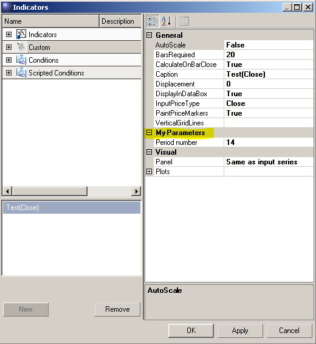
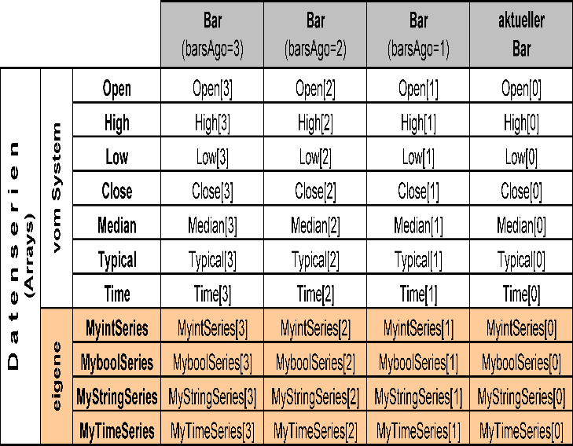
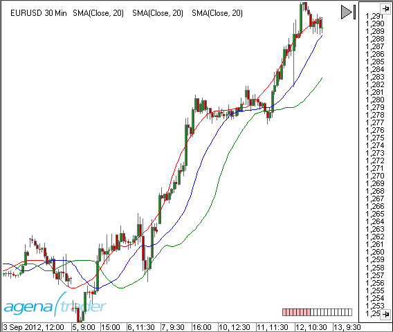
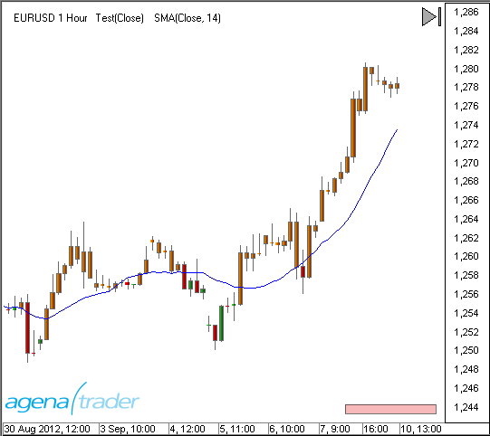
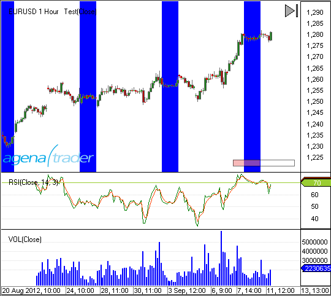
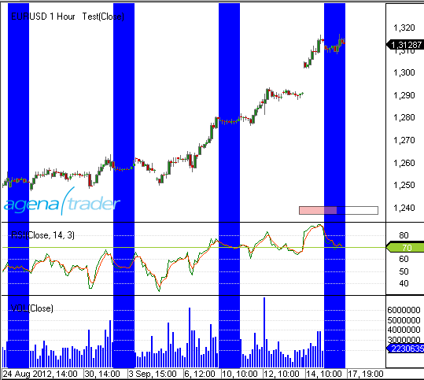
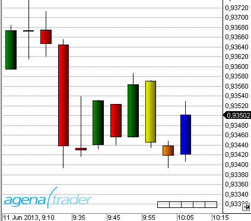
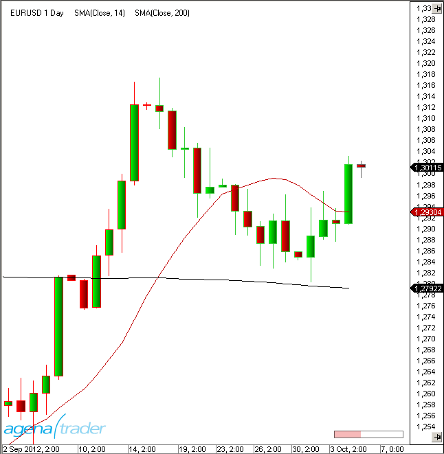

#Keywords

## Add()
### Description
The add method allows you to add plots or line objects to the chart. When a new plot object is added using Add(), this automatically creates a data series of the type DataSeries, which is attached to this object. The value collection allows you to reference and access this data series.
Add() can be used with the OnInit() and the OnCalculate() methods.

### Parameter
plot – a *OnPaint* object
line – a *LevelLine* object

### Usage
```cs
Add(OnPaint plot)
Add(LevelLine line)
```

### Example
```cs
#region Usings
using System;
using System.Collections.Generic;
using System.ComponentModel;
using System.Drawing;
using System.Linq;
using System.Xml;
using System.Xml.Serialization;
using AgenaTrader.API;
using AgenaTrader.Custom;
using AgenaTrader.Plugins;
using AgenaTrader.Helper;
#endregion
namespace AgenaTrader.UserCode
{
  [Description("Enter the description for the new custom indicator here")]
  public class MyIndicator : UserIndicator
  {
    protected override void OnInit()
    {
    // Two blue lines will be placed into the chart, one at 70 and the other at 30
    Add(new LevelLine(Color.Blue, 70, "UpperLine"));
    Add(new LevelLine(Color.Blue, 30, "LowerLine"));

    // Add 2 plots
    Add(new OnPaint(Color.Red, "myFastSMA"));
    Add(new OnPaint(Color.Blue, "mySlowSMA"));
    }

    protected override void OnCalculate()
    {
    //The set method is assigned to the value of the current bar
    FastSMA.Set( SMA(8)[0] ); // is identical with Outputs[0].Set( SMA(8)[0] );
    SlowSMA.Set( SMA(50)[0] ); // is identical with Outputs[1].Set( SMA(50)[0] );
    }

    // Two data series are made available here
    // These are not necessary for the display of the indicator // With the help of these series, one indicator can access the other
    // For example: double d = MyIndicator.FastSMA[0] - MyIndicator.SlowSMA[0];
    [Browsable(false)]
    [XmlIgnore()]
    public DataSeries FastSMA
    {
      get { return Outputs[0]; }
    }

    [Browsable(false)]
    [XmlIgnore()]
    public DataSeries SlowSMA
    {
      get { return Outputs[1]; }
    }
  }
}
```

## ShowAlert()
### Description
The ShowAlert method creates an acoustic and/or visual alarm.

### Usage
```cs
ShowAlert(string message, bool showMessageBox, string soundLocation);
//Due to compatability reasons, an old signature is still used here. When using this method, the color settings and the "re-arm seconds" parameter are ignored.
ShowAlert(string id, AlertPriority priority, string message, string soundLocation, int rearmSeconds, Color backColor, Color forColor);
```

### Return Value
None

### Parameter
|                |                                                                                                                       |
|----------------|-----------------------------------------------------------------------------------------------------------------------|
| message        | Alert text displayed within the messages tab                                                                          |
| soundLocation  | Name of a sound file in the \*.wav format. If no path is specified, then "My Documents\\AgenaTrader\\Sounds\\ is used |
| showMessageBox | If set to "true", a message box will be displayed in addition to the sound                                            |

### Example
```cs
// Message will be outputted if the SMA(20) crosses below the SMA(50)
if (CrossBelow(SMA(20), SMA(50), 1))
Alert("Check short signal!", true, "Alert4.wav");
```

To use music files in a different path, you need to specify the path:

```cs
string pathOfSoundfile = Environment.GetFolderPath(Environment.SpecialFolder.MyDocuments)+@"\\MyAlertSounds\\";
string nameOfSoundFile = "MyAlertSoundFile.wav";
Alert("Message text", true, pathOfSoundfile + nameOfSoundFile);
```

## AllowRemovalOfChartDrawings
### Description
"AllowRemovalOfChartDrawings" is a property of indicators that can be set under [*OnInit()*](#oninit).

**AllowRemovalOfChartDrawings = true**

Drawing objects that are drawn by an indicator or a strategy can be manually removed from the chart.

**AllowRemovalOfChartDrawings = false (default)**

Drawing objects that have been created by a strategy or indicator CANNOT be manually removed from the chart. They are removed once the indicator or strategy is removed.

This property can be queried and will return "true" or "false".

### Usage
```cs
AllowRemovalOfChartDrawings
```

### Example
```cs
protected override void OnInit()
{
Add(new OnPaint(Color.Red, "MyPlot1"));
//Drawing objects can be manually removed from the chart
AllowRemovalOfChartDrawings = true;
}
```

## Attribute
Attribute is a component of the C\# language. Within AgenaScript, indicators, and strategies, you can use these attributes in the same manner as you would in C\#.
Information regarding the usage of attributes can be found here:

[*http://msdn.microsoft.com/de-de/library/z0w1kczw%28v=vs.80%29.aspx*](http://msdn.microsoft.com/de-de/library/z0w1kczw%28v=vs.80%29.aspx)

The most commonly used attributes in AgenaScript are:

-   [*Browsable*](#browsable)
-   [*Category*](#category)
-   [*ConditionalValue*](#conditionalvalue)
-   [*Description*](#description)
-   [*DisplayName*](#displayname)
-   [*TimeFrameRequirements*](#timeframerequirements)
-   [*XmlIgnore*](#xmlignore)

## Browsable
Browsable is an [Attribute](#attribute) within AgenaScript.

AgenaScript uses public variables for entering parameters for indicators (such as periods for the SMA) and for outputting events and calculations within indicators (for example, data series).
Variables used for entering parameters must be displayed in the properties dialog. Data series are exempt from this.
Public variables with the browsable attribute set to false are not displayed within the properties dialog.

By default, browsable is set to true. Therefore, within a variable containing an entry parameter, the attribute does not need to be specified.

**Example for a parameter:**

The parameter should be displayed and queried in the properties window. Therefore browsable should be set to true.
```cs
[Description("Numbers of bars used for calculations")]
[Category("Parameters")]
public int Period
{
get { return period; }
set { period = Math.Max(1, value); }
}
```

**Example for a data series:**
```cs
[Browsable(false)]
[DisplayName("Lower band")]
[XmlIgnore]
public DataSeries Lower
{
get { return Outputs[0]; }
}
```

## Category
Category is an [Attribute](#attribute) in AgenaScript and can be used on properties and classes.

The category attribute on properties defines under which category in the properties dialog the parameter is shown.
If this attribute is missing, the parameters category is accepted as the standard.

The following example shows how to create the new category "My Parameters" in the properties dialog:
```cs
[Category("My Parameters")]
[DisplayName("Period number")]
public double _period
{
get { return _period; }
set { _period = value; }
}
```



If you use the category [Attribute](#attribute) on classes you are able to create subcategories for your scripts and group them all in one category.
This is pretty useful if you are creating a package and you want to group a few indicators in a group with one name.

The following example shows how to create a subfolder "My Package":
```cs
namespace AgenaTrader.UserCode
{
    [Description("Description what this indicator doing.")]
    [Category("My Package")]
    public class MyHolyGrail_Indicator : UserIndicator
    {
      //your class code
    }
}
```

## ConditionalValue
Conditional value is an [Attribute](#attribute) in AgenaScript.

Normally, when making comparisons within the ConditionEscort, the data series generated by indicators are used. One such example would be checking whether a moving average lies above or below a specific price value.
An indicator can also yield values that are not contained within data series, such as values of the type int, double, char, Boolean, string, etc.
To use these values within the scanner or ConditionEscort, they have to be labeled with the conditional value attribute.
```cs
[Browsable(false)]
[XmlIgnore]
[ConditionalValue]
public int PublicVariable
{
get
{
Update();
return _internVariable;
}
}
```

## Description
Description is an [Attribute](#attribute) in AgenaScript.

The description attribute is used in AgenaScript for classes and public variables.
As an attribute of the class, the text is a description of the function of the entire indicator.
```cs
[Description("Displays the tick count of a bar.")]
public class TickCounter : UserIndicator
{
//As an attribute of a public variable, the text is a description of the function of the parameter.
[Description("Number of standard deviations")]
[DisplayName("# of std. dev.")]
public double NumStdDev
{
get { return numStdDev; }
set { numStdDev = Math.Max(0, value); }
}
}
```

The descriptions are displayed in the relevant properties dialog.

## DisplayName
Display name is an [Attribute](#attribute) in AgenaScript.

The display name attribute defines the text shown in the properties dialog for the parameter.

If this attribute is not specified, the name of the public variable is used.
```cs
[Description("Number of standard deviations")]
[DisplayName("# of std. dev.")]
public double NumStdDev
{
get { return numStdDev; }
set { numStdDev = Math.Max(0, value); }
}
```

## TimeFrameRequirements
Timeframe requirements is an [Attribute](#attribute) in AgenaScripts.

If you want a script to use data from various timeframes, the class requires the attribute „TimeFrameRequirements". You can specify multiple timeframes here:

```cs
[TimeFrameRequirements("1 day")]
[TimeFrameRequirements("15 minutes", "1 day", "1 week")]
```

The amount of data provided for the other timeframes will always be the same as the number of actual candles loaded into the chart. If there are 500 candles for a 5-minute chart, then 500 candles of another timeframe will also be loaded. In the first example above, 500 daily candles will be loaded. In the second example, 500 15-minute candles, 500 daily candles and 500 weekly candles will be loaded.
The amount of data can become rather large very quickly, thus you should take precautions when using this attribute.

See [*MultiBars*](#multibars).

**Important:**

If a class uses a different indicator that requires one or more secondary timeframes, then the "TimeFrameRequirements" attribute must be set for the class retrieving the data. An example for this can be seen here: [*GetDayBar*](#getdaybar).

## XMLIgnore
XML ignore is an [Attribute](#attribute) in AgenaScript.

AgenaTrader saves all parameter settings for the indicators in a template. The template files are saved in an XML format. In order to avoid a parameter being saved as part of the template, the attribute XML ignore can be set.

To save parameters in an XML file, the values must be serialized. Under most circumstances, AgenaTrader performs this automatically. Self-defined data types cannot be serialized automatically, so in this case the programmer is responsible for the correct serialization.
In the following example, the color and font are used as parameters of an indicator. AgenaTrader has two methods for serializing color and font information (TextColorSerialize and TextFontSerialize). Both parameters – TextColor and TextFont – thus need to be marked with the XML ignore parameter.
```cs
private Color _textColor = Color.Blue;
private Font _textFont = new Font("Arial", 12, FontStyle.Bold);
[XmlIgnore]
[Description("Textcolor")]
public Color TextColor
{
get { return _textColor; }
set { _textColor = value; }
}
[Browsable(false)]
public string TextColorSerialize
{
get { return SerializableColor.ToString(_textColor); }
set { _textColor = SerializableColor.FromString(value); }
}
[XmlIgnore()]
[Description("TextFont")]
public Font TextFont
{
get { return _textFont; }
set { _textFont = value; }
}
[Browsable(false)]
public string TextFontSerialize
{
get { return SerializableFont.ToString(_textFont); }
set { _textFont = SerializableFont.FromString(value); }
}
```

## IsAutoScale
### Description
Auto scale is a property of indicators that can be set within the OnInit() method.

```cs
IsAutoScale = true (default)
```

The price axis (y-axis) of the chart is set so that all plots and lines of an indicator are visible.

```cs
IsAutoScale = false
```

Plots and lines of an indicator or strategy are not accounted for in the scaling of the y-axis. Therefore they may lie outside of the visible chart area.

This property can be queried and will return either "true" or "false".

### Usage
IsAutoScale

### Example
```cs
protected override void OnInit()
{
Add(new OnPaint(Color.Red, "MyPlot1"));
//Scale the chart so that all drawing objects are visible
IsAutoScale = true;
}
```

## RequiredBarsCount
### Description
The property "RequiredBarsCount" determines how many historical bars are required for an indicator or a strategy to call up the OnCalculate() method for the first time and thus begin the calculations. Bars required should be set within the OnInit() method.
The setting should be chosen carefully. If you require 100 days for the calculation of a moving average, then you should ensure that at least 100 days of historical data are loaded.
The property can be queried in the script and will return an int value.

When OnCalculate is called up for the first time, the ProcessingBarIndex property is 0 regardless of the value of RequiredBarsCount.

### Usage
RequiredBarsCount

### Example
```cs
protected override void OnInit()
{
Add(new OnPaint(Color.Red, "MyPlot1"));
//The indicator requires a minimum of 50 bars loaded into the history
RequiredBarsCount = 50;
}
```

## CalculateOnClosedBar
### Description
The property "CalculateOnClosedBar" determines the events for which AgenaTrader can call up the OnCalculate() method.

```cs
CalculateOnClosedBar = true
```

**OnCalculate()** is called up when a bar is closed and the next incoming tick creates a new bar.

```cs
CalculateOnClosedBar = false
```

OnCalculate() is called up for each new incoming tick.
If you are running AgenaTrader on older hardware, this may cause performance issues with instruments that are highly liquid.
The property can be queried in the script and will return a value of the type Boolean (true or false).
CalculateOnClosedBar can be used within OnInit() and also within OnCalculate().
OnCalculate is only called up for the closing price of each bar with historical data, even if CalculateOnClosedBar is set to false.
When an indicator is called up by another indicator, the CalculateOnClosedBar property of the retrieved indicator overwrites the indicator performing the retrieving.

### Usage
CalculateOnClosedBar

### More Information
See [*Bars*](#bars).

### Example
```cs
protected override void OnInit()
{
//Indicator calculation should only occur when a bar has closed/finished
CalculateOnClosedBar = true;
}
```
## Occurred
### Description
This DataSeries is used in conditions and indicates if signal occurred (1-long, -1 short, 0- no signal )

### Parameter
None

### Return value
Int

### Usage
In scripted condition for short, long, none signal indication

### Example
```cs
protected override void OnCalculate()
{
if ( ProcessingBarIndex %2 == 0 )
Occurred.Set(1); // Long
else if ( ProcessingBarIndex %3 == 0 )
Occurred.Set(-1); // Short
else
Occurred.Set(0);
}
```

## Chart
Chart control is an object that provides reading access of various properties for the chart.

The important properties are:

-   ChartFontColor, BackColor
-   UpColor, DownColor
-   Font
-   BarMarginLeft, BarMarginRight
-   BarSpace, BarWidth
-   BarsPainted
-   FirstBarPainted, LastBarPainted
-   BarsVisible
-   FirstBarVisible, LastBarVisible
-   GetXByBarIdx, GetYByValue

An example can be seen here: [*PlotSample*](#plotsample).

**BarsPainted und BarsVisible:**

BarsPainted contains the number of bars that a chart *could* display from the left to right border with the current width and distance of the candles.
BarsVisible contains the number of bars actually visible.

**FirstBarPainted und FirstBarVisible:**

FirstBarPainted contains the number of the bar that *would* be displayed on the left border of the chart.

FirstBarVisible contains the number of the bar that is actually shown as the first bar on the left side of the chart area.

Example: the chart has been moved so that the first bar of the chart is now in the middle of the chart.

FirstBarPainted would be negative.

FirstBarVisible would be 0.

**LastBarPainted und LastBarVisible:**

LastBarPainted contains the number of the bar that *would* be displayed on the right border of the chart.

LastBarVisible contains the number of the bar that is actually displayed on the right side of the chart.

Example: the chart has been moved so that the last bar of the chart is displayed in the middle section.

LastBarPainted would be larger than Bars.Count.

LastBarVisible would be Bars.Count -1.

## ClearOutputWindow()
### Description
The ClearOutputWindow() method empties the output window. The method can be used within OnInit() as well as within OnCalculate().
The output window contains all outputs that have been created with the [*Print()*](#print) command.
Using the output window is a great method for code debugging.

### Usage
```cs
ClearOutputWindow()
```

### Parameter
none

### Return Value
none

### Example
```cs
protected override void OnInit()
{
// Delete the content of the output window
ClearOutputWindow();
}
```

## CrossAbove()
### Description
The CrossAbove() method allows you to check whether a crossing of two values has occurred (from bottom to top) within a predefined number of periods. The values can be a market price, an indicator, a data series or a constant value.

See [*CrossAbove()*](#crossabove), [*CrossBelow()*](#crossbelow), [*IsSerieRising()*](#isserierising), [*IsSerieFalling()*](#isseriefalling).

### Usage
```cs
CrossAbove(IDataSeries series1, double value, int lookBackPeriod)
CrossAbove(IDataSeries series1, IDataSeries series2, int lookBackPeriod)
```

### Return Value
**true** a cross has occurred
**false** a cross has not occurred

### Parameter
|                     |                                                          |
|---------------------|----------------------------------------------------------|
| lookBackPeriod      | Number of bars within which a cross will be searched for |
| series1 und series2 | A data series such as an indicator, close, high, etc.    |
| value               | A constant value of the type double                      |

### Example
```cs
// Puts out a notice if the SMA(20) crosses above the SMA(50)
if (CrossAbove(SMA(20), SMA(50), 1))
Print("SMA(20) has risen above SMA(50)!");
// Puts out a notice if the SMA(20) crosses above the value of 40
if (CrossAbove(SMA(20), 40, 1))
Print("SMA(20) has risen above 40!");
// Put out a notice for a long entry if the SMA(20) has crossed above the SMA(50) within the last 5 bars.
if (CrossAbove(SMA(20), SMA(50), 1) && Close[0] > Close[1])
Print("Long entry !!!");
```

## CrossBelow()
### Description
Using the CrossBelow() method, you can test whether or not a cross below has occurred within a predefined number of periods. The values can be the market price, an indicator, any data series, or a constant value.

See [*CrossAbove()*](#crossabove), [*CrossBelow()*](#crossbelow), [*IsSerieRising()*](#isserierising), [*IsSerieFalling()*](#isseriefalling).

### Usage
```cs
CrossBelow(IDataSeries series1, double value, int lookBackPeriod)
CrossBelow(IDataSeries series1, IDataSeries series2, int lookBackPeriod)
```

### Return Value
**true** a cross has occurred
**false** a cross has not occurred

### Parameter
|                     |                                                          |
|---------------------|----------------------------------------------------------|
| lookBackPeriod      | Number of Bars within which a cross will be searched for |
| series1 und series2 | A data series such as an indicator, close, high etc.     |
| value               | A constant value of the type double                      |

### Example
```cs
// Puts out a notice if the SMA(20) crosses below the SMA(50)
if (CrossBelow(SMA(20), SMA(50), 1))
Print("SMA(20) has fallen below SMA(50)!");
// Puts out a notice if the SMA(20) falls below the value of 40
if (CrossBelow(SMA(20), 40, 1))
Print("SMA(20) has fallen below 40!");
// Puts out a notice for a short entry if a crossing of the SMA(20) below the SMA(50) has occurred within the last 5 bars.
.
if (CrossBelow(SMA(20), SMA(50), 1) && Close[1] > Close[0])
Print("Short entry !!!");
```

## ProcessingBarIndex
### Description
Current bar is a method of indexing bars used in the OnCalculate() method. If a chart contains 500 bars and an indicator is to be calculated on the basis of these, then AgenaTrader will begin calculating from the oldest bar. The oldest bar receives the number 0. Once the calculation for this bar has been completed, the OnCalculate() method is called up for the next bar, which in turn receives the number 1. This continues until the last bar, which receives a value of 500.

### Parameter
none

### Return Value
Current bar is a variable of the type int, which always contains the number of the bar currently being used.

### Usage
ProcessingBarIndex

### More Information
The OnCalculate() method uses numbering different from that of ProcessingBarIndex in terms of the [*Barindex*](#barindex) and [*Bars*](#bars). Understanding this difference is of great importance, which is why we ask you to please read the following paragraph carefully:

ProcessingBarIndex numbers continuously from the oldest to youngest bar starting with 0. The BarIndex for the youngest bar is always 0. In the example referenced below this paragraph, Time\[0\] stands for the timestamp of the current bar. The index of the oldest bar always has 1 added to it. Thus a logical numbering of barsAgo is possible. The timestamp for the bar of 5 periods ago is Time\[5\].
For using multiple timeframes (multi-bars) in an indicator, see ProcessingBarIndexes.

### Example
```cs
protected override void OnCalculate()
{
Print("Call of OnCalculate for bar nr. " + ProcessingBarIndex + " of " + Time[0]);
}
```
## IsProcessingBarIndexLast
### Description
Indicates if current bar is last in calculation.

### Parameter
None

### Return value
Type bool

### Usage
used for complicated calculation on a last bar

### Example
```cs
protected override void OnCalculate()
{
            base.OnCalculate();
            if (!IsProcessingBarIndexLast)
                return;
            bool isUpdated;
}
```

## DatafeedHistoryPeriodicity
### Description
Datafeed history periodicity is a data type.

### Definition
public enum DatafeedHistoryPeriodicity
-   DatafeedHistoryPeriodicity.Tick
-   DatafeedHistoryPeriodicity.Second
-   DatafeedHistoryPeriodicity.Minute
-   DatafeedHistoryPeriodicity.Hour
-   DatafeedHistoryPeriodicity.Day
-   DatafeedHistoryPeriodicity.Week
-   DatafeedHistoryPeriodicity.Month
-   DatafeedHistoryPeriodicity.Volume
-   DatafeedHistoryPeriodicity.Range
-   DatafeedHistoryPeriodicity.Quarter
-   DatafeedHistoryPeriodicity.Year
-   DatafeedHistoryPeriodicity.HeikinAshi
-   DatafeedHistoryPeriodicity.Renko
-   DatafeedHistoryPeriodicity.LineBreak
-   DatafeedHistoryPeriodicity.Kagi
-   DatafeedHistoryPeriodicity.PointAndFigure
-   DatafeedHistoryPeriodicity.Custom

See *TimeFrame*, *TimeFrames*.

## DataSeries
### Description
Data series (data rows) are an easy yet powerful method of saving additional values for individual bars. For example, when calculating the smoothing average, each bar is assigned the value calculated for this bar.
A data series is an array that contains as many elements as there are bars displayed in a chart. AgenaTrader ensures that data series are correctly synchronized with the bars.
Data series are used in exactly the same way as the close or time series. They can therefore also be used for the input data for various indicators.
In the table below you will find 4 newly created data series (highlighted). Each data series has exactly one value of a special data type (int, bool, string) attached to it per bar. The indexing with barsAgo is thus identical to the data series provided by the system.



### Usable Data Series in AgenaTrader
[*BoolSeries*](#boolseries)

[*DataSeries*](#dataseries)

[*DateTimeSeries*](#datetimeseries)

[*FloatSeries*](#floatseries)

[*IntSeries*](#intseries)

[*LongSeries*](#longseries)

[*StringSeries*](#stringseries)

In addition, there are also data series such as ColorSeries, although these are only used for internal purposes and should not be used directly.
To change the color of plots, please use [*PlotColors*](#plotcolors).

### Set(), Reset() und ContainsValue()
Each data series contains a **Set()**, **Reset()** and **ContainsValue()** method.
With Set(value) or Set(int barsAgo, value) you can place values into the data series for the current position, or in this case into the barsAgo position.
With Reset() or Reset(int barsAgo) you can delete a value from the data series for the current position or for the barsAgo position. This has the result that no valid value exists at this position any more.
Programming with the help of the reset method can simplify otherwise complex logic. This is especially true for Boolean series, where only "true" or "false" values can be included.
The ContainsValue() checks whether a data series has a value for a specific position.

### Information about Data Types
[*http://msdn.microsoft.com/de-de/library/s1ax56ch%28v=vs.80%29.aspx*](http://msdn.microsoft.com/de-de/library/s1ax56ch%28v=vs.80%29.aspx)

## BoolSeries
### Description
Bool series is a data series that contains a Boolean value for each bar. The number of elements in this series correlates with the exact number of bars within the chart.

### Create New Bool Series
In the area for the declaration of variables, simply declare a new variable:

```cs
//Variable declaration
private BoolSeries myBoolSeries;
```
With the OnInit() method, this variable assigns a new instance of the Bool series:
```cs
protected override void OnInit()
{
myBoolSeries = new BoolSeries(this);
CalculateOnClosedBar = true;
}
```

### Assign Values
Assigning a value to the data series for the current position:

```cs
myBoolSeries.Set(true);
```

Writing a value in the past into the data series:

```cs
myBoolSeries.Set(int barsAgo, bool Value);
```

### Delete Values
Removing the current value for the data series:

```cs
myBoolSeries.Reset();
```

Removing a value in the past from the data series:
```cs
myBoolSeries.Reset(int barsAgo);
```

### Check Values for their Validity
```cs
myBoolSeries.ContainsValue(int barsAgo);
```

### Read Value
```cs
Print ("For the bar of " + Time[0] + " ago the value of the data series is: " + myBoolSeries[0]);
```

### Example
```cs
protected override void OnCalculate()
{
if (Close[0] > Open[0])
myBoolSeries.Set(true);
else
myBoolSeries.Set(false);
}
```

## DataSeries
### Description
Data series is a [*DataSeries*](#dataseries) that can contain a double value for each bar. The number of elements in this series corresponds to the exact number of bars within the charts.

Data series for double values are the data series most commonly used for indicators.

### Create a New Data Series
In the declaration area for variables:

```cs
//Variable declaration
private DataSeries myDataSeries;
```
With the OnInit() method, this variable is assigned a new instance:

```cs
protected override void OnInit()
{
myDataSeries = new DataSeries(this);
CalculateOnClosedBar = true;
}
```

### Assign Values
Assigning a value to the data series for the current position:

```cs
myDataSeries.Set(Bars[0].Close);
```

Writing a value in the past into the data series:
```cs
myDataSeries.Set(int barsAgo, double Value);
```

### Delete Values
Removing the current value from the data series:

```cs
myDataSeries.Reset();
```

Removing a value in the past from the data series:
```cs
myDataSeries.Reset(int barsAgo);
```

### Check Values for their Validity
```cs
myDataSeries.ContainsValue(int barsAgo);
```

### Read Value
```cs
Print ("For the bar from " + Time[0] + " ago the value for the data series is: " + myDataSeries[0]);
```

### Example
```cs
//Saves the span between the high and low of a bar
myDataSeries.Set(Math.Abs(High[0]-Low[0]));
```

## DateTimeSeries
### Description
Date time series is a [*DataSeries*](#dataseries) that can record a date time value for each bar. The number of elements in this series corresponds to the number of bars in the chart.

### Create a New Data Series
Create a new variable in the declaration area:

```cs
//Variable declaration
private DateTimeSeries myDataSeries;
```
Assign a new instance of DateTimeSeries for the variable with the OnInit() method:

```cs
protected override void OnInit()
{
myDataSeries = new DateTimeSeries(this);
CalculateOnClosedBar = true;
}
```

### Assign Values
Assigning a value to the current position of the data series:

```cs
myDataSeries.Set(DateTime Value);
```

Writing a value from the past into the data series:

```cs
myDataSeries.Set(int barsAgo, DateTime Value);
```

### Delete Values
Removing the current value from the data series:

```cs
myDataSeries.Reset();
```

Remove a past value from the data series:

```cs
myDataSeries.Reset(int barsAgo);
```

### Check Values for their Validity
```cs
myDataSeries.ContainsValue(int barsAgo);
```

### Read Value
```cs
Print ("For the bar from " + Time[0] + " ago the value of the data series is: " + myDataSeries[0]);
```

### Example
```cs
//Saves the difference of -6 hours (eastern time, New York) for a time zone conversion
myDataSeries.Set(Time[0].AddHours(-6));
```

## FloatSeries
### Description
Float series is a DataSeries that contains a float value for each bar in the chart. The number of elements in this series corresponds to the number of bars within the chart.

### Create a New Data Series
Create a new variable in the declaration area:

```cs
//Variable declaration
private FloatSeries myDataSeries;
```
Assign a new instance of the FloatSeries to the variable with the OnInit() method:

```cs
protected override void OnInit()
{
myDatatSeries = new FloatSeries(this);
CalculateOnClosedBar = true;
}
```

### Assign Values
Assigning a value to the current position of the data series

```cs
myDataSeries.Set(float Value);
```

Writing a value from the past into the data series:
```cs
myDataSeries.Set(int barsAgo, float Value);
```

### Delete Values
Removing the current value from the data series:
```cs
myDataSeries.Reset();
```

Removing a value located in the past from the data series:
```cs
myDataSeries.Reset(int barsAgo);
```

### Check Values for their Validity
```cs
myDataSeries.ContainsValue(int barsAgo);
```

### Read Value
```cs
Print ("For the bar from " + Time[0] + " ago the value for the data series is: " + myDataSeries[0]);
```

### Example
```cs
//Saves the span between the high and the low of a bar
myDataSeries.Set(Math.Abs((float) High[0] - (float) Low[0]));
```

## IntSeries
### Description
Int series is a data series that can assign an integer value for each bar. The number of elements in this series corresponds to the number of bars within the chart.

### Create a New Data Series
Create a new variable in the declaration area:

```cs
//Variable declaration
private IntSeries myDataSeries;
```

Assign an instance of the int series to the variable with the OnInit() method:

```cs
protected override void OnInit()
{
myDataSeries = new IntSeries(this);
CalculateOnClosedBar = true;
}
```

### Assign Values
Assigning a value to the current position of the data series
```cs
myDataSeries.Set(int Value);
```

Writing a value from the past into the data series:
```cs
myDataSeries.Set(int barsAgo, int Value);
```

### Delete Values
Removing the current value from the data series:
```cs
myDataSeries.Reset();
```

Removing a value located in the past from the data series:
```cs
myDataSeries.Reset(int barsAgo);
```

### Check Values for their Validity
```cs
myDataSeries.ContainsValue(int barsAgo);
```

### Read Value
```cs
Print (For the bar from + Time[0] + the value of the data series is:+ myDataSeries[0]);
```

### Example
```cs
//Saves the span in ticks between high and low for each bar
myDataSeries.Set((int) ((High[0] - Low[0]) / TickSize));
```

## LongSeries
### Description
Long series is a data series that can include an integer value for each bar. The number of elements in this series corresponds to the number of bars within the chart.

### Create a New Data Series
Create a new variable in the declaration area:
```cs
//Variable declaration
private LongSeries myDataSeries;
```
Assign a new instance of the long series to the variable with the OnInit() method:
```cs
protected override void OnInit()
{
myDataSeries = new LongSeries(this);
CalculateOnClosedBar = true;
}
```

### Assign Values
Assigning a value to the current position of the data series:
```cs
myDataSeries.Set(long Value);
```

Writing a value from the past into the data deries:
```cs
myDataSeries.Set(int barsAgo, long Value);
```

### Delete Values
Removing the current value from the data series:
```cs
myDataSeries.Reset();
```

Removing a value located in the past from the data series:
```cs
myDataSeries.Reset(int barsAgo);
```

### Check Values for their Validity
```cs
myDataSeries.ContainsValue(int barsAgo);
```

### Read Value
```cs
Print (For the bar from + Time[0] + the value of the data series is:+ myDataSeries[0]);
```

### Example
```cs
//Saves the span of ticks between high and low for each bar
myDataSeries.Set((long) ((High[0] - Low[0]) / TickSize));
```

## StringSeries
### Description
String series is a data series for string values that are saved for each bar. The number of elements in this series corresponds to the number of bars within the chart.

### Create a New Data Series
Create a new variable in the declaration area:

```cs
//Variable declaration
private StringSeries myDataSeries;
```

Assign an instance of string series to the variable with the OnInit() method:

```cs
protected override void OnInit()
{
myDataSeries = new StringSeries(this);
CalculateOnClosedBar = true;
}
```

### Assign Values
Assigning a value to the current position of the data series:

```cs
myDataSeries.Set(string Value);
```

Writing a value from the past into the data series:

```cs
myDataSeries.Set(int barsAgo, string Value);
```

### Delete Values
Remove the current value from the data series:

```cs
myDataSeries.Reset();
```

Remove a value located in the past from the data series:

```cs
myDataSeries.Reset(int barsAgo);
```

### Check Values for their Validity
```cs
myDataSeries.ContainsValue(int barsAgo);
```

### Read Value
```cs
Print (For the bar from + Time[0] + the value of the data series is:+ myDataSeries[0]);
```

### Example
```cs
//Save the current calendar day for each bar (Monday… Tuesday etc.)
myDataSeries.Set(string.Format("{0:dddd}", Time[0]));
```

## DayOfWeek
### Description
"DayOfWeek" outputs the date-time value (such as a timestamp) for each bar.

Of course, all other methods defined within the C\# language for usage of date-time objects are also available, such as day, month, year, hour, minute, second, day of week etc.

See [*http://msdn.microsoft.com/de-de/library/03ybds8y.aspx*](http://msdn.microsoft.com/de-de/library/03ybds8y.aspx)

### Definition
Property DayOfWeek

public enum DayOfWeek
-   DayOfWeek.Monday
-   DayOfWeek.Tuesday
-   DayOfWeek.Wednesday
-   DayOfWeek.Thursday
-   DayOfWeek.Friday
-   DayOfWeek.Saturday
-   DayOfWeek.Sunday

### Example
```cs
//Outputs the weekday for each bar
Print(Time[0].DayOfWeek);
//Do not execute trades on a Friday
if (Time[0].DayOfWeek == DayOfWeek.Friday)
return;
```

## Displacement
### Description
By implementing "Displacement", you can shift a drawn indicator line right or left along the x-axis.
This property can be queried within the script and will return an int value.

Blue line: Displacement = 0 (Original)
Red line: Displacement = -5
Green line: Displacement = +5



### Usage
Displacement

### Parameter
int Offset Number of bars by which the indicator is to be moved.

### Example
```cs
protected override void OnInit()
{
Add(new OnPaint(Color.Red, "MyPlot1"));
//Displacement of the plot by one bar to the right
Displacement = 1;
}
```

## IsShowInDataBox
### Description
The property "IsShowInDataBox" states whether the value of an indicator is contained in the data box of the chart or not.

The property can be queried in the script and returns a value of the type Boolean (true or false).
```cs
IsShowInDataBox = true (default)
```

The indicator values are displayed in the data box.
```cs
IsShowInDataBox = false
```

The indicator values are not displayed in the data box.

The following image displays the values of 3 smoothed averages in the data box.


### Usage
IsShowInDataBox

### Example
```cs
protected override void OnInit()
{
Add(new OnPaint(Color.Red, "MyPlot1"));
//Values will not be shown in the data box
IsShowInDataBox = false;
}
```

## IsAddDrawingsToPricePanel
### Description
The property "IsAddDrawingsToPricePanel" determines the panel in which the drawing objects are drawn.
```cs
IsAddDrawingsToPricePanel = true (default)
```

Drawing objects are shown in the price chart
```cs
IsAddDrawingsToPricePanel = false
```

Drawing objects are drawn in the panel (subchart) assigned to the indicator

If the indicator is already assigned to the price chart (overlay = true) then this property has no effect, meaning that no additional subchart is opened.
The property can be queried within the script and returns a Boolean value.

### Usage
IsAddDrawingsToPricePanel

### Example
```cs
protected override void OnInit()
{
// Indicator is drawn in a new subchart
IsOverlay = false;
Add(new OnPaint(Color.Red, "MyPlot1"));
// Drawing object is drawn in the price chart
IsAddDrawingsToPricePanel = true;
}
protected override void OnCalculate()
{
// Draws a vertical line in the price chart for the bar from 5 minutes ago
AddChartVerticalLine("MyVerticalLine", 5, Color.Black);
}
```

## IsSerieFalling()
### Description
The IsSerieFalling() method allows you to test whether an "is falling" condition exists, i.e. whether the current value is smaller than the value of the previous bar.

See [*CrossAbove()*](#crossabove), [*CrossBelow()*](#crossbelow), [*IsSerieRising()*](#isserierising), [*IsSerieFalling()*](#isseriefalling).

### Usage
```cs
IsSerieFalling(IDataSeries series)
```

### Return Value
**true** If the data series is falling
**false** If the data series is not falling

### Parameter
series a data series such as an indicator, close, high etc.

### Example
```cs
// Check whether SMA(20) is falling
if (IsSerieFalling(SMA(20)))
Print("The SMA(20) is currently falling.");
```

## Colors
AgenaScript provides you with the following commands for defining colors and making color changes to the chart:

[*BarColor*](#barcolor) Color of a bar

[*BackColor*](#backcolor) Background color of the chart

[*BackColorAll*](#backcolorall) Background color of the chart and all panels

Chart.UpColor Color of up ticks (up bars)
Chart.DownColor Color of down ticks (down bars)

For each bar, its colors are saved in the following data series. If these data series are written in, the color of the referenced bar will change.

[*BarColorSeries*](#barcolorseries)

[*CandleOutlineColorSeries*](#candleoutlinecolorseries)

[*BackColorSeries*](#backcolorseries)

[*BackColorAllSeries*](#backcolorallseries)

## BarColor
### Description
Bar color changes the color of a bar.

See [*Colors*](#colors), [*BarColor*](#barcolor), [*BackColor*](#backcolor), [*BackColorAll*](#backcolorall), [*BarColorSeries*](#barcolorseries), [*BackColorAll*](#backcolorall), [*CandleOutlineColor*](#candleoutlinecolor).

### Parameter
a color object of the type "public struct color"

### Usage
BarColor

### Example
```cs
// If the closing price is above the SMA(14), color the bar orange
if (Close[0] > SMA(14)[0]) BarColor = Color.Orange;
```



## BackColor
### Description
Back color changes the background color of a bar or gives the current background color of a bar when queried.

See [*Colors*](#colors), [*BarColor*](#barcolor), [*BackColor*](#backcolor), [*BackColorAll*](#backcolorall), [*BarColorSeries*](#barcolorseries), [*BackColorAll*](#backcolorall), [*CandleOutlineColor*](#candleoutlinecolor).

### Parameter
A color object of the type "public struct color"

### Usage
BackColor

### Example
```cs
// Every Monday, change the bar background color to blue
if (Time[0].DayOfWeek == DayOfWeek.Monday)
BackColor = Color.Blue;
```



```cs
// Changing the bar background color depending on a smoothing average
// Market price above the SMA(14) to green
// Market price below the SMA(14) to maroon
BackColor = SMA(14)[0] >= Close[0] ? Color.Maroon : Color.LimeGreen;
```


## BackColorAll
### Description
Back color all changes the background color of a bar within the chart window and in all subcharts.

See [*Colors*](#colors), [*BarColor*](#barcolor), [*BackColor*](#backcolor), [*BackColorAll*](#backcolorall), [*BarColorSeries*](#barcolorseries), [*BackColorAll*](#backcolorall), [*CandleOutlineColor*](#candleoutlinecolor).

### Parameter
A color object of the type "public struct color"

### Usage
BackColorAll

### Example
```cs
// Every Monday, change the bar background color to blue
if (Time[0].DayOfWeek == DayOfWeek.Monday)
BackColorAll = Color.Blue;
```



## BarColorSeries
### Description
Bar color series is a data series containing the color for each bar.

See [*Colors*](#colors), [*BarColor*](#barcolor), [*BackColor*](#backcolor), [*BackColorAll*](#backcolorall), [*BarColorSeries*](#barcolorseries), [*BackColorAll*](#backcolorall), [*CandleOutlineColor*](#candleoutlinecolor).

### Parameter
a color object of the type "public struct color"

int barsAgo

### Usage
BarColorSeries

BarColorSeries\[**int** barsAgo\]

When using the method with an index \[**int** barsAgo\] the color for the referenced bar will be changed or returned.

**Caution: Only the color of a bar whose color has been explicitly changed beforehand will be returned. In all other cases, the "Color.Empty" value will be returned.**

### Example
```cs
protected override void OnCalculate()
{
if (ProcessingBarIndex == Bars.Count-1-(CalculateOnClosedBar?1:0))
{
// Color the current bar blue
// This is identical to BarColor = color.Blue
BarColorSeries[0] = Color.Blue;
// Color the previous bars green
BarColorSeries[1] = Color.Orange;
// Color the third bar yellow
BarColorSeries[2] = Color.Yellow;
}
}
```



## BackColorSeries
### Description
Back color series is a data series containing the background color for each bar. If the background color for the subcharts is to be included, please use "BackColorAllSeries" instead.

See [*Colors*](#colors), [*BarColor*](#barcolor), [*BackColor*](#backcolor), [*BackColorAll*](#backcolorall), [*BarColorSeries*](#barcolorseries), [*BackColorAll*](#backcolorall), [*CandleOutlineColor*](#candleoutlinecolor).

### Parameter
a color object of the type "public struct color"

int barsAgo

### Usage
```cs
BackColorSeries
BackColorSeries[int barsAgo]
```

When using this method with an index \[**int** barsAgo\] the background color for the referenced bar will be outputted.

### Example
```cs
// Which background color does the current bar have?
Print (BackColorSeries[0]);
// Set the current bar’s background color to blue
// This is identical to BackColor = Color.Blue
BackColorSeries[3] = Color.Blue;
// Set background color for the previous bar to green
BackColorSeries[1] = Color.Green;
```

## BackColorAllSeries
### Description
Back color all series is a data series containing the background color for each bar. The difference to BackColorSeries is that the background color of the subchart is included.

See [*Colors*](#colors), [*BarColor*](#barcolor), [*BackColor*](#backcolor), [*BackColorAll*](#backcolorall), [*BarColorSeries*](#barcolorseries), [*BackColorAll*](#backcolorall), [*CandleOutlineColor*](#candleoutlinecolor).

### Parameter
a color object of the type "public struct color"

int barsAgo

### Usage
```cs
BackColorAllSeries
BackColorAllSeries[int barsAgo]
```

When using the method with an index \[**int** barsAgo\] the background color for the referenced bar will be changed or returned.

### Example
See [*BackColorSeries*](#backcolorseries).

## CandleOutlineColor
### Description
Candle outline color changes the border/outline color (including the wick) of a bar.

If the color of the bar is changed using BarColor and the outline is not changed using CandleOutlineColor, the outline color is adjusted to match the color of the bar.

See [*Colors*](#colors), [*BarColor*](#barcolor), [*BackColor*](#backcolor), [*BackColorAll*](#backcolorall), [*BarColorSeries*](#barcolorseries), [*BackColorAll*](#backcolorall), [*CandleOutlineColor*](#candleoutlinecolor).

### Parameter
a color object of the type "public struct color"

### Usage
CandleOutlineColor

### Example
```cs
if (SMA(14)[0] > SMA(200)[0])
CandleOutlineColor = Color.LimeGreen;
else
CandleOutlineColor = Color.Red;
```



## CandleOutlineColorSeries
### Description
Candle outline color series is a data series that saves the outline color for each bar.

See [*Colors*](#colors), [*BarColor*](#barcolor), [*BackColor*](#backcolor), [*BackColorAll*](#backcolorall), [*BarColorSeries*](#barcolorseries), [*BackColorAll*](#backcolorall), [*CandleOutlineColor*](#candleoutlinecolor).

### Parameter
a color object of the type "public struct color"

int barsAgo

### Usage
```cs
CandleOutlineColorSeries
CandleOutlineColorSeries[int barsAgo]
```

When using this method with an index \[**int** barsAgo\] the border color for the referenced bar will be outputted.

**Caution: Color.Empty will be outputted for a bar unless it has been previously changed.**

### Example
```cs
// Set the outline color of the current bar to blue
CandleOutlineColorSeries[0] = Color.Blue;
// Change the outline color to the chart default value
CandleOutlineColorSeries[0] = Color.Empty;
```
## Email function
### Description
Override method which allows to send mail.

### Parameter
None

### Return value
string

### Usage
used for complicated calculation on a last bar

### Example
```cs
protected override void OnOrderExecution(IExecution execution)
{
if (execution.Order != null && execution.Order.OrderState == OrderState.Filled)
{
if (oEnter != null && execution.Name == oEnter.Name)
{
// Enter-Order gefüllt
if (_sendMail) this.SendEmail(Core.AccountManager.Core.Settings.MailDefaultFromAddress, Core.PreferenceManager.DefaultEmailAddress,
execution.Instrument.Symbol + " order " + execution.Name + " executed.", "The order for " + execution.Instrument.Name + " was executed. Invest: " + (Trade.Quantity * Trade.AvgPrice).ToString("F2"));
}
else if (oTStop != null && execution.Name == oTStop.Name)
{
OrderStatus = 0; // Trend-Stopp-Order gefüllt
if (_sendMail) this.SendEmail(Core.AccountManager.Core.Settings.MailDefaultFromAddress, Core.PreferenceManager.DefaultEmailAddress,
execution.Instrument.Symbol +" order " + execution.Name + " executed.",
execution.Instrument.Symbol +" order " + execution.Name + " executed. Profit:" + Trade.ClosedProfitLoss.ToString("F2"));
}
}
}
```
## FirstTickOfBar
### Description
FirstTickOfBar is a property of the type "bool" that returns "true" if the currently incoming tick is associated with a new bar. This means that this tick is the first tick of a new bar.
This property can only be meaningfully applied when the indicator or strategy is running in the tick-by-tick mode, meaning that CalculateOnClosedBar = false and the data feed is able to output real-time values.
When using end-of-day data in a daily chart, the "FirstTickOfBar" is always true for the last bar.
FirstTickOfBar should not be used outside of the OnCalculate() method.
See [*Bars.TicksCountForLastBar*](#barstickscountforlastbar).

### Usage
FirstTickOfBar

### Example
```cs
// Within a tick-by-tick strategy, execute one part bar-by-bar only
if (FirstTickOfBar)
{
if (CCI(20)[1] < -250)
OpenLong();
return;
}
```

## FirstTickOfBarMtf
### Description
FirstTickOfBarMtf is the **multi-time frame** variant of the [*FirstTickOfBar*](#firsttickofbar) property.

The setting of CalculateOnClosedBar only affects the primary timeframe (chart timeframe). When working with multi-bars, the ticks of the secondary timeframes are provided on a tick-by-tick basis independently of the CalculateOnClosedBar setting.
With the help of FirstTickOfBarMtf, it is possible to determine when a new bar has begun in a secondary timeframe.

### Usage
FirstTickOfBarMtf(ProcessingBarSeriesIndex)

### Parameter
FirstTickOfBarMtf(ProcessingBarSeriesIndex).

See [*ProcessingBarSeriesIndex*](#processingbarseriesindex).

### Example
```cs
if (FirstTickOfBarMtf(ProcessingBarSeriesIndex))
Print("A new bar has begun.");
```

## GetCurrentAsk()
### Description
The GetCurrentAsk() method returns the current value of the ask side of the order book. If no level 1 data is available to AgenaTrader, then this function simply outputs the last trade value.

See [*GetCurrentBid()*](#getcurrentbid) and [*OnLevel1()*](#onlevel1).

### Usage
GetCurrentAsk()

### Return Value
double value

### Parameter
none

### Example
```cs
If an entry condition is fulfilled, then 1 contract should be sold at the current ask price:
private IOrder entryOrder = null;
protected override void OnCalculate()
{
// Entry condition
if (Close[0] < SMA(20)[0] && entryOrder == null)
// Sell 1 contract at the current ask price
entryOrder = SubmitOrder(0, OrderAction.SellShort, OrderType.Limit, 1, GetCurrentAsk(), 0, "", "Enter short");
}
```

## GetCurrentAskVolume()
### Description
The GetCurrentAskVolume () method returns the current volume on the Ask page of the order book. This function is only executable if the data provider provides level 2 data.

See [*GetCurrentBidVolume()*](#getcurrentbidvolume), [*GetCurrentBid()*](#getcurrentbid) and [*OnLevel1()*](#onlevel1).

### Usage
GetCurrentAskVolume()

### Return Value
Long  value

### Parameter
none

### Example
```cs
protected override void OnCalculate()
{
   if (GetCurrentAskVolume() < GetCurrentBidVolume())
       Print("AskVolume {0} < BidVolume {1}", GetCurrentAskVolume(), GetCurrentBidVolume());
}
```

## GetCurrentBid()
### Description
The GetCurrentBid() method returns the current value of the bid side of the order book. If no level 1 data is available to AgenaTrader, then the function outputs the last traded price.

See [*GetCurrentAsk()*](#getcurrentask) and [*OnLevel1()*](#onlevel1).

### Usage
GetCurrentBid()

### Return Value
double value

### Parameter
none

### Example
If an entry condition is fulfilled, then 1 contract should be sold at the current bid price:

```cs
private IOrder entryOrder = null;
protected override void OnCalculate()
{
// Entry condition
if (Close[0] > SMA(20)[0] && entryOrder == null)
// Sell 1 contract at the current bid price
entryOrder = SubmitOrder(0, OrderAction.Buy, OrderType.Limit, 1, GetCurrentBid(), 0, "", "Enter long");
}
```

## GetCurrentBidVolume()
### Description
The GetCurrentBidVolume () method returns the current volume on the Bid page of the order book. This function is only executable if the data provider provides level 2 data.

See [*GetCurrentAskVolume*](#getcurrentaskvolume), [*GetCurrentBid()*](#getcurrentbid) and [*OnLevel1()*](#onlevel1).

### Usage
GetCurrentBidVolume()

### Return Value
Long value

### Parameter
none

### Example
```cs
protected override void OnCalculate()
{
   if (GetCurrentAskVolume() < GetCurrentBidVolume())
       Print("AskVolume {0} < BidVolume {1}", GetCurrentAskVolume(), GetCurrentBidVolume());
}
```

## GetCurrentPrice()
### Description
The GetCurrentPrice() method returns the current price (Latest). If AgenaTrader does not have Level1 data, the function returns the price of the last sales

See [*GetCurrentAsk*](#getcurrentask), [*GetCurrentBid()*](#getcurrentbid) and [*OnLevel1()*](#onlevel1).

### Usage
GetCurrentPrice()

### Return Value
none

### Parameter
double

### Example
If an initial condition is fulfilled, 1 contract should be purchased at the current exchange rate.
```cs
private IOrder entryOrder = null;

protected override void OnCalculate()
{
   // Einstiegsbedingung
   if (Close[0] > SMA(20)[0] && entryOrder == null)
       // Kauf 1 Kontrakt zum aktuellen BidKurs
       entryOrder = SubmitOrder(0, OrderAction.Buy, OrderType.Limit, 1, GetCurrentPrice(), 0,"", "Enter Long");
}
```
## GetCurrentSpread()
### Description
The GetCurrentSpare () method returns the current spread.

See [*GetCurrentAsk*](#getcurrentask), [*GetCurrentBid()*](#getcurrentbid) and [*OnLevel1()*](#onlevel1).

### Usage
GetCurrentSpread()

### Return Value
none

### Parameter
double

### Example
If an initial condition is fulfilled, 1 contract should be purchased at the current exchange rate.
```cs
protected override void OnCalculate()
{
       Print("Der aktuelle Spread ist {0}", GetCurrentSpread());
}
```

## GetSerieHighestValue
### Description
The GetSerieHighestValue() method searches within a predetermined number of periods for the highest bar and outputs how many bars ago it can be found.

See [*GetSerieLowestValue()*](#getserielowestvalue).

### Parameter
period Number of bars within which the bar is searched for

series Every data series, such as close, high, low, etc.

### Return Value
```cs
int barsAgo How many bars ago the high occurred
```

### Usage
```cs
GetSerieHighestValue(IDataSeries series, int period)
```

### Example
```cs
// How many bars ago was the highest high for the current session?
Print(GetSerieHighestValue(High, Bars.BarsCountForSession - 1));
// What value did the market price have at the highest high of the session?
Print("The highest price for the session was: " + Open[GetSerieHighestValue(High, Bars.BarsCountForSession - 1)]);
```

## Historical
### Description
Historical allows you to check whether AgenaScript is working with historical or real-time data.
As long as OnCalculate() is called up for historical data, then historical = true. As soon as live data is being used, then historical = false.
During a backtest, historical is always true.

### Usage
Historical

### Return Value
**true** when using historical data
**false** when using real-time data

### Example
```cs
protected override void OnCalculate()
{
// only execute for real-time data
if (IsHistoricalMode) return;
// Trading technique
}
```

## OnInit()
### Description
The OnInit() method is called up once at the beginning of an indicator or strategy calculation. This method can be used to set indicator properties, initialize your own variables, or add plots.

### Parameter
none

### Return Value
none

### Usage
```cs
protected override void OnInit()
```

### Important Keywords
-   [*Add()*](#add)
-   [*AllowRemovalOfChartDrawings*](#allowremovalofchartdrawings)
-   [*IsAutoScale*](#isautoscale)
-   [*RequiredBarsCount*](#requiredbarscount)
-   [*CalculateOnClosedBar*](calculateonclosedbar)
-   [*ClearOutputWindow()*](#clearoutputwindows)
-   [*Displacement*](displacement)
-   [*IsShowInDataBox*](#isshowindatabox)
-   [*IsAddDrawingsToPricePanel*](#isadddrawingstopricepanel)
-   [*InputPriceType*](#inputpricetype)
-   [*IsOverlay*](#isoverlay)
-   [*IsShowPriceMarkers*](#isshowpricemarkers)
-   [*SessionBreakLines*](#sessionbreaklines)
-   [*IsShowChartVerticalGrid*](#isshowchartverticalgrid)

**Additional Keywords for Strategies**

-   [*DefaultOrderQuantity*](#defaultorderquantity)
-   [*EntriesPerDirection*](#entriesperdirection)
-   [*EntryHandling*](#entryhandling)
-   [*SetUpStopLoss()*](#setupstoploss)
-   [*SetUpProfitTarget()*](#setupprofittarget)
-   [*SetUpTrailStop()*](#setuptrailstop)
-   [*TimeInForce*](#timeinforce)
-   [*PrintOrders*](#printorders)

### More Information
**Caution:**
The OnInit() method is not only called up at the beginning of an indicator or strategy calculation, but also if the chart is reloaded unexpectedly or if the properties dialog of indicators is opened and so on.
Developers of custom AgenaScripts should NOT use this method for running their own routines, opening forms, performing license checks, etc. The OnStart() method should be used for these kind of tasks.

### Example
```cs
protected override void OnInit()
{
Add(new OnPaint(Color.Blue, "myPlot"));
ClearOutputWindow();
IsAutoScale = false;
IsOverlay = true;
IsShowPriceMarkers = false;
IsShowInDataBox = false;
CalculateOnClosedBar = true;
}
```

## OnBarsRequirements()
### Description
The OnBarsRequirements() method is called up once at the beginning of an indicator and/or strategy calculation. This method is only necessary when using multi-bars.
Within OnBarsRequirements, no other programming commands are executed. For initializing, the OnInit() or OnStart() method should be used.

### Parameter
none

### Return Value
none

### Example
```cs
protected override void OnBarsRequirements()
{
Add(DatafeedHistoryPeriodicity.Day, 1);
Add(DatafeedHistoryPeriodicity.Week, 1);
}
```

## InputPriceType
### Description
The input price type property determines which price series is used by default when calculating an indicator, if no other data series is explicitly stated.
InputPriceType can be set with the OnInit() method; this specification is then valid for all further calculations.
If InputPriceType is in OnCalculate(), these changes are only valid starting with the next instruction.
Every further appearance of InputPriceType will be ignored!

See [*PriceType*](#pricetype)

### Usage
```cs
InputPriceType
```

### Example1
```cs
protected override void OnInit()
{
ClearOutputWindow();
InputPriceType = PriceType.Low;
}
protected override void OnCalculate()
{
// The input data series for the indicator (InSeries) is low
Print(Low[0] + " " + InSeries[0] + " " + InputPriceType);
}
```

### Example2
```cs
protected override void OnCalculate()
{
// These values are identical
// since close is used as the input data series by default
Print(SMA(20)[0] + " " + SMA(Close, 20)[0]);
InputPriceType = PriceType.Low;
// From here on out, low is used instead of close
// Both values are identical
Print(SMA(20)[0] + " " + SMA(Low, 20)[0]);
InputPriceType = PriceType.High;
// The instructions will be ignored
// InSeries = low is still in effect
}
```

## Instrument
### Description
With "instrument", information concerning the trading instrument (stock, future etc.) is made available.

Detailed information can be found here: *Instruments*.

## LevelLine()
### Description
A line object is used for drawing a horizontal line in the chart. Usually, these are upper and lower trigger lines for indicators such as the RSI (70 and 30).
The lines described here are not to be confused with lines from the drawing objects (see "AddChartHorizontalLine").
LevelLine objects can be added to an indicator with the help of the Add() method, and with this, added to the lines collection.

See [*OnPaint*](#onpaint).

### Parameter
|       |                                                              |
|-------|--------------------------------------------------------------|
| Color | LevelLine color                                                   |
| Name  | Description                                                  |
| Pen   | A pen object                                                 |
| Value | Defines which value on the y-axis the line will be drawn for |

### Usage
```cs
LevelLine(Color color, double value, string name)
LevelLine(Pen pen, double value, string name)
```

### More Information
Information on the pen class: [*http://msdn.microsoft.com/de-de/library/system.drawing.pen.aspx*](http://msdn.microsoft.com/de-de/library/system.drawing.pen.aspx)

### Example
```cs
// Example 1
// A new line with standard values drawn at the value of 70
Add(new LevelLine(Color.Black, 70, "Upper"));
// Example 2
// A new line with self-defined values
private LevelLine line;
private Pen pen;
protected override void OnInit()
{
// Define a red pen with the line strength 1
pen = new Pen(Color.Red, 1);
// Define a horizontal line at 10
line = new LevelLine(pen, 10, "MyLine");
// add the defined line to the indicator
Add(line);
}
// Example 3
// Short form for the line in example 2
Add(new LevelLine(new Pen(Color.Red, 1), 10, "MyLine"));
```

## Log()
### Description
Log() allows you to write outputs in the AgenaTrader log file (log tab). 5 different log levels are supported.

Note: If the log tab is not viewable, it can be displayed using the tools log.

### Usage
```cs
**Log**(string message, LogLevel logLevel)
```

### Parameter
|          |                      |
|----------|----------------------|
| message  | Text (message)       |
| logLevel | Possible values are: InfoLogLevel.Info, InfoLogLevel.Message, InfoLogLevel.Warning, InfoLogLevel.ShowAlert, InfoLogLevel.Error |

### Example
```cs
//Tab protocol
Log("This is information.", InfoLogLevel.Info); //white
Log("This is a message.", InfoLogLevel.Message); // white
Log("This is a warning.", InfoLogLevel.Warning); // blue
Log("This is an alarm.", InfoLogLevel. AlertLog); //green
Log("This is a mistake.", InfoLogLevel.Error); // red
//Tab messags
Log("This is a message (messages).", InfoLogLevel.Message); //white
//PopUp & protocoll
Log("This is an alert popup window.", InfoLogLevel.ShowAlert); //green

//Output-Tab:
//InfoLogLevel.Message = send to Tab "Messages" not "Log"

//Action:
/*
InfoLogLevel.Error: also the AT-Status-Line is red and flashes
InfoLogLevel.ShowAlert: opens also a modeless messagebox
*/

/*
Summary: * - InfoLogLevel.ShowAlert Color: green Tab: Log Action: modeless Messagebox * - InfoLogLevel.Warning Color: blue Tab: Log * - InfoLogLevel.Info Color: white Tab: Log * - InfoLogLevel.Error Color: red Tab: Log Action: AT-Status-Line: red + flashing (Error) * - InfoLogLevel.Message Color: white Tab: Messages
*/
```

Crossreference:
a crossreference to Print() and ShowAlert()

## GetSerieLowestValue
### Description
The GetSerieLowestValue() method attempts to find the lowest bar within a predefined number of periods.

See [*GetSerieHighestValue()*](#getseriehighestvalue).

### Parameter
period Number of bars that will be searched for the lowest bar

series Every data series, such as close, high, low etc.

### Return Value
**int** barsAgo How many bars ago the low occurred

### Usage
```cs
GetSerieLowestValue(IDataSeries series, int period)
```

### Example
```cs
// How many bars ago was the lowest low of the session?
Print(GetSerieLowestValue(Low, Bars.BarsCountForSession - 1));
// Which price did the lowest open of the current session have?
Print("The lowest open price of the current session was: " + Open[GetSerieLowestValue(Low, Bars.BarsCountForSession - 1)]);
```

## Level1Args
### Description
The data type Level1Args represents a change in the level 1 data and is used as a parameter of the OnLevel1() function.

|                |                                                                                                                                  |
|----------------|----------------------------------------------------------------------------------------------------------------------------------|
| AskSize        | Current order volume on the ask side                                                                                             |
| AskPrice       | Current ask price                                                                                                                |
| BidSize        | Current order volume on the bid side                                                                                             |
| BidPrice       | Current bid price.                                                                                                               |
| Instrument     | An object of the type instrument that contains the trading instrument for which the level 1 data is outputted. See *Instruments* |
| LastPrice      | Last traded price                                                                                                                |
| MarketDataType | Potential values are: MarketDataType.Ask, MarketDataType.AskSize, MarketDataType.Bid, MarketDataType.BidSize, MarketDataType.Last, MarketDataType.Volume     |
| Price          | This is equal to last price. This field only exists for compatability reasons                                                    |
| Time           | A date-time value containing the timestamp of the change                                                                         |
| Volume         | A long value that shows the volume                                                                                               |

### Example
See [*OnLevel1()*](#onlevel1).

## Level1Args
### Description
The data type Level1Args represents a change in the level 2 data (market depth) and is used as a parameter within OnLevel2().

|                |                                                                |
|----------------|----------------------------------------------------------------|
| MarketDataType | Potential values are: MarketDataType.Ask, MarketDataType.Bid                                              |
| MarketMaker    | A string value containing the market maker ID                  |
| Position       | An int value that defines the position within the market depth |
| Operation      | Represents the action caused by a change in the order book.                                                                  
                  Values can be: Operation.Insert, Operation.Remove, Operation.Update                                                |
| Price          | A double value that displays the bid/ask price                 |
| Time           | A date-time value containing the timestamp of the change       |
| Volume         | A long value that shows the volume                             |

### Example
See [*OnLevel2()*](#onlevel2).

## IsOverlay
### Description
The overlay property defines whether the indicator outputs are displayed in the price chart above the bars or whether a separate chart window is opened below the charting area.

```cs
IsOverlay = true
```

The indicator is drawn above the price (for example an *SMA*)

```cs
IsOverlay = false (default)
```

A separate chart window is opened (RSI)

This property can be queried within the script and outputs a value of the type Boolean (true or false).

### Usage
IsOverlay

### Example
```cs
protected override void OnInit()
{
Add(new OnPaint(Color.Red, "MyPlot1"));
//The indicator should be displayed within a separate window
IsOverlay = false;
}
```

## IsShowPriceMarkers
### Description
The paint price markers property defines whether the so-called price markers for the indicator outputs are displayed on the right-hand chart border (in the price axis) or not. In some cases it makes sense to switch these off for a better overview in the chart.
**IsShowPriceMarkers = true (default)**

Price markers are shown in the price axis

**IsShowPriceMarkers = false**

Price markers are not shown in the price axis

This property can be queried within the script and returns a value of the type Boolean (true or false).

### Usage
IsShowPriceMarkers

### Example
```cs
protected override void OnInit()
{
Add(new OnPaint(Color.Red, "MyPlot1"));
//Do not show price markers in the price axis
IsShowPriceMarkers = false;
}
```

## PlaySound()
### Description
This method allows you to play a wav file.

### Usage
**PlaySound**(wavFile)

### Return Value
none

### Parameter
wavFile File name of the wav file to be played

### Example
```cs
using System.IO;
string path = Environment.GetFolderPath(Environment.SpecialFolder.MyDocuments);
string file = "\\\\AgenaTrader\\\\Sounds\\\\Alert1.wav";
PlaySound(path + file);
```

## Parameter()
### Description
Attribute which used for indicator customization

### Return Value
None

### Parameter
None

### Example
```cs
[Description("Period for the medium mean average")]
[Category("Parameters")]
[DisplayName("MA Medium")]
public int MA_Medium
{
get { return _ma_medium; }
set
{
_ma_medium = value;
}
}
```

## OnPaint()
### Description
A plot (drawing) is used to visually display indicators in a chart. OnPaint objects are assigned to an indicator with the help of the Add() method and attached to the plots collection.
See [*LevelLine*](#levelline).

### Parameter
|           |                        |
|-----------|------------------------|
| Color     | Drawing color          |
| Pen       | Pen object             |
| PlotStyle | LevelLine type: PlotStyle.Bar, PlotStyle.Block, PlotStyle.Cross, PlotStyle.Dot, PlotStyle.Hash, PlotStyle.LevelLine, PlotStyle.Square, PlotStyle.TriangleDown, PlotStyle.TriangleUp  |
| Name      | Description            |

### Usage
```cs
OnPaint(Color color, string name)
OnPaint(Pen pen, string name)
OnPaint(Color color, PlotStyle plotStyle, string name)
OnPaint(Pen pen, PlotStyle plotStyle, string name)
```

### More Information
Information on the pen class: [*http://msdn.microsoft.com/de-de/library/system.drawing.pen.aspx*](http://msdn.microsoft.com/de-de/library/system.drawing.pen.aspx)

### Example
```cs
// Example 1
// OnPaint with standard values (line with line strength 1)
Add(new OnPaint(Color.Green, "MyPlot"));
// Example 2
// user-defined values for pen and plot style
private OnPaint plot;
private Pen pen;
protected override void OnInit()
{
// a red pen with the line strength of 6 is defined
pen = new Pen(Color.Blue, 6);
// a point line with a thick red pen from above is defined
plot = new OnPaint(pen, PlotStyle.Dot, "MyPlot");
// The defined plot is to be used as a representation for an indicator
Add(plot);
}
// Example 3
// Abbreviation of example 2
protected override void OnInit()
{
Add(new OnPaint(new Pen(Color.Blue, 6), PlotStyle.Dot, "MyPlot"));
}
```

## PlotMethod
### Description
In each indicator, the plot method can be overridden in order to add your own graphics (GDI+) to the price chart with the help of the graphics class (System.Drawing).

See [*http://msdn.microsoft.com/de-de/library/system.drawing.graphics.aspx*](http://msdn.microsoft.com/de-de/library/system.drawing.graphics.aspx).

The *Chart* object offers several parameters.

More examples: *Bar Numbering*, *PlotSample*, *Chart Background Image*.

### Parameter
graphics The graphics object of the price chart (context)

rectangle The size of the drawing area (type "public struct rectangle")

double min The smallest price in the y-axis

double max The biggest price in the y-axis

### Return Value
none

### Usage
```cs
public override void OnPaint(Graphics graphics, Rectangle r, double min, double max)
```

### Example
```cs
using System;
using System.Collections.Generic;
using System.ComponentModel;
using System.Drawing;
using System.Drawing.Drawing2D;
using AgenaTrader.API;
using AgenaTrader.Custom;
using AgenaTrader.Plugins;
namespace AgenaTrader.UserCode
{
[Description("Example for the usage of the plot method.")]
public class PlotSample : UserIndicator
{
private StringFormat stringFormat = new StringFormat();
private SolidBrush brush = new SolidBrush(Color.Black);
private Font font = new Font("Arial", 10);
protected override void OnInit()
{
IsChartOnlyIndicator = true;
IsOverlay = true;
}
protected override void OnCalculate()
{}
protected override void OnDispose()
{
brush.Dispose();
stringFormat.Dispose();
}
public override void OnPaint(Graphics graphics, Rectangle r, double min, double max)
{
// Fill a rectangle
SolidBrush tmpBrush = new SolidBrush(Color.LightGray);
graphics.FillRectangle(tmpBrush, new Rectangle (0, 0, 300, 300));
tmpBrush.Dispose();
// Draw a red line from top left to bottom right
Pen pen = new Pen(Color.Red);
graphics.AddChartLine(pen, r.X, r.Y, r.X + r.Width, r.Y + r.Height);
// Draw a red line from bottom left to top right
// Use anti-alias (the line appears smoother)
// The current settings for the smoothing are saved
// Restore after drawing
SmoothingMode oldSmoothingMode = graphics.SmoothingMode; //Save settings
graphics.SmoothingMode = SmoothingMode.AntiAlias; // Use higher smoothing settings
graphics.AddChartLine(pen, r.X, r.Y + r.Height, r.X + r.Width, r.Y);
graphics.SmoothingMode = oldSmoothingMode; // Settings restored
pen.Dispose();
// Text in the upper left corner (position 10,35)
stringFormat.Alignment = StringAlignment.Near; // Align text to the left
brush.Color = Color.Blue;
graphics.DrawString("Hello world!", font, brush, r.X + 10, r.Y + 35, stringFormat);
// Text in the left lower corner and draw a line around it
brush.Color = Color.Aquamarine;
graphics.FillRectangle(brush, r.X + 10, r.Y + r.Height - 20, 140, 19);
// Draw outside line
pen = new Pen(Color.Black);
graphics.AddChartRectangle(pen, r.X + 10, r.Y + r.Height - 20, 140, 19);
pen.Dispose();
// Write text
brush.Color = Color.Red;
graphics.DrawString("Here is bottom left!", font, brush, r.X + 10, r.Y + r.Height - 20, stringFormat);
}
}
}
```

## PriceType
### Description
Price type describes a form of price data.

See [*InputPriceType*](#inputpricetypes)

Following variables are available:
-   PriceType.Close
-   PriceType.High
-   PriceType.Low
-   PriceType.Median
-   PriceType.Open
-   PriceType.Typical
-   PriceType.Volume
-   PriceType.Weighted

### Usage
PriceType

### Example
See [*InputPriceType*](#inputpricetype)

## Print()
### Description
The Print() method writes outputs in the AgenaTrader output window.
See [*ClearOutputWindow()*](#clearoutputwindow).

### Usage
```cs
Print(string message)
Print(bool value)
Print(double value)
Print(int value)
Print(DateTime value)
Print(string format, string message)
```

### Parameter
string Text an individual message text

### Return Value
none

### More Information
Information regarding output formatting: *Formatting numbers*.

Hints about the String.Format() method: [*http://msdn.microsoft.com/de-de/library/fht0f5be%28v=vs.80%29.aspx*](http://msdn.microsoft.com/de-de/library/fht0f5be%28v=vs.80%29.aspx)

### Example
```cs
// "Quick&Dirty" formatting of a number with 2 decimal points
Print(Close[0].ToString("0.00"));
// Output day of the week from the timestamp for the bar
Print(string.Format("{0:dddd}", Time[0]));
// An additional empty row with an escape sequence
Print("One empty row afterwards \\n");
```

## RemoveChartDrawing()
### Description
The RemoveChartDrawing() method removes a specific drawing object from the chart based on a unique identifier (tag).
See [*RemoveChartDrawings()*](#removechartdrawings).

### Usage
RemoveChartDrawings(string tag)

### Return Value
none

### Parameter
string tag The clearly identifiable name for the drawing object

### Example
```cs
RemoveChartDrawings("My line");
```

## RemoveChartDrawings()
### Description
This method removes all drawings from the chart
See [*RemoveChartDrawings()*](#removechartdrawings).

### Usage
RemoveChartDrawings()

### Return Value
none

### Example
```cs
//Delete all drawings from the chart
RemoveChartDrawings();
```

## IsSerieRising()
### Description
With this method you can check if an uptrend exists, i.e. if the current value is bigger than the previous bar’s value.

See [*CrossAbove()*](#crossabove), [*CrossBelow()*](#crossbelow), [*IsSerieRising()*](#isserierising), [*IsSerieFalling()*](#isseriefalling).

### Usage
```cs
IsSerieRising(IDataSeries series)
```

### Return Value
**true** If the data series is rising
**false** If the data series is not rising

### Parameter
series A data series such as an indicator, close, high etc.

### Example
```cs
// Check if SMA(20) is rising
if (IsSerieRising(SMA(20)))
Print("The SMA(20) is currently rising.");
```

## SessionBreakLines
### Description
The property SessionBreakLines defines whether the vertical lines that represent a trading session stop are displayed within the chart.
This may be useful for stocks and other instruments if you wish to display session breaks/trading stops.
**SessionBreakLines = true (default)**

Session break lines are shown

**SessionBreakLines = false**

Session break lines are not shown

This property can be queried within the script and outputs a value of the type Boolean (true or false).

### Usage
SessionBreakLines

### Example
```cs
protected override void OnInit()
{
Add(new OnPaint(Color.Red, "MyPlot1"));
//Session break lines should not be shown
SessionBreakLines = false;
}
```

## TickSize
A tick is the smallest possible price change of a financial instrument within an exchange. If, for example, the trading prices are specified to 2 decimal places, then a tick equals 0.01. You can expect Forex instruments to be specified to within 4 or 5 decimal places. A tick is called a pip in Forex trading and usually equals 0.0001 or 0.00001.
The tick value is usually predefined by the exchange and does not (usually) change.
See [*Instrument.TickSize*](#instrumentticksize).

Usually, a tick is displayed as a decimal number. Historically speaking (especially in American exchanges) stocks have been noted with tick sizes of 1/16 of a dollar.
This notation is still widespread within commodities. Corn futures (ZC) are noted in ¼ US cents/bushel (usually equals 12.50 US$ per contract).
US treasury bonds are noted in a tick size of 1/32 points, which equals 31.25$.
Notations are usually made with apostrophes, for example:

149'00 equals exactly 149,
149'01 equals 149 1/32 (meaning 149.03125),
149'31 equals 149 31/32 (149.96875),
and the next value after this is 150’00

In the so-called T-Bond intermonth spreads, notations are specified in quarters of 1/32, resulting in point values of 7.8125 per contract.

Notations have a dash:

17-24 equals 17 24/32 points,
17-242 equals 17 24.25/32 points,
17-245 equals 17 24.5/32 points and
17-247 equals 17 24.75/32 points.
The next notation after 17-247 is 17-25 and then 17-252, 17-255 etc.
After 17-317 comes 18.

The individual contract specifications can be found on the websites of the respective exchanges.

CME: [*http://www.cmegroup.com*](http://www.cmegroup.com) under Products & Trading
Eurex (FDAX): [*http://www.eurexchange.com/exchange-en/products/idx/dax/17206/*](http://www.eurexchange.com/exchange-en/products/idx/dax/17206/)

See [*Instrument.TickSize*](#instrumentticksize).

## TimeFrame
See [*Bars.TimeFrame*](barstimeframe).

When using multiple timeframes ([*Multibars*](#multibars)) in an indicator, please see [*TimeFrames*](#timeframes).

## GetDayAsInt()
### Description
To day is a method specifically suited for inexperienced programmers who have problems with the potentially complex .net date-time structure of C\#.
Experienced programmers can continue using the date-time function directly.

To day outputs an int representation in the format of yyyymmdd.
(yyyy = year, mm = month, dd = day)

13.08.2012 would thus be 20120813.

See [*GetTimeAsInt*](#gettimeasint).

Help with date-time: [*http://msdn.microsoft.com/de-de/library/system.datetime.aspx*](http://msdn.microsoft.com/de-de/library/system.datetime.aspx)

### Usage
GetDayAsInt(DateTime time)

### Example
```cs
// Do not trade on the 11<sup>th</sup> of September
if (GetDayAsInt(Time[0]) = 20130911)
return;
```

## GetTimeAsInt()
### Description
To time is a method specifically suited for inexperienced programmers who have problems with the potentially complex .net date-time structure of C\#.

To time outputs an int representation in the format hhmmss.
(hh = hour, mm = minute, ss = seconds)

The time 07:30 will be displayed as 73000 and 14:15:12 will become 141512.

See [*GetDayAsInt*](#getdayasint).

Help with date-time: [*http://msdn.microsoft.com/de-de/library/system.datetime.aspx*](http://msdn.microsoft.com/de-de/library/system.datetime.aspx)

### Usage
GetTimeAsInt(DateTime time)

### Example
```cs
// Only enter trades between 08:15 and 16:35
if (GetTimeAsInt(Time[0]) >= 81500 && GetTimeAsInt(Time[0]) <= 163500)
{
// Any trading technique
}
```

## Update()
### Description
The Update() method calls up the OnCalculate method in order to recalculate the indicator values.

Update() is to be used with caution and is intended for use by experienced programmers.

### Usage
```cs
Update()
```

### Return Value
none

### Parameter
none

### Example
The effect of update can be illustrated with the help of 2 indicators.
The first indicator, Ind1, uses a public variable from the indicator Ind2.

**Code from Ind1:**
```cs
public class Ind1 : UserIndicator
{
protected override void OnCalculate()
{
Print( Ind2().MyPublicVariable );
}
}
```

**Code from Ind2:**
```cs
private double myPublicVariable = 0;
protected override void OnCalculate()
{
myPublicVariable = 1;
}
public double MyPublicVariable
{
get
{
Update();
return myPublicVariable;
}
}
```

**Without Update() - Wrong**
If Ind2 is called up by Ind1, the get-method of MyPublicVariable is called up in Ind2. Without Update(), the value of MyPublicVariable would be returned. In this case it would be 0.

**With Update() - Correct**
By calling up Update(), OnCalculate() is initially executed by Ind2. This sets MyPublicVariable to 1. Lastly, the value 1 is passed on to the requesting indicator.

## Value
### Description
Value is a data series object containing the first data series of an indicator.

When the Add() method is called up, a value object is automatically created and added to the values collection.

Value is identical to Values\[0\].

### Usage
Value

Value\[**int** barsAgo\]

### More Information
The methods known for a collection, Set(), Reset(), and Count(), can be used for values.

### Example
See [*Values*](#values).

## IsShowChartVerticalGrid
### Description
The property IsShowChartVerticalGrid defines whether or not the regularly spaced vertical lines (the so-called grid) are shown within the charting area.

**IsShowChartVerticalGrid = true (default)**

Vertical grid lines are shown

**IsShowChartVerticalGrid = false**

Vertical grid lines are not shown

This property can be queried within the script and returns a value of the type Boolean (true or false).

### Usage
IsShowChartVerticalGrid

### Example
```cs
protected override void OnInit()
{
Add(new OnPaint(Color.Red, "MyPlot1"));
// Vertical grid lines shall not be shown within the chart
IsShowChartVerticalGrid = false;
}
```
