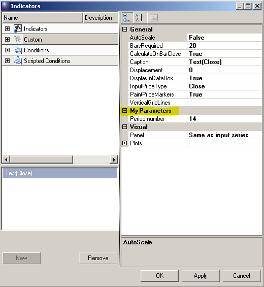
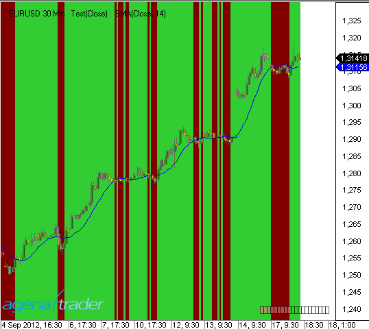
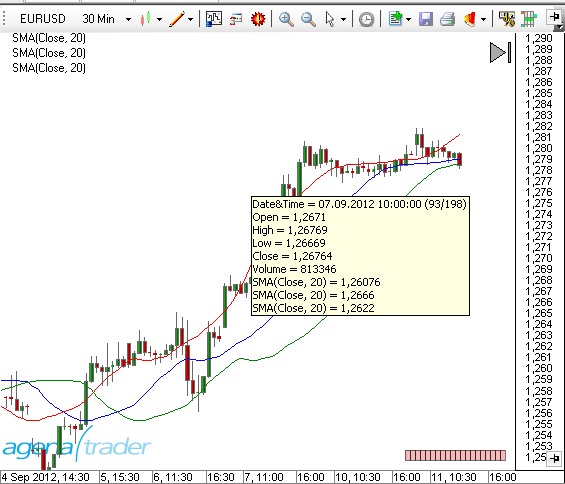

# Schlüsselworte

## Add()
### Beschreibung
Mit der Methode Add() werden dem Chart Plot - bzw. Line-Objekte  hinzugefügt. Wenn mit Add() ein neues Plot-Objekt hinzugefügt wird, wird automatisch auch eine Datenserie vom Typ DataSeries erzeugt, die diesem Plot zugeordnet ist. Auf diese Datenserie kann über die Value-Collection zugegriffen werden.
Add() kann in der  OnInit() Methode und in der OnCalculate() Methode verwendet werden..

### Parameter
plot – ein *OnPaint* Objekt
line – ein *LevelLine* Objekt

### Verwendung
```cs
Add(OnPaint plot)
Add(LevelLine line)
```

### Beispiel
```cs
#region Usings
using System;
using System.Collections.Generic;
using System.ComponentModel;
using System.Drawing;
using System.Linq;
using System.Xml;
using System.Xml.Serialization;
using AgenaTrader.API;
using AgenaTrader.Custom;
using AgenaTrader.Plugins;
using AgenaTrader.Helper;
#endregion
namespace AgenaTrader.UserCode
{
  [Description("Enter the description for the new custom indicator here")]
  public class MyIndicator : UserIndicator
  {
    protected override void OnInit()
    {
    // 2 blaue Linien in den Chart legen, eine bei 70 und eine bei 30
    Add(new LevelLine(Color.Blue, 70, "UpperLine"));
    Add(new LevelLine(Color.Blue, 30, "LowerLine"));

   // 2 Plots hinzufügen
    Add(new OnPaint(Color.Red, "myFastSMA"));
    Add(new OnPaint(Color.Blue, "mySlowSMA"));
    }

    protected override void OnCalculate()
    {
   //Mit der Set-Methode wird der Wert für den aktuellen Bar zugewiesen.
    FastSMA.Set( SMA(8)[0] ); // ist identisch mit Values[0].Set( SMA(8)[0] );
    SlowSMA.Set( SMA(50)[0] );// ist identisch mit Values[1].Set( SMA(50)[0] );
    }

    / Hier werden 2 Datenserien zur Verfügung gestellt.
		// Zur Darstellung des Indikators auf dem Chart sind diese nicht notwendig.
		// Mit Hilfe dieser Datenserien kann von anderen Indikatoren aus auf diesen Indikator
		// zugegriffen werden.
		// Z.B. mit double d = MeinIndikator.FastSMA[0] - MeinIndikator.SlowSMA[0];
    [Browsable(false)]
    [XmlIgnore()]
    public DataSeries FastSMA
    {
      get { return Outputs[0]; }
    }

    [Browsable(false)]
    [XmlIgnore()]
    public DataSeries SlowSMA
    {
      get { return Outputs[1]; }
    }
  }
}
```
## AllowRemovalOfChartDrawings
### Beschreibung
AllowRemovalOfDrawObjects ist eine Eigenschaft von Indikatoren, die in der Methode [*OnInit()*](#oninit) gesetzt werden kann..

**AllowRemovalOfChartDrawings = true**

Zeichenobjekte (DrawObjects), die von einem Indikator bzw. einer Strategie in einen Chart gezeichnet wurden, können manuell aus dem Chart entfernt werden.

**AllowRemovalOfChartDrawings = false (default)**

Zeichenobjekte (DrawObjects), die von einem Indikator bzw. einer Strategie in einen Chart gezeichnet wurden, können nicht manuell aus dem Chart entfernt werden. Sie werden erst dann vom Chart entfernt, wenn auch der Indikator bzw. die Strategie entfernt wird.

Die Eigenschaft kann abgefragt werden, und liefert "true" bzw. "false".

### Verwendung
```cs
AllowRemovalOfChartDrawings
```

### Beispiel
```cs
protected override void OnInit()
{
Add(new OnPaint(Color.Red, "MyPlot1"));
//DrawObjects können aus dem Chart manuell entfernt werden
AllowRemovalOfChartDrawings = true;
}
```

## Attribute
Attribute sind Bestandteil der Programmiersprache C#. In eigenen AgenaScript-Indikatoren bzw. Strategien können Attribute genauso verwendet werden, wie es auch in C# selbst möglich ist.
Informationen über Die Verwendung von Attributen finden Sie u.a. hier:

[*http://msdn.microsoft.com/de-de/library/z0w1kczw%28v=vs.80%29.aspx*](http://msdn.microsoft.com/de-de/library/z0w1kczw%28v=vs.80%29.aspx)

Die in AgenaScript am häufigsten verwendeten Attribute sind:

-   [*Browsable*](#browsable)
-   [*Category*](#category)
-   [*ConditionalValue*](#conditionalvalue)
-   [*Description*](#description)
-   [*DisplayName*](#displayname)
-   [*TimeFrameRequirements*](#timeframerequirements)
-   [*XmlIgnore*](#xmlignore)

## Browsable
Browsable ist ein  [Attribute](#attribute)  in AgenaScript.

In AgenaScript werden öffentliche Variablen (public variables) zum einen für die Eingabe von Parametern für Indikatoren genutzt (z.B. die Periode für einen SMA) und zum anderen für die Ausgabe von Ergebnissen einer Berechnung innerhalb eines Indikators (z.B. Datenserien).
Variablen, die der Eingabe von Parametern dienen, müssen im Eigenschaften-Dialog angezeigt werden. Datenserien hingegen nicht.

Eine public Variable, die mit dem Attribut Browsable=false gekennzeichnet wurde, wird nicht im Eigenschaftendialog von AgenaTrader angezeigt.

Standardmäßig wird Browsable = true angenommen. Daher kann bei einer Variable, die einen Eingabeparameter beinhaltet, das Attribut Browsable auch weggelassen weren.

**Beispiel für einen Parameter:**

Der Parameter soll im Eigenschaftsfenster angezeigt und abgefragt werden. Daher ist "Browsable = true" zu setzen oder das Attribut kann entfallen.

```cs
[Description("Numbers of bars used for calculations")]
[Category("Parameters")]
public int Period
{
get { return period; }
set { period = Math.Max(1, value); }
}
```

**Beispiel für eine Datenserie:**
```cs
[Browsable(false)]
[DisplayName("Lower band")]
[XmlIgnore]
public DataSeries Lower
{
get { return Outputs[0]; }
}
```

## Category
Category ist ein [Attribute](#attribute) in AgenaScript.

Das Attribut Category gibt für einen Parameter an, unter welcher Kategorie im Eigenschaften-Dialog der Parameter erscheint.

Wenn das Attribut fehlt, wird standardmäßig die Kategorie "Parameters" angenommen.

Das folgende Beispiel erzeugt im Eigenschaften-Dialog die neue Kategorie "My Parameters".

```cs
[Category("My Parameters")]
[DisplayName("Period number")]
public double _period
{
get { return _period; }
set { _period = value; }
}
```



Category ist ein  [Attribute](#attribute) in AgenaScript.

Das Attribut Category gibt für einen Parameter an, unter welcher Kategorie im Eigenschaften-Dialog der Parameter erscheint.

Wenn das Attribut fehlt, wird standardmäßig die Kategorie "Parameters" angenommen.

Das folgende Beispiel erzeugt im Eigenschaften-Dialog die neue Kategorie "My Parameters".

```cs
namespace AgenaTrader.UserCode
{
    [Description("Description what this indicator doing.")]
    [Category("My Package")]
    public class MyHolyGrail_Indicator : UserIndicator
    {
      //your class code
    }
}
```

## ConditionalValue
ConditionalValue ist ein [Attribute](#attribute) in AgenaScript.

Normalerweise werden im ConditionEscort für Vergleiche die von Indikatoren bereitgestellten Datenserien (DataSeries) benutzt. Beispielsweise wird geprüft, ob ein gleitender Durchschnitt über oder unter einem bestimmten Kurswert liegt.
Ein Indikator kann aber auch Werte als Ergebnis haben, die keine Datenserien sind, also z.B. Werte vom Typ int, double, char, boolean, string usw.

Um diese Werte im Scanner oder im Condition-Escort nutzen zu können, müssen sie mit dem Attribut "ConditionalValue" gekennzeichnet sein.
```cs
[Browsable(false)]
[XmlIgnore]
[ConditionalValue]
public int PublicVariable
{
get
{
Update();
return _internVariable;
}
}
```

## Description
Description ist ein  [Attribute](#attribute) in AgenaScript.

Das Attribute Description wird In AgenaScript für die Klasse und für public-Variablen verwendet.

Als Attribut der Klasse ist der Text eine Beschreibung der Funktion des gesamten Indikators (bzw. der Strategie usw.)
```cs
[Description("Displays the tick count of a bar.")]
public class TickCounter : UserIndicator
{
```
As an attribute of a public variable, the text is a description of the function of the parameter.
```cs
[Description("Number of standard deviations")]
[DisplayName("# of std. dev.")]
public double NumStdDev
{
get { return numStdDev; }
set { numStdDev = Math.Max(0, value); }
}
}
```

Die Beschreibungen werden jeweils im Eigenschaften-Dialog angezeigt.


## DisplayName
DisplayName ist ein [Attribute](#attribute) in AgenaScript.

Das Attribute DisplayName legt den Text fest, der im Eigenschaften-Dialog für den Parameter verwendet werden soll.

Wird dieses Attribut nicht angegeben, wird der Name der public Variable verwendet.
```cs
[Description("Number of standard deviations")]
[DisplayName("# of std. dev.")]
public double NumStdDev
{
get { return numStdDev; }
set { numStdDev = Math.Max(0, value); }
}
```

## TimeFrameRequirements
TimeFrameRequirements ist ein [Attribute](#attribute) in AgenaScript.

Sollen in einem AgenaScript Daten verschiedener Zeiteinheiten verwendet werden, ist der Klasse das Attribut "TimeFrameRequirements" voranzustellen. Es können hier auch mehrere Zeiteinheiten angegeben werden:

```cs
[TimeFrameRequirements("1 day")]
[TimeFrameRequirements("15 minutes", "1 day", "1 week")]
```

Es werden immer so viele Daten der anderen Zeiteinheit(en) bereitgestellt, wie auch Kerzen im Chart geladen sind.
Sind in einem 5 Minuten-Chart beispielsweise 500 Kerzen geladen, werden auch 500 Kerzen einer anderen Zeiteinheit geladen.
Im Beispiel oben also 500 Tageskerzen bzw. im 2. Beispiel 500 15-Minuen-Kerzen, 500 Tageskerzen und 500 Wochenkerzen.
Die Datenmengen können schnell sehr groß werden. Das Attribut ist daher mit Umsicht zu verwenden.

siehe auch [*MultiBars*](#multibars).

**Wichtig:**

Wenn in einer Klasse ein anderer Indikator verwendet wird, der seinerseits eine (oder mehrere) sekundäre Zeiteinheit(en) erfordert, muß für die aufrufende Klasse ebenfalls das Attribut "TimeFrameRequirements" angegeben werden. Ein Beispiel hierzu siehe unter [*GetDayBar*](#getdaybar).

## XMLIgnore
XML ignore st ein [Attribute](#attribute) in AgenaScript.

AgenaTrader speichert in einem Template u.a. auch alle Parameter-Einstellungen eines Indikators. Die Template-Files liegen im XML-Format vor. Um zu verhindern, dass ein Parameter als Teil eines Templates gespeichert wird, kann das Attribut "XmlIgnore" angegeben werden.

Um Parameter in einem XML-File speichern zu können, müssen die Werte zuvor serialisiert werden. In den meisten Fällen, d.h. für alle gängigen Variablentypen geschieht dies durch AgenaTrader automatisch. Selbst definierte Datentypen können jedoch nicht automatisch serialisiert werden. Der Programmierer muß selbst für die korrekte Serialisierung sorgen.

Im Beispiel werden Farbe und Schriftart als Parameter eines Indikators verwendet. In AgenaTrader existieren für die Serialisierung von Farb- und Schriftart-Informationen 2 Methoden (TextColorSerialize und TextFontSerialize), die die Serialisierung übernehmen. Die beiden Parameter "TextColor" und "TextFont" sind daher mit dem Attribute "XmlIgnore" zu kennzeichnen.

```cs
private Color _textColor = Color.Blue;
private Font _textFont = new Font("Arial", 12, FontStyle.Bold);
[XmlIgnore]
[Description("Textcolor")]
public Color TextColor
{
get { return _textColor; }
set { _textColor = value; }
}
[Browsable(false)]
public string TextColorSerialize
{
get { return SerializableColor.ToString(_textColor); }
set { _textColor = SerializableColor.FromString(value); }
}
[XmlIgnore()]
[Description("TextFont")]
public Font TextFont
{
get { return _textFont; }
set { _textFont = value; }
}
[Browsable(false)]
public string TextFontSerialize
{
get { return SerializableFont.ToString(_textFont); }
set { _textFont = SerializableFont.FromString(value); }
}
```
## CalculateOnClosedBar
### Beschreibung
Die Eigenschaft "CalculateOnClosedBar" legt fest, für welche Ereignisse AgenaTrader die Methode  OnCalculate() aufrufen soll.

```cs
CalculateOnClosedBar = true
```

**OnCalculate()**  wird aufgerufen, wenn ein Bar beendet ist, und der nächste hereinkommende Tick einen neuen Bar entstehen läßt.

```cs
CalculateOnClosedBar = false
```

OnCalculate() wird für jeden neu hereinkommenden Tick aufgerufen.
Achtung bei älterer Hardware: dies führt bei sehr liquiden Werten zu einer erhöhten Rechnerbelastung.
Die Eigenschaft kann im Script abgefragt werden und liefert einen Wert vom Typ Boolean (true bzw. false).
CalculateOnClosedBar  kann sowohl in OnInit() aals auch in OnCalculate() eingesetzt werden..
OnCalculate wird für historische Daten immer nur für den Schlusskurs eines jeden Bars aufgerufen, auch wenn CalculateOnClosedBar=false gesetzt ist.
Wird ein Indikator von einem anderen Indikator aufgerufen, so wird die Eigenschaft  CalculateOnClosedBar des aufgerufenen Indikators vom aufrufenden Indikator überschrieben.

### Verwendung
CalculateOnClosedBar

### Weitere Informationen
Siehe auch die Beschreibung zu [*Bars*](#bars).

### Beispiel
```cs
protected override void OnInit()
{
//Indikatorberechnung nur, wenn ein Bar fertig ausgeprägt ist
CalculateOnClosedBar = true;
}
```
## Chart
Chart  ist ein Objekt, über welches der lesende Zugriff auf verschiedene Eigenschaften des Charts möglich ist.


Die wichtigsten Eigenschaften sind:

-   ChartFontColor, BackColor
-   UpColor, DownColor
-   Font
-   BarMarginLeft, BarMarginRight
-   BarSpace, BarWidth
-   BarsPainted
-   FirstBarPainted, LastBarPainted
-   BarsVisible
-   FirstBarVisible, LastBarVisible
-   GetXByBarIdx, GetYByValue

Zur Verwendung der wichtigsten Eigenschaften von Chart siehe Beispiel [*PlotSample*](#plotsample).

**BarsPainted und BarsVisible:**

BarsPainted enthält die Anzahl der Bars, die ein Chart von seinem linken Rand zu seinem rechten Rand mit der momentanen Breite der

Kerzen und dem Abstand der Kerzen zueinander anzeigen *könnte*.

BarsVisible enthält die Anzahl der Bars, die tatsächlich zu sehen sind.

**FirstBarPainted und FirstBarVisible:**

FirstBarPainted enthält die Nummer des Bars, der am linken Rand des Charts angezeigt werden *würde*.

FirstBarVisible  enthält die Nummer des Bars, der tatsächlich als erster Bar links im Chart angezeigt wird.

Beispiel: der Chart ist so verschoben, dass der erste Bar des Charts erst in der Mitte des Charts angezeigt wird.

FirstBarPainted wäre in diesem Fall negativ.

FirstBarVisible  wäre 0.

**LastBarPainted und LastBarVisible:**

LastBarPainted enthält die Nummer des Bars, der am rechten Rand des Charts angezeigt werden *würde*.

LastBarVisible  enthält die Nummer des Bars, der tatsächlich als letzter Bar rechts im Chart angezeigt wird.

Beispiel: der Chart ist so verschoben, dass der letzte Bar des Charts bereits in der Mitte des Charts angezeigt wird.

LastBarPainted wäre in diesem Fall größer als Bars.Count.

LastBarVisible wäre in Bars.Count -1.

## ClearOutputWindow()
### Beschreibung
Die Methode ClearOutputWindow() leert das Output-Fenster. Die Methode kann sowohl in OnInit() als auch in OnCalculate() eingesetzt werden.
Das OutputWindow beinhaltet alle Ausgaben, die mit dem [*Print()*](#print) -Befehl erstellt wurden.
Der Einsatz des OutputWindows ist eine sehr gute Möglichkeit für Code-Debugging.

### Verwendung
```cs
ClearOutputWindow()
```

### Parameter
keiner

### Rückgabewert
keiner

### Beispiel
```cs
protected override void OnInit()
{
//Inhalt des OutputWindow löschen
ClearOutputWindow();
}
```
## Colors
In AgenaSript stehen die folgenden Befehle für Farbfestlegungen bzw. -änderungen im Chart zur Verfügung:

[*BackColor*](#backcolor) Hintergrundfarbe des Kurs-Charts

[*BackColorAll*](#backcolorall) Hintergrundfarbe des Kurs-Charts und aller Indikator-Panels

[*BackColorAllSeries*](#backcolorallseries)

[*BackColorSeries*](#backcolorseries)


Chart.UpColor Farbe für Up Ticks (Up Bars)
Chart.DownColor Farbe für Down Ticks (Down Bars)

Für jeden Bar werden seine Farben in folgenden Dataserien gespeichert. Wird in diese Datenserien geschrieben, ändern sich die Farben des referenzierten Bars.

[*BarColor*](#barcolor) Farbe eines Bars

[*BarColorSeries*](#barcolorseries)

[*CandleOutlineColor*](#candleoutlinecolor)

[*CandleOutlineColorSeries*](#candleoutlinecolorseries)


## BackColor
### Beschreibung
BackColor ändert die Hintergrundfarbe eines Bars bzw. gibt die aktuelle Hintergrundfarbe eines Bars zurück.

Siehe auch [*Colors*](#colors), [*BarColor*](#barcolor), [*BackColor*](#backcolor), [*BackColorAll*](#backcolorall), [*BarColorSeries*](#barcolorseries), [*BackColorAll*](#backcolorall), [*CandleOutlineColor*](#candleoutlinecolor).

### Parameter
ein Color-Objekt vom Typ  public struct Color

### Verwendung
BackColor

### Beispiele
```cs
// immer montags Bar-Hintergrundfarbe auf Blau ändern
if (Time[0].DayOfWeek == DayOfWeek.Monday)
BackColor = Color.Blue;
```


```cs
// Ändern der Bar-Hintergrundfarbe in Abhängigkeit von einem gl. Durchschnitt
// Kurs über SMA(14) --> Grün
// Kurs unter SMA(14) --> Maroon
BackColor = SMA(14)[0] >= Close[0] ? Color.Maroon : Color.LimeGreen;
```



## BackColorAll
### Beschreibung
BackColorAll ändert die Hintergrundfarbe eines Bars im Chartfenster und in allen Subcharts bzw. gibt die aktuelle Hintergrundfarbe eines Bars zurück.
Siehe auch [*Colors*](#colors), [*BarColor*](#barcolor), [*BackColor*](#backcolor), [*BackColorAll*](#backcolorall), [*BarColorSeries*](#barcolorseries), [*BackColorAll*](#backcolorall), [*CandleOutlineColor*](#candleoutlinecolor).

### Parameter
ein Color-Objekt vom Typ  public struct Color

### Verwendung
BackColorAll

### Beispiel
```cs
// immer montags Bar-Hintergrundfarbe auf Blau ändern
if (Time[0].DayOfWeek == DayOfWeek.Monday)
BackColorAll = Color.Blue;
```


## BackColorAllSeries
### Beschreibung
BackColorAllSeries ist eine Datenserie, die für jeden Bar die Hintergrundfarbe speichert. Im Unterschied zu BackColorSeries wird die Hinterrundfarbe der Subcharts mit berücksichtigt.

Siehe auch [*Colors*](#colors), [*BarColor*](#barcolor), [*BackColor*](#backcolor), [*BackColorAll*](#backcolorall), [*BarColorSeries*](#barcolorseries), [*BackColorAll*](#backcolorall), [*CandleOutlineColor*](#candleoutlinecolor).

### Parameter
ein Color-Objekt vom Typ  public struct Color

int barsAgo

### Verwendung
```cs
BackColorAllSeries
BackColorAllSeries[int barsAgo]
```

Bei Verwendung der Methode mit einem Index \[int barsAgo\] wird die Hintergrundfarbe für den referenzierten Bar geändert bzw. ausgegeben.

### Beispiel
siehe [*BackColorSeries*](#backcolorseries).

## BackColorSeries
### Beschreibung
BackColorSeries ist eine Datenserie, die für jeden Bar die Hintergrundfarbe speichert. Soll die Hintergrundfarbe von Subcharts mit berücksichtigt werden, ist "BackColorAllSeries" zu verwenden.

Siehe auch [*Colors*](#colors), [*BarColor*](#barcolor), [*BackColor*](#backcolor), [*BackColorAll*](#backcolorall), [*BarColorSeries*](#barcolorseries), [*BackColorAll*](#backcolorall), [*CandleOutlineColor*](#candleoutlinecolor).

### Parameter
ein Color-Objekt vom Typ  public struct Color

int barsAgo

### Verwendung
```cs
BackColorSeries
BackColorSeries[int barsAgo]
```

ei Verwendung der Methode mit einem Index \[**int** barsAgo\]  wird die Hintergrundfarbe für den referenzierten Bar geändert bzw. ausgegeben.

### Beispiele
```cs
// Welche Hintergrundfarbe hat der aktuelle Bar? (im ARGB-Format)
Print (BackColorSeries[0]);
// Hintergrundfarbe des aktuellen Bars auf Blau setzen
// Dies ist identisch mit BackColor = Color.Blue
BackColorSeries[3] = Color.Blue;
// Hintergrundfarbe des vorhergehenden Bars auf Grün setzen
BackColorSeries[1] = Color.Green;
```
## BarColor
### Beschreibung
BarColor ändert die Farbe eines Bars

Siehe auch [*Colors*](#colors), [*BarColor*](#barcolor), [*BackColor*](#backcolor), [*BackColorAll*](#backcolorall), [*BarColorSeries*](#barcolorseries), [*BackColorAll*](#backcolorall), [*CandleOutlineColor*](#candleoutlinecolor).

### Parameter
ein Color-Objekt vom Typ  public struct Color

### Verwendung
BarColor

### Beispiel
```cs
// Wenn der Schlusskurs über dem SMA(14) liegt, den Bar orange einfärben
if (Close[0] > SMA(14)[0]) BarColor = Color.Orange;
```


## BarColorSeries
### Beschreibung
BarColorSeries ist eine Datenserie, die für jeden Bar die Farbe speichert.

Siehe auch[*Colors*](#colors), [*BarColor*](#barcolor), [*BackColor*](#backcolor), [*BackColorAll*](#backcolorall), [*BarColorSeries*](#barcolorseries), [*BackColorAll*](#backcolorall), [*CandleOutlineColor*](#candleoutlinecolor).

### Parameter
ein Color-Objekt vom Typ  public struct Color

int barsAgo

### Verwendung
BarColorSeries

BarColorSeries\[**int** barsAgo\]

Bei Verwendung der Methode mit einem Index \[int barsAgo\] wird die Farbe für den referenzierten Bar geändert bzw. ausgegeben.

**Achtung: Es wird nur die Farbe eines Bars zurückgegeben, dessen Farbe vorher explizit verändert wurde. In allen anderen Fällen wird Color.Empty zurückgegeben.**

### Beispiel
```cs
protected override void OnCalculate()
{
if (ProcessingBarIndex == Bars.Count-1-(CalculateOnClosedBar?1:0))
{
// Farbe des aktuellen Bars auf Blau setzen
// Dies ist identisch mit BarColor = Color.Blue
BarColorSeries[0] = Color.Blue;
// Farbe des vorhergehenden Bars auf Grün setzen
BarColorSeries[1] = Color.Orange;
// Farbe des 3. Bars auf Gelb setzen
BarColorSeries[2] = Color.Yellow;
}
}
```


## CandleOutlineColor
### Beschreibung
CandleOutlineColor ändert die Randfarbe (incl. "Dochte" und "Lunte") eines Bars.

Wenn die Farbe eines Bars mit BarColor geändert wird, und die Umrandung des Bars wurde nicht mit CandleOutlineColor verändert, wird die Randfarbe auf die Farbe des Bars angepasst.

Siehe auch[*Colors*](#colors), [*BarColor*](#barcolor), [*BackColor*](#backcolor), [*BackColorAll*](#backcolorall), [*BarColorSeries*](#barcolorseries), [*BackColorAll*](#backcolorall), [*CandleOutlineColor*](#candleoutlinecolor).

### Parameter
ein Color-Objekt vom Typ  public struct Color

### Verwendung
CandleOutlineColor

### Beispiel
```cs
if (SMA(14)[0] > SMA(200)[0])
CandleOutlineColor = Color.LimeGreen;
else
CandleOutlineColor = Color.Red;
```


## CandleOutlineColorSeries
### Beschreibung
CandleOutlineColorSeries ist eine Datenserie, die für jeden Bar die Randfarbe speichert.

Siehe auch [*Colors*](#colors), [*BarColor*](#barcolor), [*BackColor*](#backcolor), [*BackColorAll*](#backcolorall), [*BarColorSeries*](#barcolorseries), [*BackColorAll*](#backcolorall), [*CandleOutlineColor*](#candleoutlinecolor).

### Parameter
ein Color-Objekt vom Typ  public struct Color
int barsAgo

### Verwendung
```cs
CandleOutlineColorSeries
CandleOutlineColorSeries[int barsAgo]
```

Bei Verwendung der Methode mit einem Index  \[**int** barsAgo\] wird die Randfarbe für den referenzierten Bar ausgegeben.

**Achtung: Es wird nur die RandFarbe eines Bars zurückgegeben, dessen Randfarbe vorher explizit verändert wurde. In allen anderen Fällen wird Color.Empty zurückgegeben.**

### Beispiel
```cs
// Randfarbe des aktuellen Bars auf Blau setzen
CandleOutlineColorSeries[0] = Color.Blue;
// Randfarbe auf Chart-default zurücksetzen
CandleOutlineColorSeries[0] = Color.Empty;
```

## CrossAbove()
### Beschreibung
Mit der Methode CrossAbove() kann geprüft werden, ob es innerhalb einer festgelegten Anzahl von Perioden eine Überkreuzung zweier Werte von unten nach oben gab. Die Werte können dabei der Kurs, ein Indikator, jede beliebige Datenserie oder ein fester Wert sein.

Siehe auch [*CrossAbove()*](#crossabove), [*CrossBelow()*](#crossbelow), [*IsSerieRising()*](#isserierising), [*IsSerieFalling()*](#isseriefalling).

### Verwendung
```cs
CrossAbove(IDataSeries series1, double value, int lookBackPeriod)
CrossAbove(IDataSeries series1, IDataSeries series2, int lookBackPeriod)
```

### Rückgabewert
**true** eine Überkreuzung hat stattgefunden
**false** eine Überkreuzung hat nicht stattgefunden

### Parameter
|                     |                                                          |
|---------------------|----------------------------------------------------------|
| lookBackPeriod      | Anzahl der Bars innerhalb derer nach dem Aufterten einer Überkreuzung gesucht wird |
| series1 und series2 | eine Datenserie, wie z.B. ein Indikator, Close, High o.ä    |
| value               | ein fester Wert vom Typ double                      |

### Beispiele
```cs
// Hinweis ausgeben, wenn der SMA(20) über SMA(50) kreuzt
if (CrossAbove(SMA(20), SMA(50), 1))
Print("SMA(20) has risen above SMA(50)!");
// Hinweis ausgeben, wenn der SMA(20) über den Wert 40 steigt
if (CrossAbove(SMA(20), 40, 1))
Print("SMA(20) has risen above 40!");
// Hinweis auf Long-Einstieg ausgeben, wenn innerhalb der letzten 5 Bars
// der SMA(20) über SMA(50) kreuzt und der Kurs innerhalb des letzten Bars gestiegen ist
if (CrossAbove(SMA(20), SMA(50), 1) && Close[0] > Close[1])
Print("Long entry !!!");
```

## CrossBelow()
### Beschreibung
Mit der Methode CrossBelow() kann geprüft werden, ob es innerhalb einer festgelegten Anzahl von Perioden eine Überkreuzung zweier Werte von oben nach unten gab. Die Werte können dabei der Kurs, ein Indikator, jede beliebige Datenserie oder ein fester Wert sein.

Siehe auch [*CrossAbove()*](#crossabove), [*CrossBelow()*](#crossbelow), [*IsSerieRising()*](#isserierising), [*IsSerieFalling()*](#isseriefalling).

### Verwendung
```cs
CrossBelow(IDataSeries series1, double value, int lookBackPeriod)
CrossBelow(IDataSeries series1, IDataSeries series2, int lookBackPeriod)
```

### Rückgabewert
**true** eine Überkreuzung hat stattgefunden
**false** eine Überkreuzung hat nicht stattgefunden

### Parameter
|                     |                                                          |
|---------------------|----------------------------------------------------------|
| lookBackPeriod      | Anzahl der Bars innerhalb derer nach dem Aufterten einer Überkreuzung gesucht wird |
| series1 und series2 | eine Datenserie, wie z.B. ein Indikator, Close, High o     |
| value               | ein fester Wert vom Typ double                     |

### Beispiele
```cs
// Hinweis ausgeben, wenn der SMA(20) unter SMA(50) kreuzt
if (CrossBelow(SMA(20), SMA(50), 1))
Print("SMA(20) has fallen below SMA(50)!");
// Hinweis ausgeben, wenn der SMA(20) unter den Wert 40 fällt
if (CrossBelow(SMA(20), 40, 1))
Print("SMA(20) has fallen below 40!");
// Hinweis auf Short-Einstieg ausgeben, wenn innerhalb der letzten 5 Bars
// der SMA(20) unter SMA(50) kreuzt und der Kurs innerhalb des letzten Bars gefallen ist.
if (CrossBelow(SMA(20), SMA(50), 1) && Close[1] > Close[0])
Print("Short entry !!!");
```
## DatafeedHistoryPeriodicity
### Beschreibung
DatafeedHistoryPeriodicity ist ein Datentyp.

### Definition
public enum DatafeedHistoryPeriodicity
-   DatafeedHistoryPeriodicity.Tick
-   DatafeedHistoryPeriodicity.Second
-   DatafeedHistoryPeriodicity.Minute
-   DatafeedHistoryPeriodicity.Hour
-   DatafeedHistoryPeriodicity.Day
-   DatafeedHistoryPeriodicity.Week
-   DatafeedHistoryPeriodicity.Month
-   DatafeedHistoryPeriodicity.Volume
-   DatafeedHistoryPeriodicity.Range
-   DatafeedHistoryPeriodicity.Quarter
-   DatafeedHistoryPeriodicity.Year
-   DatafeedHistoryPeriodicity.HeikinAshi
-   DatafeedHistoryPeriodicity.Renko
-   DatafeedHistoryPeriodicity.LineBreak
-   DatafeedHistoryPeriodicity.Kagi
-   DatafeedHistoryPeriodicity.PointAndFigure
-   DatafeedHistoryPeriodicity.Custom

Siehe *TimeFrame*, *TimeFrames*.

## DataSeries
### Beschreibung
Datenserien (DataSeries) sind eine sehr komfortable und sehr mächtige Möglichkeit, zusätzliche Werte für jeden einzelnen Bar zu speichern. Z.B. wird bei der Berechnung eines gleitenden Durchschnitts jedem Bar der für diesen Bar errechnete Wert zugeordnet.
Eine Datenserie ist ein Array, welches exakt so viele Elemente enthält, wie Bars im Chart angezeigt werden. AgenaTrader sorgt dafür, dass die Datenserien zu jedem Zeitpunkt korrekt mit den Bars synchronisiert sind.
Datenserien werden exakt so benutzt, wie z.B. die Serien Close oder Time. Sie können deshalb natürlich auch als Eingangsdaten (Input) für weitere Indikatoren verwendet werden.
In der Tabelle ist zu sehen, dass 4 neue Datenserien (farbig markiert) angelegt worden sind. Jede dieser Datenserien kann genau einen Wert eines speziellen Datentyps (int, bool, string, DateTime) je Bar aufnehmen. Die Indizierung mit barsAgo ist dabei identisch mit den vom System bereitgestellten Datenserien..


### In AgenaTrader verwendbare Datenserien
[*BoolSeries*](#boolseries)

[*DataSeries*](#dataseries)

[*DateTimeSeries*](#datetimeseries)

[*FloatSeries*](#floatseries)

[*IntSeries*](#intseries)

[*LongSeries*](#longseries)

[*StringSeries*](#stringseries)

Darüberhinaus gibt es die Datenserie ColorSeries, die jedoch nur für interne Zwecke bestimmt ist und nicht direkt verwendet werden sollte.
Um die Farbe von Plots zu ändern, verwenden Sie bitte [*PlotColors*](#plotcolors).

### Set(), Reset() und ContainsValue()
Jede Datenserie verfügt über die Methoden  **Set()**, **Reset()** und **ContainsValue()**.
Mit Set(value) bzw. Set(int barsAgo, value) werden Werte in die Datenserie an der aktuellen Position bzw. an der Position "barsAgo" übernommen.
Mit Reset() bzw. Reset(int barsAgo) kann an der aktuellen Position  bzw. an der Position "barsAgo" ein Wert aus der Datenserie gelöscht werden, d.h. an dieser Position existiert kein gültiger Wert mehr.
Die Programmierung mit Hilfe der Reset-Methode kann eine ansonsten sehr komplexe Logik spürbar vereinfachen.Insbesondere bei Bool-Serien, die nur true oder false enthalten können, ist diese Eigenschaft extrem hilfreich.
Mit ContainsValue() kann geprüft werden, ob die Datenserie an einer bestimmten Position einen gültigen Wert enthält.

### Informationen zu den einzelnen Datentypen
[*http://msdn.microsoft.com/de-de/library/s1ax56ch%28v=vs.80%29.aspx*](http://msdn.microsoft.com/de-de/library/s1ax56ch%28v=vs.80%29.aspx)

## BoolSeries
### Beschreibung
BoolSeries ist eine Datenserie, die für jeden Bar einen boolschen Wert (true oder false) aufnehmen kann. Die Anzahl der Elemente dieser Serie entspricht genau der Anzahl der Bars im Chart.

### Neue BoolSeries anlegen
Im Bereich für die Deklaration von Variablen eine neue Variable anlegen:

```cs
//Variablendeklaration
private BoolSeries myBoolSeries;
```
In der Methode OnInit()dieser Variable eine neue Instanz von BoolSeries zuweisen:
```cs
protected override void OnInit()
{
myBoolSeries = new BoolSeries(this);
CalculateOnClosedBar = true;
}
```

### Werte zuweisen
Der Datenserie an aktueller Position einen Wert zuweisen:

```cs
myBoolSeries.Set(true);
```

Einen Wert in der Vergangenheit in die Datenserie schreiben:

```cs
myBoolSeries.Set(int barsAgo, bool Value);
```

### Werte löschen
Den aktuellen Wert aus der Datenserie entfernen:

```cs
myBoolSeries.Reset();
```

Einen Wert in der Vergangenheit aus der Datenserie entfernen:
```cs
myBoolSeries.Reset(int barsAgo);
```

### Werte auf Gültigkeit prüfen
```cs
myBoolSeries.ContainsValue(int barsAgo);
```

### Wert auslesen
```cs
Print ("Für den Bar von " + Time[0] + " ist der Wert der Datenserie: " + myBoolSeries[0]);
```

### Beispiel
```cs
protected override void OnCalculate()
{
if (Close[0] > Open[0])
myBoolSeries.Set(true);
else
myBoolSeries.Set(false);
}
```

## DataSeries
### Beschreibung
DataSeries ist eine [*DataSeries*](#dataseries) die für jeden Bar einen double-Wert aufnehmen kann. Die Anzahl der Elemente dieser Serie entspricht genau der Anzahl der Bars im Chart.

Datenserien für double-Werte sind die für Indikatoren am häufigsten genutzen Datenserien.

### Neue DatenSerie anlegen
Im Bereich für die Deklaration von Variablen eine neue Variable anlegen:

```cs
//Variablendeklaration
private DataSeries myDataSeries;
```
In der Methode OnInit()  dieser Variable eine neue Instanz von DataSeries zuweisen:

```cs
protected override void OnInit()
{
myDataSeries = new DataSeries(this);
CalculateOnClosedBar = true;
}
```

### Werte zuweisen
Der Datenserie an aktueller Position einen Wert zuweisen:

```cs
myDataSeries.Set(Bars[0].Close);
```

Einen Wert in der Vergangenheit in die Datenserie schreiben:
```cs
myDataSeries.Set(int barsAgo, double Value);
```

### Werte löschen
Den aktuellen Wert aus der Datenserie entfernen:

```cs
myDataSeries.Reset();
```

Einen Wert in der Vergangenheit aus der Datenserie entfernen:
```cs
myDataSeries.Reset(int barsAgo);
```

### Werte auf Gültigkeit prüfen
```cs
myDataSeries.ContainsValue(int barsAgo);
```

### Wert auslesen
```cs
Print ("Für den Bar von  " + Time[0] + "ist der Wert der Datenserie: " + myDataSeries[0]);
```

### Beispiel
```cs
//Speichert die Spanne zwischen dem Hoch und dem Tief eines Bars
myDataSeries.Set(Math.Abs(High[0]-Low[0]));
```

## DateTimeSeries
### Beschreibung
Date time series  ist eine [*DataSeries*](#dataseries) die für jeden Bar einen DateTime-Wert aufnehmen kann. Die Anzahl der Elemente dieser Serie entspricht genau der Anzahl der Bars im Chart.

### Neue DatenSerie anlegen
Im Bereich für die Deklaration von Variablen eine neue Variable anlegen:

```cs
//Variablendeklaration
private DateTimeSeries myDataSeries;
```
In der Methode OnInit() dieser Variable eine neue Instanz von StringSeries zuweisen:

```cs
protected override void OnInit()
{
myDataSeries = new DateTimeSeries(this);
CalculateOnClosedBar = true;
}
```

### Werte zuweisen
Der Datenserie an aktueller Position einen Wert zuweisen:

```cs
myDataSeries.Set(DateTime Value);
```

Einen Wert in der Vergangenheit in die Datenserie schreiben:

```cs
myDataSeries.Set(int barsAgo, DateTime Value);
```

### Werte löschen
Den aktuellen Wert aus der Datenserie entfernen:

```cs
myDataSeries.Reset();
```

Einen Wert in der Vergangenheit aus der Datenserie entfernen:

```cs
myDataSeries.Reset(int barsAgo);
```

### Werte auf Gültigkeit prüfen
```cs
myDataSeries.ContainsValue(int barsAgo);
```

### Wert auslesen
```cs
Print ("Für den Bar von" + Time[0] + " ist der Wert der Datenserie: " + myDataSeries[0]);
```

### Beispiel
```cs
//Speichert einen Versatz von -6 Stunden (Eastern Time, New York) für eine Zeitzonenumrechnung
myDataSeries.Set(Time[0].AddHours(-6));
```

## FloatSeries
### Beschreibung
FloatSeries ist eine Datenserie, die für jeden Bar einen Float-Wert aufnehmen kann. Die Anzahl der Elemente dieser Serie entspricht genau der Anzahl der Bars im Chart.

### Neue DatenSerie anlegen
Im Bereich für die Deklaration von Variablen eine neue Variable anlegen:

```cs
//Variablendeklaration
private FloatSeries myDataSeries;
```
In der Methode OnInit() dieser Variable eine neue Instanz von StringSeries zuweisen:

```cs
protected override void OnInit()
{
myDatatSeries = new FloatSeries(this);
CalculateOnClosedBar = true;
}
```

### Werte zuweisen
Der Datenserie an aktueller Position einen Wert zuweisen:

```cs
myDataSeries.Set(float Value);
```

Einen Wert in der Vergangenheit in die Datenserie schreiben:
```cs
myDataSeries.Set(int barsAgo, float Value);
```

### Werte löschen
Den aktuellen Wert aus der Datenserie entfernen:
```cs
myDataSeries.Reset();
```

Einen Wert in der Vergangenheit aus der Datenserie entfernen:
```cs
myDataSeries.Reset(int barsAgo);
```

### Werte auf Gültigkeit prüfen
```cs
myDataSeries.ContainsValue(int barsAgo);
```

### Wert auslesen
```cs
Print ("Für den Bar von" + Time[0] + " ist der Wert der Datenserie: " + myDataSeries[0]);
```

### Beispiel
```cs
//Speichert die Spanne zwischen dem Hoch und dem Tief eines Bars
myDataSeries.Set(Math.Abs((float) High[0] - (float) Low[0]));
```

## IntSeries
### Beschreibung
IntSeries ist eine Datenserie, die für jeden Bar einen Integer-Wert aufnehmen kann. Die Anzahl der Elemente dieser Serie entspricht genau der Anzahl der Bars im Chart.

### Neue DatenSerie anlegen
Im Bereich für die Deklaration von Variablen eine neue Variable anlegen:

```cs
//Variablendeklaration
private IntSeries myDataSeries;
```

In der Methode OnInit() dieser Variable eine neue Instanz von StringSeries zuweisen:

```cs
protected override void OnInit()
{
myDataSeries = new IntSeries(this);
CalculateOnClosedBar = true;
}
```

### Werte zuweisen
Der Datenserie an aktueller Position einen Wert zuweisen:
```cs
myDataSeries.Set(int Value);
```

Einen Wert in der Vergangenheit in die Datenserie schreiben:
```cs
myDataSeries.Set(int barsAgo, int Value);
```

### Werte löschen
Den aktuellen Wert aus der Datenserie entfernen:
```cs
myDataSeries.Reset();
```

Einen Wert in der Vergangenheit aus der Datenserie entfernen:
```cs
myDataSeries.Reset(int barsAgo);
```

### Werte auf Gültigkeit prüfen
```cs
myDataSeries.ContainsValue(int barsAgo);
```

### Wert auslesen
```cs
Print ("Für den Bar von " + Time[0] + "ist der Wert der Datenserie"+ myDataSeries[0]);
```

### Beispiel
```cs
//Speichert für jeden Bar die Spanne in Ticks zwischen dem Hoch und dem Tief
myDataSeries.Set((int) ((High[0] - Low[0]) / TickSize));
```

## LongSeries
### Beschreibung
LongSeries ist eine Datenserie, die für jeden Bar einen Integer-Wert aufnehmen kann. Die Anzahl der Elemente dieser Serie entspricht genau der Anzahl der Bars im Chart.

### Neue DatenSerie anlegen
Im Bereich für die Deklaration von Variablen eine neue Variable anlegen:
```cs
//Variablendeklaration
private LongSeries myDataSeries;
```
In der Methode OnInit() dieser Variable eine neue Instanz von LongSeries zuweisen:
```cs
protected override void OnInit()
{
myDataSeries = new LongSeries(this);
CalculateOnClosedBar = true;
}
```

### Werte zuweisen
Der Datenserie an aktueller Position einen Wert zuweisen:
```cs
myDataSeries.Set(long Value);
```

Einen Wert in der Vergangenheit aus der Datenserie entfernen:
```cs
myDataSeries.Set(int barsAgo, long Value);
```

### Werte löschen
Den aktuellen Wert aus der Datenserie entfernen:
```cs
myDataSeries.Reset();
```

Einen Wert in der Vergangenheit aus der Datenserie entfernen:
```cs
myDataSeries.Reset(int barsAgo);
```

### Werte auf Gültigkeit prüfen
```cs
myDataSeries.ContainsValue(int barsAgo);
```

### Wert auslesen
```cs
Print ("Für den Bar von " + Time[0] + "ist der Wert der Datenserie: " + myDataSeries[0]);
```

### Beispiel
```cs
//Speichert für jeden Bar die Spanne in Ticks zwischen dem Hoch und dem Tief
myDataSeries.Set((long) ((High[0] - Low[0]) / TickSize));
```

## StringSeries
### Beschreibung
StringSeries ist eine Datenserie, die für jeden Bar einen String-Wert aufnehmen kann. Die Anzahl der Elemente dieser Serie entspricht genau der Anzahl der Bars im Chart.

### Neue DatenSerie anlegen
Im Bereich für die Deklaration von Variablen eine neue Variable anlegen:

```cs
//Variablendeklaration
private StringSeries myDataSeries;
```

In der Methode OnInit() dieser Variable eine neue Instanz von StringSeries zuweisen:

```cs
protected override void OnInit()
{
myDataSeries = new StringSeries(this);
CalculateOnClosedBar = true;
}
```

### Werte zuweisen
Der Datenserie an aktueller Position einen Wert zuweisen:

```cs
myDataSeries.Set(string Value);
```

Einen Wert in der Vergangenheit in die Datenserie schreiben:

```cs
myDataSeries.Set(int barsAgo, string Value);
```

### Werte löschen
Den aktuellen Wert aus der Datenserie entfernen:

```cs
myDataSeries.Reset();
```

Einen Wert in der Vergangenheit aus der Datenserie entfernen:

```cs
myDataSeries.Reset(int barsAgo);
```

### Werte auf Gültigkeit prüfen
```cs
myDataSeries.ContainsValue(int barsAgo);
```

### Wert auslesen
```cs
Print ("Für den Bar von " + Time[0] + "ist der Wert der Datenserie: " + myDataSeries[0]);
```

### Beispiel
```cs
//Speichert für jeden Bar den Wochentag (Montag, Dienstag ...)
myDataSeries.Set(string.Format("{0:dddd}", Time[0]));
```

## DayOfWeek
### Beschreibung
"DayOfWeek" gibt den zu einem DateTime-Wert, wie z.B. dem Zeitstempel eines Bars, gehörenden Wochentag aus.

Darüberhinaus sind natürlich auch alle Methoden verwendbar, die in C# für DateTime-Objekte definiert sind, z.B. Day, Month, Year, Hour, Minute, Second, DayOfWeek usw.

Siehe [*http://msdn.microsoft.com/de-de/library/03ybds8y.aspx*](http://msdn.microsoft.com/de-de/library/03ybds8y.aspx)

### Definition
Eigenschaft DayOfWeek

public enum DayOfWeek
-   DayOfWeek.Monday
-   DayOfWeek.Tuesday
-   DayOfWeek.Wednesday
-   DayOfWeek.Thursday
-   DayOfWeek.Friday
-   DayOfWeek.Saturday
-   DayOfWeek.Sunday

### Beispiele
```cs
//Ausgabe des Wochentages für jeden Bar
Print(Time[0].DayOfWeek);
//An einem Freitag keine Trades ausführen
if (Time[0].DayOfWeek == DayOfWeek.Friday)
return;
```

## Displacement
### Beschreibung
Mit der Angabe Displacement kann eine gezeichnete Indikatorlinie auf der Zeitachse (x-Achse) nach links bzw. rechts verschoben werden.
Die Eigenschaft kann im Script abgefragt werden und liefert einen int-Wert.

Blue line: Displacement = 0 (Original)
Red line: Displacement = -5
Green line: Displacement = +5


### Verwendung
Displacement

### Parameter
int Offfset	Anzahl Bars, um die der Indikator verschoben werden soll.

### Beispiel
```cs
protected override void OnInit()
{
Add(new OnPaint(Color.Red, "MyPlot1"));
//Displacement of the plot by one bar to the right
Displacement = 1;
}
```
## Email function
### Beschreibung
Override-Methode zum Senden von E-Mails.

### Parameter
keine

### Rückgabewert
string

### Verwendung
Verwendet für komplizierte Berechnung auf einem letzten Bar

### Beispiel
```cs
protected override void OnOrderExecution(IExecution execution)
{
if (execution.Order != null && execution.Order.OrderState == OrderState.Filled)
{
if (oEnter != null && execution.Name == oEnter.Name)
{
// Enter-Order gefüllt
if (_sendMail) this.SendEmail(Core.AccountManager.Core.Settings.MailDefaultFromAddress, Core.PreferenceManager.DefaultEmailAddress,
execution.Instrument.Symbol + " order " + execution.Name + " executed.", "The order for " + execution.Instrument.Name + " was executed. Invest: " + (Trade.Quantity * Trade.AvgPrice).ToString("F2"));
}
else if (oTStop != null && execution.Name == oTStop.Name)
{
OrderStatus = 0; // Trend-Stopp-Order gefüllt
if (_sendMail) this.SendEmail(Core.AccountManager.Core.Settings.MailDefaultFromAddress, Core.PreferenceManager.DefaultEmailAddress,
execution.Instrument.Symbol +" order " + execution.Name + " executed.",
execution.Instrument.Symbol +" order " + execution.Name + " executed. Profit:" + Trade.ClosedProfitLoss.ToString("F2"));
}
}
}
```

## FirstTickOfBar
### Beschreibung
FirstTickOfBar ist eine Eigenschaft, vom Type bool, die immer dann "true" ergibt, wenn der aktuell hereinkommende Tick einem neuen Bar zugeordnet wird, dieser Tick also der erste Tick eines neuen Bars ist.
Die Eigenschaft kann nur sinnvoll eingesetzt werden, wenn der Indikator bzw. die Startegie im Tick-by-Tick-Modus läuft, d.h. wenn CalculateOnClosedBar = false gesetzt ist und der verwendete Datenfeed Realtime-Kurse liefert.
Bei Verwendung von EoD-Daten in einem Tageschart ist FirstTickOfBar für den letzten Bar immer true.
FirstTickOfBar sollte nicht außerhalb der OnCalculate() Methode verwendet werden..

siehe auch [*Bars.TicksCountForLastBar*](#barstickscountforlastbar).

### Verwendung
FirstTickOfBar

### Beispiel
```cs
// Innerhalb einer Tick-By-Tick-Strategie einen Teil nur Bar-by-Bar ausführen
if (FirstTickOfBar)
{
if (CCI(20)[1] < -250)
OpenLong();
return;
}
```

## FirstTickOfBarMtf
### Beschreibung
FirstTickOfBarMtf ist die  **multi-time frame** Variante von [*FirstTickOfBar*](#firsttickofbar).

Die Einstellung von CalculateOnClosedBar wirkt sich nur auf die primäre Zeiteinheit (Chart-Zeiteinheit) aus. Wenn jedoch mit multi-bars gearbeitet wird, werden die Ticks der sekundären Zeiteinheit(en) unabhängig von der Einstellung von CalculateOnClosedBar  immer Tick-by-Tick bereitgestellt.
Mit Hilfe von FirstTickOfBarMtf, ist es möglich, festzustellen, wann in einer sekundären Zeiteinheit ein neuer Bar beginnt.   

### Verwendung
FirstTickOfBarMtf(ProcessingBarSeriesIndex)

### Parameter
FirstTickOfBarMtf(ProcessingBarSeriesIndex).

siehe [*ProcessingBarSeriesIndex*](#processingbarseriesindex).

### Beispiel
```cs
if (FirstTickOfBarMtf(ProcessingBarSeriesIndex))
Print("A new bar has begun.");
```
## GetCurrentAsk()
### Beschreibung
Die Methode GetCurrentAsk() liefert den aktuellen Kurs auf der Ask-Seite des Orderbuchs. Wenn AgenaTrader keine Level1-Daten zur Verfügung stehen, liefert die Funktion den Kurs des letzten Umsatzes.

siehe auch  [*GetCurrentBid()*](#getcurrentbid) und [*OnLevel1()*](#onlevel1).

### Verwendung
GetCurrentAsk()

### Rückgabewert
double value

### Parameter
keiner

### Beispiel
Wenn eine Einstiegsbedingung erfüllt ist, soll 1 Kontrakt zum aktuellen Ask-Kurs verkauft werden.
```cs
private IOrder entryOrder = null;
protected override void OnCalculate()
{
// Einstiegsbedingung
if (Close[0] < SMA(20)[0] && entryOrder == null)
// Verkauf 1 Kontrakt zum aktuellen AskKurs
entryOrder = SubmitOrder(0, OrderAction.SellShort, OrderType.Limit, 1, GetCurrentAsk(), 0, "", "Enter short");
}
```

## GetCurrentAskVolume()
### Beschreibung
Die Methode GetCurrentAskVolume() liefert das aktuelle Volumen auf der Ask-Seite des Orderbuchs. Diese Funktion ist nur lauffähig, wenn der Datenanbieter Level2-Daten liefert.

siehe auch [*GetCurrentBidVolume()*](#getcurrentbidvolume), [*GetCurrentBid()*](#getcurrentbid) und [*OnLevel1()*](#onlevel1).

### Verwendung
GetCurrentAskVolume()

### Rückgabewert
Long  value

### Parameter
keiner

### Beispiel
```cs
protected override void OnCalculate()
{
   if (GetCurrentAskVolume() < GetCurrentBidVolume())
       Print("AskVolume {0} < BidVolume {1}", GetCurrentAskVolume(), GetCurrentBidVolume());
}
```
## GetCurrentBid()
### Beschreibung
Die Methode GetCurrentBid() liefert den aktuellen Kurs auf der Bid-Seite des Orderbuchs. Wenn AgenaTrader keine Level1-Daten zur Verfügung stehen, liefert die Funktion den Kurs des letzten Umsatzes.

siehe auch [*GetCurrentAsk()*](#getcurrentask) und [*OnLevel1()*](#onlevel1).

### Verwendung
GetCurrentBid()

### Rückgabewert
double value

### Parameter
keiner

### Beispiel
Wenn eine Einstiegsbedingung erfüllt ist, soll 1 Kontrakt zum aktuellen Bid-Kurs gekauft werden.

```cs
private IOrder entryOrder = null;
protected override void OnCalculate()
{
// Einstiegsbedingung
if (Close[0] > SMA(20)[0] && entryOrder == null)
// Kauf 1 Kontrakt zum aktuellen BidKurs
entryOrder = SubmitOrder(0, OrderAction.Buy, OrderType.Limit, 1, GetCurrentBid(), 0, "", "Enter long");
}
```

## GetCurrentBidVolume()
### Beschreibung
Die Methode GetCurrentBidVolume() liefert das aktuelle Volumen auf der Bid-Seite des Orderbuchs. Diese Funktion ist nur lauffähig, wenn der Datenanbieter Level2-Daten liefert.

siehe auch [*GetCurrentAskVolume*](#getcurrentaskvolume), [*GetCurrentBid()*](#getcurrentbid) und [*OnLevel1()*](#onlevel1).

### Verwendung
GetCurrentBidVolume()

### Rückgabewert
Long value

### Parameter
keiner

### Beispiel
```cs
protected override void OnCalculate()
{
   if (GetCurrentAskVolume() < GetCurrentBidVolume())
       Print("AskVolume {0} < BidVolume {1}", GetCurrentAskVolume(), GetCurrentBidVolume());
}
```
## GetCurrentPrice()
### Beschreibung
Die Methode GetCurrentPrice() liefert den aktuellen Kurs (Latest). Wenn AgenaTrader keine Level1-Daten zur Verfügung stehen, liefert die Funktion den Kurs des letzten Umsatzes.

siehe auch [*GetCurrentAsk*](#getcurrentask), [*GetCurrentBid()*](#getcurrentbid) und [*OnLevel1()*](#onlevel1).

### Verwendung
GetCurrentPrice()

### Rückgabewert
keiner

### Parameter
double value

### Beispiel
Wenn eine Einstiegsbedingung erfüllt ist, soll 1 Kontrakt zum aktuellen Kurs gekauft werden.

```cs
private IOrder entryOrder = null;

protected override void OnCalculate()
{
   // Einstiegsbedingung
   if (Close[0] > SMA(20)[0] && entryOrder == null)
       // Kauf 1 Kontrakt zum aktuellen BidKurs
       entryOrder = SubmitOrder(0, OrderAction.Buy, OrderType.Limit, 1, GetCurrentPrice(), 0,"", "Enter Long");
}
```
## GetCurrentSpread()
### Beschreibung
Die Methode GetCurrentSpread() liefert den aktuellen Spread.

siehe auch [*GetCurrentAsk*](#getcurrentask), [*GetCurrentBid()*](#getcurrentbid) and [*OnLevel1()*](#onlevel1).

### Verwendung
GetCurrentSpread()

### Rückgabewert
keiner

### Parameter
double

### Beispiel
Wenn eine Anfangsbedingung erfüllt ist, sollte ein Vertrag zum aktuellen Wechselkurs gekauft werden.
```cs
protected override void OnCalculate()
{
       Print("Der aktuelle Spread ist {0}", GetCurrentSpread());
}
```
## GetDayAsInt()
### Beschreibung
GetDayAsIntist eine Methode, die sich speziell an unerfahrene Programmierer richtet, die mit der durchaus komplizierten .Net-DateTime-Struktur aus C# Schwierigkeiten haben.
Erfahrene Programmierer können die DateTime-Funktionen auch direkt verwenden.

GetDayAsInt liefert eine int-Repräsentation im Format yyyyMMdd.
(yyyy = Jahr,  MM = Monat, dd = Tag)

Die Zahl für den 13.08.2012 lautet damit 20120813.

Siehe auch [*GetTimeAsInt*](#gettimeasint).

Hilfe zu DateTime: [*http://msdn.microsoft.com/de-de/library/system.datetime.aspx*](http://msdn.microsoft.com/de-de/library/system.datetime.aspx)

### Verwendung
GetDayAsInt(DateTime time)

### Beispiele
```cs
// Am 11. September besser keine Trades eingehen
if (GetDayAsInt(Time[0]) = 20130911)
return;
```

## GetSeriesHighestValue
### Beschreibung
Die Methode GetSeriesHighestValue() sucht in einer vorgegebenen Anzahl von Perioden nach dem höchsten Bar und gibt an, vor wievielen Bars dieser höchste Bar zu finden ist

Siehe auch [*GetSeriesLowestValue()*](#getserieslowestvalue).

### Parameter
period Anzahl von Bars, innerhalb derer gesucht werden soll

series Jede Datenserie, wie Close, High, Low usw.

### Rückgabewert
```cs
int barsAgo Vor wievielen Bars trat das Hoch auf
```

### Verwendung
```cs
GetSeriesHighestValue(IDataSeries series, int period)
```

### Beispiele
```cs
// Vor wievielen Bars lag das höchste Hoch der aktuellen Session?
Print(GetSeriesHighestValue(High, Bars.BarsCountForSession - 1));
// Welchen Kurs hatte das bisher höchste Open der aktuellen Session?
Print("The highest price for the session was: " + Open[GetSeriesHighestValue(High, Bars.BarsCountForSession - 1)]);
```

## GetSeriesLowestValue
### Beschreibung
Die Methode  GetSeriesLowestValue() sucht in einer vorgegebenen Anzahl von Perioden nach dem tiefsten Bar und gibt an, vor wievielen Bars dieser tiefste Bar zu finden ist.

Siehe auch [*GetSeriesHighestValue()*](#getserieshighestvalue).

### Parameter
period Anzahl von Bars, innerhalb derer gesucht werden soll

series Jede Datenserie, wie Close, High, Low usw.

### Rückgabewert
**int** barsAgo Vor wievielen Bars trat das Tief auf

### Verwendung
```cs
GetSerieLowestValue(IDataSeries series, int period)
```

### Beispiele
```cs
// Vor wievielen Bars lag das tiefste Tief der aktuellen Session?
Print(GetSeriesLowestValue(Low, Bars.BarsCountForSession - 1));
// Welchen Kurs hatte das bisher tiefste Open der aktuellen Session?
Print("The lowest open price of the current session was: " + Open[GetSeriesLowestValue(Low, Bars.BarsCountForSession - 1)]);
```

## GetTimeAsInt()
### Beschreibung
GetTimeAsInt ist eine Methode, die sich speziell an unerfahrene Programmierer richtet, die mit der durchaus komplizierten .Net-DateTime-Struktur aus C# Schwierigkeiten haben.
Erfahrene Programmierer können die DateTime-Funktionen auch direkt verwenden..

GetTimeAsInt liefert eine int-Repräsentation im Format HHmmss.
(HH = Stunde,  mm = Minute, ss = Sekunde)

Die Uhrzeit 07:30 Uhr wird dargestellt als 73000 und 14:15:12 wird zu 141512.

Siehe auch [*GetDayAsInt*](#getdayasint).

Hilfe zu DateTime: [*http://msdn.microsoft.com/de-de/library/system.datetime.aspx*](http://msdn.microsoft.com/de-de/library/system.datetime.aspx)

### Verwendung
GetTimeAsInt(DateTime time)

### Beispiele
```cs
// Nur zwischen 08:15 Uhr und 16:35 Uhr Trades eingehen
if (GetTimeAsInt(Time[0]) >= 81500 && GetTimeAsInt(Time[0]) <= 163500)
{
// irgendeine Handelslogic
}
```

## Historical
### Beschreibung
Mit Historical läßt sich überprüfen, ob AgenaScript mit historen Daten oder mit Real-Time-Daten arbeitet.
Solange OnCalculate() für historische Daten aufgerufen wird, ist Historical = true, in dem Moment, in dem die Verarbeitung von Live-Daten beginnt, wird Historical = false.
Während ein Backtest ausgeführt wird, ist Historical immer true.

### Verwendung
Historical

### Rückgabewert
**true** bei Verarbeitung von historischen Daten
**false** bei Verarbeitung von Real-Time-Daten

### Beispiele
```cs
protected override void OnCalculate()
{
// Nur für realtime-Daten ausführen
if (IsHistoricalMode) return;
// irgendeine Handelslogik
}
```

## InputPriceType
### Beschreibung
Die Eigenschaft InputPriceType legt fest, welche Kursreihe bei der Berechnung in Indikatoren als Standard verwendet werden soll, wenn keine Datenreihe explizit angegeben ist.
InputPriceType kann in der OnInit()-Methode stehen. Die Angabe hat dann für alle weiteren Berechnungen im Indikator Gültigkeit.
Steht InputPriceType in OnCalculate(), gilt die Änderung der Eingangsdatenreihe ab der nächsten Anweisung.
Jedes weitere Auftreten von InputPriceType wird ignoriert!

Siehe auch  [*PriceType*](#pricetype)

### Verwendung
```cs
InputPriceType
```

### Beispiel1
```cs
protected override void OnInit()
{
ClearOutputWindow();
InputPriceType = PriceType.Low;
}
protected override void OnCalculate()
{
// Die Eingangsdatenreihe für den Indikator (Input) ist Low
Print(Low[0] + " " + InSeries[0] + " " + InputPriceType);
}
```

### Beispiel2
```cs
protected override void OnCalculate()
{
// Diese Werte sind identisch,
     // da standardmäßig Close als Inputdatenreihe verwendet wird
Print(SMA(20)[0] + " " + SMA(Close, 20)[0]);
InputPriceType = PriceType.Low;
// ab hier wird Low anstatt Close als Standard verwendet
// Die beiden Werte sind identisch
Print(SMA(20)[0] + " " + SMA(Low, 20)[0]);
InputPriceType = PriceType.High;
// Diese Anweisung wird ignoriert.
     // Es gilt weiterhin Input = Low !!!
}
```

## Instrument
### Beschreibung
Mit Instrument werden Informationen zum Handelsinstrument (Aktie, Future etc.) bereitgestellt, für welches ein Indikator, eine Strategie usw. gerade läuft.

Ausführliche Details finden sich unter *Instruments*.

## IsAddDrawingsToPricePanel
### Beschreibung
Die Eigenschaft  "IsAddDrawingsToPricePanel" legt fest, in welchem Panel Zeichenobjekte gezeichnet werden.
```cs
IsAddDrawingsToPricePanel = true (default)
```

Zeichenobjekte werden im Preischart gezeichnet
```cs
IsAddDrawingsToPricePanel = false
```

Zeichenobjekte werden in dem Panel (Subchart) gezeichnet, das dem Indikator zugeordnet ist.

Ist der Indikator bereits dem Preischart zugeordnet (Overlay = true) ist diese Eigenschaft wirkungslos, d.h. es wird in diesem Fall kein neuer Subchart geöffnet.

Die Eigenschaft kann im Script abgefragt werden und liefert einen Wert vom Typ Boolean (true bzw. false)

### Verwendung
IsAddDrawingsToPricePanel

### Beispiel
```cs
protected override void OnInit()
{
// Indikator in einem neuen Subchart zeichnen
IsOverlay = false;
Add(new OnPaint(Color.Red, "MyPlot1"));
// Zeichenobjekte im Preischart zeichnen
IsAddDrawingsToPricePanel = true;
}
protected override void OnCalculate()
{
// zeichnet im Preischart eine vertikale Linie am Bar von vor 5 Perioden
AddChartVerticalLine("MyVerticalLine", 5, Color.Black);
}
```
## IsAutoAdjustableScale
### Beschreibung
Auto scale is a property of indicators that can be set within the OnInit() method.

```cs
IsAutoAdjustableScale = true (default)
```

Die Preisachse (y-Achse) des Charts wird so eingestellt, dass alle Plots und Lines eines Indikators bzw. einer Strategie im Chart sichtbar sind.

```cs
IsAutoAdjustableScale = false
```

Plots und Lines eines Indikators bzw. einer Strategie werden nicht in die Skalierung der Preisachse (y-Achse) eines Charts mit einbezogen. Sie können auch ausserhalb des sichtbaren Chartbereichs liegen.

Die Eigenschaft kann abgefragt werden, und liefert "true" bzw. "false".

### Verwendung
IsAutoAdjustableScale

### Beispiel
```cs
protected override void OnInit()
{
//Chart so skalieren, dass alle Zeichenobjekte sichtbar sind
IsAutoAdjustableScale = true;
}
```

## IsOverlay
### Beschreibung
Die Eigenschaft Overlay legt fest, ob die Indikatorausgaben, wie Plots und Linien, im Preischart über die Kursbars gezeichnet werden oder ob ein neues separates Chartfenster unterhalb des Preischarts geöffnet wird.

```cs
IsOverlay = true
```

Es wird über den Kurs gezeichnet (wie z.B. ein *SMA*)

```cs
IsOverlay = false (default)
```

Es wird ein separates Chartfenster geöffnet (wie z.B. ein *RSI*)

Die Eigenschaft kann im Script abgefragt werden und liefert einen Wert vom Typ Boolean (true bzw. false).

### Verwendung
IsOverlay

### Beispiel
```cs
protected override void OnInit()
{
Add(new OnPaint(Color.Red, "MyPlot1"));
//Der Indikator soll in einem separaten Fenster dargestellt werden
IsOverlay = false;
}
```

## IsProcessingBarIndexLast
### Description
Indicates if current bar is last in calculation.

### Parameter
None

### Return value
Type bool

### Usage
used for complicated calculation on a last bar

### Example
```cs
protected override void OnCalculate()
{
            base.OnCalculate();
            if (!IsProcessingBarIndexLast)
                return;
            bool isUpdated;
}
```

## IsSerieRising()
### Beschreibung
Mit der Methode IsSerieRising() kann geprüft werden, ob eine "ist steigend"-Bedingung vorliegt, d.h. ob der aktuelle Wert größer ist als der Wert des vorhergehenden Bars.

Siehe auch [*CrossAbove()*](#crossabove), [*CrossBelow()*](#crossbelow), [*IsSerieRising()*](#isserierising), [*IsSerieFalling()*](#isseriefalling).

### Verwendung
```cs
IsSerieRising(IDataSeries series)
```

### Rückgabewert
**true** wenn die Datenreihe steigt
**false** wenn die Datenreihe nicht steigt

### Parameter
series eine Datenserie, wie z.B. ein Indikator, Close, High o.ä

### Beispiele
```cs
// Prüfen, ob der SMA(20) steigt
if (IsSerieRising(SMA(20)))
Print("The SMA(20) is currently rising.");
```

## IsSeriesFalling()
### Beschreibung
Mit der Methode  IsSeriesFalling() kann geprüft werden, ob eine "ist fallend"-Bedingung vorliegt, d.h. ob der aktuelle Wert kleiner ist als der Wert des vorhergehenden Bars.

Siehe auch  [*CrossAbove()*](#crossabove), [*CrossBelow()*](#crossbelow), [*IsSerieRising()*](#isserierising), [*IsSerieFalling()*](#isseriefalling).

### Verwendung
```cs
IsSerieFalling(IDataSeries series)
```

### Rückgabewert
**true** wenn die Datenreihe fällt
**false** wenn die Datenreihe nicht fällt

### Parameter
series eine Datenserie, wie z.B. ein Indikator, Close, High o.ä

### Beispiele
```cs
// Prüfen, ob der SMA(20) fällt
if (IsSerieFalling(SMA(20)))
Print("The SMA(20) is currently falling.");
```

## IsShowChartVerticalGrid
### Beschreibung
Die Eigenschaft IsShowChartVerticalGrid legt fest, ob in regelmäßigen Abständen vertikale Linien im Chart (das sog. vertikale Grid) angezeigt werden sollen.

**IsShowChartVerticalGrid = true (default)**

Vertikale Gitternetzlinien werden im Chart angezeigt.

**IsShowChartVerticalGrid = false**

Vertikale Gitternetzlinien werden nicht im Chart angezeigt.

Die Eigenschaft kann im Script abgefragt werden und liefert einen Wert vom Typ Boolean (true bzw. false).

### Verwendung
IsShowChartVerticalGrid

### Beispiel
```cs
protected override void OnInit()
{
Add(new OnPaint(Color.Red, "MyPlot1"));
// Vertikale Gitternetzlinien sollen nicht im Chart angezeigt werden
IsShowChartVerticalGrid = false;
}
```

## IsShowInDataBox
### Beschreibung
Die Eigenschaft  "IsShowInDataBox" gibt an, ob die Werte des Indikators (Datenserien) in der DataBox des Charts enthalten sein sollen oder nicht.

Die Eigenschaft kann im Script abgefragt werden und liefert einen Wert vom Typ Boolean (true bzw. false)
```cs
IsShowInDataBox = true (default)
```

Die Indikatorwerte werden in der DataBox angezeigt.
```cs
IsShowInDataBox = false
```

Die Indikatorwerte werden nicht in der DataBox angezeigt.


Im Bild werden die Werte von 3 gleitenden Durchschnitten in der DataBox angezeigt.



### Verwendung
IsShowInDataBox

### Beispiel
```cs
protected override void OnInit()
{
Add(new OnPaint(Color.Red, "MyPlot1"));
//Werte sollen nicht in der DataBox angezeigt werden
IsShowInDataBox = false;
}
```

## IsShowPriceMarkers
### Beschreibung
Die Eigenschaft PaintPriceMarkers legt fest, ob für die Indikatorausgaben, am rechten Chartrand (in der Preisachse) die sog. PriceMarkers angezeigt werden sollen oder nicht. In manchen Fällen ist es sinnvoll, dies für eine bessere Übersicht im Chart auszuschalten.
**IsShowPriceMarkers = true (default)**

PriceMarkers werden in der Preisachse angezeigt.

**IsShowPriceMarkers = false**

PriceMarkers werden nicht in der Preisachse angezeigt.

Die Eigenschaft kann imScript abgefragt werden und liefert einen Wert vom Typ Boolean (true bzw. false).

### Verwendung
IsShowPriceMarkers

### Beispiel
```cs
protected override void OnInit()
{
Add(new OnPaint(Color.Red, "MyPlot1"));
//IsShowPriceMarkers sollen nicht angezeigt werden
IsShowPriceMarkers = false;
}
```
## Level1Args
### Beschreibung
Der Datentyp MarketDataEventArgs repräsentiert eine Änderung in den Level-I-Daten und wird als Parameter in der Funktion OnLevel1() verwendet.

|                |                                                                                                                                  |
|----------------|----------------------------------------------------------------------------------------------------------------------------------|
| AskSize        | Das aktuelle Ordervolumen auf der Ask-Seite.                                                                                            |
| AskPrice       | Der aktuelle Ask-Kurs                                                                                                             |
| BidSize        | Das aktuelle Ordervolumen auf der Bid-Seite                                                                                            |
| BidPrice       | Der aktuelle Bid-Kurs.                                                                                                              |
| Instrument     | Ein Objekt des Types IInstrument, das das Handelsinstrument beinhaltet, für welches die Level-I-Daten geliefert werden. Siehe *Instruments* |
| LastPrice      | Der letzte durch einen Umsatz entstandene Kurs                                                                                                                |
| MarketDataType | Mögliche Werte sind: MarketDataType.Ask, MarketDataType.AskSize, MarketDataType.Bid, MarketDataType.BidSize, MarketDataType.Last, MarketDataType.Volume     |
| Price          | Tenthält den gleichen Wert wie LastPrice. Das Feld ist nur aus Kompatibilitätsgründen vorhanden.                                                   |
| Time           | Ein DateTime-Wert, der den Zeitstempel der Änderung beinhaltet.                                                                        |
| Volume         | Ein long-Wert, der das Volumen, d.h. den letzten realen Umsatz angiebt.                                                                                               |

### Beispiel
siehe Beispiel unter [*OnLevel1()*](#onlevel1).

## Level2Args
### Beschreibung
Der Datentyp  Level2Args repräsentiert eine Änderung in den Level-II-Daten (Markttiefe) und wird als Parameter in der Funktion OnLevel2() verwendet.

|                |                                                                |
|----------------|----------------------------------------------------------------|
| MarketDataType | Mögliche Werte sind: MarketDataType.Ask, MarketDataType.Bid                                              |
| MarketMaker    | Ein string-Wert, der die Market Maker ID enthällt                  |
| Position       | Ein int-Wert, der die Position innerhalb der Markttiefe angiebt |
| Operation      | Steht für die Aktion, die durch die Änderung in einem Orderbuch ausgelöst wird.  Mögliche Werte sind: Operation.Insert, Operation.Remove, Operation.Update                                           |
| Price          | Eine double-Wert, der den jeweiligen Bid/Ask-Kurs                 |
| Time           | Ein DateTime-Wert, der den Zeitstempel der Änderung beinhaltet     |
| Volume         | Ein long-Wert, der das Volumen angiebt                             |

### Beispiel
siehe Beispiel unter [*OnLevel2()*](#onlevel2).

## LevelLine()
### Beschreibung
EinA LevelLine object wird genutzt, um eine horizontale Linie in einen Chart zu zeichnen. Üblicherweise sind dies obere und untere Triggerlinien wie z.B. beim RSI-Indikator die 70 und die 30 Linie.
Diese hier beschriebenen Linien sind nicht zu verwechseln mit der Linie aus den Zeichenobjekten  (siehe "AddChartHorizontalLine").
LevelLine objectwerden einem Indikator mit Hilfe der Add()-Methode hinzugefügt und damit in die Lines-Collection aufgenommen.

Siehe auch [*OnPaint*](#onpaint).

### Parameter
|       |                                                              |
|-------|--------------------------------------------------------------|
| Color | Linienfarbe                                                  |
| Name  | Bezeichnung                                                  |
| Pen   | ein Pen-Objekt                                               |
| Value | Gibt an, bei welchem Wert auf der y-Achse (Preisachse) die Linie gezeichnet werden soll |

### Verwendung
```cs
LevelLine(Color color, double value, string name)
LevelLine(Pen pen, double value, string name)
```

### Weitere Informationen
Informationen zur Klasse Pen: [*http://msdn.microsoft.com/de-de/library/system.drawing.pen.aspx*](http://msdn.microsoft.com/de-de/library/system.drawing.pen.aspx)

### Beispiele
```cs
// Beispiel 1
// Eine Linie mit Standardwerten bei 70 in den Chart zeichnen
Add(new LevelLine(Color.Black, 70, "Upper"));
// Beispiel 2
// Eine Linie mit selbstdefinierten Werten in den Chart zeichnen
private LevelLine line;
private Pen pen;
protected override void OnInit()
{
// einen roten Stift mit der Linienstärke 1 definieren
pen = new Pen(Color.Red, 1);
// eine horizontale Linie bei 10 definieren
line = new LevelLine(pen, 10, "MyLine");
// die oben def. Linie dem Indikator hinzufügen
Add(line);
}
// Beispiel 3
// Kurzform für die Linie aus Bespiel 2
Add(new LevelLine(new Pen(Color.Red, 1), 10, "MyLine"));
```

## Log()
### Beschreibung
Mit Log() ist es möglich, Ausgaben in das LogFile (Log Tab) von AgenaTrader zu schreiben. Es werden 5 verschiedene LogLevel unterstützt.

Hinweis: Ist der Log-Tab nicht sichtbar, kann er mit Tools-Log angezeigt werden.

### Verwendung
```cs
**Log**(string message, LogLevel logLevel)
```

### Parameter
|          |                      |
|----------|----------------------|
| message  | Text (message)       |
| logLevel | Mögliche Werte sind: InfoLogLevel.Info, InfoLogLevel.Message, InfoLogLevel.Warning, InfoLogLevel.ShowAlert, InfoLogLevel.Error |

### Beispiel
```cs
//Tab protocol
Log("Das ist eine Information.", InfoLogLevel.Info); //white
Log("Das ist eine Nachricht.", InfoLogLevel.Message); // white
Log("Das ist eine Warnung.", InfoLogLevel.Warning); // blue
Log("Das ist ein Alarm.", InfoLogLevel.ShowAlert); //green
Log("Das ist ein Fehler.", InfoLogLevel.Error); // red
//Tab messages
Log("This is a message (messages).", InfoLogLevel.Message); //white
//PopUp & protocoll
Log("This is an alert popup window.", InfoLogLevel.ShowAlert); //green

//Output-Tab:
//InfoLogLevel.Message = send to Tab "Messages" not "Log"

//Action:
/*
InfoLogLevel.Error: also the AT-Status-Line is red and flashes
InfoLogLevel.ShowAlert: opens also a modeless messagebox
*/

/*
Summary: * - InfoLogLevel.ShowAlert Color: green Tab: Log Action: modeless Messagebox * - InfoLogLevel.Warning Color: blue Tab: Log * - InfoLogLevel.Info Color: white Tab: Log * - InfoLogLevel.Error Color: red Tab: Log Action: AT-Status-Line: red + flashing (Error) * - InfoLogLevel.Message Color: white Tab: Messages
*/
```
Crossreference:
a crossreference to Print() and ShowAlert()

## Occurred
### Beschreibung
Diese DataSeries werden unter Bedingungen verwendet und geben an, ob ein Signal aufgetreten ist(1-long, -1 short, 0- kein signal )

### Parameter
keiner

### Rückgabewert
Int

### Verwendung
Im Skriptzustand für short, long, kein Signal

### Beispiel
```cs
protected override void OnCalculate()
{
if ( ProcessingBarIndex %2 == 0 )
Occurred.Set(1); // Long
else if ( ProcessingBarIndex %3 == 0 )
Occurred.Set(-1); // Short
else
Occurred.Set(0);
}
```

## OnBarsRequirements()
### Beschreibung
Die OnBarsRequirements() Methode wird einmal zu Beginn einer Indikator- bzw. Strategieberechnung aufgerufen. Die Methode ist nur bei Verwendung von MultiBars notwendig.
Innerhalb von InitRequirements werden keine weiteren Programmierbefehle ausgeführt.
Für eigene Initialisierungen sind die MethodenOnInit() bzw. OnStart() zu verwenden.

### Parameter
keiner

### Rückgabewert
keiner

### Beispiel
```cs
protected override void OnBarsRequirements()
{
Add(DatafeedHistoryPeriodicity.Day, 1);
Add(DatafeedHistoryPeriodicity.Week, 1);
}
```

## OnInit()
### Beschreibung
Die OnInit()-Methode wird einmal zu Beginn einer Indikator- bzw. Strategieberechnung aufgerufen. Die Methode kann verwendet werden um Indikatoreigenschaften zu setzen, eigene Variablen zu initialisieren oder Plots hinzuzufügen.

### Parameter
keiner

### Rückgabewert
keiner

### Verwendung
```cs
protected override void OnInit()
```

### wichtige Schlüsselworte
-   [*Add()*](#add)
-   [*AllowRemovalOfChartDrawings*](#allowremovalofchartdrawings)
-   [*IsAutoScale*](#isautoscale)
-   [*RequiredBarsCount*](#requiredbarscount)
-   [*CalculateOnClosedBar*](calculateonclosedbar)
-   [*ClearOutputWindow()*](#clearoutputwindows)
-   [*Displacement*](displacement)
-   [*IsShowInDataBox*](#isshowindatabox)
-   [*IsAddDrawingsToPricePanel*](#isadddrawingstopricepanel)
-   [*InputPriceType*](#inputpricetype)
-   [*IsOverlay*](#isoverlay)
-   [*IsShowPriceMarkers*](#isshowpricemarkers)
-   [*SessionBreakLines*](#sessionbreaklines)
-   [*IsShowChartVerticalGrid*](#isshowchartverticalgrid)

**zusätzlich für Strategien**

-   [*DefaultOrderQuantity*](#defaultorderquantity)
-   [*EntriesPerDirection*](#entriesperdirection)
-   [*EntryHandling*](#entryhandling)
-   [*SetUpStopLoss()*](#setupstoploss)
-   [*SetUpProfitTarget()*](#setupprofittarget)
-   [*SetUpTrailStop()*](#setuptrailstop)
-   [*TimeInForce*](#timeinforce)
-   [*PrintOrders*](#printorders)

### Weitere Informationen
**Achtung:**
Die OnInit()-Methode wird nicht nur am Beginn einer Indikator- bzw. Strategieberechnung aufgerufen, sondern auch unerwartet z.B. wenn ein Chart neu geladen wird oder der Eigenschaftsdialog von Indikatoren geöffnet wird usw.
Entwickler von eigenen AgenaScripts sollten diese Methode NICHT verwenden, um eigene Routinen laufen zu lassen, Forms zu öffnen, Lizenzchecks auszuführen u. dgl. mehr. Hierzu ist die Methode  OnStart() zu verwenden.

### Beispiel
```cs
protected override void OnInit()
{
Add(new OnPaint(Color.Blue, "myPlot"));
ClearOutputWindow();
IsAutoScale = false;
IsOverlay = true;
IsShowPriceMarkers = false;
IsShowInDataBox = false;
CalculateOnClosedBar = true;
}
```

## OnPaint()
### Beschreibung
EinOnPaint (drawing)wird genutzt, um einen Indikator in einem Chart graphisch darzustellen. Plot-Objekte werden einem Indikator mit Hilfe der Add()-Methode hinzugefügt und damit in die Plots-Collection aufgenommen.
Siehe auch  [*LevelLine*](#levelline).

### Parameter
|           |                        |
|-----------|------------------------|
| Color     | Zeichenfarbe           |
| Pen       | ein Pen-Objekt         |
| PlotStyle | Linienart: PlotStyle.Bar, PlotStyle.Block, PlotStyle.Cross, PlotStyle.Dot, PlotStyle.Hash, PlotStyle.LevelLine, PlotStyle.Square, PlotStyle.TriangleDown, PlotStyle.TriangleUp  |
| Name      | Bezeichnung            |

### Verwendung
```cs
OnPaint(Color color, string name)
OnPaint(Pen pen, string name)
OnPaint(Color color, PlotStyle plotStyle, string name)
OnPaint(Pen pen, PlotStyle plotStyle, string name)
```

### Weitere Informationen
Informationen zur Klasse Pen: [*http://msdn.microsoft.com/de-de/library/system.drawing.pen.aspx*](http://msdn.microsoft.com/de-de/library/system.drawing.pen.aspx)

### Beispiele
```cs
// Beispiel 1
// Plot mit Standardwerten (Linie mit Linienstärke 1)
Add(new OnPaint(Color.Green, "MyPlot"));
// Beispiel 2
// benutzerdefinierte Werte für Pen und PlotStyle
private OnPaint plot;
private Pen pen;
protected override void OnInit()
{
// einen roten Stift mit der Linienstärke 6 definieren
pen = new Pen(Color.Blue, 6);
// eine Punkt-Linie mit dem dicken roten Stift von oben definieren
plot = new OnPaint(pen, PlotStyle.Dot, "MyPlot");
// den oben def. Plot als Darstellung für den Indikator verwenden
Add(plot);
}
// Beispiel 3
// Kurzform von Beispiel 2
protected override void OnInit()
{
Add(new OnPaint(new Pen(Color.Blue, 6), PlotStyle.Dot, "MyPlot"));
}
```

## Parameter()
### Beschreibung
Attribut, das für die Anpassung der Indikatoren verwendet wird

### Rückgabewert
keiner

### Parameter
keiner

### Beispiele
```cs
[Description("Period for the medium mean average")]
[Category("Parameters")]
[DisplayName("MA Medium")]
public int MA_Medium
{
get { return _ma_medium; }
set
{
_ma_medium = value;
}
}
```

## PlaySound()
### Beschreibung
Die Methode PlaySound() dient dazu, ein Wav-File abzuspielen.

### Verwendung
**PlaySound**(wavFile)

### Rückgabewert
keiner

### Parameter
wavFile Dateiname der Wav-Datei zum Abspielen

### Beispiel
```cs
using System.IO;
string path = Environment.GetFolderPath(Environment.SpecialFolder.MyDocuments);
string file = "\\\\AgenaTrader\\\\Sounds\\\\Alert1.wav";
PlaySound(path + file);
```

## PlotMethod
### Beschreibung
In jedem Indikator kann die Plot-Methode überschrieben werden um mit Mittlen der Graphics-Klasse (System.Drawing) dem Preis-Chart  eigene Grafiken hinzuzufügen (GDI+).

Siehe [*http://msdn.microsoft.com/de-de/library/system.drawing.graphics.aspx*](http://msdn.microsoft.com/de-de/library/system.drawing.graphics.aspx).

Das Objekt  *Chart* bietet einige nützliche Parameter.

Weitere Beispiele: *Bar Numbering*, *PlotSample*, *Chart Background Image*.

### Parameter
graphics Das graphics-Objekt des Preischarts (der sog. context)

rectangle Die Größe der Zeichenfläche (Type public struct rectangle)

double min Der kleinste Kurs in der y-Achse

double max Der größte Kurs in der y-Achse

### Rückgabewert
keiner

### Verwendung
```cs
public override void OnPaint(Graphics graphics, Rectangle r, double min, double max)
```

### Beispiel
```cs
using System;
using System.Collections.Generic;
using System.ComponentModel;
using System.Drawing;
using System.Drawing.Drawing2D;
using AgenaTrader.API;
using AgenaTrader.Custom;
using AgenaTrader.Plugins;
namespace AgenaTrader.UserCode
{
[Description("Example for the usage of the plot method.")]
public class PlotSample : UserIndicator
{
private StringFormat stringFormat = new StringFormat();
private SolidBrush brush = new SolidBrush(Color.Black);
private Font font = new Font("Arial", 10);
protected override void OnInit()
{
IsChartOnlyIndicator = true;
IsOverlay = true;
}
protected override void OnCalculate()
{}
protected override void OnDispose()
{
brush.Dispose();
stringFormat.Dispose();
}
public override void OnPaint(Graphics graphics, Rectangle r, double min, double max)
{
// Ausfuellen eines Rechtecks
SolidBrush tmpBrush = new SolidBrush(Color.LightGray);
graphics.FillRectangle(tmpBrush, new Rectangle (0, 0, 300, 300));
tmpBrush.Dispose();
// Zeichnen einer roten Linie von oben links nach unten recht
Pen pen = new Pen(Color.Red);
graphics.AddChartLine(pen, r.X, r.Y, r.X + r.Width, r.Y + r.Height);
// Zeichnen einer roten Linie von unten links nach oben rechts
// Verwenden von AnitAlias (Die Linie erscheint glatter)
// Die aktuellen Einstellungen fuer die Glaettung werden gesichert
 // und nach dem Zeichnen wiederhergestellt
SmoothingMode oldSmoothingMode = graphics.SmoothingMode; //Einstellung sichern
graphics.SmoothingMode = SmoothingMode.AntiAlias; // hohe Glaettung verwenden
graphics.AddChartLine(pen, r.X, r.Y + r.Height, r.X + r.Width, r.Y);
graphics.SmoothingMode = oldSmoothingMode; // Einstellungen wiederherstellen
pen.Dispose();
// Text in die obere linke Ecke (Position 10,35) schreiben
stringFormat.Alignment = StringAlignment.Near; // Text links ausrichten
brush.Color = Color.Blue;
graphics.DrawString("Hello world!", font, brush, r.X + 10, r.Y + 35, stringFormat);
// Text in die linke untere Ecke schreiben und eine Linie darum herumzeichnen
brush.Color = Color.Aquamarine;
graphics.FillRectangle(brush, r.X + 10, r.Y + r.Height - 20, 140, 19);
// Aeussere Linie zeichnen
pen = new Pen(Color.Black);
graphics.AddChartRectangle(pen, r.X + 10, r.Y + r.Height - 20, 140, 19);
pen.Dispose();
// Text schreiben
brush.Color = Color.Red;
graphics.DrawString("Here is bottom left!", font, brush, r.X + 10, r.Y + r.Height - 20, stringFormat);
}
}
}
```

## PriceType
### Beschreibung
PriceType beschreibt die Art von Kursdaten.

Siehe auch [*InputPriceType*](#inputpricetypes)

Folgende Werte stehen zur Verfügung:
-   PriceType.Close
-   PriceType.High
-   PriceType.Low
-   PriceType.Median
-   PriceType.Open
-   PriceType.Typical
-   PriceType.Volume
-   PriceType.Weighted

### Verwendung
PriceType

### Beispiel
Siehe Beispiel unter [*InputPriceType*](#inputpricetype)

## Print()
### Beschreibung
Die Methode Print() schreibt Ausgaben in das AgenaTrader Output-Window.
Siehe auch [*ClearOutputWindow()*](#clearoutputwindow).

### Verwendung
```cs
Print(string message)
Print(bool value)
Print(double value)
Print(int value)
Print(DateTime value)
Print(string format, string message)
```

### Parameter
string Text ein individueller Meldungstext

### Rückgabewert
keiner

### Weitere Informationen
Hinweise zum Formatieren von Ausgaben finden Sie unter *Formatting numbers*.

Hinweise zur String.Format()-Methode:  [*http://msdn.microsoft.com/de-de/library/fht0f5be%28v=vs.80%29.aspx*](http://msdn.microsoft.com/de-de/library/fht0f5be%28v=vs.80%29.aspx)

### Beispiel
```cs
// "Quick&Dirty"-Formatierung einer Zahl mit 2 Nachkommastellen
Print(Close[0].ToString("0.00"));
// Wochentag aus dem Zeitstempel des Bars ausgeben
Print(string.Format("{0:dddd}", Time[0]));
// Ein zusätzlicher Zeilenvorschub mit ESC-Sequenz
Print("One empty row afterwards \\n");
```

## ProcessingBarIndex
### Beschreibung
 ProcessingBarIndex  ist eine Nummerierung von Bars, die in der Methode OnCalculate()  verwendet wird. Wenn in einem Chart z.B. 500 Bars dargestellt werden und auf diese ein Indikator berechnet werden soll, so beginnt AgenaTrader mit der Berechnung (also dem Aufruf von OnCalculate() bei dem ältesten Bar. Dieser bekommt die Nummer 0. Ist die Berechnung für diesen Bar abgeschlossen, wird OnCalculate() für den nächsten Bar aufgerufen. Dieser bekommt dann die Nummer 1 usw. bis zum letzten Bar, der die Nummer 499 bekommt.

### Parameter
keiner

### Rückgabewert
ProcessingBarIndex ist eine Variable vom Typ int, die immer die Nummer des sich gerade in Bearbeitung befindenden Bars enthält.

### Verwendung
ProcessingBarIndex

### Weitere Informationen
Die in der Methode  OnCalculate() verwendete Nummerierung mit ProcessingBarIndex unterscheidet sich vom [*Barindex*](#barindex) und [*Bars*](#bars). Das Verständnis dieses Unterschiedes ist sehr wichtig! Bitte das folgende genau lesen!

ProcessingBarIndex nummeriert fortlaufend vom ältesten zum jüngsten Bar beginnend bei 0. Der Barindex ist für den jüngsten Bar immer 0. Im Beispiel unten steht Time\[0\] für den Zeitstempel des aktuellen Bars. Der Index des ältesten Bars wird mit jedem neu hinzukommenden Damit wird eine logische Zählung für barsAgo möglich. Der Zeitstempel für den Bar von vor 5 Perioden ist damit Time\[5\].
Bei Verwendung mehrerer Zeiteinheiten (multi-bars)in einem Indikator siehe ProcessingBarIndexes.

### Beispiel
```cs
protected override void OnCalculate()
{
Print("Call of OnCalculate for bar nr. " + ProcessingBarIndex + " of " + Time[0]);
}
```

## RemoveChartDrawing()
### Beschreibung
Die Methode RemoveChartDrawing() entfernt ein bestimmtes Zeichenobjekt vom Chart anhand einer eindeutigen Kennzeichnung (tag).
Siehe auch [*RemoveChartDrawings()*](#removechartdrawings).

### Verwendung
RemoveChartDrawings(string tag)

### Rückgabewert
keiner

### Parameter
string tag Der Name eines Zeichenobjekts zur eindeutigen Identifizierung

### Beispiel
```cs
RemoveChartDrawings("Meine Linie");
```

## RemoveChartDrawings()
### Beschreibung
Die Methode RemoveDrawObjects() entfernt alle Zeichenobjekte vom Chart.
Siehe auch [*RemoveChartDrawings()*](#removechartdrawings).

### Verwendung
RemoveChartDrawings()

### Rückgabewert
keiner

### Beispiel
```cs
//Alle Zeicheobjekte vom Chart löschen
RemoveChartDrawings();
```

## RequiredBarsCount
### Beschreibung
Die Eigenschaft BarsRequired gibt an, wieviele historische Bars mindestens benötigt werden, damit ein Indikator bzw. eine Strategie erstmal die Methode OnCalculate() aufrufen und mit den Berechnungen beginnen kann. BarsRequired sollte in der OnInit() Methode angegeben werden.
Die Einstellung sollte sorgfältig gewählt werden. Z.B. braucht man zur Berechnung eines gleitenden Durchschnittes über 100 Tage auch mindestens 100 Tage historische Daten, damit das Ergebnis korrekt ist.

Die Eigenschaft kann im Script abgefragt werden und liefert einen int-Wert.

Wenn OnBarUpdate erstmals aufgerufen wird, ist  ProcessingBarIndex property = 0, unabhängig vom Wert von RequiredBarsCount.

### Verwendung
RequiredBarsCount

### Beispiel
```cs
protected override void OnInit()
{
//Der Indikator benötigt mindestens 50 Bars Historie
RequiredBarsCount = 50;
}
```

## SessionBreakLines
### Beschreibung
Die Eigenschaft SessionBreakLines legt fest, ob vertikale Linien im Chart angezeigt werden, die eine Handelsunterbrechung anzeigen. Dies kann (wie bei Aktien üblich) die Datumsgrenze sein, ist aber mitunter bei vielen Handelsinstrumenten innerhalb des Tages.
**SessionBreakLines = true (default)**

SessionBreakLines werden im Chart angezeigt.

**SessionBreakLines = false**

SessionBreakLines werden nicht im Chart angezeigt

Die Eigenschaft kann im Script abgefragt werden und liefert einen Wert vom Typ Boolean (true bzw. false).

### Verwendung
SessionBreakLines

### Beispiel
```cs
protected override void OnInit()
{
Add(new OnPaint(Color.Red, "MyPlot1"));
//SessionBreakLines sollen nicht im Chart angezeigt werden
SessionBreakLines = false;
}
```

## ShowAlert()
### Beschreibung
Mit der Methode  ShowAlert wird ein akustischer und/oder visueller Alarm erzeugt.

### Verwendung
```cs
ShowAlert(string message, bool showMessageBox, string soundLocation);
//Aus Kompatibilitätsgründen ist noch eine veraltete Signatur enthalten. Bei Nutzung dieses Aufrufvariante werden die Farbangaben und "rearmSeconds" ignoriert.
ShowAlert(string id, AlertPriority priority, string message, string soundLocation, int rearmSeconds, Color backColor, Color forColor);
```

### Rückgabewert
keiner

### Parameter
|                |                                                                                                                       |
|----------------|-----------------------------------------------------------------------------------------------------------------------|
| message        | Nachrichtentext, der im Messages-Tab angezeigt wird.                                                                          |
| soundLocation  | Name eines Sound-Files im *.wav Format. Ist kein Pfad angegeben, wird "Eigene Dokumente\AgenaTrader\Sounds" verwendet.|
| showMessageBox | wenn true, wird zusätzlich zum Sound eine Messagebox auf dem Bildschim angezeigt.                                           |

### Beispiel
```cs
// Hinweis ausgeben, wenn der SMA(20) unter SMA(50) kreuzt
if (CrossBelow(SMA(20), SMA(50), 1))
Alert("Check short signal!", true, "Alert4.wav");
```

Um Musikdateien in anderen Verzeichnissen wiederzugeben, muss der vollständige Pfad angegeben werden, z.B.:

```cs
string pathOfSoundfile = Environment.GetFolderPath(Environment.SpecialFolder.MyDocuments)+@"\\MyAlertSounds\\";
string nameOfSoundFile = "MyAlertSoundFile.wav";
Alert("Message text", true, pathOfSoundfile + nameOfSoundFile);
```

## TickSize
Ein Tick ist die kleinst mögliche Kursänderung eines Finanzinstruments an einer Börse. Wenn die Handelspreise z.B. mit zwei Stellen nach dem Komma angegeben werden, beträgt ein Tick 0,01. Im Forexhandel (Währungshandel) wird mit 4 bzw. 5 Stellen nach dem Komma gearbeitet. Ein Tick - der im Forexhandel als Pip bezeichnet wird - beträgt dementsprechend 0,0001 bzw. 0,00001.
Der Tickwert wird durch die Börse fest vorgegeben und ändert sich (in der Regel) nicht.
Siehe auch [*Instrument.TickSize*](#instrumentticksize).

Üblicherweise wird heute ein Tick als Dezimalzahl angegeben. Historisch wurden besonders im amerikanischen Raum Aktien jedoch mit einer Tickgröße von 1/16 von einem Dollar notiert.

Bei Rohstoffen ist diese Notierung noch weit verbreitet. Der Corn-Future (ZC - Mais) wird genau wie Wheat (ZW - Weizen) in ¼ US-Cent/bushel (entspricht 12,50 US-$ je Kontrakt) notiert.

US-Statsanleihen (T-Bonds) werden mit Tickgrößen von 1/32 Punkten gehandelt, was 31,25 US-Dollar entspricht.

Die Notierung erfolgt mit Hochkomma:
149'00 entspricht genau 149,
149'01 entspricht 149 1/32 (also 149,03125),
149'31 enspricht 149 31/32 (149,96875),
danach folgt dann 150'00.

In sog. T-Bond-Intermonth Spreads werden die Notierungen in Vierteln von 1/32 angegeben, was dann einem Punktwert von $7.8125 per Kontrakt entspricht.

Die Notierungen erfolgt mit Bindestrich:

17-24 entspricht 17 24/32 Punkten,
17-242 entspricht 17 24,25/32 Punkten,
17-245 entspricht 17 24,5/32 Punkten und
17-247 entspricht 17 24,75/32 Punkten.
Die nächste Notierung nach 17-247 ist 17-25, dann wieder 17-252, 17-255 usw.
Nach 17-317 folgt 18.

Die Kontraktspezifikationen sind auf den Internetseiten der jeweiligen Börsen veröffentlicht.

CME: [*http://www.cmegroup.com*](http://www.cmegroup.com) under Products & Trading
Eurex (FDAX): [*http://www.eurexchange.com/exchange-en/products/idx/dax/17206/*](http://www.eurexchange.com/exchange-en/products/idx/dax/17206/)

siehe auch  [*Instrument.TickSize*](#instrumentticksize).

## TimeFrame
siehe [*Bars.TimeFrame*](barstimeframe).

Bei Verwendung mehrerer Zeiteinheiten ([*Multibars*](#multibars)) in einem Indikator siehe [*TimeFrames*](#timeframes).

## Update()
### Beschreibung
Die Methode Update() ruft die OnCalculateMethode einmal auf, um Indikatorwerte neu zu berechnen.

Update() ist mit Vorsicht und nur von erfahrenen Programmierern zu verwenden.

### Verwendung
```cs
Update()
```

### Rückgabewert
keiner

### Parameter
keiner

### Beispiel
Die Wirkung von Update läßt sich mit Hilfe von 2 Indikatoren veranschaulichen.
Der erste Indikator "Ind1" nutzt eine public Variable aus Indikator "Ind2".

**Code von Ind1:**
```cs
public class Ind1 : UserIndicator
{
protected override void OnCalculate()
{
Print( Ind2().MyPublicVariable );
}
}
```

**Code von Ind2:**
```cs
private double myPublicVariable = 0;
protected override void OnCalculate()
{
myPublicVariable = 1;
}
public double MyPublicVariable
{
get
{
Update();
return myPublicVariable;
}
}
```

**Ohne Update() - Falsch**
Wenn Ind2 von Ind1 aufgerufen wird, wird die get-Methode von MyPublicVariable in Ind2 aufgerufen. Ohne Update() würde der Wert von myPublicVariable zurückgegeben werden. In diesem Falle eine 0.

**Mit Update() - Richtig**
Durch den Aufruf von Update() wird zunächst OnBarUpdate() von Ind2 ausgeführt. Damit wird myPublicVariable auf 1 gesetzt. Anschließend wird der Wert 1 an den aufrufenden Indikator Ind1 übergeben.

## Value
### Beschreibung
Value ist ein DataSeries-Objekt, welches die erste Datenserie eines Indikators enthält.

Beim Aufruf der Add()-Methode wird automatisch ein Value-Objekt erzeugt und der Collection Values hinzugefügt.

Value ist identisch mit  Values\[0\].

### Verwendung
Value

Value\[**int** barsAgo\]

### Weitere Informationen
Die für eine Collection bekannten Methoden Set(), Reset() und Count() sind auf Value anwendbar.

### Beispiel
Siehe [*Values*](#values).
