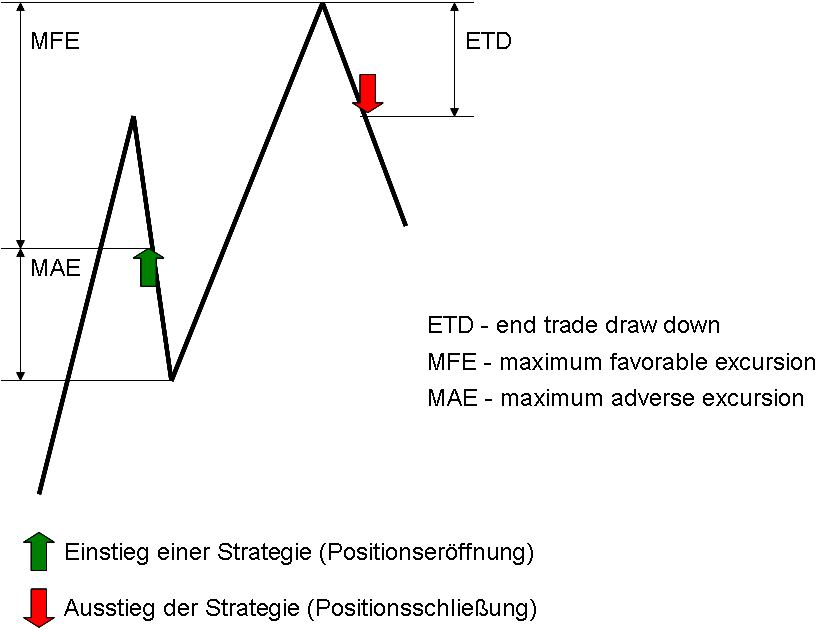

# Strategy Programming

## Account
### Description
Account is an object containing information about the account with which the current strategy is working.

The individual properties are:

-   **Account.AccountConnection**
    Name for the broker connection used (the name assigned under the account connection submenu)

-   **Account.AccountType**
    Type of account (live account, simulated account etc.)

-   **Account.Broker**
    Name/definition for the broker

-   **Account.BuyingPower**
    The current account equity in consideration of the leverage provided by the broker (IB leverages your account equity by a factor of 4, meaning that with 10000€ your buying power is equal to 40000€)

-   **Account.CashValue**
    Amount (double)

-   **Account.Currency**
    Currency in which the account is held

-   **Account.ExcessEquity**
    Excess

-   **Account.InitialMargin**
    Initial margin (depends on the broker, double)

-   **Account.InstrumentType**
    Type of trading instrument (type AgenaTrader.Plugins.InstrumentTypes)

-   **Account.IsDemo**
    True, if the account is a demo account

-   **Account.Name**
    Name of the account (should be identical to Account.AccountConnection)

-   **Account.OverNightMargin**
    Overnight margin (depends on the broker, double)

-   **Account.RealizedProfitLoss**
    Realized profits and losses (double)

### Example
```cs
Print("AccountConnection " + Account.AccountConnection);
Print("AccountType " + Account.AccountType);
Print("Broker " + Account.Broker);
Print("BuyingPower " + Account.BuyingPower);
Print("CashValue " + Account.CashValue);
Print("Currency " + Account.Currency);
Print("ExcessEquity " + Account.ExcessEquity);
Print("InitialMargin " + Account.InitialMargin);
Print("InstrumentTypes " + Account.InstrumentTypes);
Print("IsDemo " + Account.IsDemo);
Print("Name " + Account.Name);
Print("OverNightMargin " + Account.OverNightMargin);
Print("RealizedProfitLoss " + Account.RealizedProfitLoss);
```

## BarsCountFromTradeOpen()
### Description
The property "BarsCountFromTradeOpen" returns the number of bars that have occurred since the last entry into the market.

### Usage
```cs
BarsCountFromTradeOpen()
BarsCountFromTradeOpen(string strategyName)
```

For multi-bar strategies

```cs
BarsCountFromTradeOpen(int multibarSeriesIndex, string strategyName, int entriesAgo)
```

### Parameter
|                     |                                                                                                           |
|---------------------|-----------------------------------------------------------------------------------------------------------|
| strategyName          | The strategy name (string) that has been used to clearly label the entry within an entry method.            |
| multibarSeriesIndex | For *[Multibar*](#multibar), [*MultiBars*](#multibars) strategies. Index for the data series for which the entry order was executed. See [*ProcessingBarSeriesIndex*](#processingbarseriesindex), [*ProcessingBarSeriesIndex*](#processingbarseriesindex). |
| entriesAgo          | Number of entries in the past. A zero indicates the number of bars that have formed after the last entry. |

### Example
```cs
Print("The last entry was " + BarsCountFromTradeOpen() + " bars ago.");
```

## BarsCountFromTradeClose()
### Description
The property "BarsCountFromTradeClose" outputs the number of bars that have occurred since the last exit from the market.

### Usage
```cs
BarsCountFromTradeClose()
BarsCountFromTradeClose(string strategyName)
```

For multi-bar strategies
```cs
BarsCountFromTradeClose(int multibarSeriesIndex, string strategyName, int exitsAgo)
```

### Parameter
|                     |                                                                                                                           |
|---------------------|---------------------------------------------------------------------------------------------------------------------------|
| strategyName          | The Strategy name (string) that has been used to clearly label the exit within the exit method.    |
| multibarSeriesIndex | For *[Multibar*](#multibar)[*MultiBars*](#multibars) strategies. Index of the data series for which the exit order has been executed. See [*ProcessingBarSeriesIndex*](#processingbarseriesindex). |
| exitsAgo            | Number of exits that have occurred in the past. A zero indicates the number of bars that have formed after the last exit. |

### Example
```cs
Print("The last exit was " + BarsCountFromTradeClose() + " bars ago.");
```
## CancelAllOrders()
### Description
CancelAllOrders deletes all oders (cancel) managed by the strategy.
A cancel request is sent to the broker. Whether an or there is really deleted, can not be guaranteed. It may happen that an order has received a partial execution before it is deleted.
Therefore we recommend that you check the status of the order with [*OnOrderChanged()*](#onorderupdate).

### Usage
```cs
CancelAllOrders()
```
### Parameter
None

### Example
```cs
protected override void OnCalculate()
{
   if (BarsCountFromTradeOpen() >= 30)
       CancelAllOrders();
}
```
## CancelOrder()
### Description
Cancel order deletes an order.

A cancel request is sent to the broker. There is no guarantee that the order will actually be deleted there. It may occur that the order receives a partial execution before it is deleted. Therefore we recommend that you check the status of the order with [*OnOrderChanged()*](#onorderupdate).

### Usage
```cs
CancelOrder(IOrder order)
```

### Parameter
An order object of the type "IOrder"

### Example
```cs
private IOrder entryOrder = null;
private int barNumber = 0;
protected override void OnCalculate()
{
    // Place an entry stop at the high of the current bar
    if (entryOrder == null)
    {
        entryOrder = OpenLongStop(High[0], "stop long");
        barNumber = ProcessingBarIndex;
    }
    // Delete the order after 3 bars
    if (Position.PositionType == PositionType.Flat &&
    ProcessingBarIndex > barNumber + 3)
        CancelOrder(entryOrder);
}
```

## ReplaceOrder()
### Description
Change order, as the name suggests, changes an order.

### Usage
```cs
ReplaceOrder(IOrder iOrder, int quantity, double limitPrice, double stopPrice)
```

### Parameter
|            |                                          |
|------------|------------------------------------------|
| iOrder     | An order object of the type "IOrder"     |
| quantity   | Number of units to be ordered            |
| limitPrice | Limit price. Set this to 0 if not needed |
| stopPrice  | Stop price. Set this to 0 if not needed  |

### Example
```cs
private IOrder stopOrder = null;
protected override void OnCalculate()
{
// If the position is profiting by 10 ticks then set the stop to break-even
if (stopOrder != null
    && Close[0] >= Position.AvgPrice + (10 * TickSize)
        && stopOrder.StopPrice < Position.AvgPrice)
ReplaceOrder(stopOrder, stopOrder.Quantity, stopOrder.LimitPrice, Position.AvgPrice);
}
```
## CreateIfDoneGroup()
### Description
If two orders are linked to one another via a CreateIfDoneGroup, it means that if the one order has been executed, the second linked order is activated.

### Usage
```cs
CreateIfDoneGroup(IEnumerable<IOrder> orders)
```

### Parameter
An order object of type IOrder as a list

### Example
```cs
private IOrder oEnterLong = null;
private IOrder oExitLong = null;


protected override void OnInit()
{
   IsAutomated = false;
}


protected override void OnCalculate()
{
   oEnterLong = SubmitOrder(0, OrderAction.Buy, OrderType.Market, DefaultOrderQuantity, 0, 0, "ocoId","strategyName");
   oExitLong = SubmitOrder(0, OrderAction.Sell, OrderType.Stop, DefaultOrderQuantity, 0, Close[0] * 1.1, "ocoId","strategyName");

   CreateIfDoneGroup(new List<IOrder> { oEnterLong, oExitLong });

   oEnterLong.ConfirmOrder();
}
```

## CreateOCOGroup()
### Description
If two orders are linked via a CreateOCOGroup, it means that once the one order has been executed, the second linked order is deleted.

### Usage
```cs
CreateOCOGroup(IEnumerable<IOrder> orders)
```

### Parameter
An order object of type IOrder as a list

### Example
```cs
private IOrder oEnterLong = null;
private IOrder oEnterShort = null;


protected override void OnInit()
{
   IsAutomated = false;
}


protected override void OnCalculate()
{
   oEnterLong = SubmitOrder(0, OrderAction.Buy, OrderType.Stop, DefaultOrderQuantity, 0, Close[0] * 1.1, "ocoId","strategyName");
   oEnterShort = SubmitOrder(0, OrderAction.SellShort, OrderType.Stop, DefaultOrderQuantity, 0, Close[0] * -1.1,"ocoId", "strategyName");

   CreateOCOGroup(new List<IOrder> { oEnterLong, oEnterShort });

   oEnterLong.ConfirmOrder();
   oEnterShort.ConfirmOrder();
}
```

## CreateOROGroup()
### Description
If two orders are linked via a CreateOROGroup, it means that once the one order has been executed, the order size of the second order is reduced by the order volume of the first order.
### Usage
```cs
CreateOROGroup(IEnumerable<IOrder> orders)
```

### Parameter
An order object of type IOrder as a list

### Example
```cs
private IOrder oStopLong = null;
private IOrder oLimitLong = null;


protected override void OnInit()
{
   IsAutomated = false;
}


protected override void OnCalculate()
{
   oStopLong = SubmitOrder(0, OrderAction.BuyToCover, OrderType.Stop, DefaultOrderQuantity, 0, Close[0] * -1.1,"ocoId", "strategyName");
   oLimitLong = SubmitOrder(0, OrderAction.BuyToCover, OrderType.Limit, (int)(DefaultOrderQuantity * 0.5), Close[0] * 1.1, 0, "ocoId", "strategyName");

   CreateOROGroup(new List<IOrder> { oLimitLong, oStopLong });
}
```


## DataSeriesConfigurable
## DefaultOrderQuantity
### Description
Change order changes an order.

Default quantity defines the amount to be used in a strategy. Default quantity is set within the [*OnInit()*](#initialize) method.

### Usage
```cs
ReplaceOrder(IOrder iOrder, int quantity, double limitPrice, double stopPrice)
```

### Parameter
An int value containing the amount (stocks, contracts etc.)

### Example
```cs
protected override void OnInit()
{
DefaultOrderQuantity = 100;
}
```

## OpenLong()
### Description
Enter long creates a long position (buy).

If a signature not containing an amount is used, the amount is set by the [*DefaultOrderQuantity*](#defaultquantity) or taken from the strategy dialog window.

See [*OpenLongLimit()*](#enterlonglimit), [*OpenLongStop()*](#enterlongstop), [*OpenLongStopLimit()*](#enterlongstoplimit).

### Usage
```cs
OpenLong()
OpenLong(string strategyName)
OpenLong(int quantity)
OpenLong(int quantity, string strategyName)

//For multi-bar strategies
OpenLong(int multibarSeriesIndex, int quantity, string strategyName)
```

### Parameter
|                     |                                                                                               |
|---------------------|-----------------------------------------------------------------------------------------------|
| strategyName          | An unambiguous name                                                                           |
| quantity            | The amount of stocks/contracts                                                                |
| multibarSeriesIndex | For [*Multibar*](#multibar), [*MultiBars*](#multibars) strategies.  Index of the data series for which the entry order is to be executed. See [*ProcessingBarSeriesIndex*](#processingbarseriesindex).  |

### Return Value
an order object of the type "IOrder"

### Example
```cs

// if the EMA14 crosses the SMA50 from below to above
// the ADX is rising its values
if (CrossAbove(EMA(14), SMA(50), 1) && IsSerieRising(ADX(20)))
    OpenLong("SMACrossesEMA");

```

## OpenLongLimit()
### Description
Enter long limit creates a limit order for entering a long position (buy).

If a signature not containing a set amount is used, the amount is set by the [*DefaultOrderQuantity*](#defaultquantity) or taken from the strategy dialog window.

See [*OpenLong()*](#enterlong), [*OpenLongStop()*](#enterlongstop), [*OpenLongStopLimit()*](#enterlongstoplimit).

### Usage
```cs
OpenLongLimit(double limitPrice)
OpenLongLimit(double limitPrice, string strategyName)
OpenLongLimit(int quantity, double limitPrice)
OpenLongLimit(int quantity, double limitPrice, string strategyName)
```

For Multibar-Strategies
```cs
OpenLongLimit(int multibarSeriesIndex, bool liveUntilCancelled, int quantity, double limitPrice, string strategyName)
```

### Parameter
|             |                  |     
|---------------------|-------------|
| strategyName          | An unambiguous name |
| quantity            | Amount of stocks/contracts/etc.  |
| multibarSeriesIndex | For [*Multibar*](#multibar) and [*MultiBars*](#multibars) strategies. Index of the data series for which the entry order is to be executed. See [*ProcessingBarSeriesIndex*](#processingbarseriesindex). |
| limitPrice          | A double value for the limit price |
| liveUntilCancelled  | The order will not be deleted at the end of the bar, but will remain active until removed with [*CancelOrder*](#cancelorder) or until it reaches its expiry (see [*TimeInForce*](#timeinforce)). |

### Return Value
An order object of the type "IOrder"

### Example
```cs
// if the EMA14 crosses the SMA50 from below to above
// the ADX is rising its values
if (CrossAbove(EMA(14), SMA(50), 1) && IsSerieRising(ADX(20)))
    OpenLongLimit("SMACrossesEMA");
```

## OpenLongStop()
### Description
Enter long stop creates a limit order for entering a long position (buy).

If a signature not containing a set amount is used, the amount is set by the [*DefaultOrderQuantity*](#defaultquantity) or taken from the strategy dialog window.

See [*OpenLong()*](#enterlong), [*OpenLongLimit()*](#enterlonglimit), [*OpenLongStopLimit()*](#enterlongstoplimit).

### Usage
```cs
OpenLongStop(double stopPrice)
OpenLongStop(double stopPrice, string strategyName)
OpenLongStop(int quantity, double stopPrice)
OpenLongStop(int quantity, double stopPrice, string strategyName)
```

For multi-bar strategies
```cs
OpenLongStop(int multibarSeriesIndex, bool liveUntilCancelled, int quantity, double stopPrice, string strategyName)
```

### Parameter
| |   |
|---------------------|-------------------------------------------------------------------------------------------|
| strategyName          | An unambiguous name    |
| quantity            | Amount of stocks or contracts etc.                                                                                                                                                    |
| multibarSeriesIndex | For [*Multibar*](#multibar) and [*MultiBars*](#multibars) strategies Index of the data series for which an entry order is to be executed. See [*ProcessingBarSeriesIndex*](#processingbarseriesindex).  |
| stopPrice           | A double value for the stop price                                                                                                                                                     |
| liveUntilCancelled  | The order will not be deleted at the end of the bar, but will remain active until deleted with the [*CancelOrder*](#cancelorder) command or until it reaches its expiry time (see [*TimeInForce*](#timeinforce)). |

### Return Value
An order object of the type "IOrder"

### Example
```cs
private IOrder stopOrder = null;
// Place an entry order at the high of the current bar
if (stopOrder == null)
    stopOrder = OpenLongStop(Low[0], "Stop Long");
```

## OpenLongStopLimit()
### Description
Enter long stop limit creates a buy stop limit order for entering a long position.

If a signature not containing a set amount is used, the amount is set by the [*DefaultOrderQuantity*](#defaultquantity) or taken from the strategy dialog window.

See [*OpenLong()*](#enterlong), [*OpenLongLimit()*](#enterlonglimit), [*OpenLongStop()*](#enterlongstop).

### Usage
```cs
OpenLongStopLimit(double limitPrice, double stopPrice)
OpenLongStopLimit(double limitPrice, double stopPrice, string strategyName)
OpenLongStopLimit(int quantity, double limitPrice, double stopPrice)
OpenLongStopLimit(int quantity, double limitPrice, double stopPrice, string strategyName)
```

For multi-bar strategies
```cs
OpenLongStopLimit(int multibarSeriesIndex, bool liveUntilCancelled, int quantity, double limitPrice, double stopPrice, string strategyName)
```

### Parameter
|    |     |
|--------------|-------------------------|
| strategyName          | An unambiguous name       |
| quantity            | Amount of stocks or contracts to be ordered   |
| multibarSeriesIndex | For [*Multibar*](#multibar), [*MultiBars*](#multibars) strategies. Index of the data series for which the entry order is to be executed.  See [*ProcessingBarSeriesIndex*](#processingbarseriesindex).  |
| stopPrice           | A double value for the stop price |
| limitPrice          | A double value for the limit price |
| liveUntilCancelled  | The order will not be deleted at the end of the bar, but will remain active until canceled with the CancelOrder command or until it reaches its expiry (see [*TimeInForce*](#timeinforce)). |

### Return Value
An order object of the type "IOrder"

### Example
```cs
private IOrder stopOrder = null;
// Place an entry stop at the high of the current bar
// if the high  is reached, at 5 ticks above the high.
if (stopOrder == null)
    stopOrder = OpenLongStopLimit(High[0]+ (5*TickSize), High[0], "Stop Long Limit");
```

## OpenShort()
### Description
Enter short creates a market order for entering a short position (naked sell).

If a signature not containing a set amount is used, the amount is set by the [*DefaultOrderQuantity*](#defaultquantity) or taken from the strategy dialog window.

See [*OpenShortLimit()*](#entershortlimit), [*OpenShortStop()*](#entershortstop)(entershortstop), [*OpenShortStopLimit()*](#entershortstoplimit).

### Usage
```cs
OpenShort()
OpenShort(string strategyName)
OpenShort(int quantity)
OpenShort(int quantity, string strategyName)
For multi-bar strategies
OpenShort(int multibarSeriesIndex, int quantity, string strategyName)
```

### Parameter
|                     |                                                                      |
|---------------------|----------------------------------------------------------------------|
| strategyName          | An unambiguous name                                                  |
| quantity            | Amount of stocks/contracts etc.                                      |
| multibarSeriesIndex | For [*Multibar*](#multibar), [*MultiBars*](#multibars) strategies
Index of the data series for which the entry order is to be executed
See [*ProcessingBarSeriesIndex*](#processingbarseriesindex).     |

### Return Value
an order object of the type "IOrder"

### Example
```cs
// if the EMA14 crosses the SMA50 from above to below
// the ADX is rising its values
if (CrossBelow(EMA(14), SMA(50), 1) && IsSerieRising(ADX(20)))
    OpenShort("'EMACrossesSMA");
```

## OpenShortLimit()
### Description
Enter short limit creates a limit order for entering a short position (naked short).

If a signature not containing a set amount is used, the amount is set by the [*DefaultOrderQuantity*](#defaultquantity) or taken from the strategy dialog window.

See [*OpenShort()*](#entershort), [*OpenShortStop()*](#entershortstop), [*OpenShortStopLimit()*](#entershortstoplimit).

### Usage
```cs
OpenShortLimit(double limitPrice)
OpenShortLimit(double limitPrice, string strategyName)
OpenShortLimit(int quantity, double limitPrice)
OpenShortLimit(int quantity, double limitPrice, string strategyName)
```

For Multibar-Strategies
```cs
OpenShortLimit(int multibarSeriesIndex, bool liveUntilCancelled, int quantity, double limitPrice, string strategyName)
```

### Parameter
|    |  |
|---------------------|-------------------------------------------------|
| strategyName          | An unambiguous name     |
| quantity            | Amount to be ordered   |
| multibarSeriesIndex | For [*Multibar*](#multibar), [*MultiBars*](#multibars) strategies. Index of the data series for which the entry order is to be executed. See [*ProcessingBarSeriesIndex*](#processingbarseriesindex).   |
| limitPrice          | A double value for the limit price   |
| liveUntilCancelled  | The order will not be deleted at the end of the bar, but will remain active until deleted with the CancelOrder command or until it reaches its expiry (see [*TimeInForce*](#timeinforce)). |

### Return Value
an order object of the type "IOrder"

### Example
```cs
// Enter a short position if the last entry is 10 bars in the past and two SMAs have crossed each other
if (BarsCountFromTradeOpen() > 10 && CrossBelow(SMA(10), SMA(20), 1))
OpenShortLimit("SMA cross entry");
```

## OpenShortStop()
### Description
Enter short stop creates a limit order for entering a short position.
If a signature not containing a set amount is used, the amount is set by the [*DefaultOrderQuantity*](#defaultquantity) or taken from the strategy dialog window.
See [*OpenShort()*](#entershort), [*OpenShortLimit()*](#entershortlimit), [*OpenShortStopLimit()*](#entershortstoplimit).

### Usage
```cs
OpenShortStop(double stopPrice)
OpenShortStop(double stopPrice, string strategyName)
OpenShortStop(int quantity, double stopPrice)
OpenShortStop(int quantity, double stopPrice, string strategyName)
```

For multi-bar strategies
```cs
OpenShortStop(int multibarSeriesIndex, bool liveUntilCancelled, int quantity, double stopPrice, string strategyName)
```

### Parameter
|                     |                                                                                                               |
|---------------------|---------------------------------------------------------------------------------------------------------------|
| strategyName          | An unambiguous name                                                                                           |
| quantity            | Amount to be ordered                                                                                          |
| multibarSeriesIndex | For [*Multibar*](#multibar), [*MultiBars*](#multibars) strategies. Index of the data series for which the entry order is to be executed. See [*ProcessingBarSeriesIndex*](#processingbarseriesindex). |
| stopPrice           | A double value for the stop price                                                                             |
| liveUntilCancelled  | The order will remain active until canceled using the CancelOrder command or until it reaches its expiry time |

### Return Value
An order object of the type "IOrder"

### Example
```cs
private IOrder stopOrder = null;
// Place an entry stop at the High of the current bar
if (stopOrder == null)
    stopOrder = OpenShortStop(High[0], "stop short");
```

## OpenShortStopLimit()
### Description
Enter short stop limit creates a sell stop limit order for entering a short position.

If a signature not containing a set amount is used, the amount is set by the [*DefaultOrderQuantity*](#defaultquantity) or taken from the strategy dialog window.

See [*OpenShort()*](#entershort), [*OpenShortLimit()*](#entershortlimit), [*OpenShortStop()*](#entershortstop).

### Usage
```cs
OpenShortStopLimit(double limitPrice, double stopPrice)
OpenShortStopLimit(double limitPrice, double stopPrice, string strategyName)
OpenShortStopLimit(int quantity, double limitPrice, double stopPrice)
OpenShortStopLimit(int quantity, double limitPrice, double stopPrice, string strategyName)
```

For multi-bar strategies

```cs
OpenShortStopLimit(int multibarSeriesIndex, bool liveUntilCancelled, int quantity, double limitPrice, double stopPrice, string strategyName)
```

### Parameter
|                     |                                                                                                                                                              |
|---------------------|--------------------------------------------------------------------------------------------------------------------------------------------------------------|
| strategyName          | An unambiguous name      |
| quantity   | Amount to be ordered       |
| multibarSeriesIndex | For [*Multibar*](#multibar), [*MultiBars*](#multibars) strategies.
Index of the data series for which an entry order is to be placed.
See [*ProcessingBarSeriesIndex*](#processingbarseriesindex).       |
| stopPrice           | A double value for the stop price                                                                                                                            |
| limitPrice          | A double value for the limit price                                                                                                                           |
| liveUntilCancelled  | The order will not be deleted at the end of the bar, but will remain active until deleted using the CancelOrder command or until it reaches its expiry time. |

### Return Value
An order object of the type "IOrder"

### Example
```cs
private IOrder stopOrder = null;
// Place an entry stop at the low of the current bar; if the low is reached then place a limit order 2 ticks below the low
if (stopOrder == null)
    stopOrder = OpenShortStopLimit(High[0] + (2*TickSize), High[0], "stop short");
```

## EntriesPerDirection
### Description
Entries per direction defines the maximum number of entries permitted in one direction (long or short).

Whether the name of the entry signal is taken into consideration or not is defined within [*EntryHandling*](#entryhandling).

Entries per direction is defined with the [*OnInit()*](#initialize) method.

### Usage
**EntriesPerDirection**

### Parameter
An int value for the maximum entries permitted in one direction.

### Example
```cs
// Example 1
// If one of the two entry conditions is true and a long position is opened, then the other entry signal will be ignored
protected override void OnInit()
{
EntriesPerDirection = 1;
EntryHandling = EntryHandling.AllEntries;
}

protected override void OnCalculate()
{
    if (CrossAbove(EMA(14), SMA(50), 1) && IsSerieRising(ADX(20)))
        OpenLong("SMA cross entry");
}

// Example 2


protected override void OnCalculate()
{
    if (CrossAbove(EMA(14), SMA(50), 1) && IsSerieRising(ADX(20)))
        OpenLong("EMACrossesSMA");
    else if (CrossAbove (MACD(2,2,5), 0, 1))
        OpenLong("MACDCross");
}
```

## EntryHandling
### Description
Entry handling decides how the maximum number of entries permitted in one direction is interpreted ([*EntriesPerDirection*](#entriesperdirection)).

Entry handling is defined with the [*OnInit()*](#initialize) method.

**EntryHandling.AllEntries**

AgenaTrader continues to create entry orders until the maximum number of entries permitted (defined in [*EntriesPerDirection*](#entriesperdirection)) per direction (long or short) is reached, regardless of how the entry signals are named.

If entries per direction = 2, then enter long ("SMA crossover") and enter long ("range breakout") combined will reach the maximum number of long entries permitted.

**EntryHandling.UniqueEntries**

AgenaTrader continues to generate entry orders until the maximum number of entries (defined in entries per direction) in one direction (long or short) for the differently named entry signals has been reached.
If entries per direction = 2, then it is possible for two signals for enter long ("SMA crossover") *and* 2 signals for enter long ("range breakout") to be traded.

### Usage
**EntryHandling**

### Example
See [*EntriesPerDirection*](#entriesperdirection).

## ExcludeTradeHistoryInBacktest
## CloseLong()
### Description
Exit long creates a sell market order for closing a long position (sell).

If a signature not containing a set amount is used, the amount is set by [*DefaultOrderQuantity*](#defaultquantity) or taken from the strategy dialog window.

See [*CloseLong()*](#closelong), [*CloseLongLimit()*](#closelonglimit), [*CloseLongStop()*](#closelongstop), [*CloseLongStopLimit()*](#closelongstoplimit).

### Usage
```cs
CloseLong()
CloseLong(int quantity)
CloseLong(string fromEntry signal)
CloseLong(string strategyName, string fromEntry signal)
CloseLong(int quantity, string strategyName, string fromEntry signal)
```

For multi-bar strategies
```cs
CloseLong(int multibarSeriesIndex, int quantity, string strategyName, string fromEntry signal)
```

### Parameter
|                     |                                                                      |
|---------------------|----------------------------------------------------------------------|
| strategyName          | An unambiguous name                                                  |
| quantity            | The quantity to be sold                                              |
| multibarSeriesIndex | For [*Multibar*](#multibar), [*MultiBars*](#multibars) strategies. Index of the data series for which the exit order is to be executed. See [*ProcessingBarSeriesIndex*](#processingbarseriesindex).   |
| fromEntry signal    | The name of the attached entry signal                                |

### Return Value
An order object of the type "IOrder"

### Example
```cs
// Enter if two EMA crosses SMA and the ADX is rising
if (CrossAbove(EMA(14), SMA(50), 1) && IsSerieRising(ADX(20)))
     OpenLong("EMACrossesSMA");

// Close position
if (CrossBelow(EMA(14), SMA(50), 2))
    CloseLong();
```

## CloseLongLimit()
### Description
Exit long limit creates a sell limit order for closing a long position (i.e. for selling).

If a signature not containing a set amount is used, the amount is set by the [*DefaultOrderQuantity*](#defaultquantity) or taken from the strategy dialog window.
See [*CloseLong()*](#closelong), [*CloseLongLimit()*](#closelonglimit), [*CloseLongStop()*](#closelongstop), [*CloseLongStopLimit()*](#closelongstoplimit).

### Usage
```cs
CloseLongLimit(double limitPrice)
CloseLongLimit(int quantity, double limitPrice)
CloseLongLimit(double limitPrice, string fromEntry signal)
CloseLongLimit(double limitPrice, string strategyName, string fromEntry signal)
CloseLongLimit(int quantity, double limitPrice, string strategyName, string fromEntry signal)
```

For multi-bar strategies
```cs
CloseLongLimit(int multibarSeriesIndex, bool liveUntilCancelled, int quantity, double limitPrice, string strategyName, string fromEntry signal)
```

### Parameter
|                     |                                                                                                                                                              |
|---------------------|--------------------------------------------------------------------------------------------------------------------------------------------------------------|
| strategyName          | An unambiguous name                                                                                                                                          |
| fromEntry signal    | The name of the attached entry signal                                                                                                                        |
| quantity            | Order quantity to be sold                                                                                                                                    |
| multibarSeriesIndex | For [*Multibar*](#multibar), [*MultiBars*](#multibars) strategies. Index of the data series for which the exit order is to be executed. See [*ProcessingBarSeriesIndex*](#processingbarseriesindex).  |
| limitPrice          | A double value for the limit price                                                                                                                           |
| liveUntilCancelled  | The order will not be deleted at the end of the bar, but will remain active until deleted using the CancelOrder command or until it reaches its expiry time. |

### Return Value
an order object of the type "IOrder"

### Example
```cs
// Enter if two EMA crosses SMA and the ADX is rising
if (CrossAbove(EMA(14), SMA(50), 1) && IsSerieRising(ADX(20)))
     OpenLong("EMACrossesSMA");

// Close position
if (CrossBelow(EMA(14), SMA(50), 2))
    CloseLongLimit(Low[0]);
```

## CloseLongStop()
### Description
Exit long stop creates a sell stop order for closing a long position (short).

If a signature not containing a set amount is used, the amount is set by the [*DefaultOrderQuantity*](#defaultquantity) or taken from the strategy dialog window.
See [*CloseLong()*](#closelong), [*CloseLongLimit()*](#closelonglimit), [*CloseLongStop()*](#closelongstop), [*CloseLongStopLimit()*](#closelongstoplimit).

### Usage
```cs
CloseLongStop(int quantity, double stopPrice)
CloseLongStop(double stopPrice, string fromEntry signal)
CloseLongStop(double stopPrice, string strategyName, string fromEntry signal)
CloseLongStop(int quantity, double stopPrice, string strategyName, string fromEntry signal)
```

For multi-bar strategies
```cs
CloseLongStop(int multibarSeriesIndex, bool liveUntilCancelled, int quantity, double stopPrice, string strategyName, string fromEntry signal)CloseLongStop
```

### Parameter
|                     |                                                                                                                                                              |
|---------------------|--------------------------------------------------------------------------------------------------------------------------------------------------------------|
| strategyName          | An unambiguous name                                                                                                                                          |
| fromEntry signal    | The name of the associated entry signal                                                                                                                      |
| quantity            | The quantity to be sold                                                                                                                                      |
| multibarSeriesIndex | For [*Multibar*](#multibar), [*MultiBars*](#multibars) strategies. Index of the data series for which the exit order is to be executed. See [*ProcessingBarSeriesIndex*](#processingbarseriesindex).  |
| stopPrice           | A double value for the stop price                                                                                                                            |
| liveUntilCancelled  | The order will not be deleted at the end of the bar, but will remain active until deleted using the CancelOrder command or until it reaches its expiry time. |

### Return Value
an order object of the type "IOrder"

### Example
```cs
// Enter if two EMA crosses SMA and the ADX is rising
if (CrossAbove(EMA(14), SMA(50), 1) && IsSerieRising(ADX(20)))
     OpenLong("EMACrossesSMA");

// Close position
if (CrossBelow(EMA(14), SMA(50), 2))
    CloseLongStop(Low[0]);
```

## CloseLongStopLimit()
### Description
Exit long stop limit creates a sell stop limit order for closing a long position (i.e. selling).

If a signature not containing a set amount is used, the amount is set by the [*DefaultOrderQuantity*](#defaultquantity) or taken from the strategy dialog window.

See [*CloseLong()*](#closelong), [*CloseLongLimit()*](#closelonglimit), [*CloseLongStop()*](#closelongstop), [*CloseLongStopLimit()*](#closelongstoplimit).

### Usage
```cs
CloseLongStopLimit(double limitPrice, double stopPrice)
CloseLongStopLimit(int quantity, double limitPrice, double stopPrice)
CloseLongStopLimit(double limitPrice, double stopPrice, string fromEntry signal)
CloseLongStopLimit(double limitPrice, double stopPrice, string strategyName, string fromEntry signal)
CloseLongStopLimit(int quantity, double limitPrice, double stopPrice, string strategyName, string fromEntry signal)
```

For Multibar-Strategies
```cs
CloseLongStopLimit(int multibarSeriesIndex, bool liveUntilCancelled, int quantity, double limitPrice, double stopPrice, string strategyName, string fromEntry signal)
```

### Parameter
|                     |                                                                                                                                                              |
|---------------------|--------------------------------------------------------------------------------------------------------------------------------------------------------------|
| strategyName          | An unambiguous name                                                                                                                                          |
| fromEntry signal    | The name of the associated entry signal                                                                                                                      |
| quantity            | The quantity to be sold                                                                                                                                      |
| multibarSeriesIndex | For [*Multibar*](#multibar), [*MultiBars*](#multibars) strategies. Index of the data series for which the exit order is to be executed. See [*ProcessingBarSeriesIndex*](#processingbarseriesindex). |
| limitPrice          | A double value for the limit price                                                                                                                           |
| stopPrice           | A double value for the stop price                                                                                                                            |
| liveUntilCancelled  | The order will not be deleted at the end of the bar, but will remain active until deleted using the CancelOrder command or until it reaches its expiry time. |

### Return Value
An order object of the type "IOrder"

### Example
```cs
// Enter if two EMA crosses SMA and the ADX is rising
if (CrossAbove(EMA(14), SMA(50), 1) && IsSerieRising(ADX(20)))
     OpenLong("EMACrossesSMA");

// Close position
if (CrossBelow(EMA(14), SMA(50), 2))
    CloseLongStopLimit(Low[0] - (15 * TickSize), Low[0]);
```

## ExitOnClose
## ExitOnCloseSeconds
## CloseShort()
### Description
Exit short creates a buy-to-cover market order for closing a short position (buy).

If a signature not containing a set amount is used, the amount is set by the [*DefaultOrderQuantity*](#defaultquantity) or taken from the strategy dialog window.
See [*CloseShort()*](#closeshort), [*CloseShortLimit()*](#closeshortlimit), [*CloseShortStop()*](#closeshortstop), [*CloseShortStopLimit()*](#closeshortstoplimit).

### Usage
```cs
CloseShort()
CloseShort(int quantity)
CloseShort(string fromEntry signal)
CloseShort(string strategyName, string fromEntry signal)
CloseShort(int quantity, string strategyName, string fromEntry signal)
```

For multi-bar strategies
```cs
CloseShort(int multibarSeriesIndex, int quantity, string strategyName, string fromEntry signal)
```

### Parameter
|                     |                                                                      |
|---------------------|----------------------------------------------------------------------|
| strategyName          | An unambiguous name                                                  |
| Quantity            | Order quantity to be bought                                          |
| multibarSeriesIndex | For [*Multibar*](#multibar), [*MultiBars*](#multibars) strategies. Index of the data series for which the exit order is to be executed. See [*ProcessingBarSeriesIndex*](#processingbarseriesindex). |
| fromEntry signal    | The name of the associated entry signal                              |

### Return Value
An order object of the type "IOrder"

### Example
```cs
// Enter if two EMA crosses SMA and the ADX is rising
if (CrossBelow(EMA(14), SMA(50), 1) && IsSerieRising(ADX(20)))
     OpenShort("EMACrossesSMA");

// Close
if (CrossAbove(EMA(15), SMA(50), 2))
    CloseShort();
```

## CloseShortLimit()
### Description
Exit short limit creates a buy-to-cover limit order for closing a short position (buy).

If a signature not containing a set amount is used, the amount is set by the [*DefaultOrderQuantity*](#defaultquantity) or taken from the strategy dialog window.

See [*CloseShort()*](#closeshort)(#closeshort), [*CloseShortLimit()*](#closeshortlimit), [*CloseShortStop()*](#closeshortstop), [*CloseShortStopLimit()*](#closeshortstoplimit).

### Usage
```cs
CloseShortLimit(double limitPrice)
CloseShortLimit(int quantity, double limitPrice)
CloseShortLimit(double limitPrice, string fromEntry signal)
CloseShortLimit(double limitPrice, string strategyName, string fromEntry signal)
CloseShortLimit(int quantity, double limitPrice, string strategyName, string fromEntry signal)
```

For multi-bar strategies
```cs
CloseShortLimit(int multibarSeriesIndex, bool liveUntilCancelled, int quantity, double limitPrice, string strategyName, string fromEntry signal)
```

### Parameter
|                     |                                                                                                                                                              |
|---------------------|--------------------------------------------------------------------------------------------------------------------------------------------------------------|
| strategyName          | An unambiguous name                                                                                                                                          |
| fromEntry signal    | The name of the associated entry signal                                                                                                                      |
| quantity            | Order quantity to be bought                                                                                                                                  |
| multibarSeriesIndex | For [*Multibar*](#multibar), [*MultiBars*](#multibars) strategies. Index of the data series for which the exit order is to be executed. See [*ProcessingBarSeriesIndex*](#processingbarseriesindex).  |
| limitPrice          | A double value for the limit price                                                                                                                           |
| liveUntilCancelled  | The order will not be deleted at the end of the bar, but will remain active until deleted using the CancelOrder command or until it reaches its expiry time. |

### Return Value
An order object of the type "IOrder"

### Example
```cs
// Enter if two EMA crosses SMA and the ADX is rising
if (CrossBelow(EMA(14), SMA(50), 1) && IsSerieRising(ADX(20)))
     OpenShort("EMACrossesSMA");
// Close
if (CrossAbove(EMA(15), SMA(50), 2))
    CloseShortLimit(High[0] + (Ticksize * 2));
```

## CloseShortStop()
### Description
Exit short stop creates a buy-to-cover stop order for closing a short position.
If a signature not containing a set amount is used, the amount is set by the [*DefaultOrderQuantity*](#defaultquantity) or taken from the strategy dialog window.

See [*CloseShort()*](#closeshort), [*CloseShortLimit()*](#closeshortlimit), [*CloseShortStop()*](#closeshortstop), [*CloseShortStopLimit()*](#closeshortstoplimit).

### Usage
```cs
CloseShortStop(int quantity, double stopPrice)
CloseShortStop(double stopPrice, string fromEntry signal)
CloseShortStop(double stopPrice, string strategyName, string fromEntry signal)
CloseShortStop(int quantity, double stopPrice, string strategyName, string fromEntry signal)
```

For multi-bar strategies
```cs
CloseShortStop(int multibarSeriesIndex, bool liveUntilCancelled, int quantity, double stopPrice, string strategyName, string fromEntry signal)CloseLongStop
```

### Parameter
|  |                                                                                                                                                              |  |---------------------|---------------------------------------------------------------|
| strategyName          | An unambiguous name    |
| fromEntry signal    | The name of the associated entry signal    |
| quantity            | Order quantity to be bought    |
| multibarSeriesIndex | For [*Multibar*](#multibar), [*MultiBars*](#multibars) strategies. Index of the data series for which the exit order is to be executed. See [*ProcessingBarSeriesIndex*](#processingbarseriesindex). |
| stopPrice           | A double value for the stop price    |
| liveUntilCancelled  | The order will not be deleted at the end of the bar, but will remain active until deleted using the CancelOrder command or until it reaches its expiry time. |

### Return Value
An order object of the type "IOrder"

### Example
```cs
/// Enter if two EMA crosses SMA and the ADX is rising
if (CrossBelow(EMA(14), SMA(50), 1) && IsSerieRising(ADX(20)))
     OpenShort("EMACrossesSMA");
// Close
if (CrossAbove(EMA(15), SMA(50), 2))
    CloseShortStop(High[0] + (Ticksize * 2));
```

## CloseShortStopLimit()
### Description
Exit short stop limit creates a buy-to-cover stop limit order for closing a short position.
If a signature not containing a set amount is used, the amount is set by the [*DefaultOrderQuantity*](#defaultquantity) or taken from the strategy dialog window.

See [*CloseLong()*](#closelong), [*CloseLongLimit()*](#closelonglimit), [*CloseLongStop()*](#closelongstop), [*CloseLongStopLimit()*](#closelongstoplimit).

### Usage
```cs
CloseShortStopLimit(double limitPrice, double stopPrice)
CloseShortStopLimit(int quantity, double limitPrice, double stopPrice)
CloseShortStopLimit(double limitPrice, double stopPrice, string fromEntry signal)
CloseShortStopLimit(double limitPrice, double stopPrice, string strategyName, string fromEntry signal)
CloseShortStopLimit(int quantity, double limitPrice, double stopPrice, string strategyName, string fromEntry signal)
```

For multi-bar strategies
```cs
CloseShortStopLimit(int multibarSeriesIndex, bool liveUntilCancelled, int quantity, double limitPrice, double stopPrice, string strategyName, string fromEntry signal)
```

### Parameter
|    |     |
|---------------------|----------------------------------|
| strategyName          | An unambiguous name      |
| fromEntry signal    | The name of the associated entry signal    |
| quantity            | Order quantity to be bought      |
| multibarSeriesIndex | For [*Multibar*](#multibar), [*MultiBars*](#multibars) strategies. Index of the data series for which the exit order is to be executed. See [*ProcessingBarSeriesIndex*](#processingbarseriesindex). |
| limitPrice          | A double value for the limit price    |
| stopPrice           | A double value for the stop price      |
| liveUntilCancelled  | The order will not be deleted at the end of the bar, but will remain active until deleted using the CancelOrder command or until it reaches its expiry time. |

### Return Value
An order object of the type "IOrder"

### Example
```cs
/// Enter if two EMA crosses SMA and the ADX is rising
if (CrossBelow(EMA(14), SMA(50), 1) && IsSerieRising(ADX(20)))
     OpenShort("EMACrossesSMA");
// Close
if (CrossAbove(EMA(15), SMA(50), 2))
    CloseShortStopLimit(High[0] + ( TickSize * 2 ), High[0]);
```

## GetAccountValue()
### Description
Get account value outputs information regarding the account for which the current strategy is being carried out.

See [*GetProfitLoss()*](#getprofitloss).

### Usage
```cs
GetAccountValue(AccountItem accountItem)
```

### Parameter
Possible values for account item are:

AccountItem.BuyingPower

AccountItem.CashValue

AccountItem.RealizedProfitLoss

### Return Value
A double value for the account item for historical bars, a zero (0) is returned

### Example
```cs
Print("The current account cash value is " + GetAccountValue(AccountItem.CashValue));
Print("The current account cash value with the leverage provided by the broker is " + GetAccountValue(AccountItem.BuyingPower));
Print("The current P/L already realized is " + GetAccountValue(AccountItem.RealizedProfitLoss));
```

## GetProfitLoss()
### Description
Get profit loss outputs the currently unrealized profit or loss for a running position.

See [*GetAccountValue()*](#getaccountvalue).

### Usage
```cs
GetProfitLoss(int pLType);
```

### Parameter
Potential values for the P/L type are:

0 – Amount: P/L as a currency amount

1 – Percent: P/L in percent

2 – Risk: P/L in Van Tharp R-multiples [*www.vantharp.com*](http://www.vantharp.com/tharp-concepts/risk-and-r-multiples.asp)

3 – P/L in ticks

### Return Value
A double value for the unrealized profit or loss

### Example
```cs
Print("The current risk for the strategy " + this.Name + " is " + GetProfitLoss(1) + " " + Instrument.Currency);
Print("This equals "+ string.Format( "{0:F1} R.", GetProfitLoss(3)));
```
## GetScriptedCondition()
### Description
This method allows user to communicate between scripts.


## GetProfitLossAmount()
### Description
GetProfitLossAmount () provides the current unrealized gain or loss of a current position as the currency amount.

See [*GetAccountValue()*](#getaccountvalue).

### Usage
```cs
GetProfitLossAmount(double profitLoss);
```

### Parameter
Double

### Return Value
A double value for the unrealized profit or loss

### Example
```cs
Print("the current P&L " + this.Name + " is " + GetProfitLossAmount(Position.OpenProfitLoss) + " " + Instrument.Currency);
```

## GetProfitLossRisk()
### Description
GetProfitLossRisk () returns the current unrealized gain or loss of a current position in R-multiples.

See [*GetAccountValue()*](#getaccountvalue).

### Usage
```cs
GetProfitLossRisk();
```

### Parameter
None
### Return Value
A double value for the R-Multiple

### Example
```cs
Print("the current P&L " + this.Name + " is " + string.Format( "{0:F1} R.", GetProfitLossRisk()));
```

## IsAutomated
### Description
IsAutomated determines whether orders are activated automatically. IsAutomated is specified in the [*OnInit()*](#initialize) method.

If IsAutomated = true, then orders are automatically activated (default). If IsAutomated is assigned the value false, the corresponding order must be activated with order.[*ConfirmOrder()*](#confirmorder).

### Parameter
Bool value

### Example
```cs
protected override void OnInit()
{
   IsAutomated = false;
}
```

## Order
### Description
IOrder is an object that contains information about an order that is currently managed by a strategy.


The individual properties are:

-   Action
    **One of four possible positions in the market:**
    -   OrderAction.Buy
    -   OrderAction.BuyToCover
    -   OrderAction.Sell
    -   OrderAction.SellShort

-   **AvgFillPrice**
    **The average purchase or selling price of a position.For positions without partial executions, this corresponds to the entry price.**

-   **Filled**
    For partial versions, Filled is less than Quantity

-   **FromEntrySignal**
    The trading instrument in which the position exists... See *Instruments*.

-   **LimitPrice**

-   **Name**
    The unique SignalName  (maybe mistake SignalName)

-   **OrderId**
    The unique OrderId

-   **OrderMode**
    One of three possible positions in the market:
    -   OrderMode.Direct
    -   OrderMode.Dynamic
    -   OrderMode.Synthetic

-   **OrderState**
    The current status of the order can be queried (see *OnOrderExecution* and *OnOrderChanged*)
    -   OrderState.Accepted
    -   OrderState.Cancelled
    -   OrderState.CancelRejected
    -   OrderState.Filled
    -   OrderState.PartFilled
    -   OrderState.PendingCancel
    -   OrderState.PendingReplace
    -   OrderState.PendingSubmit
    -   OrderState.Rejected
    -   OrderState.ReplaceRejected
    -   OrderState.Unknown
    -   OrderState.Working

-   **OrderType**
    Possible order types:
    -   OrderType.Limit
    -   OrderType.Market
    -   OrderType.Stop
    -   OrderType.StopLimit

-   **Quantity**
    The quantity to be ordered

-   **StopPrice**

-   **Time**
    Time stamp

-   **TimeFrame**
    The TimeFrame, which is valid for the order.

-   **TimeFrame**

Possible Methods:

-   **order CancelOrder()**
    Delete the Order

-   **order.ConfirmOrder()**
    Confirm the order. This method have to be executed if IsAutomated is set to false and you want to run the order automatically. This is, for example, the case when an OCO or IfDone fabrication is to be produced.


## PositionType
See [*Position.PositionType*](#positionpositiontype).

## Performance
### Description
Performance is an object containing information regarding all trades that have been generated by a strategy.

The trades are sorted into multiple lists. With the help of these lists it is easier to create a performance evaluation.

See Performance Characteristics.

The individual lists are:

-   **Performance.AllTrades**
    A [*Trade*](#trade) collection object containing all trades generated by a strategy.

-   **Performance.LongTrades**
    A [*Trade*](#trade) collection object containing all long trades generated by a strategy.

-   **Performance.ShortTrades**
    A [*Trade*](#trade) collection object containing all short trades generated by a strategy.

-   **Performance.WinningTrades**
    A [*Trade*](#trade) collection object containing all profitable trades generated by a strategy.

-   **Performance.LosingTrades**
    A [*Trade*](#trade) collection object containing all loss trades generated by a strategy.

### Example
```cs
// When exiting a strategy, create a performance evaluation
protected override void OnDispose()
{
Print("Performance evaluation of the strategy : " + this.Name);
Print("----------------------------------------------------");
Print("Amount of all trades: " + Performance.AllTrades.Count);
Print("Amount of winning trades: " + Performance.WinningTrades.Count);
Print("Amount of all loss trades: " + Performance.LosingTrades.Count);
Print("Amount of all long trades: " + Performance.LongTrades.Count);
Print("Amount of short trades: " + Performance.ShortTrades.Count);
Print("Result: " + Account.RealizedProfitLoss + " " + Account.Currency);
}
```

## Position
### Description
Position is an object containing information regarding the position currently being managed by a strategy.

The individual properties are:

-   **Position.AvgPrice**
    The average buy or sell price of a position.
    For positions without partial executions, this is equal to the entry price.

-   **Position.CreatedDateTime**
    Date and time at which the position was opened.

-   **Position.Instrument**
    The trading instrument in which the position exists.
    See *Instruments*.

-   **Position.PositionType**
    One of three possible positions in the market:
    -   PositionType.Flat
    -   PositionType.Long
    -   PositionType.Short

-   **Position.OpenProfitLoss**
    The currently not yet realized profit or loss.
    See [*GetProfitLoss()*](#getprofitloss).

-   **Position.ProfitCurrency**
    Profit (or loss) displayed as a currency amount.

-   **Position.ProfitPercent**
    Profit (or loss) displayed in percent.

-   **Position.ProfitPoints**
    Profit (or loss) displayed in points or pips.

-   **Position.Quantity**
    Amount of stocks, contracts, CFDs etc. within a position.

### Example
```cs
if (Position.PositionType != PositionType.Flat)
{
Print("Average price " + Position.AvgPrice);
Print("Opening time " + Position.CreatedDateTime);
Print("Instrument " + Position.Instrument);
Print("Current positioning " + Position.PositionType);
Print("Unrealized P/L " + Position.OpenProfitLoss);
Print("P/L (currency) " + Position.ProfitCurrency);
Print("P/L (in percent) " + Position.ProfitPercent);
Print("P/L (in points) " + Position.ProfitPoints);
Print("Pieces " + Position.Quantity);
}
```

## Quantity
See [*Position.Quantity*](#positionquantity), [*Position.PositionType*](#positionpositiontype).

## SetUpProfitTarget()
### Description
Set profit target immediately creates a "take profit" order after an entry order is generated. The order is sent directly to the broker and becomes active immediately.
If the profit target is static, you can also define SetUpProfitTarget() with the OnInit() method.

See [*SetUpStopLoss()*](#setupstoploss), [*SetUpTrailStop()*](#setuptrailstop).

### Usage
```cs
SetUpProfitTarget(double currency)
SetUpProfitTarget(CalculationMode mode, double value)
SetUpProfitTarget(string fromEntry signal, CalculationMode mode, double value)
```

### Parameter
|    |           |
|------------------|------------------------------------|
| currency         | Sets the profit target in a currency, for example 500€.  |
| mode             | Possible values are:
-   CalculationMode.Percent (display in percent)
-   CalculationMode.Price (display as price value)
-   CalculationMode.Ticks (display in ticks or pips)      |
| value  | The distance between entry price and profit target. This is dependent upon the „mode" but generally refers to a monetary value, a percentage or a value in ticks. |
| fromEntry signal | The name of the entry signal for which the profit target is to be generated. The amount is taken from the entry order referenced.   |

### Example
```cs
protected override void OnInit()
{
// Creates a Target Order 20 ticks above the market
SetUpProfitTarget(CalculationMode.Ticks, 20);
}
```

## SetUpStopLoss()
### Description
Set stop loss creates a stop loss order after an entry order is placed. The order is sent directly to the broker and becomes effective immediately.

If the stop loss is static, then SetUpStopLoss() can be defined with the OnInit() method.

See [*SetUpProfitTarget()*](#setupprofittarget), [*SetUpTrailStop()*](#setuptrailstop).

### Usage
```cs
SetUpStopLoss(double currency)
SetUpStopLoss(double currency, bool simulated)
SetUpStopLoss(CalculationMode mode, double value)
SetUpStopLoss(string fromEntry signal, CalculationMode mode, double value, bool simulated)
```

### Parameter
|      |      |
|------------------|---------------------------------------|
| currency         | The difference between the stop loss and the entry price (=risk) in a currency, such as 500€     |
| mode             | Potential values can be:
-   CalculationMode.Percent (display in percent)
-   CalculationMode.Price (display as price value)
-   CalculationMode.Ticks (display in ticks or pips)    |
| simulated        | When set to "true," the stop order does not go live (as a market order) until the price has „touched" it for the first time (meaning that it is executed just as it would be under real market conditions). |
| value            | The distance between stop price and profit target. This is dependent upon the „mode" but generally refers to a monetary value, a percentage or a value in ticks.                                            |
| fromEntry signal | The name of the entry signal for which the stop order is to be generated. The amount is taken from the entry order referenced.                                                                              |

### Example
```cs
protected override void OnInit()
{
// Sets profitTarget 15 Ticks above the market
SetUpStopLoss("MACDEntry", CalculationMode.Ticks, 15, true);
}
```

## SetUpTrailStop()
### Description
Set trail stop creates a trail stop order after an entry order is generated. Its purpose is to protect you from losses, and after reaching break-even, to protect your gains.

The order is sent directly to the broker and becomes effective immediately.

If the stop loss price and the offset value are static, you can define SetUpTrailStop() with the OnInit() method.

If you use SetUpTrailStop() within the [*OnCalculate()*](#oncalculate) method, you must make sure that the parameters are readjusted to the initial value, otherwise the most recently used settings will be used for the new position.

**Functionality:**

Assuming that you have SetUpTrailStop(CalculationMode.Ticks, 30) selected:

In a long position, the stop will be 30 ticks from the previously reached high. If the market makes a new high, the stop will be adjusted. However, the stop will no longer be moved downwards.

In a short position, this behavior starts with the most recent low.

**Tips:**

It is not possible to use SetUpStopLoss and SetUpTrailStop for the same position at the same time within one strategy. The SetUpStopLoss() method will always have precedence over the other methods.

However, it is possible to use both variants parallel to each other in the same strategy if they are referencing different entry signals.

Partial executions of a single order will cause a separate trading stop for each partial position.

If a SetUpProfitTarget() is used in addition to a SetUpTrailStop(), then both orders will be automatically linked to form an OCO order.

It is always a stop market order that is generated, and not a stop limit order.

If a position is closed by a different exit order within the strategy, then the TrailingStopOrder is automatically deleted.

See [*SetUpStopLoss()*](#setupstoploss), [*SetUpProfitTarget()*](#setupprofittarget).

### Usage
```cs
SetUpTrailStop(double currency)
SetUpTrailStop(double currency, bool simulated)
SetUpTrailStop(CalculationMode mode, double value)
SetUpTrailStop(string fromEntry signal, CalculationMode mode, double value, bool simulated)
```

### Parameter
|           |      |
|------------------|---------------------------------------------------|
| currency         | The distance between the stop loss and the entry price      |
| mode             | Possible values are:  
-   CalculationMode.Percent
-   CalculationMode.Ticks   |
| simulated        | When set to "true," the stop order does not go live (as a market order) until the price has „touched" it for the first time (meaning that it is executed just as it would be under real market conditions). |
| value            | The distance between stop price and profit target. This is dependent upon the „mode" but generally refers to a monetary value, a percentage or a value in ticks.                                            |
| fromEntry signal | The name of the entry signal for which the stop order is to be generated. The amount is taken from the entry order referenced.                                                                              |

### Example
```cs
protected override void OnInit()
{
// Sets a trailing at the low of the last candle
    SetUpTrailStop(CalculationMode.Price, Low[0]);
}
```

## SubmitOrder()
### Description
Submit order creates a user-defined order. For this order, no stop or limit order is placed in the market. All AgenaTrader control mechanisms are switched off for this order type. The user is responsible for managing the various stop and target orders, including partial executions.

See [*OnOrderChanged()*](#onorderchanged), [*OnOrderExecution()*](#onorderexecution).

### Usage
```cs
SubmitOrder(int multibarSeriesIndex, OrderAction orderAction, OrderType orderType, int quantity, double limitPrice, double stopPrice, string ocoId, string strategyName)
```

### Parameter
|                     |                                                                    |
|---------------------|--------------------------------------------------------------------|
| multibarSeriesIndex | For multi-bar strategies.
Index of the data series for which the order is to be executed.
See [*ProcessingBarSeriesIndex*](#processingbarseriesindex).                                                 |
| orderAction         | Possible values are:
OrderAction.Buy
Buy order for a long entry

OrderAction.Sell
Sell order for closing a long position

OrderAction.SellShort
Sell order for a short entry

OrderAction.BuyToCover
Buy order for closing a short position                              |
| orderType           | Possible values: OrderType.Limit, OrderType.Market, OrderType.Stop, OrderType.StopLimit                                                 |
| quantity            | Amount                                                             |
| limitPrice          | Limit value. Inputting a 0 makes this parameter irrelevant         |
| stopPrice           | Stop value. Inputting a 0 makes this parameter irrelevant          |
| ocoId               | A unique ID (string) for linking multiple orders into an OCO group |
| strategyName          | An unambiguous signal name (string)                                |

### Return Value
an order object of the type "IOrder"

### Example
```cs
private IOrder entryOrder = null;
protected override void OnCalculate()
{

if (CrossBelow(EMA(14), SMA(50), 1) && IsSerieRising(ADX(20)))
    entryOrder = SubmitOrder(0, OrderAction.Buy, OrderType.Stop, 1, 0, High[0], "", "LongEntry");
}
```

## TimeInForce
### Description
The time in force property determines how long an order is valid for. The validity period is dependent upon which values are accepted by a broker.

TimeInForce is specified with the [*OnInit()*](#initialize) method.

Permitted values are:
TimeInForce.day
TimeInForce.loc
TimeInForce.gtc (GTC = good till canceled)
TimeInForce.gtd

**Default:** TimeInForce.GTC

### Usage
**TimeInForce**

### Example
```cs
protected override void OnInit()
{
TimeInForce = TimeInForce.Day;
}
```

## PrintOrders
### Description
The trace orders property is especially useful for keeping track of orders generated by strategies. It also provides an overview of which orders were generated by which strategies.
Trace orders can be specified with the [*OnInit()*](#oninit) method.

When PrintOrders is activated, each order will display the following values in the output window:

-   Instrument
-   Time frame
-   Action
-   Type
-   Limit price
-   Stop price
-   Quantity
-   Name

This information is useful when creating and debugging strategies.

### Usage
PrintOrders

### Parameter
none

### Return Value
**true** Tracing is currently switched on
**false** Tracing is switched off

### Example
```cs
protected override void OnInit()
{
ClearOutputWindow();
PrintOrders = true;
}
```

## Trade
### Description
Trade is an object containing information about trades that have been executed by a strategy or are currently running.

The individual properties are:

-   **Trade.AvgPrice**
    Average entry price

-   **Trade.ClosedProfitLoss**
    Profit or loss already realized

-   **Trade.Commission**
    Commissions

-   **Trade.CreatedDateTime**
    Time at which the trade was created

-   **Trade.EntryReason**
    Description of the entry signal
    For strategies: signal entry name

-   **Trade.ExitDateTime**
    Time at which the trade was closed

-   **Trade.ExitPrice**
    Exit price

-   **Trade.ExitReason**
    Description of the exit signal
    For strategies: name of the strategy

-   **Trade.Instrument**
    Description of the trading instrument

-   **Trade.PositionType**
    Positioning within the market
    -   PositionType.Flat
    -   PositionType.Long
    -   PositionType.Short

-   **Trade.OpenProfitLoss**
    Unrealized profit/loss of a running position

-   **Trade.ProfitCurrency**
    Profit or loss in the currency that the account is held in

-   **Trade.ProfitLoss**
    Profit or loss

-   **Trade.ProfitPercent**
    Profit or loss in percent

-   **Trade.ProfitPercentWithCommission**
    Profit or loss in percent with commissions

-   **Trade.ProfitPoints**
    Profit or loss in points/pips

-   **Trade.Quantity**
    Quantity of stocks/contracts/ETFs/etc.

-   **Trade.TimeFrame**
    Timeframe in which the trade was opened

-   **Trade.Url**
    URL for the snapshot of the chart at the moment of creation

### Example
```cs
protected override void OnDispose()
{
  if (Performance.AllTrades.Count < 1) return;
  foreach (ITrade trade in Performance.AllTrades)
  {
    Print("Trade #"+trade.Id);
    Print("--------------------------------------------");
    Print("Average price " + trade.AvgPrice);
    Print("Realized P/L " + trade.ClosedProfitLoss);
    Print("Commissions " + trade.Commission);
    Print("Time of entry " + trade.CreatedDateTime);
    Print("Entry reason " + trade.EntryReason);
    Print("Time of exit " + trade.ExitDateTime);
    Print("Exit price " + trade.ExitPrice);
    Print("Exit reason " + trade.ExitReason);
    Print("Instrument " + trade.Instrument);
    Print("Positioning " + trade.PositionType);
    Print("Unrealized P/L " + trade.OpenProfitLoss);
    Print("P/L (currency) " + trade.ProfitCurrency);
    Print("P/L " + trade.ProfitLoss);
    Print("P/L (in percent) " + trade.ProfitPercent);
    Print("P/L (% with commission)" + trade.ProfitPercentWithCommission);
    Print("PL (in points) " + trade.ProfitPoints);
    Print("Quantity " + trade.Quantity);
    Print("Timeframe " + trade.TimeFrame);
    Print("URL for the snapshot " + trade.Url);
  }
}
```

## Unmanaged
# Backtesting and Optimization

## Performance Characteristics
Performance characteristics are the various factors that can be calculated for a list of trades. The trades can be generated by a strategy in real-time or based on a backtest.

The following are available:

-   all trades
-   all long trades
-   all short trades
-   all winning trades
-   all losing trades

See [*Performance*](#performance).

The individual factors are:

-   **AvgEtd**
    The average drawdown at the end of a trade
    &lt;TradeCollection&gt;.TradesPerformance.&lt;TradesPerformanceValues&gt;.AvgEtd
    ```cs
    Print("Average ETD of all trades is: " + Performance.AllTrades.TradesPerformance.Currency.AvgEtd);
    ```
-   **AvgMae**
    Average maximum adverse excursion
    &lt;TradeCollection&gt;.TradesPerformance.&lt;TradesPerformanceValues&gt;.AvgMae
    ```cs
    Print("Average MAE of all trades is: " + Performance.AllTrades.TradesPerformance.Currency.AvgMae);
    ```
-   **AvgMfe**
    Average maximum favorable excursion
    &lt;TradeCollection&gt;.TradesPerformance.&lt;TradesPerformanceValues&gt;.AvgMfe
    ```cs
    Print("Average MFE of all trades is: " + Performance.AllTrades.TradesPerformance.Currency.AvgMfe);
    ```
-   **AvgProfit**
    Average profit for all trades
    &lt;TradeCollection&gt;.TradesPerformance.&lt;TradesPerformanceValues&gt;.AvgProfit
    ```cs
    Print("Average profit of all trades is: " + Performance.AllTrades.TradesPerformance.Currency.AvgProfit);
    ```
-   **CumProfit**
    The cumulative winnings over all trades
    &lt;TradeCollection&gt;.TradesPerformance.&lt;TradesPerformanceValues&gt;.CumProfit
    ```cs
    Print("Average cumulative profit of all trades is: " + Performance.AllTrades.TradesPerformance.Currency.CumProfit);
    ```
-   **DrawDown**
    The drawdown for all trades
    &lt;TradeCollection&gt;.TradesPerformance.&lt;TradesPerformanceValues&gt;.DrawDow
    ```cs
    Print("Drawdown of all trades is: " + Performance.AllTrades.TradesPerformance.Currency.DrawDown);
    ```
-   **LargestLoser**
    The largest losing trade
    &lt;TradeCollection&gt;.TradesPerformance.&lt;TradesPerformanceValues&gt;.LargestLoser
    ```cs
    Print("Largest loss of all trades is: " + Performance.AllTrades.TradesPerformance.Currency.LargestLoser);
    ```
-   **LargestWinner**
    The largest winning trade
    &lt;TradeCollection&gt;.TradesPerformance.&lt;TradesPerformanceValues&gt;.LargestWinner
    ```cs
    Print("Largest win of all trades is: " + Performance.AllTrades.TradesPerformance.Currency.LargestWinner);
    ```
-   **ProfitPerMonth**
    The total performance (wins/losses) for the month (also in percent)
    &lt;TradeCollection&gt;.TradesPerformance.&lt;TradesPerformanceValues&gt;.ProfitPerMonth
    ```cs
    Print("Profit per month of all trades is: " + Performance.AllTrades.TradesPerformance.Currency.ProfitPerMonth);
    ```
-   **StdDev**
    The standard deviation for the wins/losses. With this, you are able to identify outliers. The smaller the standard deviation, the higher the expectation of winnings.

**All factors are double values.**


